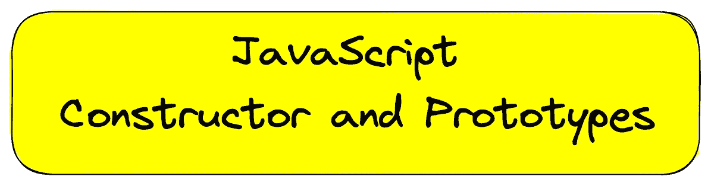
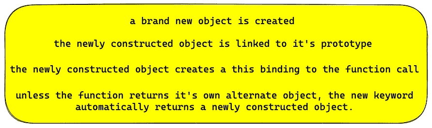
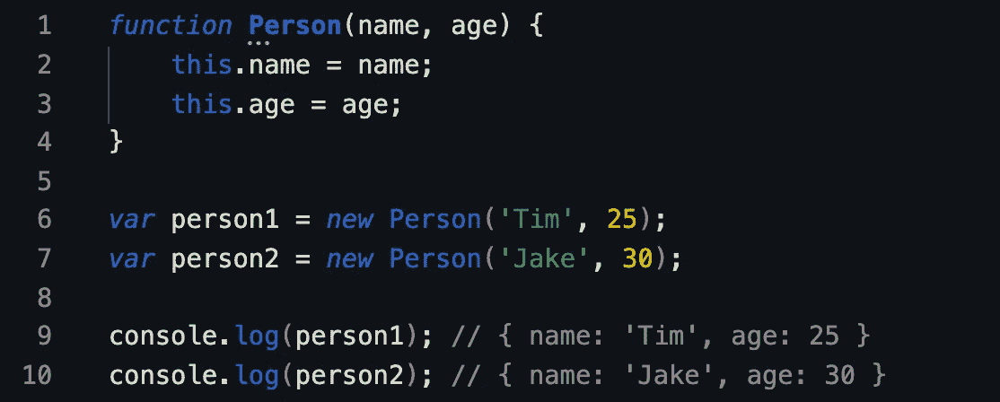
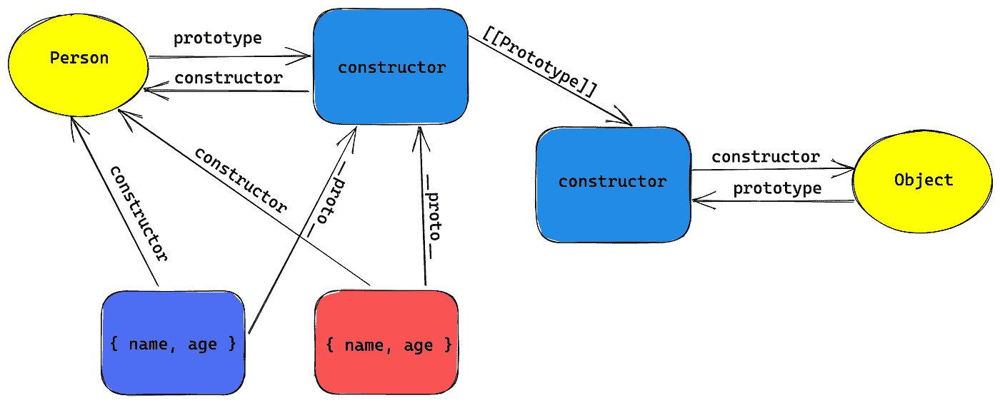
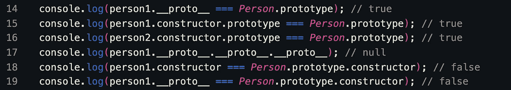

# JavaScript“构造函数”真的会创建对象吗？

> 原文：<https://blog.devgenius.io/does-javascript-constructor-really-create-the-object-f47bae4c616?source=collection_archive---------6----------------------->

***什么是建造师？***

> 在基于类的编程的现实世界中，构造函数是实例化对象的方法。

大多数基于类编程的开发人员都有同样的想法，我在学习 JavaScript 之前也有同样的想法。

如果我们没有解开谜语，我们总是称之为“神秘”, JavaScript 语言也是如此。

先来看一个来自 [MDN](https://developer.mozilla.org/en-US/docs/Web/JavaScript/Reference/Classes/constructor) 的正式定义。

> **`**constructor**`**方法是一个类的特殊方法，用于创建和初始化该类的对象实例。****

**让我们更深入地了解 JavaScript 中构造函数的作用。**

> ****在 JavaScript 中，构造函数只是用 new 关键字调用的函数。****
> 
> **它们不附属于类，也不实例化一个类。**
> 
> ****它们甚至不是特殊类型的函数。****
> 
> ****它们只是普通的函数，每当被调用时都会与 new 关键字一起使用。****

**当我们试图使用 new 关键字创建对象时，会发生四种情况，这反过来劫持了构造函数。**

****

**当调用构造函数时。**

> ****注意:对于 JavaScript 来说，实例化一个对象的“构造函数”的概念是完全不同的。****

**让我们通过构造函数调用模式继续深入理解。**

**下图是一个构造函数调用模式的例子。**

****

**构造函数调用模式**

**因此，当您尝试 console.log person1 和 person2 时，它将显示它自己绑定到上下文的值，并且在使用 new 关键字时执行上述四个步骤。**

**我们现在的目的是看看一个构造函数在 JavaScript 对象中起什么作用。**

**可视化上面的代码会给你更清晰的画面。这可能会令人困惑，但慢慢地，随着时间的推移，理解会带来更多的意义。**

****

**构造函数原型链接**

**因此，如果你看到人对象有两个属性，即姓名和年龄。**

**两个对象 person1 和 person2 有自己的绑定。**

**当我们创建一个函数时，一个构造函数被附加到它的原型上。**

**默认情况下，Person.prototype 对象获取一个公共的、不可枚举的属性，称为“constructor ”,该属性引用回与该对象关联的函数。**

****

**如果您看到，即使 person1 上不存在构造函数属性，但构造函数试图解析为 person 函数。**

**同样，在对象上，附加了 __proto__(又名 **dunder proto** )。**

**什么是[[原型]]？**

> ****JavaScript 中的对象有一个内部属性，在规范中表示为[[Prototype]]，它只是对另一个对象的引用。几乎所有对象在创建时都被赋予了一个非空的属性值。****

**所以，这里的要点是，由人创造的物体，实际上是由人的原型创造的。**

**在这一点上可能会令人困惑，但是让我们来想想是什么让我这么说的。**

****

**如果你在上图中看到，它就是**人。原型。构造者**不过是**人**本身。**

**在这里，重点就像“**构造函数**”正在创建一个返回到 Person 函数的引用链接。**

****

**如果你试着把对象和构造函数联系起来，事情会变得更清楚。**

****__proto__** 关键字无非就是 **constructor.prototype** 。你可以看到第 14 和 15 行。这是 Mozilla 在编写构造函数时给出的。将 prototype 放在原型链的顶端会让它看起来很麻烦。所以，他们发明了一个新的关键字 dunder proto。**

**第 17 行显示您正在遍历原型链，它会停止，直到发现 null。**

**简单地说，一个对象“构造者”Person 可以访问指向 Person 的. constructor 属性。**

****谁创建了该对象？****

> ****person1 没有构造函数属性，所以它委托给[[Prototype]]链，即 Person.prototype。但是，该对象没有“构造函数”属性。因此，它再次将其原型链委托给它的顶层，即 Object.prototype，它确实有一个“构造函数”，指向内置的 Object(…)函数。****

**突出显示“**构造器**”关键字的目的是为了读出真正的目的。**

> **注意:在传统的基于类的语言中,“super”是子类的构造函数引用其父类的构造函数的直接方式。这在很大程度上是正确的，因为对于真实的类，构造函数属于该类。**
> 
> **然而，在 JS 中，情况正好相反——实际上，认为“类”属于构造函数(Person.prototype…类型引用)更合适。孩子和父母的关系只存在于两者之间。各自构造函数的原型对象，构造函数本身并不直接相关。**

**所以，我希望如果有人在面试中问到“构造函数”的用法，你至少不要说“实例化对象”。**

**快乐编码。不断学习。继续探索。😊**