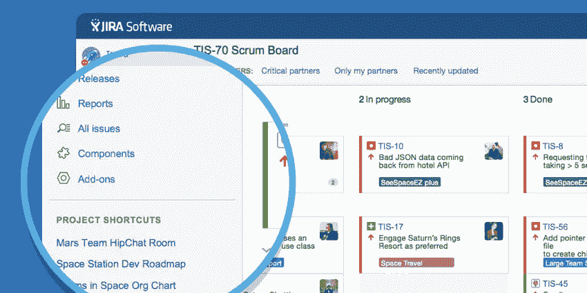
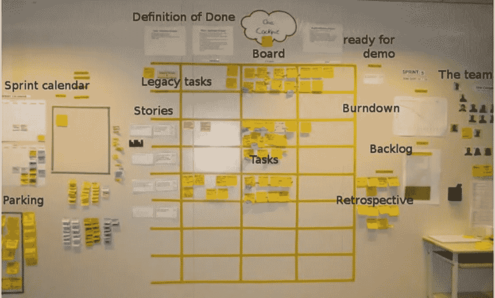

# JIRA 能提高敏捷性吗？

> 原文：<https://blog.devgenius.io/does-jira-improve-agility-4a76db86ff52?source=collection_archive---------2----------------------->

## 探索敏捷性和 JIRA 之间的联系

[https://www.uctoday.com/collaboration/jira-review/](https://www.uctoday.com/collaboration/jira-review/)

什么是敏捷？遵循敏捷宣言，成为一名敏捷软件开发人员。你可以在这里阅读更多关于原则[的内容。](https://agilemanifesto.org/principles.html)

> 流程和工具上的个人和交互
> 工作软件上的综合文档
> 合同谈判上的客户协作
> 按照计划响应变更— [敏捷宣言](https://agilemanifesto.org/)

艾伦·霍勒布怀疑 JIRA 提高了敏捷。他在推特上提出了这个问题。

我已经和 JIRA 共事一年多了。它能提高敏捷性吗？我不知道。让我们来看一下异议，回顾一下，然后得出结论。

# JIRA 通过可视化提高敏捷性？

任务的可视化提高了敏捷性。团队可以异步工作和交付。更轻松地访问信息提高了敏捷性。

Allen 怀疑异步工作能带来更好的团队敏捷性。没有比内部团队更好的了。

JIRA 本质上允许在每张票上合作，有评论，有误解。你打算怎么在白板上写呢？

> 我不同意艾伦的观点。

开发人员需要信息，票证的可视化会带来更好的敏捷性。你可以随时查阅有问题的票。同步沟通需要更多的努力，指的是问题。

 [## 异步的艺术:团队沟通的远程指南

### 团队成员跨国交流和合作比以往任何时候都更加普遍。越来越多的团队允许…

twist.com](https://twist.com/remote-work-guides/remote-team-communication#synchronous-vs-asynchronous-communication) 

实时沟通有助于提高敏捷性。你总是需要围绕问题进行沟通。然而，我们需要 JIRA 更快地转移产品。

我们需要应对新出现的变化。即使在发展的后期。我们需要 JIRA 跟踪它，思考它，并做出改变。

> 欢迎不断变化的需求，即使是在
> 开发的后期。敏捷流程利用变化为客户带来竞争优势。——敏捷宣言原则

我们现在可以举一个 JIRA 如何提高敏捷性的例子。

> 任务可视化和启用异步通信。没有不尊重同步沟通和工作。

# 白板提高敏捷性？

同步工具如何提高敏捷性？艾伦对此有什么例子吗？

跟踪问题的同步工具是白板。你看清楚门票。你可以清楚地看到这个项目。

我的观点是，它们不支持任何异步通信。你可以很容易地通过电子邮件或任何其他媒介发送一张 JIRA 的机票。您将如何从白板发送票证？

[白板](https://www.cbtnuggets.com/blog/wp-content/uploads/2017/10/2-1.jpg)

我同意 JIRA 是强制性的，团队没有选择问题跟踪的工具。有时甚至不需要。我利用了特雷罗。团队就在我身边。

虽然白板对于同步工作很好，但是对于远程团队并不好。

> 我有点不同意[艾伦](https://medium.com/u/38b7d2909b2f?source=post_page-----4a76db86ff52--------------------------------)。

使用 JIRA 有助于异步工作。白板非常适合内部团队，但不适合远程团队。团队应该选择适合他们需求的工具，不要因为 JIRA 很酷就选择它。

# JIRA 通过存储 Bugs Backlog 来提高敏捷性吗？

一位评论者喜欢 JIRA 储存虫子的能力。他有大量的 bug，他喜欢 JIRA 来管理。他可以检查错误，保持记录，更加敏捷。

艾伦不同意。有大量的 bug 意味着，你没有开发出高质量的软件。

> 如果你有如此多的 bug，你需要一个工具来管理它们，你需要仔细审视你的质量文化。—艾伦·霍勒布

> 我同意[艾伦](https://medium.com/u/38b7d2909b2f?source=post_page-----4a76db86ff52--------------------------------)的观点。

这与敏捷原则无关。你需要交付有价值的高质量的软件。你有很多虫子吗？你违背了第一条敏捷原则。JIRA 不会帮助你提高软件质量。

# 累积流程图提高敏捷性？

我没听说过这些图表。我们团队中最常用的图表是燃尽图。关于这些图表的更多信息可以在下面找到。下面这篇文章深入探讨了这个话题。我对它不熟悉。

 [## 累积流程图:它是什么，如何阅读？

### 累积流程图是最常用的图表之一，用于跟踪敏捷团队的进展。您可以生成…

zepel.io](https://zepel.io/agile/reports/cumulative-flow-diagram/) 

> [Allen](https://medium.com/u/38b7d2909b2f?source=post_page-----4a76db86ff52--------------------------------) 同意 CFD 可以提高敏捷性。

现在来看，这些对于找出障碍和瓶颈非常有用。

你可以在图表上清楚地看到积压的时间。从而停止了高质量软件的持续交付。

监控这些图确实对提高团队敏捷性有很大帮助。您可以看到团队正在做什么，并跟踪是什么阻碍了进展。

这是 JIRA 如何提高敏捷性的另一个例子。我们现在有了不止一个“单一的例子”。

# 结论

我们可以争论 JIRA 提高敏捷性的能力。尽管如此，我们还是找到了几个 JIRA 提高敏捷性的例子。强制 JIRA 没有帮助。JIRA 不是一个“一刀切”的东西。

在选择产品管理流程时，请考虑这篇文章。如果您在内部开发团队中，白板就足够了。至少从我的经验来看，远程团队没有 JIRA 是无法工作的。