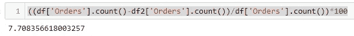

# 页面加载时间影响转化吗？—分析

> 原文：<https://blog.devgenius.io/does-page-load-time-affect-conversion-analysis-ac4ab4895b9c?source=collection_archive---------14----------------------->

使用 Python 库和 Adobe Analytics 的生产数据进行分析。


## 背景

最近，我的组织通过电子商务平台销售耐用消费品(冰箱、手机、洗衣机等)，希望了解在客户旅程中页面运行缓慢的影响。

## 假设

在影响**购买**的众多因素中，其中一个关键变量是客户在访问过程中遇到的**平均页面加载时间**。

> **页面加载时间越长=转化率越低。**

## 过程

深入探究这一假设大致有五个步骤:

1.  确定(相关数据点)。
2.  出口。
3.  分析一下。
4.  推荐

## 识别

为了测试我的假设，我想细化我的数据，这样我就可以看到一个访问者，在一个给定的访问中，平均页面加载时间是多少，以及该访问是否导致了购买。

此外，我还提取了设备以及渠道或来源(付费营销、有机点击等。)进行了访问。这将作为我以后的元数据。

Adobe analytics(AA)维度:


AA 指标:


在我的网站中，页面加载时间是由启动时配置的 getPageLoadTime 扩展设置的事件。你可以在这里阅读这个扩展如何工作[。关于此事件的工作方式，有 4 个标注:](https://experienceleague.adobe.com/docs/analytics/implementation/vars/plugins/getpageloadtime.html?lang=en#)

1.  此事件测量的数字以 1/10 秒为单位。例如，如果页面加载耗时 2 秒，则捕获的值为 20。
2.  该数字是针对上一页的加载量测量的。假设你登陆了页面 A，然后是页面 B，只有当页面 B 的页面加载发生时，页面 A 的加载时间才会被捕获。如果没有加载页面 B，则不会记录页面 A 的加载时间。
3.  此事件存储的数字是累积的。也就是说，每次加载一个页面，这个数字都会不断增加。因此，要获得某个维度的平均页面加载时间，您必须创建一个计算指标=页面加载时间/页面浏览量，然后根据该维度对其进行评估。例如，如果我想知道我每天的平均页面加载时间，它看起来会像这样:


4.根据这篇[文章](https://blog.hubspot.com/marketing/page-load-time-conversion-rates)，良好页面加载时间的基准不超过 4 秒。因此，如果你看到页面加载时间/页面浏览量(PLTPV) > 40，你就知道这对你的网站不好。

## 出口

嗯，一旦你确定了 dim 和指标，这应该是非常直接的。我用过 AA 的数据仓库工具。你可以在这里阅读如何使用数据仓库。

此外，为了限制我的文件大小，我

1.  把数据保存到一周的回顾中。需要注意的是，这是一个正常的一周，而不是一个节日周，服务器可能会间歇性地关闭，从而导致页面负载激增。
2.  使用命中级别参数为“ECID 存在”的段来删除任何可能通过的垃圾命中。你可以在这里阅读关于[的片段。](https://experienceleague.adobe.com/docs/analytics/components/segmentation/seg-overview.html?lang=en)

最终的数据布局如下所示:


导出到我的 FTP 的最终 DWH 文件的快照

## **解析**

步骤 1:由于时间关系，我将放弃基本的导入和读取文件的步骤。总之，我导入了:

Pandas，Numpy 在数据帧中构造数据，并在需要时执行基本的数组功能。

Matplotlib，Seaborn 来可视化数据。

分别检查 ANOVA 和 ttest。

我的数据也没有任何空值。

导入文件的摘要:


df.describe()

还有更多信息:


df.info()

第二步:我已经创建了一个新的功能，称为“PLTPV”或每次页面浏览的页面加载时间。这是页面加载时间事件的总和除以查看的页面数。如果我在 a 访问中看到这个数字，它将给出该访问的平均 PLTPV。

```
df['PLTPV']=(df['PageLoad Time (event1)']/df['Page Views'])/10
```

注意，我将该值除以 10，得到以秒为单位的值。

步骤 3:检查 PLTPV 度量的分布并执行异常值去除。

```
plt.boxplot(df['PLTPV'])
```


肯定有太多的离群值。我将删除任何高于 20 的内容(这不是推荐的方法，我们应该使用 IQR 作为删除的基础，但为了简单起见，我只是结合我过去对这类数据的经验，使用了一种反复试验的方法)

```
df2=df[df['PLTPV']<20]
```

```
plt.boxplot(df2['PLTPV'])
```


这看起来更好，而且我只丢失了 7%的数据:



第四步。检查 PLTPV 在有订单和无订单的访问中如何变化。

但在此之前，我们需要将订单转换为一个对象，以便我们可以它是绝对的。甚至在此之前，我需要将顺序值限制为仅 1(如果顺序≥1)和 0。

```
df2.loc[df2['Orders']>1,'Orders']=1
df2['Orders']=df2['Orders'].astype('string')
```

然后我们绘制:


中位数 PLTPV 有显著差异，但不能说差异是否显著。因此，我们将做一个快速 2 样本 t 检验，看看方差是否显著。

为此，我创建了两个数据帧，一个用于 Orders ==1，另一个用于 Orders ==0。

```
orders=df2[df2['Orders']=='1']
norders=df2[df2['Orders']=='0']
```

现在，我运行测试，看看 PLTPV 在这 2 组中如何变化:

```
import pingouin as pg
result = pg.ttest(orders['PLTPV'],norders['PLTPV'],
                  correction=True)
print(result)
```


ttest 的输出

该测试清楚地显示在两组数据中 PLTPV 有很大的差异。p<.05/>

第五步。元数据分析。既然我们知道订单与非订单的 PLTPV 有显著差异，我将尝试看看这个统计数据是否可以进一步细分。首先，我将选择设备类型，因为众所周知，页面加载时间因设备而异。

但是，我的数据集有几种设备类型。通常 Adobe 对此有 7-8 个不同的值，但我只想要移动设备、台式机/笔记本电脑(在 Adobe 中标为其他)和平板电脑。

```
df2=df2[(df2['Mobile Device Type']=='Mobile Phone') | 
(df2['Mobile Device Type']=='Other') | 
(df2['Mobile Device Type']=='Tablet')]
```

然后我们像以前一样做一个类似的方框图

```
sns.boxplot(x='Mobile Device Type',y='PLTPV',data=df2,hue='Orders')
```


从这个图中，我可以推断这个问题在移动访问中更加突出，这是有道理的，因为移动用户的注意力范围更小，因此损耗更快。

为了进一步验证这一点，我将进行方差分析测试，看看这些组之间的差异有多大。

我创建了 6 个组-设备类型(3)X 订单(是或否- (2))

```
om=df2[(df2['Mobile Device Type']=='Mobile Phone') & (df2['Orders']=='1')]
nom=df2[(df2['Mobile Device Type']=='Mobile Phone') & (df2['Orders']=='0')]

oo=df2[(df2['Mobile Device Type']=='Other') & (df2['Orders']=='1')]
noo=df2[(df2['Mobile Device Type']=='Other') & (df2['Orders']=='0')]

ot=df2[(df2['Mobile Device Type']=='Tablet') & (df2['Orders']=='0')]
nott=df2[(df2['Mobile Device Type']=='Tablet') & (df2['Orders']=='1')]
```

我看到了对立群体的 f 和 p 值(例如:订单移动(om)对无订单移动(nom)


很明显，这三项都很重要，但其他(笔记本电脑/台式机)和移动设备也很重要，因此应该优先考虑。

第六步:我对营销渠道做了类似的分析，下面是我的箱线图分布:


在这里，我们也看到这种影响在以下方面更加显著:

加盟
有机社交
下线
内部

在现阶段，很难说这可能意味着什么。因此，我进一步分析了每个通道的页面重载时间。示例报告如下所示:


注意，我添加了一个 PV>1000 的过滤器来过滤掉垃圾/测试页面等。

作为进一步的细分，我按设备进行了细分。这份报告清楚地给了我一些页面，这些页面要么在其他手机上运行缓慢，要么在其中一个手机上运行缓慢。我可以向管理层提出我的第一套建议。

## 推荐:

根据我目前掌握的信息，以下是我的建议:

1.  页面加载时间是影响我们网站转化率的一个重要因素。这个问题需要尽快解决。
2.  这种影响在移动设备中非常显著，其次是笔记本电脑/台式机。设计/内容团队需要深入探究可能导致这种情况的因素。(资产、使用的 CDN 等。)
3.  这种影响在来自特定来源的流量中也非常显著(附属、有机社交、推荐等)。).各个营销团队需要研究用于这些活动的页面设计类型，并在尝试为下一组活动制定战略时，考虑因页面负载导致的销售损失。
4.  应该在此分析上花费更多的时间，以找出更多可操作的集群(例如，如果一天中的任何特定时间页面加载缓慢，了解客户在网站访问后的情绪-他们是否注意到页面加载时间较长，这是否是一个阻碍因素？).

如果你喜欢这篇文章，请鼓掌。很想听听你会如何着手做这件事。