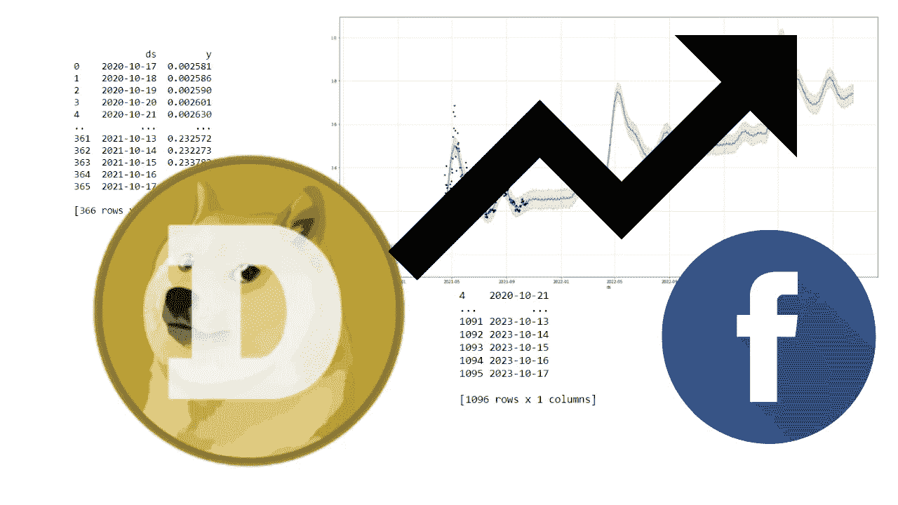
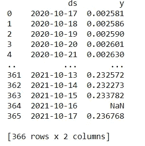
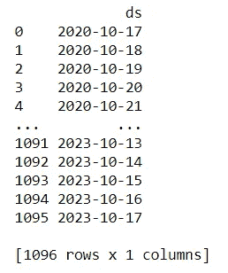
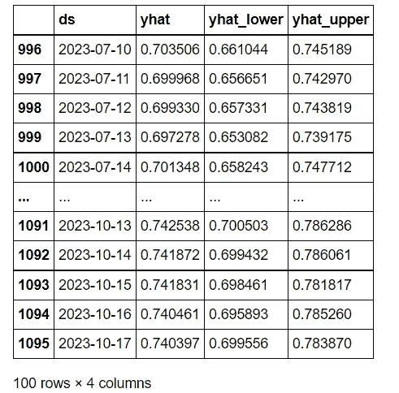
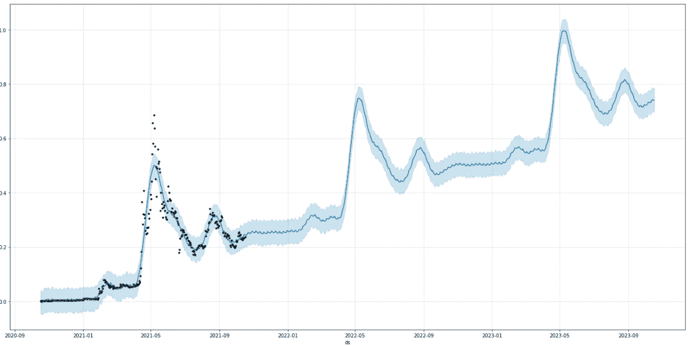

# 使用 python 进行 Doge 硬币预测

> 原文：<https://blog.devgenius.io/doge-coin-prediction-using-python-1dcf759f3e11?source=collection_archive---------3----------------------->



使用 python 进行 Doge 硬币预测

Dogecoin 是由软件策划人比利·马库斯和杰克逊·帕尔默创造的一种加密货币，他们决定制作一个支付系统作为一个“笑话”，取笑目前加密货币中的疯狂赌博。尽管其讽刺的本质，一些人认为这是一个合法的投资前景。

# 总督硬币预测

最近，由于埃隆·马斯克和维塔利克·布特林参与了这个项目，doge coin 受到了很多关注。由于 Doge coin 被视为一种投资前景，并在许多加密和股票交易平台上交易，许多加密专家预测 Doge coin 将达到 1 美元，并稳定在这个范围内。

在这篇文章中，我将使用脸书先知模型来预测未来的金币价格。脸书先知库是一个开源的加法回归模型，由脸书提供，用于时间序列预测。如果你想了解更多关于脸书先知的事情，你可以在这里学习[](https://facebook.github.io/prophet/)**。**

# **使用机器学习的 Python 进行 Doge 价格预测**

**在本节中，我将带您了解 Doge 硬币价格预测的机器学习项目。**

**下载 doge 价格最新数据的第一步。从[雅虎财经](https://finance.yahoo.com/quote/DOGE-USD/history?p=DOGE-USD)下载最新数据。**

**下载完数据后，就该导入必要的 python 库和数据集了。**

**使用 pip install prophet 命令安装 fbprophet。**

**现在导入库:**

```
**import** **pandas** **as** **pd**
**from** **fbprophet** **import** Prophet
```

**脸书先知模型仅适用于在名为“ds”的列中包含字符串时间序列格式的数据，以及在名为“y”的列中包含连续值的数据。因此，我们需要相应地创建数据:**

```
df = pd.read_csv('DOGE-USD.csv')df = df[["Date","Close"]]df.columns = ["ds","y"]print(df)
```

****

**打印(df)列 ds 和 y**

**现在让我们将数据放入我们的模型:**

```
prophet= Prophet( yearly_seasonality=**True**,daily_seasonality=**True**)
prophet.fit(df)
```

**现在我们来做预测。**

**Prophet 中的 make_future_dataframe 方法有一个参数是“periods”，我们可以用它来设置我们进行预测所需的时间。**

**现在让我们对未来 730 天(2 年)进行预测:**

```
future = prophet.make_future_dataframe(periods=730)
print(future)
```

****

```
forecast = prophet.predict(future)
forecast[["ds","yhat","yhat_lower","yhat_upper"]].tail(100)
```

****

**现在让我们来绘制:**

```
**from** **fbprophet.plot** **import** plot

prophet.plot(forecast,figsize=(20,10))
```

****

**Doge 价格图**

# **预言；预测；预告**

**根据绘制的图表，金币将达到 0.8，然后稳定在 0.6 到 0.8 的范围内。在 2023 年初，它将再次爆发，并在 0.6 至 1 美元的范围内达到 1 美元。从剧情来看，Doge 币的价格将在很长一段时间内呈上升趋势。**

# **结论**

**虽然有几个因素影响了 doge coin 的价格，如比特币的当前势头、恐惧指数、正面或负面消息，但我们仍有可能看到 Doge coin 的价格快速增长。**

**欢迎在下面的评论中提出你有价值的问题。**