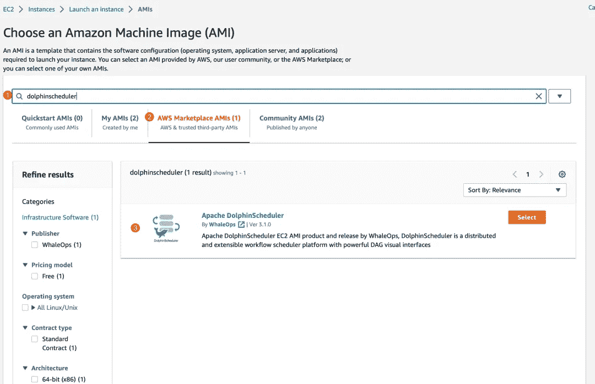

# DolphinScheduler 在 AWS AMI 应用市场上发布

> 原文：<https://blog.devgenius.io/dolphinscheduler-launches-on-the-aws-ami-application-marketplace-488edfd17247?source=collection_archive---------26----------------------->


# 介绍

Apache DolphinScheduler 已经在 AWS EC2 AMI 应用市场上正式上线，这意味着如果你想在 AWS 中使用或体验 DolphinScheduler，可以直接使用这个 EC2 AMI 来启动 DolphinScheduler 服务。启动时，您的 EC2 实例将启动一个 DolphinScheduler 独立服务，这是一个完整的 DolphinScheduler 组件，可以执行 DolphinScheduler 的各种任务。

需要注意的是，在生产环境中不使用 standalone，因为它的所有服务都在一个进程中，元数据默认存储在内存中，当服务终止时，数据将不再存在。但它仍然非常有用，因为我们可以快速启动一个服务进行经验验证。如果想启动一个 DolphinScheduler 集群，可以参考本文的启动集群一章。更多 AMI 相关信息请查看[https://AWS . Amazon . com/market place/PP/prodview-cbwnzxolq 46 yo](https://aws.amazon.com/marketplace/pp/prodview-cbwnzxolq46yo)

# 为什么在 AWS 中推出？

亚马逊网络服务(AWS)是世界上最全面、最广泛采用的云平台，提供来自全球数据中心的 200 多种全功能服务。数百万客户——包括发展最快的初创公司、最大的企业和领先的政府机构——正在使用 AWS 来降低成本、变得更加敏捷和更快地创新。

# EC2 是什么？

亚马逊弹性计算云(Amazon EC2)在亚马逊 Web 服务(AWS)云中提供可扩展的计算能力。使用 Amazon EC2 消除了预先投资硬件的需要，因此您可以更快地开发和部署应用程序。您可以使用 Amazon EC2 启动任意多或任意少的虚拟服务器，配置安全性和网络，以及管理存储。Amazon EC2 使您能够扩大或缩小规模，以应对需求的变化或人气的飙升，从而减少您预测流量的需求。用户可以在 EC2 上选择适合他们需求的服务，并且可以选择任务容量、CPU 和内存模型。在启动 EC2 实例之前，用户可以选择不同的操作系统，例如 Windows、Linux 和 Mac，这些操作系统在 EC2 中被称为亚马逊机器映像(AMI)。

# EC2 AMI 是什么？

如上所述，在启动 EC2 实例时，可以指定一个镜像，这个镜像就是 Amazon Machine Image (AMI)。Amazon 机器映像(AMI)是 AWS 提供的受支持和维护的映像，它提供启动实例所需的信息。启动实例时，必须指定一个 AMI。当您需要具有相同配置的多个实例时，您可以从单个 AMI 启动多个实例。当您需要具有不同配置的实例时，可以使用不同的 ami 来启动实例。AMI 包括以下内容:

*   一个或多个 Amazon 弹性块存储(Amazon EBS)快照，或者实例存储支持的 ami、实例根卷的模板(例如，操作系统、应用服务器和应用程序)。
*   启动权限，控制哪些 AWS 帐户可以使用 AMI 来启动实例。
*   块设备映射指定启动实例时要附加到实例的卷。

AWS 官方提供的 ami 都是基础镜像，一般只包含操作系统，比如 Windows、Linux、Mac。AMI 的另一个强大功能是它允许用户基于基础映像定制 AMI，这意味着用户可以在运行的 EC2 实例中安装任何软件，最后对实例内容进行快照来定义一个 AMI。

# 使用

## 启动单个实例

通过 DolphinScheduler AMI 启动 EC2 实例的方式非常简单，只需在 EC2 页面点击启动实例，然后点击浏览更多 AMI，在输入框中输入 DolphinScheduler 即可。然后选择 AMI 并填写实例类型、密钥对、网络，点击 launch instance 启动实例。


启动实例


浏览更多 ami



搜索海豚调度程序


基于 DolphinScheduler AMI 的启动实例

启动实例需要一些时间。我们现在可以检查网络配置。我们需要确保启用端口 12345 和 22，这是 DolphinScheduler 服务的端口和 ssh 端口。


3-5 分钟后，您可以通过 EC2 实例的公共 DNS 或公共 IPv4 加上端口 12345 访问 DolphinScheduler 服务。登录 DolphinScheduler 服务的用户名和密码分别是 user 和当前 EC2 实例 id。

注意:DolphinScheduler 的密码是动态的，它将在 EC2 实例启动后自动更改，以确保您的服务安全。您可以在 EC2 控制台主页中找到它。有关 AMI 提供者的 AWS 请求的更多细节，请参见 AMI 容器产品。

# 启动集群

[https://github . com/WhaleOps/packer _ tmpl/blob/main/AWS/ami/dolphin scheduler/readme . MD # cluster-server](https://github.com/WhaleOps/packer_tmpl/blob/main/aws/ami/dolphinscheduler/README.md#cluster-server)

上面的教程告诉了我们如何启动单个实例，那么如果我们想启动一个 DolphinScheduler 集群应该怎么做呢？

## 为集群添加新的密钥对

在下一步中，我们将使用 ssh 连接到现有的 EC2 实例，目前我们的 cluster.sh 脚本只支持一个密钥对。所以我们需要创建一个新的，然后在启动实例时使用它。转到 EC2 ->网络和安全->密钥对->创建密钥对。请小心保存，否则，您将无法登录到您的实例。

## 为群集添加新的安全组

转到 EC2 ->网络和安全->安全组->创建安全组要创建新的安全组，您应该将以下几点添加到该安全组的入站规则中:

*   22:默认 ssh 点
*   2181:动物园管理员连接点
*   5432: PostgreSQL 连接点
*   1234: Dolphin Scheduler 的主服务器点
*   5678: DolphinScheduler 的工作服务器点
*   12345: DolphinScheduler 的 web UI 点


## 启动多个 EC2 实例

目前，您必须自己构建这个 AMI，然后**从 EC2 - > Images - > AMIs 侧边栏路径**启动一个新的 EC2 实例，选择您构建的 AMI，然后在 AMI 底部点击**，在 EC2->Instances->Launch**an instance 页面中，您应该选择您在 new key pair for cluster 部分创建的现有密钥对，它可以在**Key pair->Select Key pair**中找到。此外，您应该选择您在“为集群创建新的安全组”部分中创建的现有安全组，它可以在**网络设置- >选择现有安全组- >选择安全组**中找到。最后，从 Summary 平面的 Number of instances 输入框中，根据集群编号启动多个实例(在本教程中，我们使用 8 个实例来创建一个集群)。

## 获取 cluster.sh 和 cluster_env.sh 脚本

如果您已经克隆了这个项目，您应该转到 packer _ tmpl/AWS/ami/dolphin scheduler/bin 目录，您可以看到两个名为 cluster.sh 和 cluster_env.sh 的脚本

```
wget https://raw.githubusercontent.com/WhaleOps/pa
cker_tmpl/main/aws/ami/dolphinscheduler/bin/cluster.sh
wget https://raw.githubusercontent.com/WhaleOps/packer_tmpl/main/aws/ami/dolphinscheduler/bin/cluster_env.sh
```

> 注意:如果您的网络无法连接到 GitHub，上述命令将失败，并显示错误日志，如连接到 raw.githubusercontent.com(raw . githubusercontent . com)| 0 . 0 . 0 . 0 |:443…失败:连接被拒绝。你应该找出一种方法使你的网络可以连接到主机 raw.githubusercontent.com 或者从 GitHub 网站下载这两个脚本。

## 修改集群 _ 环境. sh 脚本

您必须修改 cluster_env.sh 脚本，它包括您的密钥对和 EC2 实例的 IPv4 地址或 IPv4 DNS。例如，我们启动了 8 个 EC2 实例，我们希望部署两个主服务器、3 个工作服务器、一个 API 服务器、一个警报服务器、一个数据库和一个 zookeeper 服务器，每个实例的 IPv4 地址如下:

*   192.168.1.1:主服务器
*   192.168.1.2:主服务器
*   192.168.1.3:工作服务器
*   192.168.1.4:工作服务器
*   192.168.1.5:工作服务器
*   192 . 168 . 1 . 6:API-服务器
*   192.168.1.7:警报服务器
*   192.168.1.8:元数据数据库(PostgreSQL)，动物园管理员

我们应该将我们的部署计划告诉 cluster_env.sh，否则它将永远不知道如何部署它(这里我们只显示一些必要的更改内容，没有注释)

```
export ips="192.168.1.1,192.168.1.2,192.168.1.3,192.168.1.4,192.168.1.5,192.168.1.6,192.168.1.7,192.168.1.8"
```

```
export masters="192.168.1.1,192.168.1.2"export workers="192.168.1.3:default,192.168.1.4:default,192.168.1.5:default"export alertServer="192.168.1.6"export apiServers="192.168.1.7"export DATABASE_SERVER="192.168.1.8"export REGISTRY_SERVER="192.168.1.8"
```

还应该添加您在新密钥对中为集群创建的密钥对位置，建议使用绝对路径(这里我们只显示一些必要的更改内容，没有注释)

```
# Do not change this if you use this AMI to launch your instance
export INSTANCE_USER=${INSTANCE_USER:-"ubuntu"}
# You have to change to your key pair path
export INSTANCE_KEY_PAIR="/change/to/your/personal/to/key/pair"
```

## 执行 cluster.sh 脚本

修改 cluster_env.sh 后，您可以通过命令执行该脚本

```
./cluster.sh start
```

所需的时间取决于您的网络速度，完成后，您的 EC2 实例将被合并到一个 DolphinScheduler 集群中。

## 执行 cluster.sh 后应该怎么做

之后可以通过实例的【API-SERVER-Public-IP v4-address】:12345/DolphinScheduler/ui 或者【API-SERVER-Public-IP v4-DNS】:12345/dolphin scheduler/ui，以 user/EC2_DYNAMIC_INSTANCE_ID 为默认用户名/密码登录 dolphin scheduler 服务。关于如何使用 DolphinScheduler，你可以在 DolphinScheduler 的函数中查看细节。

# 贡献的

我们通过打包器构建 AMI，并使其完全开源。我们欢迎任何对这个项目感兴趣的人来查看和贡献。DolphinScheduler AMI 源代码可以在 AMI-dolphin scheduler【https://github . com/whale ops/packer _ tmpl/blob/main/AWS/AMI/dolphin scheduler/readme . MD】查看。关于如何贡献代码，可以学习如何贡献【https://github . com/whale ops/packer _ tmpl/blob/main/AWS/ami/dolphin scheduler/readme . MD # contributing】。

# 概述

*   简单介绍一下什么是 AWS、EC2、EC2 AMI，以及如何通过 AMI 创建一个 EC2 实例；
*   介绍如何使用 DolphinScheduler AMI，如何启动单个实例，组建集群；
*   再次强调单机版仅用于测试和体验
*   如果你对这个项目感兴趣，如何投稿

📌📌欢迎填写[本次调查](https://www.surveymonkey.com/r/7CHHWGW)来反馈您的用户体验或您对 Apache DolphinScheduler 的想法:)

https://www.surveymonkey.com/r/7CHHWGW