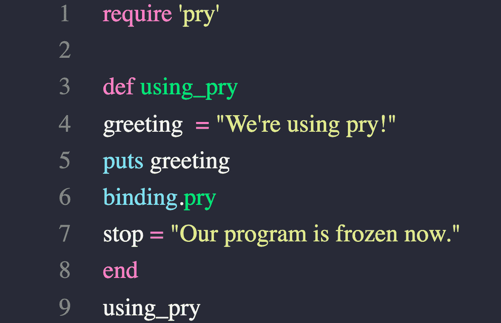
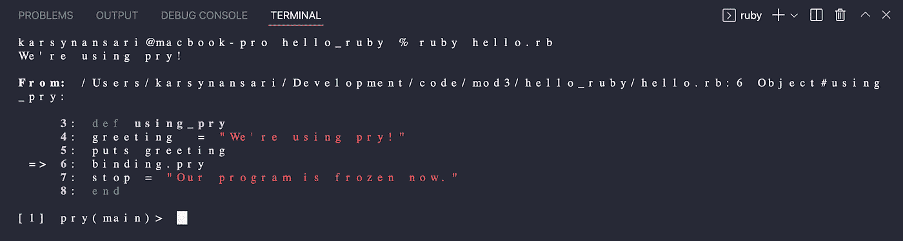
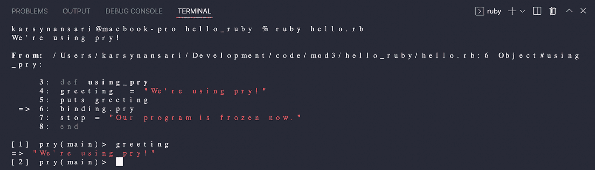
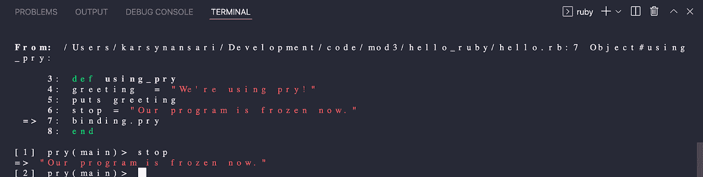

# 不要为捆绑哭泣。撬

> 原文：<https://blog.devgenius.io/dont-cry-over-binding-pry-6004399df196?source=collection_archive---------7----------------------->

**使用红宝石撬 REPL 的初学者指南**

当我从学习 JavaScript(可以在浏览器或浏览器控制台中直接看到代码更新的结果)过渡到学习 Ruby 时，我对我必须总是在 IRB(Ruby 的内置 REPL)中运行代码的想法感到有些不安。它让人感觉陌生、笨拙、低效——我不得不将代码从我的代码编辑器复制/粘贴到 IRB 中来运行它。

提醒你一下，我刚刚开始我的 Ruby 学习之旅，所以不久之后我就接受了 Pry 教育。如果你刚刚开始学习 Ruby，让我告诉你——不要再花一分钟不学习 Pry。幸运的是，我已经在这里概述了基础知识，所以你可以开始了。

**什么是撬？**

Pry 是一个 ruby gem，它提供了另一个交互式编程环境，一个 REPL，像 IRB 一样，允许您在终端上执行 ruby 代码，您可以看到结果并与之交互。然而，由于一些不同的原因，Pry 是一个比 IRB 更广泛的工具。它允许您运行代码编辑器中的代码，并与终端中的输出进行交互。Pry 类似于 Node.js 中的调试器工具，可以设置断点来冻结代码的执行，这对测试输出和调试很有帮助。Pry 还对终端中的语法进行了颜色编码，使得它比 IRB 中的代码更易于解释。

**如何安装撬杆**

在我们体验使用 Pry 运行和调试我们的 Ruby 代码的无缝乐趣之前，您必须首先在您的机器上安装 ruby gem。为此，请在您的终端中运行以下命令:

```
gem install pry
```

**如何使用撬**

现在，在你真正使用*Pry 之前，你需要通过把`require ‘pry’`放在顶部来告诉 ruby 文件，你在其中写代码。`require`是一种加载另一个文件并执行其语句的方法。在这种情况下，您使用`require`方法将撬库加载到您的文件中。*


成功！现在我们可以将代码行`binding.pry`放入我们的 Ruby 代码中，程序将在您的终端中执行，直到您放置`binding.pry`的那一行。



在您的终端中——确保您与您的文件在同一个目录中——运行`ruby your_file_name.rb`,您将看到类似如下的输出:



在我的终端中，我现在可以与第 6 行以上的所有代码进行交互…



但是当我试图访问一个在`binding.pry`下面的变量时，我得到了`nil`，因为我的程序不会在绑定下面运行，因此变量`stop`还没有被解释。


如果我想访问`stop`变量，我可以将绑定放在该行下面，然后重新运行该文件。

**注意:** *您必须在 pry 提示符下键入* `*exit*` *退出当前的 pry 会话，然后在终端中再次输入* `*ruby your_file_name.rb*` *重新运行您的文件。*



哒哒！简而言之就是窥探。很明显，这是对 Pry 实际能做的介绍性工作的过度简化。例如，您可以一次在代码的多行中使用`binding.pry`,这样您就可以一次探索和调试一个部分来隔离错误，并确保您的 Ruby 代码输出您所期望的结果。

尽管一开始 Pry 可能看起来有点笨拙，但是您很快就会意识到，使用这个强大的 REPL 将真正帮助您在学习的同时探索 Ruby 代码，并帮助您在以后调试更复杂的代码。