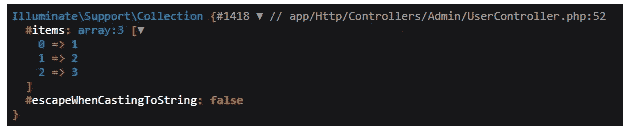
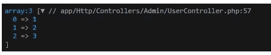
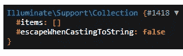

# 不要在 Laravel 系列中犯这个错误

> 原文：<https://blog.devgenius.io/dont-do-this-mistake-in-the-laravel-collection-8abdd519f01b?source=collection_archive---------1----------------------->

## 避免在 Laravel 集合中使用 empty 函数


马克·弗莱彻·布朗在 [Unsplash](https://unsplash.com?utm_source=medium&utm_medium=referral) 上的照片

Laravel 集合是一个 PHP 数组的包装器。在 Laravel 世界中，它是一种基于数组创建的新数据类型。`Illuminate\Support\Collection`类提供了 Laravel 集合。此外，Laravel 雄辩的方法将返回集合实例。

> [雄辩的](https://laravel.com/docs/9.x/eloquent)查询的结果总是作为`Collection`实例返回。

与数组相比，收集方法让您的生活更轻松。[点击此处](https://laravel.com/docs/9.x/collections#available-methods)查看 Laravel 单据上可用的收款方式。

`collect`助手用于根据给定的数组创建集合。

```
$collection = collect([1, 2, 3]);

dd($collection);
```

当您打印集合时，将会得到以下结果。



在检查空函数问题之前，我将澄清 Laravel 集合中的一些常见问题。

## 我们可以使用`foreach`迭代器吗？

是的，我们可以用`foreach`代替[的每一个](https://laravel.com/docs/9.x/collections#method-each)方法进行采集。

```
$collection = collect([1, 2, 3]);

foreach ($collection as $data) {
    echo $data;
}

$collection->each(function ($item) {
    echo $item;
});
```

[](https://balajidharma.medium.com/the-syntax-highlighting-highlight-js-is-now-available-on-medium-58f672595691) [## 用语法荧光笔尝试代码块的中等新功能

### 介质上的语法高亮显示

balajidharma.medium.com](https://balajidharma.medium.com/the-syntax-highlighting-highlight-js-is-now-available-on-medium-58f672595691) 

## 如何将 PHP 集合转换成数组？

`toArray()`函数将集合转换成普通的 PHP `array`。

```
$collection = collect([1, 2, 3]);
$array_colection = $collection->toArray();
dd($array_colection);
```



我们知道数组方法`foreach`可以很好地处理集合。但是我们不能对集合使用的所有数组方法。

## 不要用空的

最常见的错误是使用`empty`方法检查集合是否为空。在下面的示例中，创建了一个空集合，并添加了一个 if 语句来检查集合是否为空。

```
$collection = collect([]);

if(empty($collection)) {
    dd('collection is empty');
}
```

还有，不要用空洞来换取雄辩的结果

```
$users = User::where('active', 1)->get();

if(empty($users)) {
    dd('collection is empty');
}
```

集合为空，但它没有传递条件语句。因为集合不是空的，因为它有空的 items 数组。让我们打印空集合。

```
$collection = collect([]);
dd($collection);
```



所以使用`[isEmpt](https://laravel.com/docs/9.x/collections#method-isempty)y()`或`[isNotEmpty](https://laravel.com/docs/9.x/collections#method-isnotempty)()`集合方法来检查集合。

```
$collection = collect([]);

if($collection->isEmpty()) {
    dd('collection is empty');
}

if($collection->isNotEmpty()) {
    dd('collection is empty');
}
```

## 可以用 count 和 isset 吗？

我遇到了一个空函数的问题。所以我决定用`count`和`isset`功能来测试。

```
$collection = collect(['name' => 'Balaji']);

if(isset($collection['name'])) {
    dd($collection);
}
```

`isset()`功能工作正常。

```
$collection = collect([1, 2, 3]);

if(count($collection) > 2) {
    dd(count($collection));
}
```

是的，数组计数方法也工作得很好。但是最好使用集合`[count()](https://laravel.com/docs/9.x/collections#method-count)`来获得计数。

```
$collection = collect([1, 2, 3]);

if($collection->count() > 2) {
    dd($collection->count());
}
```

## 结论

我们知道集合是数组的包装。此外，该集合有很多功能，它使搜索，过滤，循环，查找等变得容易。,

所以我的建议是不要用集合试`empty`、`count`、`isset`。使用类似`$collection->isEmpty()` `$collection->count()`的相应采集功能

## 集合函数是如何工作的？

你认为收藏功能`$collection->isEmpty()` `$collection->count()`是如何工作的？答案是 collection 也使用数组函数，但是他们对集合项使用数组函数。

以下收集功能在`Illuminate\Support\Collection`上声明

```
 /**
     * Determine if the collection is empty or not.
     *
     * @return bool
     */
    public function isEmpty()
    {
        return empty($this->items);
    }

    /**
     * Count the number of items in the collection.
     *
     * @return int
     */
    public function count(): int
    {
        return count($this->items);
    }
```

参考文件:[https://github . com/laravel/framework/blob/master/src/Illuminate/Collections/collection . PHP](https://github.com/laravel/framework/blob/master/src/Illuminate/Collections/Collection.php)

感谢您的阅读。

敬请关注更多内容！

*跟我来*[***balajidharma.medium.com***](https://balajidharma.medium.com/)。