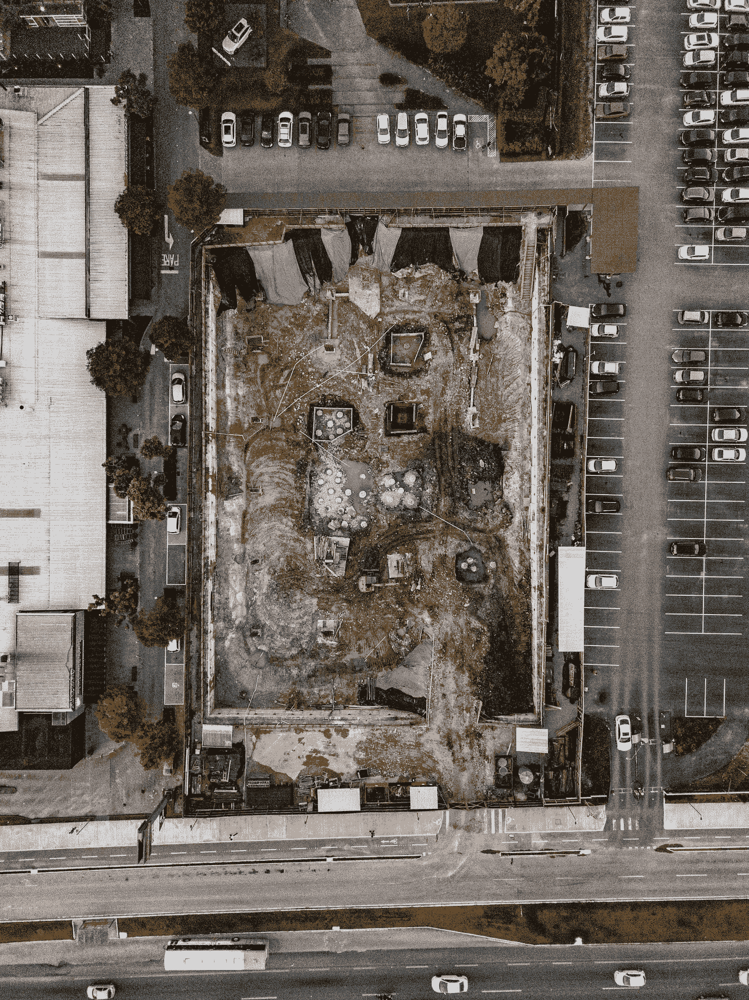

# 设计应用程序时“不要和网站作对”

> 原文：<https://blog.devgenius.io/dont-fight-the-site-when-designing-applications-6f333dd88956?source=collection_archive---------23----------------------->

照片由 Marek Novotný on Unsplash 拍摄

在之前，我曾经提到过[，那时我基本上决定这不适合我，我将成为一名园林设计师。我漏掉的一个细节是，我实际上参加了一个景观设计的函授课程。我学到了一些关于制图、灌溉、植物的有趣的事情，如果你实际上只是一个景观设计师，那么不称自己为景观设计师(一个有资格证书的专业头衔)是多么重要，而且通常足以意识到我真的不想成为这些事情中的任何一个。我仍然喜欢园艺，实际上我仍然有一辆卡车，但是我真的不想为了钱做那种工作。](https://medium.com/@jmgant.cleareyeconsulting/languages-ive-learned-or-not-my-days-in-shadow-it-fd76e4c69f67)

他们在课程中强调的一个设计原则是始终仔细考虑你计划安装新景观的位置的实际条件。从字面上看，景观是一个有生命的“东西”——一个由植物、动物、真菌和微生物组成的生态系统，所有这些都在一起工作。庭园设计师大多只是选择和安装植物和其他功能。但是，如果该地点的现有条件——土壤、水、气候——不符合植物或植物所依赖的其他生物的文化要求，景观就不会茁壮成长。

我想看看我是否能把同样的原则应用到软件开发中。我认为有很多相似之处。让我知道你是否同意。

# “绿地”开发

我应该指出，这篇文章根本不是关于重构现有的应用程序。关于这个问题已经写了很多，我现在没有什么有用的补充。它也不是关于“推倒重来”的开发，这是我们开发人员经常想做的事情，但几乎总是一个坏主意。

不，这都是关于通常所说的“绿地”开发。当你有了一个全新的计划(和必要的资金)来创造一个全新的实体，由你自己的十个手指打造，这是生命中罕见而美妙的时刻。

思维与可能性赛跑。这将是一个单页应用程序架构，还是使用服务器端模板？前端会不会是 React，或者 Vue，或者 Angular，或者其他什么新事物？后端会是 Node，还是 C#，还是 Python，还是 Go，还是别的？关系还是 NoSQL？我们需要服务层吗？我们将如何认证？业务规则何去何从？我们应该谨慎行事，使用成熟的语言/框架/工具/范例等吗？？或者我们应该利用这个机会去学习和接受新的东西？

您在这个阶段所做的选择将对应用程序的生命周期产生影响。权力大，责任大。

然而，除非你是在一个非常新的初创公司里开发第一个应用程序，而你只是其中的一员，否则你很可能不是在一张完全空白的石板上写东西。或者回到我最初的比喻，你的“绿地”并不是完全没有现有的场地条件。如果您希望您的应用程序设计能够很好地适应新环境，那么您必须考虑一些关键因素。

# 还有什么是已经存在的？

Guillherme Schneider 在 Unsplash 上拍摄的照片

如果你被一家公司聘为全职员工或合同开发人员，这实际上是一种保证，因为该公司足够大，可以聘请一名开发人员，它有一些现有的软件。您的新应用程序的初始需求很可能没有提到与任何其他应用程序的接口。但这并不意味着你不需要担心。

很有可能项目发起人甚至没有考虑到连接不同部分的可能性。或者他们只是没有提到。无论哪种方式，如果您的应用程序成功了，很可能在某个时候，它会被调用来充当其他应用程序的提供者或消费者。

环境中的其他应用程序是否已经在相互通信？他们如何共享数据？API？异步流程和队列？共享数据库还是存储过程？批处理？一些古怪的自制进程间通信协议？把数据打印在绿纸上，然后运到一栋没有窗户的大楼里，在那里，一群数据录入人员整天疲惫地输入数据，他们非常害怕如果准确率低于 99.97%，就会丢掉工作。这些都是(甚至可能是最后一种)集成应用程序的实际方式。预先找出您需要支持其中一种或多种方法的可能性，并将其纳入您的设计中。

# 哪些工具已经在使用了？

简单是优秀设计的基石，无论你谈论的是软件、风景还是几乎任何东西。当你设计一个应用程序时，你设计的不仅仅是一个用户界面，不仅仅是一个业务流程，不仅仅是一个组件架构，不仅仅是一个技术基础设施。你也在设计软件开发生命周期。当然，已建立的企业会有他们自己的记录在案的 SDLC(当然，您必须在设计中考虑到这一点)。但是每个应用程序都是独一无二的，安装、支持、维护以及最终淘汰的过程都不可避免地受到应用程序设计的驱动。

因此，以一种适合现有 SDLC 的方式设计应用程序。不仅仅是官方的、文档化的 SDLC(如果有的话)，更一般地说，是软件在组织中编写和维护的方式。

其中很大一部分是技术栈。当一个新的平台或语言被引入到环境中时，它总是伴随着成本。可能需要调整现有的流程和程序。编码标准必须调整。可能需要新的构建服务器，或者新的分析工具，或者新的测试工具，或者任何数量的其他东西，这些东西实际上不是应用程序设计的一部分，但是仍然是组织需要承担的新责任。而且，至关重要的是，从现在开始，组织必须总是能够找到有资格使用该工具的开发人员，即使在你离开多年之后。

这并不是说使用与其他应用程序相同的堆栈更好。如果所有现有的应用程序都使用 ASP.NET 的 Web 表单，而且这是所有人都用过的，那么当现有的开发人员离开时(因为他们不想再使用 ASP.NET 的 Web 表单)，公司将无法维护它的任何应用程序，包括你的新应用程序。有时候是时候来点新的了。但这是一个必须权衡利弊的代价。

# 建筑师怎么说？

较大的企业可能会有一个或多个拥有“架构师”头衔的人他们可能是数据架构师，或者系统架构师，甚至是企业架构师。所有这些角色在组织中都有他们的位置，他们的输入可能对你的设计至关重要。

如果有一个数据架构师，那会告诉你该公司对其数据的结构非常感兴趣。数据架构师可能会告诉您使用什么样的数据库，或者至少给您几个选项供您选择。他们可能还想设计你的数据结构，或者至少检查你的设计。当谈到数据管理时，有很多知识(原谅 TNG 的笑话)，他们的一些建议可能有点老派——存储过程仍然在许多地方根深蒂固(事实:它们并不总是比 ORM 或适当构造的动态 SQL 更快或更安全)——但你可能仍然没有什么选择，只能接受他们的建议。你可能会从他们的专业知识中学到一些东西。

当部署到生产时，系统架构师可能会救你一命。他们会知道服务器和网络环境的细微差别，这些你可能从来没有想到过。我不知道有多少次我在纸上想出了很棒的设计，却发现由于一些奇怪的原因，它在生产环境中实际上并不可行。如果你能接触到有这方面知识的人，让他们尽早参与设计过程。

如果组织大到足以拥有一个企业架构师，那么它也有可能大到足以拥有一些高度复杂的组织动态。企业架构师不仅知道组织中使用的是什么技术，还可能知道选择这些技术的一些原因。在某些情况下，这些原因不仅与组织的实际技术战略有关，还与组织内的权力结构有关，即谁决定什么，谁有预算资金，谁对哪些支持者有影响力。但是一个好的 EA 也应该知道技术策略，以及一个特定的方法如何适应这个策略。

# 它如何应用

如果你已经读到这里(谢谢！)，您可能想知道所有这些如何适用于一般的开发人员，以及一般的开发人员是否应该关心架构师和组织动态等等。我的答案是肯定的。每个开发人员都需要明白这些联系和交互是存在的，它们会影响我们的工作，我们的工作也会影响它们。

有一个很好的想法，即应用程序首先被设计，然后被构建，就像你对房子(或风景)所做的那样。有时确实会这样，但以我的经验来看，这远非常态。通常，在很大程度上，应用程序大多是在构建时就设计好的。这不一定是件坏事。

当然，有一些重大的前期决策，就像我前面列出的那些。还有一个总体架构方向。开发人员很少改变这些东西，如果有的话。但是开发人员，即使是入门级的，也至少整天都在做小的设计决策。更有经验的开发人员会做出更大的设计决策。

很难在某个任意点划一条线，然后说，在这里，就在这里，环境条件不再适用于这些决定；超过这一点，所有的决定都是“纯粹的”技术性的。我认为，即使是很小的决策也可能，而且经常应该受到“现场条件”的影响。我们对工作环境了解得越多，我们就能更好地调整我们的选择以适应该环境，从而为资助我们工作的企业或组织增加价值。

当然，我并不是说对于一般的开发人员，甚至是团队中的高层人员来说，过分关注他们工作场所的政治活动是有益的。但要知道它的存在。

并且，知道它的存在，努力对你的设计方法，甚至是你做的小决定保持开放的心态。尝试用不同的工具和技术拓宽你的经验。无论你受到什么样的约束，都要从这些约束中学习。在一种情况下看似荒谬的事情，在另一种情况下可能是完全合理的。弥合这个差距——至少理解在什么样的环境下决策*可能*有意义——会让你成为一个更好的开发者。

无论你发现自己在什么样的环境中工作，总会有一些东西已经存在。其他应用程序、业务流程、现有决策、沉没成本。不要害怕挑战现有的条件，如果这样做有意义的话，但也不要急于推动一个新的方向。理解之前发生的事情，并利用它成为你的优势。