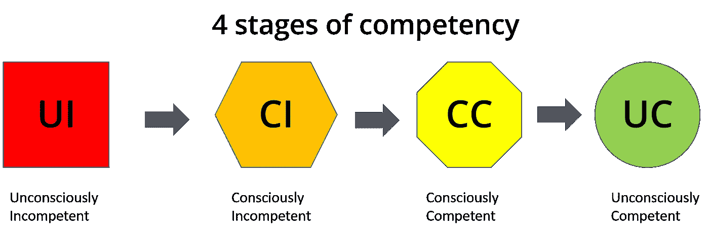

# 不要先确定流程的开始

> 原文：<https://blog.devgenius.io/dont-fix-the-start-of-your-process-first-7d04b4564d14?source=collection_archive---------6----------------------->

## 如何从原始混沌进化成某种过程

Johannes Plenio 在 [Unsplash](https://unsplash.com?utm_source=medium&utm_medium=referral) 上拍摄的照片

许多小企业已经逐渐成长为一个合理数量的开发人员和一些测试人员，但仍然以一种随意的方式编写代码，没有一致的或定义的过程。最近，我与一些公司讨论了这种情况，这些公司有 8 到 15 名员工，存在一些问题，我认为值得写下观察结果和建议。在所有这些案例中，这些公司都意识到出了问题，需要以更有条理的方式进行变革。

# 能力

作者格雷格·比灵顿的图片

描述个人和企业发展能力的一个简单而有效的模型是四阶段模型:

*   **不知不觉无能**——进化模型的底层。你不仅是坏的，而且你也没有意识到你是坏的，所以事情不会改善。
*   自觉无能——好一点，至少你认识到自己一无是处，所以很可能会努力寻找前进的道路。
*   **自觉胜任**——你现在能够做事，并且明白你可以用正确的方式去做。
*   **无意识地胜任**——你不仅能以正确的方式做事，而且你甚至没有意识到这一点。

# 原生浆液

因此，这些小企业已经发展到一定程度，以至于企业中的某些人，通常是花费大量资金试图变得更大、更快、更好，但没有实现的首席执行官，决定是时候向外部寻求帮助了。在这一点上，企业已经意识到自己是无能的。

在这一点上有一些策略:

*   鸵鸟政策——把头埋在沙子里，忽略这个问题，希望它会神奇地自我修复。
*   **乒乓** —当出现问题时，询问关键人物，他们很可能会对问题的原因(或归咎于谁)有自己的看法。然后顺着面包屑找到下一个会为自己辩护和/或通过把责备弹回来的人。
*   革命**——棘手但可行。引进一名顾问，培训每个人，增加许多新的流程和工具。将其实现为“大爆炸”，然后测量会发生什么。通常在几份报告出来后，顾问就会离开。**
*   ****进化**——以渐进的方式实施变革，并不断改进。**

# **更换和保持照明**

**流程变革的问题在于，企业的其他部分并没有停滞不前，公司需要不断赚钱来维持运转。**

**在较小的企业中，通常没有足够的时间或资金让专门的先锋团队来决定最好的工具、编写清晰的 wiki 页面、讨论过程选项。**

**典型的类比是车队需要在以每小时 90 英里的速度行驶的同时更换轮胎。即使你有技能，这也不是一件容易的事，更不用说你正在学习技能，并试图同时教授、鼓励他人。**

**这导致了一个优先排序练习:**

> **终极目标是什么？**
> 
> **近期目标是什么？(也就是造成最大痛苦的最糟糕的问题)**
> 
> **什么样的改变能带来最大的收益？**

**这一点很重要，因为早期的成功将展示变革的好处，从而更容易获得更多的资源、人员和资金。这也有助于改变那些不感兴趣、消极、抗拒改变、阻碍改变的人的想法。**

# **变革的进化策略**

**这里有一些在受约束的环境中进行渐进式变革的策略。请随意评论或讨论其他对你有用的技巧。**

*   ****从后面开始**——假设你的情况非常糟糕，那么你需要阻止事情进一步升级，并尝试增加一些控制力度。所以从发布和部署开始，然后回到生命周期。让团队参与进来，确保部署得到更好的管理，如果出现问题，恢复过程会更容易。介绍几个众所周知的模式/解决方案——金丝雀版本、蓝/绿部署、非工作时间部署、不要在周五部署(以防周六发生灾难)、添加试运行环境、所有团队投票决定版本是否足够稳定、测试覆盖率和 bug 数据。至少提前分享和解释数据和风险。告诉某人团队只测试了 60%的产品，其中 80%通过了测试，而你还没有回滚计划，这就把风险考虑和去/不去的决定推到了更高的位置。如果你发布并有一个问题，然后分享这些数据，你会得到一个不同的结果。**
*   ****分而治之**——将生命周期和开发过程分成更小的部分，并为每个部分分配一个变更负责人/传播者/或团队——配置管理、部署、发布、测试。逐步改进每个部分，但要让所有相互关联的子流程同时改进。**
*   ****可视化** —开始为产品和工作引入可视化工具，并使系统及其状态对所有人都是可访问的。我和一个在白板上画图表的团队一起工作，这是一个简单的建筑风格草图，但是很大。这些零件在组装和测试时被涂上颜色，所以图表从红色变成绿色。当它足够稳定可以发布时，他们在试运行环境中重复图表和步骤。**
*   ****每日站立会议** —从一天结束时的问题会议开始，尝试加快解决问题的周期，然后添加昨天的结果和今天的计划，并将其转移到一天的开始。加入一些乐趣和变化来保持人们的兴趣，在你知道之前，一个敏捷的站立会自然出现。**
*   ****节奏和步速**——尝试找到自然的心跳和节奏，工作需要快速流动，并对流动有一定的控制。试着减少局外人和利益相关者对工作会被完成而不是匆忙完成的恐惧。一个列表开始出现，可以共享以克服信任的缺乏，然后授权给团队。**
*   ****数据驱动的变化** —捕捉并记录任何可用的数据。这可能很棘手，但需要尽早完成，并且最好在变更开始前有一些历史记录可以展示。发布多久发生一次，有多少 bug 公开，团队中有多少人，完成了多少功能(每年/每月/迭代)，有多少行代码？数据可以用来证明一个变化的合理性，或者显示一个变化的效果(好的或坏的)。在一个混乱的公司里，数据就是力量。**

> **我总能找到向高层管理人员解释项目规模和遗留代码数量的方法，那就是计算代码行数，然后将其与登月(阿波罗 11 号)和航天飞机进行比较。例如，我们的代码是用于将宇航员送入太空的航天飞机代码大小的 62 %, NASA 比我们大得多，所以让我们放松一下，我们正试图用 3 名开发人员和一只狗来做这件事。**

****

**照片由 [NASA](https://unsplash.com/@nasa?utm_source=medium&utm_medium=referral) 在 [Unsplash](https://unsplash.com?utm_source=medium&utm_medium=referral) 上拍摄**

**随着上述策略中的一个开始生效，事情开始改变，然后可以添加更多的定义，速度可以慢慢增加。**

*   ****可视化** —可以发展成任务的积压，然后从白板转移到 excel，成为更多人可以看到和使用的工具。**
*   ****每日脱口秀**——可以更快地形成一套结构化的话题。积压可以用来控制正在进行的工作量。**
*   ****质量**可以理解为团队定义**完成**并与其他人分享以管理期望。**
*   ****反馈**可以通过经验教训咖啡会议来收集，而**回顾**这几个字可以开始溜进来。**

**然后，团队可以开始提前考虑更多问题:**

*   **待办事项**可以细化并区分优先级****
*   **短期目标或**主题**可以出现，因此团队交付有价值的东西，而不仅仅是一桶比特、一堆不相关的 bug 或一堆变更单。**
*   **团队中的一些人可能会更多地抓住这一点，他们是进一步激发灵感的人。这本书可能会让你感兴趣，你看过…上的博客吗？你认为团队会发现为计划预留时间有用吗？，你有什么想法来跟踪我们是如何完成工作的？这些人成为"**变革推动者**"，他们领先并领导团队，他们的热情会被磨掉。**

**现在是时候开始建议团队看看其他公司正在使用的现成流程了。如果其他人都这样做，那么它一定有价值，对吗？**鼓励和支持**这:**

*   **为 scrum 上的在线课程或视频付费**
*   **找一张一页的备忘单，然后传阅**
*   **找到一个过程的袖珍指南，给每个人一份(团队内外)**
*   **找一个免费的在线测试和测验，鼓励竞争，把证书贴在墙上，大声疾呼**
*   **安排一次午餐，学习分享知识和想法**

**随着这一点开始向前推进，然后寻找支持和发展团队的方式:**

*   **确保任何新员工在您提议的流程中都有经验**
*   **检查您使用的工具是否支持您的流程，或者调查其他选项**
*   **提供正式的培训和认证，理想情况下，在一次集体活动中培训所有人，或者先派出关键志愿者。**
*   **传播任何本地会议的详细信息，这些信息可能涉及流程改进或您正在采用的流程**
*   **开始让团队外的其他人意识到你在做什么**
*   **突出任何成功**
*   **保持记录度量和测量，并跟踪一段时间内发生的事情**
*   **请一位外部教练或有技能和经验的人来帮忙，也许是一位关键代码的开发承包商，但他也能解释、讨论、示范。**
*   **尝试并影响其他部门采用有助于整个团队、产品经理的变革，这些部门已经使用了与您的目标一致的流程或工具。**
*   **利用你业务中的任何盟友，可能是对软件感兴趣的质量经理，想要更敏捷的项目经理，想要更快变化的客户服务领导。**

# **反思的时间到了**

**在这个阶段，你的过程(无论你选择了什么)应该是活跃的，对其他人可见的，并且有希望开始产生影响。现在，您需要与团队一起审查:**

*   **什么在起作用——应该被锁定并继续下去**
*   **什么是不起作用的——应该停止、逆转、改变**

**你可能会决定继续发展(也许——从无到看板，从 scrum 到 less 到 safe …)或者只是利用你已经建立的优势，取得一些实实在在的胜利。**

**到这个时候，如果没有别的，你将**自觉不称职**，并且有希望成为**自觉称职**。**

# **进一步阅读**

** [## 园丁解释 Scrum

### 一个有趣的日常类比来解释 scrum

blog.devgenius.io](/scrum-explained-by-gardeners-30d0b27daf2f)  [## 你的 SDLC 烂透了！

### 如果你只有一把锤子，不要以为所有东西都是钉子

blog.devgenius.io](/your-sdlc-sucks-b0ac06b09911)  [## 过程改进蛇和梯子

### 我见过各种各样的开发人员，也见过不同的公司，他们都说他们在做敏捷，但实际上只是…

greg-billington.medium.com](https://greg-billington.medium.com/process-improvement-snakes-and-ladders-247c98f4fe25) 

# 关于作者的更多信息

**Greg** 是一名经验丰富的软件专业人士，也是[**outsource . dev**](https://outsource.dev/)**，**的首席技术官，他曾在多家公司工作过，现在热衷于帮助他人在软件开发、管理和[外包](https://outsource.dev/how-to-successfully-outsource-software-development-and-it-projects/)方面取得成功。

如果你喜欢这篇文章，请鼓掌👏和**跟着**我。**