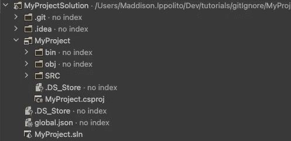
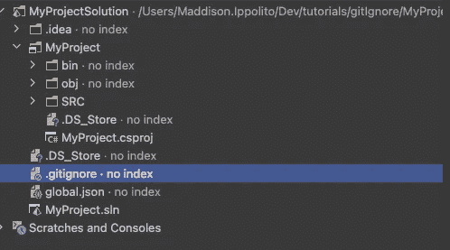

# 不要忽视。gitignore

> 原文：<https://blog.devgenius.io/dont-ignore-gitignore-fa5fcdbfeb36?source=collection_archive---------9----------------------->

# 为什么我需要一个. gitignore？

所以你一直在写一个程序，它进行得很好。你真的对你的代码很满意，它在你的机器上运行得很完美。就像你是一个聪明的程序员，你不只是在你的机器上保存一份拷贝，你一直在使用 GitHub 来跟踪你的更改，并拥有你的代码的远程拷贝。你正在和你的朋友聊你的程序，他们问他们是否可以检查一下并添加一些东西。你发送你的回购给你的朋友，他们克隆它，并作出修改，并把它推到主。你想看看他们做了什么改变，你拉回购，突然你有一大堆合并冲突。到底是怎么回事！？什么是 DS_Store？什么是. idea 文件，为什么你的朋友更改了它们？

在你和你的朋友争论破坏你的代码之前，让我们来看看最可能的原因。这很可能是因为您忘记向 repo 中添加一个. gitignore 文件。

那么 gitignore 文件到底是什么？好吧，都在名字里，git 忽略。这是一个隐藏文件，我们可以告诉 git 哪些文件要添加到你的 repos 中，哪些要忽略。转到机器上的任何项目，允许自己查看隐藏的文件(Command + shift +)。对于 mac 或查看>选项>更改文件夹和搜索选项>高级设置>显示 windows 的隐藏文件)。有些文件会弹出来，你可能都不知道它们在哪里。这些文件通常代表机器上的本地配置或运行时文件。这些不是运行程序所需的文件，并且会根据所使用的机器和 IDE 而改变。这就是导致合并冲突的原因。您将项目中的所有文件，包括隐藏文件，都推送到 GitHub。当你的朋友把代码推回去的时候，他们机器上的隐藏文件也被推了上来，导致了拉的冲突。那么我们如何使用？gitignore 来解决这个问题？git 将自动提交并推送 repo 中的所有文件，除非您告诉它“忽略”它们。这种情况的例外是。自动忽略的 git 文件夹。

# 为什么不能直接用模板？

老实说，你可以。有很多很棒的模板，涵盖了很多你可能需要忽略的文件(说真的，有些模板有几百行)。大多数情况下，这些模板可以完成工作。虽然像大多数编码的事情一样，如果你不知道事情是如何工作的，当它们出错时，你将会痛苦地试图找出如何修复它。尤其是如果你刚刚开始你的职业生涯，制作你自己的基本控制台或 web 应用程序，这是练习制作你自己的 gitignore 文件的最佳时机，而你的文件系统是简单的。无论您是自己制作模板还是使用模板，将. gitignore 添加到项目中应该是您首先要做的事情之一。从一开始就添加一个. gitignore 比试图删除已经在远程 repo 中的文件要容易得多。

# 我需要知道什么？

好了，首先要知道的是。gitignore，这就像当你在代码中引用文件路径时，我们需要考虑我们想要忽略的文件相对于你的。gitignore 文件。听起来令人困惑，但我们希望尽快让它变得更清晰。第二个需要知道的重要事情是我们可以使用的符号以及它们的含义。

#-大麻。英寸 gitignore 文件，哈希是我们用来做注释的。以散列开头的行不做任何事情。这几行可以用来为自己或他人做评论。

/-斜线。这用于分隔目录或文件夹。如果该行以斜杠开头，将在。gitignore 在。如果它是在一个文件名之后，它将在那个目录里面寻找。

*-星号。通常被称为通配符。这个符号可以代替 0——许多符号。如果文件名前面有*号，它将在所有目录中查找该文件名，甚至在多层目录中也是如此

[]-方括号。任意选择器。将忽略与括号中的任何字符匹配的任何内容。例如文件。[123]将忽略文件 1、文件 2 和文件 3

！感叹号。非符号。和许多编码语言一样！意思是没有。这可以代表不可忽视的东西。例如，如果您想忽略所有以结尾的文件。除了 example.txt，你可以写:

```
*.txt
!example.txt
```

# 把所有的放在一起

因此，您创建了一个新的解决方案来启动您的应用程序。添加您的。gitignore 文件。您可能希望将它放在最外层的目录中。您总是从。gitignore，看文件结构的“内部”比让你的。gitignore 嵌套在目录中，然后不得不向外看。



如果我们看看我的示例文件结构，我会想把我的。gitignore 位于 MyProjectSolution 目录中。如果我将它添加到 MyProject 或 SRC 目录中，我将不得不“向外”工作以忽略一些东西。这是使用模板时需要考虑的一件非常重要的事情。当你使用一个模板时，确保阅读它是如何引用要忽略的文件的。例如，如果它有/。想法在。忽略它，你把它放在。它不会忽略 MyProject 目录中的。想法目录，我们可以在顶部看到，因为它只会寻找。我的项目中的 idea 目录。

在上面的例子中，我做了一个本地 git 回购。


如果我们现在推动远程回购，这就是我们将得到的结果。如您所见，除了。自动忽略的 git 目录。



很好，我们已经添加了. gitignore。现在我们需要决定我们要忽略哪些文件。老实说，有很多文件类型，所以我将让您自己去查找原因，因为我们可能希望忽略某些文件/它们的作用以及特定于您的项目的文件。

在这种情况下，我们希望忽略以下目录。idea，bin，obj 以及 DS_Store 文件。

从我们的角度来看。git 忽略。就文件结构而言，idea 处于同一“级别”。所以我们将添加这一行:

```
.idea/
```

bin 和 obj 是一个层，位于:

```
*/bin*/obj
```

虽然有两个不同级别的 DS _ Stores:

```
*DS_Store
```

如果我们用 gitignore present 初始化 git，然后向上推我们的 GitHub repo，结果会是这样。


这是最基本的例子。请确保您考虑了是否有任何其他文件类型可能会在项目开发的后期出现，而我们可能想要忽略这些文件类型。如果您的项目将被其他人使用和添加，那么添加与其他常见 IDE 类型(如 vs 代码)一起出现的文件类型是一个好主意。