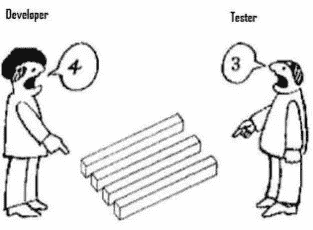

# 不要只测试快乐路径

> 原文：<https://blog.devgenius.io/dont-just-test-the-happy-path-e3fd565bad53?source=collection_archive---------4----------------------->

这篇文章的要点是，当涉及到编写和测试代码时，脾气暴躁的开发人员仍然可以在快乐的道路上蹦蹦跳跳。

[代码完成 2](https://crmbusiness.wordpress.com/2015/04/29/developers-need-to-stop-being-so-happy/A%20Practical%20Handbook%20of%20Software%20Construction) 有一个有趣的段落。

## 避免失败

> *Petroski 认为，许多引人注目的桥梁故障之所以发生，是因为专注于以前的成功，而没有充分考虑可能的故障模式。他的结论是，如果设计者仔细考虑了桥梁可能发生故障的方式，而不仅仅是复制其他成功设计的属性，像塔科马海峡大桥这样的故障是可以避免的*

# 开发商太高兴了

发展的过程通常是

*   收集的需求
*   指定的功能要求
*   规定的技术要求
*   为交付需求而编写的代码
*   测试->修复错误周期

开发人员通常专注于交付功能，这通常被称为遵循[快乐路径](http://en.wikipedia.org/wiki/Happy_path)

维基描述为[快乐之路](http://en.wikipedia.org/wiki/Happy_path)

> *在软件或信息建模的上下文中，一个* ***快乐路径*** *是一个默认的* [*场景*](http://en.wikipedia.org/wiki/Scenario_(computing)) *以没有* [*异常或错误条件*](http://en.wikipedia.org/wiki/Exception_handling) *为特征，并且包含了如果一切按预期进行所执行的活动序列。**[*【2】*](http://en.wikipedia.org/wiki/Happy_path#cite_note-2)*例如，函数验证信用卡号码的最佳路径是* [*验证规则*](http://en.wikipedia.org/wiki/Validation_rule) *都不会引发错误，从而让执行成功地继续到最后，生成肯定的响应。**

*当最终用户偏离了快乐的道路，进入了可选择的道路或异常的道路时，专注于快乐的道路和创建所需的功能就为错误留下了空间。*

*开发人员自然倾向于快乐路径，经常关注快乐路径测试。开发人员不会从最终用户的角度来看功能，而是主要从代码的角度来看功能。*

*对于开发者来说，为什么用户会使用意外的值，用户将如何使用该功能，或者他们试图使用该功能来实现什么，这些都不是显而易见的。*

*快乐路径测试可能会给空值、不正确的值和大量错误检查/验证错误留下漏洞，从而溜进生产系统，因为没有人测试过这些路径。*

*另一个问题是，开发人员低估了终端用户的随机行为。*

# *开发人员不是好的测试人员*

**

*开发人员不擅长测试他们自己的代码，让其他人测试代码被认为是一种很好的做法。*

*开发人员忽略 bug 的一个原因是他们使用系统管理员角色测试所有东西，这避免了许多权限错误。*

*[系统管理员的角色对 CRM 开发人员来说是一种好处，也是一种诅咒](https://crmbusiness.wordpress.com/2015/04/10/the-system-administrator-role-is-a-benefit-and-a-curse-to-crm-developers/)*

*开发人员很难退后一步测试功能，而不是测试代码。就像作家编辑自己的作品一样，他们对自己的作品有一种依恋感，以至于很难客观地评价它。*

# *如何避免失败*

*避免失败的有效方法是为代码编写单元测试。编写单元测试的行为让开发人员思考*

*   *该功能应该做什么，例如，我在测试什么*
*   *允许什么值(最小值，最大值)*
*   *可能会呈现哪些替代值*
*   *当错误发生时会发生什么*

*编码前思考是有益的，有时开发人员急于得到编码，他们错过了这一步。*

*一旦编写了代码，对开发人员来说编写单元测试就没有吸引力了，所以单元测试的最佳方法是在您创建代码的同时编写单元测试，并使用这些单元测试来确保它按预期工作。*

*思考错误和失败是非常有益的。你将捕捉并避免许多错误。开发人员将决定如何处理错误，这通常是一个选择*

*   *快速失败，中止操作*
*   *继续并警告用户*

*错误是不好的，但是错误地修改了预期值的一半的代码可能会造成更大的混乱，并且需要更长的时间来清理，所以最好预先有一个计划。*

*不要让这些通常很简单的错误从您的开发环境中泄露给最终用户，确保您强化了您的代码。*

*如果你不写单元测试，你应该考虑这样做*

*[为什么 CRM 开发人员应该对他们的代码进行单元测试](https://crmbusiness.wordpress.com/2015/03/31/why-crm-developers-should-unit-test-their-code/)*

*[使用 Microsoft Dynamics CRM 项目进行单元测试的经验](https://crmbusiness.wordpress.com/2015/04/28/experiences-of-unit-testing-with-microsoft-dynamics-crm-projects/)*

*如果你仍然没有被说服去写单元测试，确保你检查你的代码，寻找潜在的错误，验证检查。确保您已经决定了如何处理代码中的错误。在开发环境中管理错误比以后再添加要好得多/快得多/容易得多。*

# *给你更多的阅读*

*[先测试一下你的悲伤之路](http://dcycleproject.org/blog/63/test-your-sad-path-first)*

*[幸福之路测试](http://www.sei.cmu.edu/library/assets/happy.pdf)*