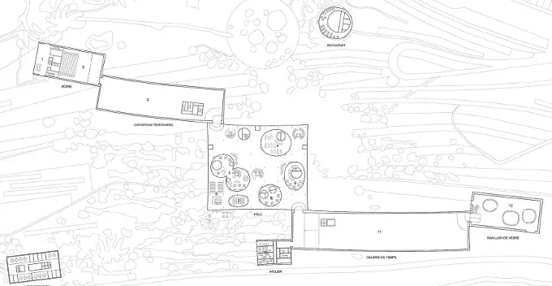
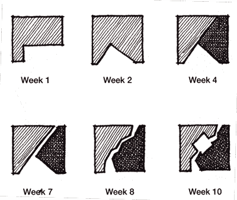

# 不要让敏捷毁了你软件的架构设计

> 原文：<https://blog.devgenius.io/dont-let-agile-ruin-your-software-s-architectural-design-a194db8be4be?source=collection_archive---------24----------------------->

图片来源:[https://flic.kr/p/hqFAs2](https://flic.kr/p/hqFAs2)，[知识共享](https://creativecommons.org/licenses/by/2.0/)许可

# Parti，大创意

建筑师称建筑的中心思想或概念为*部分*或简称为*部分*。这个词来自法语 prendre parti，意思是“做出决定”。你可以认为 *parti* 是建筑设计背后的大思想，它通常“通过描绘总体平面图组织[……]和[……]其经验和审美感受力的图表来表达”(引自[*Frederick m .:101 Things I Learned in Architecture School，MIT Press，2007*](http://www.amazon.de/gp/product/0262062666/ref=as_li_tl?ie=UTF8&camp=1638&creative=19454&creativeASIN=0262062666&linkCode=as2&tag=timecockpit-21&linkId=25YH4XHWVZKSEOC2) —一本值得推荐的书)。

## Parti 在敏捷项目中保护你的软件架构

特别是重要的敏捷项目需要一个部分，一个大想法的存在。我并不主张预先进行大设计的瀑布模型。我需要一个*方向点*，它有助于保持软件架构设计的一致性，同时使用敏捷原则在迭代中增强它。

没有 parti 的敏捷团队的典型问题有:

*   软件架构没有文档化，并且不可管理
*   软件架构不适合迭代增强和扩展
*   时间和金钱被浪费了，因为详细的设计阶段和实现在部分还不清楚的时候就开始得太早了
*   估计(时间和预算)是错误的，因为没有完全理解项目的范围
*   编程语言、框架、云环境等技术特点。确定建筑设计

## 我们自己的党

对于我们自己的软件产品 [*time cockpit*](http://www.timecockpit.com/) 及其底层 *Cockpit 框架* (CoFX)，我们在创办公司时花了好几个月的时间开发最初的软件架构 parti。我们还记录并在演示文稿、会议论文、杂志文章、视频等中展示了它。以下是我们自己的部分所涉及的一些主题示例:

*   我们产品用户的关键需求以及我们通常希望如何解决这些需求
*   SaaS 的构建模块(例如多租户、可用性、可扩展性、安全性)
*   自定义和扩展性概念
*   平台策略(例如，云平台、运行时、编程语言、库)
*   商业模式以及它如何转化为我们的软件架构

## 你对你的软件架构有兴趣吗？

多年来，我们的 parti 一直充当着许多日常设计决策的路标，现在仍然如此。在我们的咨询工作中，我们定期拜访软件开发公司，参加研讨会、培训和代码审查。他们中的大多数根本没有派对。有些人有，但它只存在于一个人的头脑中。只有极少数人能回答这样的问题:

*   你们产品的建筑设计的基本原则是什么？
*   在高层次上，你认为你的软件架构在三到五年后会是什么样子？
*   尽管软件开发的环境在快速变化，你的架构设计中最有可能不变的核心支柱是什么？

我们坚信一个清晰的和文档化的 parti 对于软件产品的长期成功是非常重要的。在软件产品的生命周期中，开发人员和架构师必须做出大量的决策。parti 应该是贯穿其中的金线。

## Parti 开发中的陷阱

你不可能在几个小时内为一个重要的软件产品创建一个 parti。相反，创建过程是令人疲惫和耗时的，因为需求可能是未知的，技术上的复杂性出现了，你会忘记事情，等等。计划足够的时间来发展 parti。没有它就开始详细的设计或实现是浪费时间和金钱。

模式、工具、库、最佳实践、好主意等的数量。是无尽的。小心不要把他们都塞进你的聚会里。目标是一个干净、一致、简单(而不是幼稚)的部分，满足你的项目需求。把其他的好主意留给将来的其他项目吧。

如果你正在纠结于复杂和简单之间的平衡，我推荐看看约翰·梅达的 [*简单定律*](http://lawsofsimplicity.com/) 。你可能会在那里找到一些灵感。

## 保持你的派对

当你设法创造出*并记录/可视化*你的第一部分时，你的工作还没有完成。客户和利益相关者经常改变主意。也许你会尽可能地坚持你的党派。您将向您的架构设计添加补丁和小的修复。很难识别什么时候聚会不再合适。当达到这一点时，你必须放弃它，对它进行重大改变，甚至创建一个新的。

糟糕的软件架构师坚持他们的角色，即使在敏捷项目中随着时间的推移自然发生的小的扩展、补丁和修复破坏了整体的完整性。

弗雷德里克·m .:我在建筑学校学到的 101 件事，麻省理工学院出版社，2007 年，第 26 页

## 软件架构师的角色

敏捷项目中 [*软件架构师*](https://en.wikipedia.org/wiki/Software_architect) 的工作是识别现有 parti 何时不再有效。她必须和她的团队一起做出更大的改变，或者创建一个全新的 parti，将所有的知识整合在一起。新的 parti 将作为未来迭代的指南。

## 摘要

1.  花时间为你的软件的架构设计开发一个部分，一个大的想法。
2.  记录并可视化您的 parti，以便您可以与利益相关者、同事、员工等分享。
3.  将您的详细设计决策与您的 parti 保持一致，以保持产品的完整性。
4.  勇敢的接受，当是时候放弃你的部分，创造一个新的部分。
5.  作为一名软件架构师，你负责开发和维护敏捷团队中的 parti。