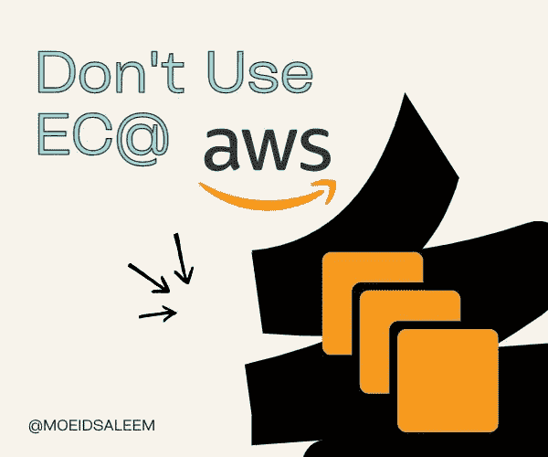
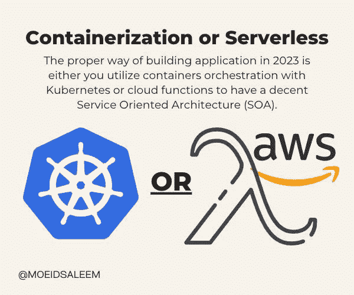
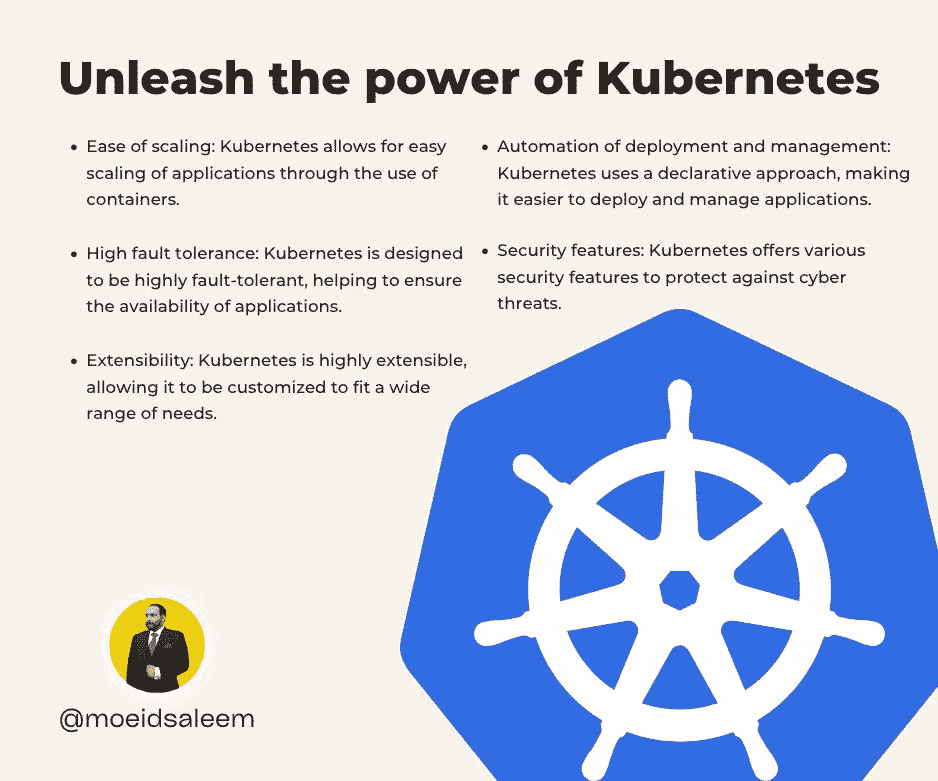
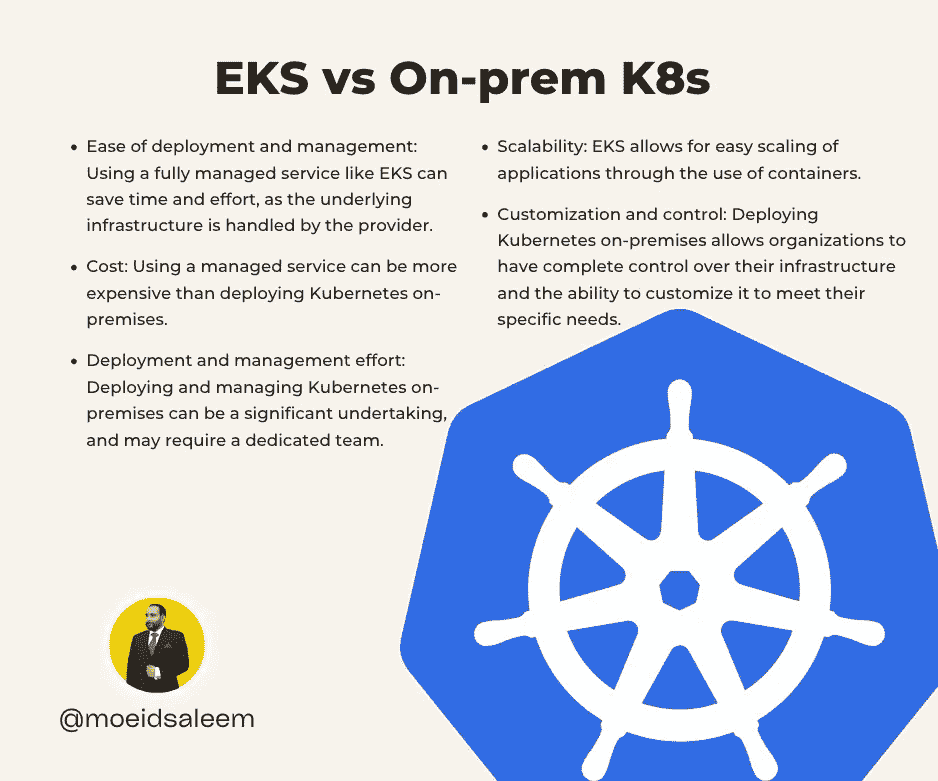

# 不要用 EC2，用这个代替

> 原文：<https://blog.devgenius.io/dont-use-ec2-use-this-ins-548b61347021?source=collection_archive---------11----------------------->

不要使用 EC2

随着组织越来越依赖云计算来推动其业务运营，使用哪个平台的问题变得越来越重要。虽然 Amazon Web Services (AWS)是最受欢迎的云计算平台之一，但它并不总是每个组织的最佳选择。特别是，许多组织正在转向 Kubernetes 或用于 Kubernetes (EKS)的亚马逊弹性容器服务，作为 AWS 弹性计算云(EC2)实例的替代方案。

容器编排与 AWS 无服务器

这种转变的主要原因之一是能够轻松扩展应用程序。EC2 实例是在云中运行应用程序的一种灵活可靠的方式，但是它们很难扩展。当对应用程序的需求增加时，增加额外的 EC2 实例来满足需求是非常耗时和耗费资源的。

另一方面，Kubernetes 和 EKS 使得扩展应用程序变得容易得多。这些平台使用基于容器的方法来部署和运行应用程序，这允许对资源进行更细粒度的控制。这意味着更容易添加额外的容器来满足需求，而不需要构建全新的 EC2 实例。

Kubernetes 和 EKS 的另一个优势是他们能够自动化应用程序的部署和管理。这些平台使用声明性方法，其中定义了系统的期望状态，而不是实现该状态所需的特定步骤。这使得部署和管理应用程序以及在必要时回滚更改变得更加容易。

释放 kubernetes 的力量

除了这些好处，Kubernetes 和 EKS 还提供了许多优于 EC2 实例的其他优势。这些平台的设计具有高度容错能力，是运行关键任务应用的可靠选择。它们还提供了许多安全功能，包括基于角色的访问控制和网络分段，有助于抵御网络威胁。

总的来说，虽然 EC2 实例是在云中运行应用程序的可靠而灵活的选择，但它们可能不是每个组织的最佳选择。对于希望轻松扩展其应用程序并自动化其部署和管理的组织，Kubernetes 和 EKS 可能是更好的选择。

# EKS vs 本地 kubernetes 解决方案

随着组织寻求采用像 Kubernetes 这样的容器编排平台，他们需要做出的一个决定是，是为 Kubernetes (EKS)使用像 Amazon Elastic Container Service 这样的完全托管服务，还是在内部部署 Kubernetes。这两种选择都有各自的优点和缺点，正确的选择将取决于组织的特定需求和要求。

使用像 EKS 这样的完全托管服务的主要好处之一是易于部署和管理。有了 EKS，组织不需要担心底层基础设施的安装、配置和维护，因为这些都由 Amazon Web Services (AWS)处理。这可以节省大量的时间和精力，并使组织能够专注于开发和部署他们的应用程序，而不是管理基础架构。

EKS 的另一个好处是能够根据需要轻松扩展或缩减应用程序。EKS 使用容器来部署和运行应用程序，这允许对资源进行粒度控制。这使得添加额外的容器来满足需求变得更加容易，而无需启动全新的虚拟机。

然而，使用像 EKS 这样的全托管服务也有一些缺点。一个问题是成本，因为使用托管服务可能比在内部部署 Kubernetes 更昂贵。此外，组织对底层基础设施的定制和控制水平可能会受到限制，因为这些都是由 AWS 管理的。

另一方面，在内部部署 Kubernetes 允许组织完全控制他们的基础设施，并能够定制它以满足他们的特定需求。这对于拥有敏感数据或严格合规要求的组织来说尤其具有吸引力。然而，在本地部署和管理 Kubernetes 可能是一项艰巨的任务，可能需要一个专门的团队来处理基础设施的安装、配置和维护。

最终，选择使用像 EKS 这样的完全托管服务还是在内部部署 Kubernetes 将取决于组织的具体需求和要求。组织应该仔细评估他们的选择，选择最能满足他们需求的解决方案。