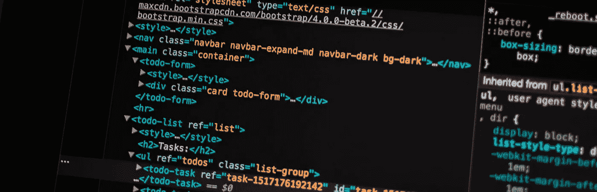

# 不要在 Angular 中使用本机 DOM 操作

> 原文：<https://blog.devgenius.io/dont-use-native-dom-manipulations-in-angular-6c8db13f463f?source=collection_archive---------10----------------------->

大多数前端项目都有根据各种条件改变 DOM 结构的需求。例如为特定用户显示或隐藏页面的一部分。这些类型的活动可以通过 DOM 操作来实现。

Angular 提供了各种结构指令来实现这一点。但是对于其他需要进行多种 DOM 操作并且操作逻辑非常复杂的复杂场景，您可能希望使用您的 typescript 代码进行 DOM 操作。

首先，我们可能会开始使用像 **document.getElementById** 或 **document.appendChild** 这样的方法，它们是本地 DOM 操作方法。但是如果我们仔细查看 Angular 的文档[你会发现一个名为 Renderer2 的 API 用于 DOM 操作。但是这些方法中的大多数什么都不是，只是原生 DOM 操作 API 的包装。让我们在这里看到他们](https://angular.io/api/core/Renderer2)。

如果你看它的代码，你会注意到在它的内部，它使用相同的原生 DOM API 进行操作。那么 Angular 为什么建议使用自己的 Renderer2 API 而不是原生 DOM 操作呢？

这主要有两个原因。

1.  **服务器端渲染(角度通用)**
2.  **安全**

让我们一个一个地谈论它们:-

1.  **服务器端渲染(角度通用)**

以下是 Angular Universal Page 的官方声明:-

> 因为通用应用程序不能在浏览器中执行，所以服务器上可能会缺少一些浏览器 API 和功能。
> 
> 例如，服务器端应用程序不能引用浏览器专用的全局对象，如`window`、`document`、`navigator`或`location`。
> 
> Angular 为这些对象提供了一些可注入的抽象，比如`[Location](https://angular.io/api/common/Location)`或`[DOCUMENT](https://angular.io/api/common/DOCUMENT)`；它可以充分替代这些原料药。如果 Angular 不提供它，可以编写新的抽象，在浏览器中委托给浏览器 API，在服务器上委托给替代实现(也称为 shimming)。

**2。安全**

假设您想创建一个指令，在使用该指令的地方将元素高亮显示为红色。这可以通过执行下面提到的代码来实现

这将很好地工作，但首先让我们听听 Angular 团队告诉我们如何使用 ElementRef [这里](https://angular.io/api/core/ElementRef#properties)。

> 当需要直接访问 DOM 时，使用这个 API 作为最后的手段。请改用 Angular 提供的模板和数据绑定。或者，您可以看一看`[Renderer2](https://angular.io/api/core/Renderer2)`,它提供了即使不支持直接访问本地元素也可以安全使用的 API。
> 
> 依赖于直接 DOM 访问会在应用程序和呈现层之间产生紧密耦合，这使得不可能将两者分开并将应用程序部署到 web worker 中。

同样的指令可以如下实现。

您也可以选择实现自己的 Renderer2 实现。因为这是渲染 2 [的官方声明，这里是](https://angular.io/api/core/Renderer2)。

> 扩展此基类以实现自定义呈现。默认情况下，Angular 将模板呈现到 DOM 中。您可以使用自定义渲染来拦截渲染调用，或者渲染到**而不是 DOM** 。

我们可能会这样想，因为我们在项目中没有使用服务器端渲染，所以可以使用原生 DOM APIs，但将来您可能希望从提高应用程序性能中受益。此外，Renderer2 可以实现为支持除 DOM 之外的其他东西的呈现。这仅仅意味着它是未来的证明。

> Angular 的未来将会看到更多与服务器端渲染、Web Workers 等领域的性能相关的改进。减少构建规模只会在一定程度上增加。让您的项目准备好开始从现在可用的和将来可能可用的这些改进中获益。你应该开始使用 Angular 提供的 Renderer2 API，而不是使用原生的 DOM 操纵 API。