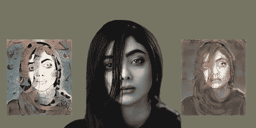

# Dore DeepStyle:基于人工智能的风格转移照片效果 SDK

> 原文：<https://blog.devgenius.io/dore-deepstyle-ai-based-style-transfer-photo-effect-sdk-889881a2702d?source=collection_archive---------13----------------------->

创建过滤器或类似“Prisma”风格转移的功能需要几个月的努力，现在，有了 Dore DeepStyle，您可以在几分钟内使用基于 DeepStyle AI 的风格转移照片效果 SDK 将相同的功能添加到您的应用程序中，不仅是图像，您还可以在实时视频中使用这种风格转移效果。

适用于 IOS 和 Android 的实时相机视图风格传输图像效果移动 SDK

Dore DeepStyle 优化了人工智能算法，使其能够在 IOS 和 Android 设备上实时工作。为了建立风格转移，我们已经培训了 150 多种不同的风格。我们创建了一个简单易用的移动 SDK，允许任何开发人员将风格转移集成到他们的应用程序中。所有处理都在设备上实时完成

dore deep Style:IOS 和 Android 的风格转移移动 sdk

Dore DeepStyle(基于人工智能的风格转移照片效果 SDK)允许我们以另一种风格重新组合图像的内容。如果你曾经想象过如果一张照片是由一位著名的艺术家绘制的，它会是什么样子，那么 Dore DeepStyle transfer 就是将这变成现实的风格转移照片效果技术。

实际上，这是一种技术，它采用两个图像-一个内容图像和一个样式参考图像(样式过滤器类型)并将它们混合在一起，以便最终的输出图像保留内容图像的核心元素，但看起来是以样式参考图像的样式绘制的，Dore DeepStyle 免费提供了超过 [150 种不同类型的样式](https://dore.ai/product/dore-deepstyle/2-product/23-doredeepstyle-filters)(过滤器类型)。

随着风格转移等技术的进步，几乎任何人都可以享受创作和分享艺术杰作带来的乐趣。

用于 IOS 和 Android 的实时风格传输移动 sdk

更多信息:【https://dore.ai/product/dore-deepstyle 