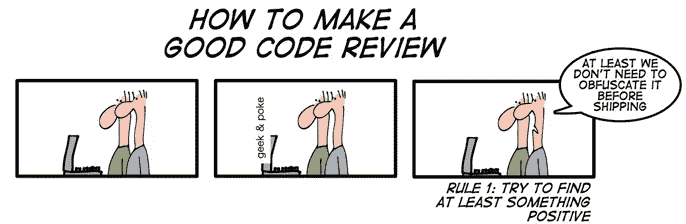

# 下一次代码评审的应该做和不应该做的事情

> 原文：<https://blog.devgenius.io/dos-and-donts-for-your-code-review-b25c088ce8cb?source=collection_archive---------21----------------------->

> 关键的一点是，没有“完美”的代码，只有更好的代码。

途经[http://geek-and-poke.com/](http://geek-and-poke.com/)

# 磁盘操作系统

## **为审核人**:

1.  要善良。整个过程都是为了相互开发，提高代码质量。如果你心情不好或太累，请让别人做或重新安排。
2.  解释你的推理。语气是关键，坚持事实，说明。
3.  在给出明确的指示和指出问题并让开发人员决定之间取得平衡。使用问题或建议来推动对话。
4.  鼓励开发人员简化代码或添加代码注释，而不是仅仅向您解释复杂性。
5.  限制和分开吹毛求疵。留下有助于开发者学习新东西的评论总是好的。随着时间的推移，共享知识是改善系统代码健康的一部分。请记住，如果你的评论纯粹是教育性的，但对达到标准并不重要，那么在前面加上“Nit:”或者表明作者并不一定要在这个 PR 中解决它。
6.  每次都要彻底。如果情况紧急，就加速。
7.  一个评审者应该追求的不是完美，而是持续改进。作为一个整体，提高系统的可维护性、可读性和可理解性的 PR 不应该因为它不“完美”而被推迟几天或几周。审稿人不应该要求作者在批准之前润色 PR 的每一个细节。

## **对于被评审人**:

1.  处理所有评论。尽快确认评论。
2.  让评审请求尽可能的小。在实际的代码评审之前发出预读、prd 和技术文档。
3.  确保你已经公正地对待了你的公关。不要推不必要的改动，不要在同一个 PR 里做相关的改动。
4.  写好标题和描述。让你的代码评审请求读起来很愉快。

# 不要

1.  避免讽刺和表情符号。避，“有你的。甚至测试过？”。试着说，“当 x 时，代码中断。你能解决这个问题吗？”避免使用否定或呕吐表情符号来指出代码中的问题。出于类似的原因，这与讽刺一样无益。表情符号晦涩难懂，容易被误读。
2.  避免问判断性的问题。避免"*为什么不直接在这里做 __ "*，试试，“*你可以做 __，这样有 ____ 的好处。”*
3.  如果你心情不好或太累，请让别人做或重新安排。
4.  不要把你个人的观点和喜好当做事实来推。技术事实和数据推翻意见和个人偏好。
5.  不要被铺天盖地的评论淹没。当一个人犯了一个错误时，他们很有可能在变更集中的几个地方犯了同样的错误。不要一遍又一遍重复同样的评论。
6.  不要让一个开发者去修改他在当前公关中没有触及的代码。如果那件事与你有关，创建一个标签并添加到你的待办事项中。
7.  如果没有其他规则适用，那么评审者可能会要求作者与当前代码库中的内容保持一致，只要这不会恶化系统的整体代码健康。
8.  在风格问题上，风格指南是绝对的权威。任何纯样式点(空白等。)不在风格指南里的是个人喜好问题。风格要和那里的一致。如果没有以前的风格，接受作者遵循的风格。

基于[https://google.github.io/eng-practices/review/reviewer/](https://google.github.io/eng-practices/review/reviewer/)的
读数和
对[的【https://rands in elements . com/welcome-to-rands-leadership-slack/】和
的讨论，从过去 7 年无数次代码评审中学习](https://randsinrepose.com/welcome-to-rands-leadership-slack/)