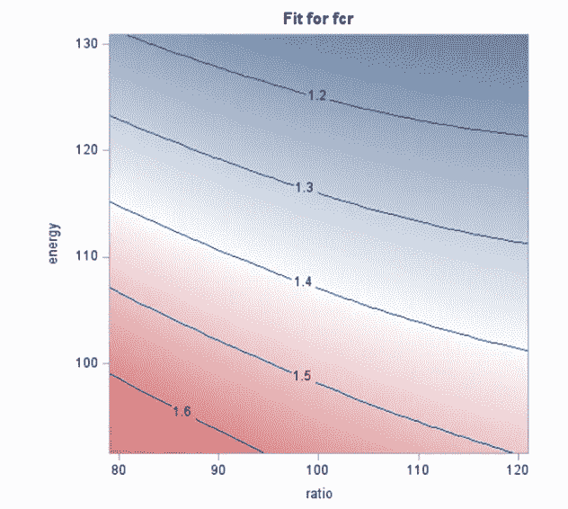
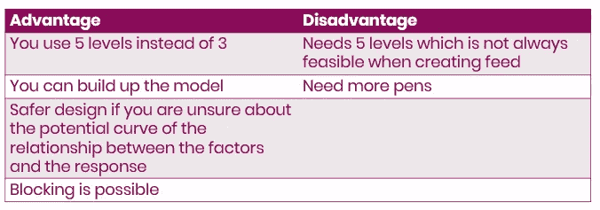

# 使用 SAS 的剂量反应、反应表面和样条曲线

> 原文：<https://blog.devgenius.io/dose-response-response-surface-designs-and-splines-using-sas-42535db1302e?source=collection_archive---------0----------------------->

在这篇文章中，我将关注剂量反应和反应面设计，这可以被视为继我在[关于实验设计的介绍性](https://medium.com/@marc.jacobs012/general-introduction-to-design-of-experiments-in-animal-science-using-sas-for-codes-fe1c5272b37a)文章之后的又一次深入探讨。

剂量反应设计旨在找到一种物质**(剂量)**的数量或暴露量与其对动物的总体效应**(反应)**之间的**关系**。为了有效地设计剂量反应研究，你需要了解**生物系统**并有一个集中的问题:

1.  有剂量效应的证据吗？
2.  最佳剂量是多少？*(响应面设计)*
3.  要产生不同于控制/零响应的响应，需要做什么？
4.  剂量关系的本质是什么？

两个变量之间的关系，以及大型数据集中几个变量之间的相关性。左边清楚地显示了剂量反应。

两个变量之间的关系。

下面，您将找到一个快速代码来实际生成响应面图，这可以通过任何线性回归模型来完成。这里我用了 **PROC GLIMMIX** 。关键是要包括每个变量的主要效应和二级交互作用，以及每个效应的多项式。这些图清楚地显示了适当拟合的模型和变量之间的多项式响应曲线。

要使用 PROC MIXED 或 PROC GLIMMIX 生成响应曲面图，除了每个效应的多项式之外，还需要包括每个变量的效应和二级交互作用。

残差看起来和结果本身一样好。

现在，这进行得有点快，所以让我们后退一步。下面，我用 **PROC PLAN** 创建了一个响应面设计，实际上是一个 5 全因子。用这种方法，创造全因子是轻而易举的事。热图在可视化你所做的东西方面表现出色。

**PROC 计划**创建一个 5 全阶乘。

以及由此产生的 3D 设计的 2D 图。

每个剂量反应设计成功的关键是已经有了关于剂量反应曲线的知识——了解生物学。这听起来像是一个悖论——如果你已经对剂量反应曲线有了很好的了解，为什么还要进行剂量反应设计呢？这是因为许多物质遵循一个给定的公式。这也带来了一个问题，因为方程的微小变化会导致剂量反应曲线的大幅波动。

可用于拟合右侧关系的几条可能曲线。最后，使用了不同的曲线。矛盾的是，找到可能的匹配的最简单的方法是知道关系将遵循的曲线。有点像第二十二条军规。

因此，了解**曲线**对你的试验设计很有帮助。找到正确的**参数**，这就是 SAS 将帮助你的地方。

Gompertz 曲线拟合 7000 头猪体重增长的例子。

如果你的目标是**拟合曲线**，你需要:

1.  以这样一种方式放置剂量，使你能够估计整个曲线
2.  即使有些剂量你不感兴趣！！

让我们举例说明这在实践中是如何工作的。下面你看到的是 Sigmoid E-max 模型的非线性公式，它是测量毒性的标准剂量反应模型。接下来，我们将模拟一个我们知道可以用这个公式拟合的响应。为了创建一条平滑的曲线，我们将要求 SAS 创建大约 200 个观察值。

在**数据步骤**模拟中使用的非线性公式。

在数据图的下方，您可以看到 EC50、底部、顶部和顶部。

如果您在 SAS 中运行该模型，则 **PROC NLIN** 程序将为您提供您为开始模拟而插入的值。这在 200 次观察中是很自然的，没有变化。

你不需要 200 个观察值来适应这个模型。由于是四参数模型，所以只需要五个观测值。然而，诀窍是将它们尽可能地放在信息丰富的地方，这意味着它们必须覆盖整个范围。

如果放置正确，这个模型可以用五个点来拟合。在这里，我把它们放在底部、顶部和 EC50 处。

现在，如果我不包括 EC50，你可以看到会发生什么。模型会合适，但是你用的公式不合适。太多的参数无法拟合这样的曲线。

在 EC50 之后，拟合的缺乏变得明显——顶部、希尔和 EC50 被很好地估计，但是底部只是一个随机的猜测。

因此，由于没有包括**拐点剂量**(50%反应时的剂量【EC50】)，该模型难以估计曲线的 **EC50** 和**底部**。因此，我们对剂量反应曲线的**下部没有很好的了解。**

接下来，是治疗之间的剂量反应关系评估——这里是喂养计划。

热图是描绘两个或更多变量之间关系的绝佳方式。

SAS 中估计响应面图的常用分析方法是 [**PROC RSREG**](https://support.sas.com/documentation/onlinedoc/stat/131/rsreg.pdf) 。事实上，这个过程是为了估计响应面的回归曲线。下面，您可以看到通过包含变量来获得结果是多么容易。

与之前的 **PROC GLIMMIX** 相比，你不必指定确切的功能。PROC RSREG 会自动执行此操作。

两个 **PROC RSREG** 结果的比较。与 **PROC GLIMMIX** 相比，我们必须对每个治疗组分别进行分析。

和等高线图。正如你所看到的，他们之间可能没有太多的曲线关系。热图已经揭示了这一点。

这里，我们有 PROC GLIMMIX 方法，包括治疗。残差真的没有那么大，暗示着模型设定错误，或者只是缺少曲线线性关系。

最终，结果确实模拟了观察结果。

与 PROC RSREG 相比，PROC GLIMMIX 可以很容易地在特定时间提供处理之间的比较。

最后，该模型甚至可以用于观测值之间的插值和观测值之外的外推。一如既往，插值是更安全的进行。

超越模型

超越模型

在前面的示例中，您可以看到赖氨酸随着时间推移对 FCR 的影响:

1.  随着时间的推移，FCR 增加。
2.  赖氨酸水平较低时，FCR 最高。

现在，我们能设计一个新的试验来绘制能量和赖氨酸/能量比之间的关系吗？我们假设这种关系遵循抛物线，这里可以看到。

不同处理(及其能量含量和赖氨酸/能量比)和预期 FCR 之间的预期关系。在这里，所有的治疗都是潜在剂量反应关系的一部分。因此，我们最好不要谈论治疗，而是讨论剂量反应。

能量/赖氨酸比率与 FCR 以及能量与 FCR 之间关系的估计拟合度。

ls 表示来自模型的适合度。能量是有影响的，但没那么大。

所以，我们模拟了一个额外的场景，其中会有更大的影响。请记住，模拟的目的是了解我们所预见的关系，以及模型检测噪声中信号的能力。因此，对于每个设计仿真，您需要对信号和噪声都有所了解。

第二次尝试。

关系更像曲线线性。

每个剂量反应设计成功的关键是已经有了关于剂量反应曲线的知识——了解生物学。这将帮助你在**设计一个有效的研究**，其中剂量反应的假设可以被证明。一个积极的结果会给你一个**统计模型**，通过它你可以估计因素和反应之间的关系。这些统计模型可以用来估计数据边界之外的响应**，但是这种努力当然不是没有风险的。**

R 响应面法一般指使用 **3** 步骤的统计设计和分析的**完整包；**

1.  设计并收集数据，以拟合方程**来近似因子和响应之间的关系**。
2.  拟合**回归模型**来描述数据。
3.  通过**图形和数字技术**检查配合关系。

每个响应面模型的开始是一个[全因子](https://medium.com/@marc.jacobs012/factorial-designs-in-sas-8af1e6895fef)。事实上，响应面是将全因子减少到更易管理的大小的有效方法，而不必降低寻找特定线性或曲线关系的统计效率。例如，为了评估三种水平的快速淀粉、快速蛋白质和快速纤维对肉鸡生长性能和胴体特性的影响，我们可以使用以下设计:

我们希望包括的水平和因子-这将导致 3 全因子。

代码创建全因子，在 3D 和 2D 的设计。

使用 3 全因子意味着创建 27 个处理，因此:

1.  每次治疗四支笔
2.  (27 *(27–1))/2 = 351 个可能的比较

然而，如果你的目标是找到最佳组合，你很可能发现不了，因为你只有 27 个组合。如果最佳组合在这些范围内，你可能需要 270 次(10 倍)甚至 2700 次(100 倍)的治疗。

因此，尽管您需要全因子设计来开始构建响应面设计，但您需要响应面设计来找到因子水平的最佳组合，而不必使用全因子设计。响应面设计通常是全因子设计和随机区组设计的组合，导致两种可能的选择:

1.  中心复合设计
2.  博克斯-贝肯设计

响应面设计的目的是找到一个最优值(最小值或最大值)。不多也不少。

响应面应该找到最小值或最大值，而不是脊或鞍。如果他们这样做，这是一个迹象，表明设计没有选择正确，这在大多数情况下意味着你没有选择正确的水平。你要么放大，要么缩小，要么完全错过了标记。

目的是设计一个有效的实验，使用一个**全因子**作为基础，并找到假设的**最小值/最大值**。一个**高效的设计**意味着选择一系列因素，使我们能够:

1.  创建二次线
2.  尽可能减少差异
3.  使用所需的最少次数

让我们使用下面的用例。下面你会看到一个包含几个变量的数据集，我们首先对这些变量进行简单的交叉关联，找出显示一些有趣关联的变量。每个变量在进行交叉比较之前首先被标准化。

变量之间相关性的热图。

然后我们运行 **PROC RSREG** 来寻找曲线关系，如果它们存在的话。记住，生物学应该驱动这样的决定，但是现在，让我们用一个更统计驱动的方法。

r 非常高，我看到一些计算错误。该设计似乎不需要二次响应，但当我看到这样的响应时，我会很小心。

然后我看到了这个图，我确定我需要小心。

让我们使用 **PROC GLIMMIX** 再试一次。

残差看起来很好，左边的图看起来很好，尽管它是一个马鞍。然而，如果你记得 PROC RSREG 中的情节，你也会意识到这些结果是不可轻视的。事实上，根本不应该服用它们。

让我们创建一个新的更简单的模型。

没有证据表明缺乏拟合，并且这种关系似乎与叉积成线性关系。然而，右边的图确实让我想知道覆盖在点上的曲线到底有多合适。

让我们用 **PROC GLIMMIX** 重新运行。

我对结果感到更放心了。

再次，一个新的模型。

又一次有趣的结果。

在 GLIMMIX 过程中重新运行。

如果你只看残差，看起来不错，但模型本身(右边的图片显示)在左上角显示了相当大的差距。模型的选择确实揭示了一些有趣的部分，但现在没有什么可以解决的。

总之，响应面的目的是设计一个有效的实验，使用**全因子**作为基础，并找到假设的**最小值/最大值**。一个**高效的设计**意味着选择一系列因素，使我们能够:

1.  创建二次线。
2.  尽可能减少差异。
3.  使用所需的最少次数

有两种类型的响应面设计:

1.  中心复合设计
2.  博克斯-贝肯设计

首先从 BBD 开始。BBD 可能是最直观的设计，因为它保持在全因子空间内，这在 CCD 中不会发生，CCD 中包括原始全因子之外的水平。正如你在下面看到的，BBD 使用了原始的 3 全阶乘，并考虑了放置在立方体“边缘”的所有组合。剩下的是中点和中心点，它们实际上被复制了三次。这种复制对于以相等的方差估计立方体的三个维度上的方差是必要的。这叫整齐划一。当然，你可以自由添加更多的中心点，也可以复制所有其他的组合。然而，BBD 的目标是效率，即用最少的水平模拟原始全因子所需的最少的实验单位。

BBD 是全因子的精简版本，但没有失去寻找关系(如果存在)的特性。

构建 BBD 的方法是:

1.  你在中心放一个数据点
2.  然后在过程空间的每个边缘的中点处有一个数据点
3.  并且没有拐角(极端)点

每个图对左侧的响应面设计结果和右侧的点。

SAS 的问题是无法创建 BBD，所以我不得不恢复到 r。幸运的是，有一个非常简单的包叫做 [rsm](https://cran.r-project.org/web/packages/rsm/rsm.pdf) ，它可以创建任何类型的响应面设计。下面，您可以看到为三个因素和三个水平创建响应面的简单代码，这些因素和水平是均匀分布的。中心点重复三次，设计是随机的。

在上面这段简单的代码中，我指定了以下内容:

1.  n0=3 表示三个中心点
2.  指定三个蛋白质水平，从 13 2 开始
3.  从 13.5±0.5 开始指定三种淀粉水平
4.  从 2.75±0.65 开始指定三个纤维等级
5.  随机组合

来自 rsm 程序的结果。

通过使用 BBD，我们应该能够:

1.  找到三个因素之间的**二次效应**，如果它存在的话
2.  与全阶乘的**同幂**
3.  但是少了**个实验单位**

现在，我们有了设计，并且进行了设计，我们可以开始使用 **PROC REG** 查看结果。

不缺乏契合度，这很好。r 极低，但不需要说明什么。

此表显示了模型的拟合度以及关系是线性还是二次关系。还计算叉积。“不适合”行的非显著值意味着我们不需要添加额外的因素。

寻找第 0 天体重的淀粉、蛋白质和纤维之间的关系

从结果中，您可以看到该关系是最小值、最大值、鞍形还是脊形。它还提供了一个驻点和达到这个驻点所需的响应。

该表显示了所有因素加在一起的 BW 值:40.97。它还显示了淀粉、蛋白质和淀粉的水平。此表指示响应面模型是最小值、最大值、脊形还是鞍形。在这里，它是一个马鞍。然而，并非所有的组合都是如此，如下图所示。

当纤维设定在某一水平，淀粉和蛋白质变化时，响应面模拟最大值。

这里我们有马鞍。

和另一个马鞍。

实际结果向左，响应

使用 BBD 的优点和缺点总结

使用 BBD 时，你需要绝对确定因素和响应之间的关系是二次的！因此，当你只希望每个因子有三个级别时，通常使用 BBD。与 CCD 相比，它有两个主要优点:

1.  它只需要三级——CCD 需要五级，这是更极端的情况
2.  通常需要较少的笔→ 3 因子 CCD 需要 20 个实验单位，而 BBD 需要 15 个。
3.  在 **SAS** 中无法设计，但在 **R** 中不难设计

现在我们已经讨论了 BBD 设计，最好也讨论一下中心复合设计(CCD)。这是一种更先进的设计，但价格不菲。构建 CCD 的方法如下。你:

1.  采取全因子设计
2.  删除所有的中点，这样你就只剩下边了
3.  添加一个中心点(所有因素之间的中点)
4.  重复中心点
5.  添加轴向(星形)点(极值)

本质上，CCD 是一种中心点和星点或轴点相结合的析因设计。下面你会看到多个图形示例，展示了这种设计是如何设置的。

CCD 设计由三部分组成，析因设计、中心点和轴点。它们共同实现了线性和二次效应，而 BBD 设计只能适应二次(曲线)效应。

BBD 和 CCD 设计的比较。两者各有利弊。CCD 更灵活，但需要更多的实验单元，有时在生物学上不可行。

要在 SAS 中创建 CCD，您需要使用[内置宏的](https://v8doc.sas.com/sashtml/qc/chape/sect19.htm)。它们易于使用，并带有一系列功能。首先，让我们使用 [**%adxpcc 宏**](https://v8doc.sas.com/sashtml/qc/chape/sect22.htm) 来查看可能的复合设计。下面，你会看到我试图找到一个具有特定属性(三个级别，三个因子)的设计，并将这些属性扩展 1.6818。然后我会用 [**%adxdcode 宏**](https://v8doc.sas.com/sashtml/qc/chape/sect7.htm) 来解开设计。

顶部的宏寻找三因子 CCD 设计，底部的宏解开它。

该宏为您提供了一个解决方案和进一步解开该解决方案的代码。最佳设计有八个因子部分、九个中心点和六个轴向极值，需要 23 个实验单位。第二好的设计只需要 20 个实验单元。

左边是原始的全因子。然后建立 CCD，最后进行 CCD 设计。在这里，你可以看到第二个设计。

在 SAS 中，如果你知道宏的工作方式以及 CCD 的优缺点，那么创建 CCD 实际上并不困难。简而言之，CCD 为你提供了更大的能力，但能力越大，责任越大。

CCD 的优点和缺点。

正如我在上一篇文章中展示了如何[优化析因设计](https://medium.com/@marc.jacobs012/factorial-designs-in-sas-8af1e6895fef)，我将在这里展示如何优化 CCD。当然，我们将返回到 **PROC OPTEX** 进行优化，这是 SAS 中的首选程序。CCD 的初始设计将使用 **%adxccd** 和 **%adxdcode** 宏构建。然后，我们将使用该设计来优化我们想要分析的响应面，包括一个七块结构。

从 fccd 到 DesignMF →从 ccd 设计到专注于特定回归的模块化 CCD 设计。

一旦你包含了你想要优化 CCD 的公式，你也知道如何分析它。如你所见， **PROC MIXED** 来自 **PROC OPTEX** 。

**PROC PLM** 是创建显示两个或多个因素之间关系的等高线图的强大工具。

很明显，一旦光纤被固定在某一点，变量之间的关系就模仿最大值。

进程 RSREG 与最大值一致。

总之，中心复合设计是另一种类型的响应面设计，像 Box-Behnken。这些可以在 SAS 中轻松创建和优化。与 Box-Behnken 相比，CCD 需要更多的复制，您需要实现更多的极限水平。然而，这带来了创建响应面设计的更多自由，包括阻止您的设计的选项。

下面是一些分析数据集的附加示例，如响应面设计。当然，将数据集作为响应面设计进行分析的最简单方法是，该设计实际上是一个响应面。事实往往并非如此——这种设计模仿了传统的剂量反应。

以下所有示例都使用样条来创建曲线关系。样条是一种分段回归，它在分段模型的节点(即所谓的断点)处进行平滑处理。

多项式和样条模型的代码。

多项式和样条模型的输出。

查找特定因子级别的因子之间的差异的代码。

用于在样条比较的每个点获得处理之间的多重调整差异的代码。

右边的输出显示了图形中两条样条曲线之间的差异是否具有统计显著性。这些估计值根据多重比较进行了调整。

热图是显示三个因素之间关系的绝佳方式:

1.  水平
2.  时间
3.  来源

我建议你从这些图开始探索，看看你收集的数据是否真的有意义。

使用样条效果的 **PROC GLIMMIX** 代码。因为它们是样条，我只需要包括主效应和双因素效应。而不是额外的二次效应。

来自 **PROC RESREG** 的结果看起来不错。

从 **PROC GLIMMIX** 获得的残差看起来也不错。

样条与多项式模型。

样条与多项式模型。请注意，尽管样条模型看起来非常有吸引力，但它们可以轻松超越自己，正如您在与多项式模型进行比较时所看到的那样。没有什么比过度拟合更糟糕的了，这正是左边的图看起来的样子。

样条模型与多项式模型

如果您有三个以上的级别，并且想要超出数据的边界，样条效果是比多项式更安全的选择。然而，总是要检查模型化的效果是否有生物学意义。

在这篇文章中，我讨论了剂量反应/反应面设计在寻找变量和反应之间潜在的有趣关系中的可能用途。我向您展示了如何设计、探索和分析来自响应面设计的数据。我还强调了生物学的重要性，以及密切关注你想要达到的目标。响应面设计只是达到目的的另一种手段，而目的必须从一开始就很明确。