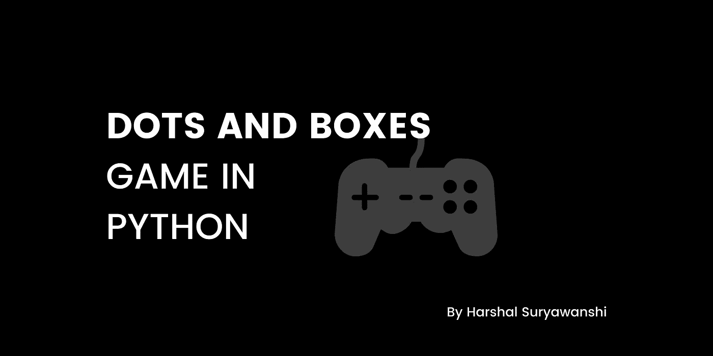
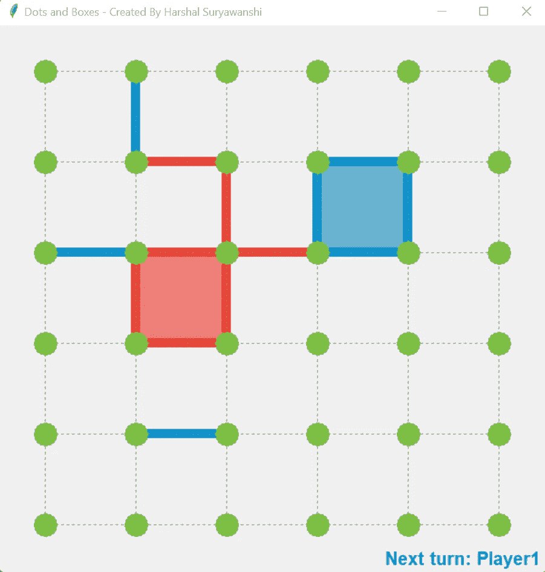

# 以下是我如何用 Python 编写“点和盒子”游戏的代码

> 原文：<https://blog.devgenius.io/dots-and-boxes-game-in-python-22058a187a84?source=collection_archive---------3----------------------->

作为一名计算机科学和应用专业的学生，编程是在各个领域中进行选择的一个途径。在编程方面，我是一名 Python 和 Django 学习者(截至目前)。除此之外，Python 是市场上使用最多的语言之一。众所周知，Python 是一种解释型语言。在这里，我们可以编码和开发网站，应用程序，游戏和更多的探索。



所以，今天我将编码并解释我是如何用 Python 编码“点和盒子”游戏的。

**先决条件:** tkinter、numpy、编辑器和一台电脑/笔记本电脑。

安装时， **pip 为 Tkinter 安装 tk** ，而 **pip 为 numpy 安装 numpy** 。

之后，这个基本的安装——进入你的编辑器**(例如 Visual Studio 代码，PyCharm，PyScripter)**

首先，我们将根据代码脚本导入库。

```
from tkinter import *import numpy as np
```

然后，我们将定义 **GUI 中的所有内容，如棋盘大小、玩家、圆点**等等。

```
size_of_board = 600number_of_dots = 6symbol_size = (size_of_board / 3 - size_of_board / 8) / 2symbol_thickness = 50dot_color = '#7BC043'player1_color = '#0492CF'player1_color_light = '#67B0CF'player2_color = '#EE4035'player2_color_light = '#EE7E77'Green_color = '#7BC043'dot_width = 0.25*size_of_board/number_of_dotsedge_width = 0.1*size_of_board/number_of_dotsdistance_between_dots = size_of_board / (number_of_dots)
```

让我们创建一个类并**初始化函数。**

```
class Dots_and_Boxes():
```

初始化或**定义功能**

```
def __init__(self):self.window = Tk()self.window.title('Dots and Boxes - Created By Harshal Suryawanshi')self.canvas = Canvas(self.window, width=size_of_board, height=size_of_board)self.canvas.pack()self.window.bind('<Button-1>', self.click)self.player1_starts = Trueself.refresh_board()self.play_again()def play_again(self):self.refresh_board()self.board_status = np.zeros(shape=(number_of_dots - 1, number_of_dots - 1))self.row_status = np.zeros(shape=(number_of_dots, number_of_dots - 1))self.col_status = np.zeros(shape=(number_of_dots - 1, number_of_dots))# Input from user in form of clicksself.player1_starts = not self.player1_startsself.player1_turn = not self.player1_startsself.reset_board = Falseself.turntext_handle = []self.already_marked_boxes = []self.display_turn_text()def mainloop(self):self.window.mainloop()# ------------------------------------------------------------------# Logical Functions:# The modules required to carry out game logic# ------------------------------------------------------------------def is_grid_occupied(self, logical_position, type):r = logical_position[0]c = logical_position[1]occupied = Trueif type == 'row' and self.row_status[c][r] == 0:occupied = Falseif type == 'col' and self.col_status[c][r] == 0:occupied = Falsereturn occupieddef convert_grid_to_logical_position(self, grid_position):grid_position = np.array(grid_position)position = (grid_position-distance_between_dots/4)//(distance_between_dots/2)type = Falselogical_position = []if position[1] % 2 == 0 and (position[0] - 1) % 2 == 0:r = int((position[0]-1)//2)c = int(position[1]//2)logical_position = [r, c]type = 'row'# self.row_status[c][r]=1elif position[0] % 2 == 0 and (position[1] - 1) % 2 == 0:c = int((position[1] - 1) // 2)r = int(position[0] // 2)logical_position = [r, c]type = 'col'return logical_position, typedef mark_box(self):boxes = np.argwhere(self.board_status == -4)for box in boxes:if list(box) not in self.already_marked_boxes and list(box) !=[]:self.already_marked_boxes.append(list(box))color = player1_color_lightself.shade_box(box, color)boxes = np.argwhere(self.board_status == 4)for box in boxes:if list(box) not in self.already_marked_boxes and list(box) !=[]:self.already_marked_boxes.append(list(box))color = player2_color_lightself.shade_box(box, color)def update_board(self, type, logical_position):r = logical_position[0]c = logical_position[1]val = 1if self.player1_turn:val =- 1if c < (number_of_dots-1) and r < (number_of_dots-1):self.board_status[c][r] += valif type == 'row':self.row_status[c][r] = 1if c >= 1:self.board_status[c-1][r] += valelif type == 'col':self.col_status[c][r] = 1if r >= 1:self.board_status[c][r-1] += valdef is_gameover(self):return (self.row_status == 1).all() and (self.col_status == 1).all()# ------------------------------------------------------------------# Drawing Functions:# The modules required to draw required game based object on canvas# ------------------------------------------------------------------def make_edge(self, type, logical_position):if type == 'row':start_x = distance_between_dots/2 + logical_position[0]*distance_between_dotsend_x = start_x+distance_between_dotsstart_y = distance_between_dots/2 + logical_position[1]*distance_between_dotsend_y = start_yelif type == 'col':start_y = distance_between_dots / 2 + logical_position[1] * distance_between_dotsend_y = start_y + distance_between_dotsstart_x = distance_between_dots / 2 + logical_position[0] * distance_between_dotsend_x = start_xif self.player1_turn:color = player1_colorelse:color = player2_colorself.canvas.create_line(start_x, start_y, end_x, end_y, fill=color, width=edge_width)def display_gameover(self):player1_score = len(np.argwhere(self.board_status == -4))player2_score = len(np.argwhere(self.board_status == 4)) if player1_score > player2_score:# Player 1 winstext = 'Winner: Player 1 'color = player1_colorelif player2_score > player1_score:text = 'Winner: Player 2 'color = player2_colorelse:text = 'Its a tie'color = 'gray'self.canvas.delete("all")self.canvas.create_text(size_of_board / 2, size_of_board / 3, font="cmr 60 bold", fill=color, text=text)score_text = 'Scores \n'self.canvas.create_text(size_of_board / 2, 5 * size_of_board / 8, font="cmr 40 bold", fill=Green_color,text=score_text)score_text = 'Player 1 : ' + str(player1_score) + '\n'score_text += 'Player 2 : ' + str(player2_score) + '\n'# score_text += 'Tie                    : ' + str(self.tie_score)self.canvas.create_text(size_of_board / 2, 3 * size_of_board / 4, font="cmr 30 bold", fill=Green_color,text=score_text)self.reset_board = Truescore_text = 'Click to play again \n'self.canvas.create_text(size_of_board / 2, 15 * size_of_board / 16, font="cmr 20 bold", fill="gray",text=score_text)def refresh_board(self):for i in range(number_of_dots):x = i*distance_between_dots+distance_between_dots/2self.canvas.create_line(x, distance_between_dots/2, x,size_of_board-distance_between_dots/2,fill='gray', dash = (2, 2))self.canvas.create_line(distance_between_dots/2, x,size_of_board-distance_between_dots/2, x,fill='gray', dash=(2, 2))for i in range(number_of_dots):for j in range(number_of_dots):start_x = i*distance_between_dots+distance_between_dots/2end_x = j*distance_between_dots+distance_between_dots/2self.canvas.create_oval(start_x-dot_width/2, end_x-dot_width/2, start_x+dot_width/2,end_x+dot_width/2, fill=dot_color,outline=dot_color)def display_turn_text(self):text = 'Next turn: 'if self.player1_turn:text += 'Player1'color = player1_colorelse:text += 'Player2'color = player2_colorself.canvas.delete(self.turntext_handle)self.turntext_handle = self.canvas.create_text(size_of_board - 5*len(text),size_of_board-distance_between_dots/8,font="cmr 15 bold", text=text, fill=color)def shade_box(self, box, color):start_x = distance_between_dots / 2 + box[1] * distance_between_dots + edge_width/2start_y = distance_between_dots / 2 + box[0] * distance_between_dots + edge_width/2end_x = start_x + distance_between_dots - edge_widthend_y = start_y + distance_between_dots - edge_widthself.canvas.create_rectangle(start_x, start_y, end_x, end_y, fill=color, outline='')def display_turn_text(self):text = 'Next turn: 'if self.player1_turn:text += 'Player1'color = player1_colorelse:text += 'Player2'color = player2_colorself.canvas.delete(self.turntext_handle)self.turntext_handle = self.canvas.create_text(size_of_board - 5*len(text),size_of_board-distance_between_dots/8,font="cmr 15 bold",text=text, fill=color)def click(self, event):if not self.reset_board:grid_position = [event.x, event.y]logical_positon, valid_input = self.convert_grid_to_logical_position(grid_position)if valid_input and not self.is_grid_occupied(logical_positon, valid_input):self.update_board(valid_input, logical_positon)self.make_edge(valid_input, logical_positon)self.mark_box()self.refresh_board()self.player1_turn = not self.player1_turnif self.is_gameover():# self.canvas.delete("all")self.display_gameover()else:self.display_turn_text()else:self.canvas.delete("all")self.play_again()self.reset_board = Falsegame_instance = Dots_and_Boxes()game_instance.mainloop()
```

以下是输出结果:



所以，这是基于“点和盒子游戏”的文章。希望你会喜欢。别忘了跟着。