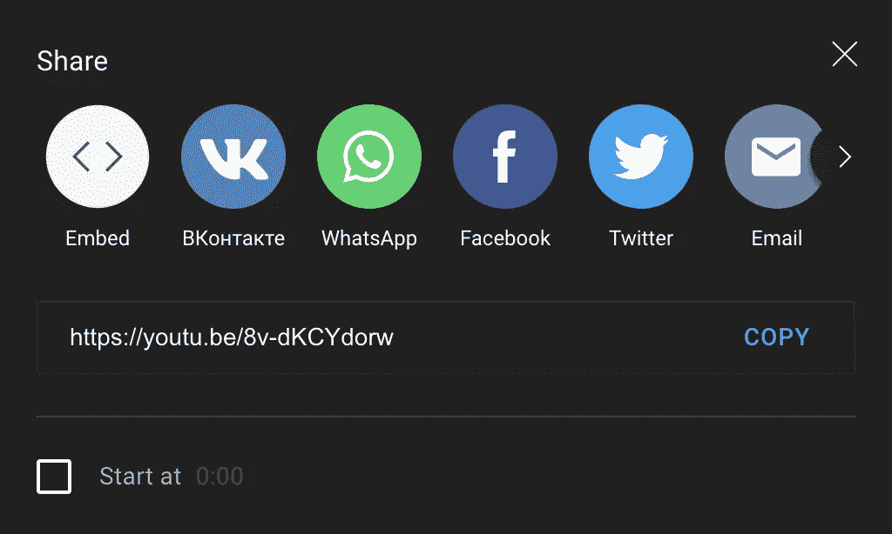

# 从 YouTube 下载一个视频，并使用 Python/Django 将其转换为 mp3

> 原文：<https://blog.devgenius.io/download-a-video-from-youtube-and-convert-it-to-mp3-using-python-django-552141990d57?source=collection_archive---------2----------------------->


这是我和姜戈可爱约会历史上的第二篇博文。我最近的经历是关于我将要谈到的几件事:处理文件(上传、转换、删除和作为临时文件存储)，将它们存储在存储器中(在我们的例子中是 AWS S3 Bucket 🪣)，以及将有关它的数据保存到数据库中。

1.  我的第一个目标是从 YouTube URL 下载一个视频。
2.  之后再转换成 mp3。
3.  接下来，将 mp3 文件保存到存储器中。
4.  最后，在数据库中保存关于它的信息以及到它的存储链接。

1.  **通过 YouTube 网址下载视频。**

首先，我们需要下载视频。

我在所有解决方案中使用的一个包是“pytube”，用于通过 URL 下载 YouTube 视频，而不是带有图像的完整视频，而是视频中的音频。

当然，我们可以用 pip 安装它:

`pip3 install pytube`

我们需要使用它导入“Youtube”类:

`from pytube import YouTube`

首先，我们需要从 YouTube 视频下载一个音频流，只接收它的 URL。为此，我们肯定会使用“pytube”包。它有很多很好的功能，如解析所有视频流格式(mp3，mp4，wav，WebM，WMV)，并以查询流列表的形式返回它们，如果我们需要，我们可以使用它来显示页面上的所有流，并只下载用户想要的一个，但这里我们只需要音频。

因此，为了只从 YouTube 视频中下载音频，我们需要首先接收 URL，并且存在一些特殊性:URL 必须是共享的，这意味着它必须具有特定的短格式，以便在“pytube”类中使用。

所以我们需要用这个按钮来获取分享的短 URL 格式。


并复制以下 URL:



这是视频通常的 YouTube 网址:


如果你仔细看，会发现除了短域( [youtu.be](http://youtu.be/) 而不是通常的[youtube.com](http://youtube.com/))和域后的属性(短 URL 中只有视频的 ID 而不是普通 URL 中的‘观看’属性及其值是视频本身的 ID)之外，它们几乎是一样的。当然，我们可以创建一个普通 URL 的验证器和格式化器到它的较短版本中，或者它可以在“pytube”包中，但是我还没有看到它。但是，这是我们在使用该软件包时需要了解的特定功能。

因此，我们使用“pytube”包中的“YouTube”类，从 Youtube 视频中下载音频。

我们通过 API 请求从一个输入或另一个输入接收 URL，现在这对我们来说无关紧要，并将其保存在一个变量中:

`url = YouTube(str(youtube_url))`

请注意,“Youtube”类只接收 str 作为 URL 属性。

之后，我们使用“streams”方法解析可用格式的流，并通过设置为 True 的“only_audio”属性按音频过滤它们:

`audio_stream = url.streams.filter(only_audio=True).first()`

之后，我们可以将它下载到某个目标路径中，或者如果我们将其留空，它将下载到项目的基本目录中:

`out_file = audio_stream.download(output_path=destination)`

注意，这个文件现在是 mp4 格式，但是没有图像，只有音频。

在这里，我们不再需要“pytube”包装。

**2。将视频转换成 mp3**

对于第二点，存在几个解决方案包，但是当你为你的项目使用某个包时，它是一个好的实践，这个包应该现在就被支持，或者至少不要超过 1-2 年，完善它不应该有很多依赖。如果软件包的使用时间超过 2 年，则其依赖项过期的可能性非常高，并且您使用的软件包中的任何功能都不支持其依赖项的新版本。我会给你看我找到的所有解决方案，无论是第三方包还是没有任何包的简单解决方案。

首先我将向你展示一个不使用任何包的解决方案，只使用 python 的原生函数。

所以在我们下载了 mp4 文件和 pytube 包之后，我们可以简单地重命名它，特别是重命名它的格式。为此，我们可以使用 python 内核的“操作系统”模块:

`import os`

需要把文件名分成两部分，文件名本身和点后的格式。

`base, ext = os.path.splitext(out_file)`

之后，我们将名称与新格式(mp3)连接起来:

`new_file = base + '.mp3'`

最后，我们将该文件重命名为:

`os.rename(out_file, new_file)`

因此，我们删除了第一个完整的名称，并将其重命名为新的连接字符串，该字符串由文件名和新格式(mp3)格式化而成。

我们可以将它作为 FileResponse 实例返回到页面，当您在浏览器中打开页面时，它将会播放。

`return FileResponse(open(new_file, 'rb'))`

请注意，文件的打开模式是“rb”，这意味着它将以二进制格式打开进行读取，音频和视频应该以该格式打开进行读取。

但对我来说，这个解决方案并不适合，因为它已经保存在本地，但我需要直接保存在 AWS 存储上，而不使用本地存储。最后，我会告诉你如何避免这种情况。

**使用第三方软件包转换:**

为此，我尝试使用更多的软件包，我将谈谈其中的几个。

所以，我用的第一个包是“pydub”。“Pydub”提供多种格式进行转换，如 mp3、mp4、wav、m4a 等。它在 Mac 和 Linux 上工作是一样的，你只需要安装“Pydub”所基于的“FFmpeg”。

在 Mac 上，我们安装了:

`brew install ffmpeg`

在 Linux 上:

`sudo apt-get install ffmpeg`

在 Windows 上，我们应该从他们的链接下载它:

`[https://ffmpeg.org/download.html](https://ffmpeg.org/download.html)`

当然，我们还需要安装“pydub”:

`pip3 install pydub`

为了使用这个包，我们需要从中导入 AudioSegment 类:

`from pydub import AudioSegment`

首先，我们还需要拆分文件名，以获得文件的原始扩展名。

`original_extension = out_file.split('.')[-1]`

之后，我们可以使用 AudioSegment 类来创建它的实例，以便进一步转换:

`mp3_converted_file = AudioSegment.from_file(out_file, original_extension)`

接下来，我们为文件创建一个新名称，并在保存时获取路径。

`new_path = out_file[:-3] + target_filetype`

在这里我们最终用我们想要的质量(码率)转换成我们想要的。

`mp3_converted_file.export(new_path, format=target_filetype, bitrate="192k")`

之后，我们可以打开它阅读。

`converted_audiofile = File(file=open(new_path, 'rb'))`

`return converted_audiofile`

剩下的最后一个解决方案包括 python 内核的“tempfile”特性。我决定使用它，因为我需要直接上传 mp3 文件到存储器，这似乎是我发现的最好的解决方案。

因此，我们将使用 NamedTemporaryFile 类，因为它会自动为我们的文件创建一个随机名称，并且在我们使用它后会自动删除它。我们需要将该类的一个实例保存在一个变量中，并且我们必须指定临时保存该实例的路径:

`audio = NamedTemporaryFile(dir='music')`

接下来，我们在这个临时文件中写入我们之前下载的音频，并以“rb”模式打开它，读取以获取关于它的二进制信息。

`audio.write(File(file=open(out_file, 'rb')).read())`

之后，我们需要对它使用 flush()方法，以清除内部缓冲区。

`audio.flush()`

接下来，创建 File 类的实例，并将其作为进一步交互的属性:

`audio = File(audio)`

在这里，我们改变格式:

`name = str(audio.name).split('.')[-1]`

`name += '.mp3'`

接下来，我们得到路径:

`audio_path = name.split('/')[-1:]`

`audio.name = '/'.join(audio_path)`

在这里，我们将它返回并保存到存储器中(在下一篇文章中)。

但是在这里我发现了一个问题，mp4 还是会留在本地存储，在这里我除了直接删除之外没有发现别的。

`os.remove(out_file) # delete the mp4 file from the local`

就这些了，谢谢你阅读这篇文章。这当然不是一个完美的解决方案，但至少是可行的。

你应该知道，视频越大，上传和处理的时间就越长。

第 3 点和第 4 点关于保存文件到 AWS S3 桶存储和保存从存储的链接，以便在任何需要的地方使用它，以及关于数据库中的音频文件的信息，我将在下一篇文章中描述。

这篇文章中使用的所有代码:

第一种解决方案:

```
def youtube_downloader(url='<https://youtu.be/s-PKj3eUT9k>', destination=BASE_DIR / 'music/'):
"""Download audio only from youtube url."""# extract only audio
video = YouTube(str('<https://youtu.be/s-PKj3eUT9k>'))
video = video.streams.filter(only_audio=True).first()# download the file
out_file = video.download(destination)# save the file
base, ext = os.path.splitext(out_file)
new_file = base + '.mp3'
os.rename(out_file, new_file)return FileResponse(open(new_file, 'rb'))
```

第二种解决方案:

```
def youtube_downloader(url='<https://youtu.be/s-PKj3eUT9k>', destination=BASE_DIR / 'music/'):
"""Download audio only from youtube url."""# extract only audio`
video = YouTube(str('<https://youtu.be/s-PKj3eUT9k>'))
video = video.streams.filter(only_audio=True).first()# download the file
out_file = video.download(destination)
original_extension = out_file.split('.')[-1]mp3_converted_file = AudioSegment.from_file(out_file, original_extension)
new_path = out_file[:-3] + target_filetype
mp3_converted_file.export(new_path, format=target_filetype, bitrate="192k")
converted_audiofile = File(file=open(new_path, 'rb'))return converted_audiofile
```

主要解决方案:

```
def convert_youtube_url_to_mp3(youtube_url: str, destination: str = BASE_DIR / 'music/') -> File:
    url = YouTube(str(youtube_url))
    audio_stream = url.streams.filter(only_audio=True).first()
    # get first video with only audio true format out_file = audio_stream.download(output_path=destination)
    # download the mp4 from YouTube url audio = NamedTemporaryFile(dir='music')
    audio.write(File(file=open(out_file, 'rb')).read())
    audio.flush()
    audio = File(audio) name = str(audio.name).split('.')[-1]
    name += '.mp3' audio_path = name.split('/')[-1:]
    audio.name = '/'.join(audio_path) os.remove(out_file)  # delete the mp4 file from the local return audio
```

可能的问题列表:

如果您从“pytube”包中得到这样的异常:

`pytube.exceptions.RegexMatchError: __init__: could not find match for ^\\w+\\W`

您应该进入 [cipher.py](http://cipher.py/) 文件并替换第 30 行，它是:

`var_regex = re.compile(r"^\\w+\\W")`

用那句台词:

`var_regex = re.compile(r"^\\$*\\w+\\W")`