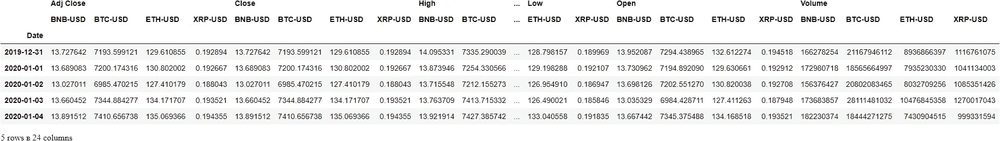
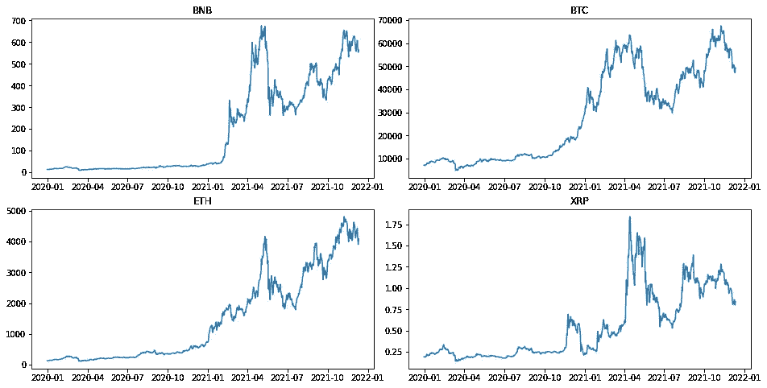
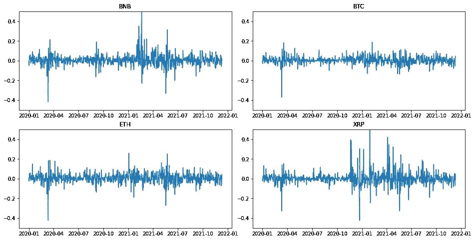
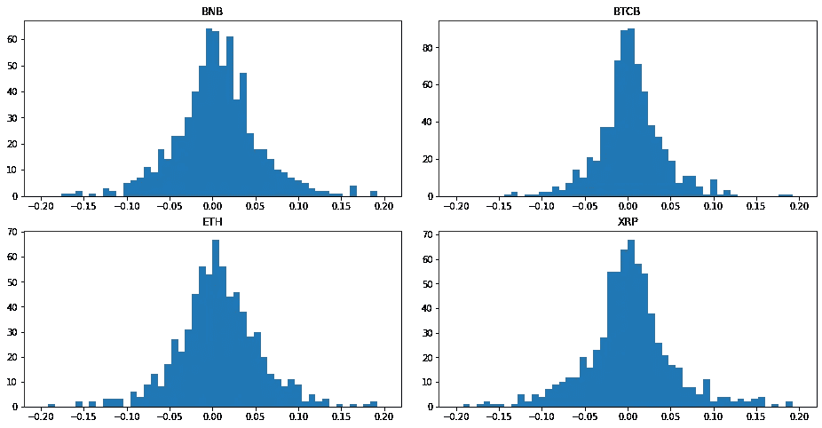
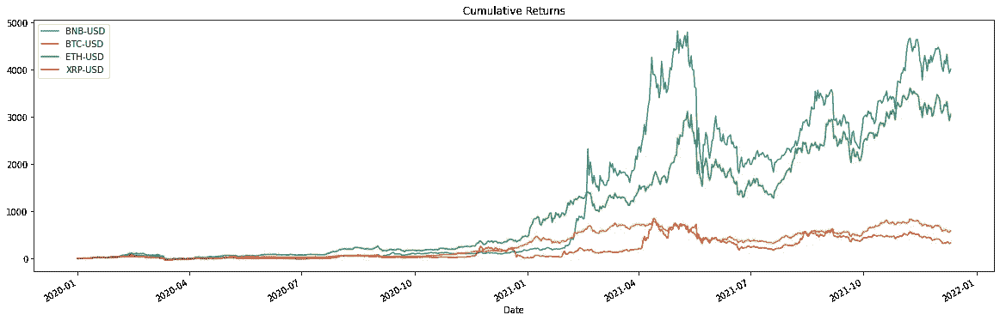
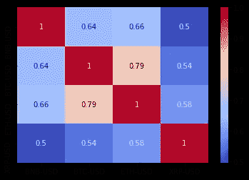
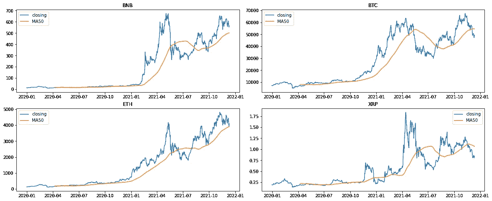
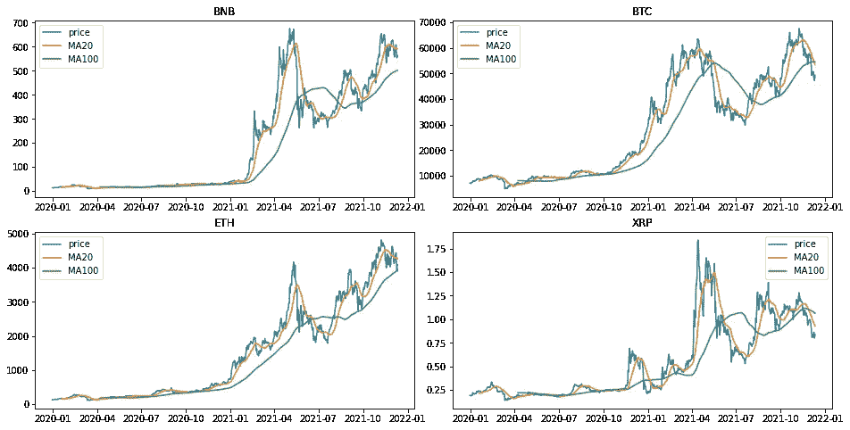

# 使用 Python 下载和分析加密市场数据

> 原文：<https://blog.devgenius.io/download-and-analyze-crypto-market-data-with-python-c23941e475f?source=collection_archive---------1----------------------->


Unsplash 上的行政长官照片

## 介绍

加密货币是可转移的数字资产，使用加密技术进行安全交易。加密货币交易始于 2009 年，不受政府控制。虽然加密货币市场仍然年轻，但由于汇款需求高，它已经经历了快速增长。然而，由于各种因素，加密市场非常不稳定。雅虎财经网站免费提供加密货币市场的详细数据。

在本文中，我们将从雅虎财经网站下载加密市场数据，并使用 Python 对其进行分析。

我们将使用以下库:

*   yfinance 是 python 中的一个金融模块，使用了雅虎公开的 API。yfinance 返回一个熊猫数据框。我们将用它来下载加密价格。
*   **Pandas** ，一个用于数据分析和操作的 python 库
*   **Seaborn** ，一个 python 库，用于数据可视化和探索性数据分析
*   Matplotlib ，一个用于数据可视化的 python 库

我们将从下载多个 tickers 的加密货币数据开始。我们开始吧

如果您没有这些库，您可以在您的终端上安装它们。

*pip 安装熊猫*

*pip 安装融资*

*pip 安装 seaborn*

*pip 安装 matplotlib*

我们将从加载所需的库开始

```
#Load the required libraries
import pandas as pd
import yfinance as yf
import seaborn as sns
import matplotlib.pyplot as plt
```

我们想下载*币安*、*比特币*、*以太坊*和 *XRP(涟漪)*的加密数据。我们将使用他们的股票代码 *BNB* 、 *BTC* 、*瑞士联邦理工学院*和 *XRP*

```
# list of crptocurrencies as ticker arguments
cryptocurrencies = ['BNB-USD','BTC-USD', 'ETH-USD', 'XRP-USD']
```

我们希望看到自 Covid 19 疫情开始以来密码市场的变化。因此，开始日期是 2020 年 1 月 1 日

我们可以用下面给出的代码简单地下载数据:

```
data = yf.download(cryptocurrencies, start='2020-01-01',
                end='2021-12-12')
data.head()[*********************100%***********************]  4 of 4 completed
```



```
# check for missing data
data.isnull().any()Adj Close  BNB-USD    False
           BTC-USD    False
           ETH-USD    False
           XRP-USD    False
Close      BNB-USD    False
           BTC-USD    False
           ETH-USD    False
           XRP-USD    False
High       BNB-USD    False
           BTC-USD    False
           ETH-USD    False
           XRP-USD    False
Low        BNB-USD    False
           BTC-USD    False
           ETH-USD    False
           XRP-USD    False
Open       BNB-USD    False
           BTC-USD    False
           ETH-USD    False
           XRP-USD    False
Volume     BNB-USD    False
           BTC-USD    False
           ETH-USD    False
           XRP-USD    False
dtype: bool
```

数据框中没有丢失的数据。因此，我们可以继续进行分析，但首先，我们需要知道数据集中的要素代表什么。

## 功能描述

*   日期:观察日期
*   开盘:开盘价
*   高:最高价格
*   低:最低价格
*   收盘:收盘价格
*   调整收盘价格:对股票分割和股息进行调整后的收盘价
*   成交量:交易的股票总数

## 探索性分析

我们对*调整后的收盘价*感兴趣。因此，我们将选择加密货币的调整后收盘价。

```
adj_close=data['Adj Close']
adj_close.head()
```


我们将绘制*调整后的收盘价*。我们使用支线剧情，因为加密货币的规模不同。

```
# ploting the adjusted closing price
fig, axs =plt.subplots(2,2,figsize=(16,8),gridspec_kw ={'hspace': 0.2, 'wspace': 0.1})
axs[0,0].plot(adj_close['BNB-USD'])
axs[0,0].set_title('BNB')
axs[0,1].plot(adj_close['BTC-USD'])
axs[0,1].set_title('BTC')
axs[1,0].plot(adj_close['ETH-USD'])
axs[1,0].set_title('ETH')
axs[1,1].plot(adj_close['XRP-USD'])
axs[1,1].set_title('XRP')
plt.show()
```



这些图是*时间序列*图，表示股票价格随时间的变化。由于规模不同，我们不能比较图表，但我们将使用累积回报图，它给出了相对变化。

## 退货系列

回报是资产价格随时间的变化。回报可以是正数，代表盈利，也可以是负数，代表亏损。一项资产的收益序列比价格序列更容易处理，并给出投资机会的完整摘要。

我们将使用 pandas *pct_change()* 函数来计算回报。

这些是加密货币的相对价格变化

```
# Returns i.e. percentage change in the adjusted close price and drop the first row with NA's
returns = adj_close.pct_change().dropna(axis=0)
#view the first 5 rows of the data frame
returns.head()
```


```
#ploting the returns
fig, axs = plt.subplots(2,2,figsize=(16,8),gridspec_kw ={'hspace': 0.2, 'wspace': 0.1})
axs[0,0].plot(returns['BNB-USD'])
axs[0,0].set_title('BNB')
axs[0,0].set_ylim([-0.5,0.5])
axs[0,1].plot(returns['BTC-USD'])
axs[0,1].set_title('BTC')
axs[0,1].set_ylim([-0.5,0.5])
axs[1,0].plot(returns['ETH-USD'])
axs[1,0].set_title('ETH')
axs[1,0].set_ylim([-0.5,0.5])
axs[1,1].plot(returns['XRP-USD'])
axs[1,1].set_title('XRP')
axs[1,1].set_ylim([-0.5,0.5])
plt.show()
```



XRP 的波动性最大，其次是币安，而比特币的波动性最小。对于所有的加密货币，我们可以看到 2020 年 3 月左右的巨大崩溃

## 挥发性

波动性是衡量资产价格随时间变化的指标。标准差越高，资产的波动性越大。

```
#volatility, standard deviation of the returns
returns.std()BNB-USD    0.065132
BTC-USD    0.040267
ETH-USD    0.053324
XRP-USD    0.071800
dtype: float64
```

XRP (Ripple)是四种资产中波动性最大的，而比特币是波动性最小的。

## 柱状图

```
#ploting the histogram
fig, axs = plt.subplots(2,2,figsize=(16,8),gridspec_kw ={'hspace': 0.2, 'wspace': 0.1})
axs[0,0].hist(returns['BNB-USD'], bins=50, range=(-0.2, 0.2))
axs[0,0].set_title('BNB')
axs[0,1].hist(returns['BTC-USD'], bins=50, range=(-0.2, 0.2))
axs[0,1].set_title('BTCB')
axs[1,0].hist(returns['ETH-USD'], bins=50, range=(-0.2, 0.2))
axs[1,0].set_title('ETH')
axs[1,1].hist(returns['XRP-USD'], bins=50, range=(-0.2, 0.2))
axs[1,1].set_title('XRP')
plt.show()
```



## 累积回报

累积回报表示一项资产价格在一段时间内的总变化。

我们使用 pandas *cumprod()* 函数来计算每日累积简单回报。

```
# Cumulative return series
cum_returns = ((1 + returns).cumprod() - 1) *100
cum_returns.head()
```


```
cum_returns.plot(figsize=(20,6))
plt.title('Cumulative Returns')Text(0.5, 1.0, 'Cumulative Returns')
```



从 2021 年 3 月开始，币安的表现超过了以太坊、比特币和 XRP，而以太坊则超过了比特币和 XRP。

## 相互关系

我们将计算回报的相关性，因为原始价格数据的相关性可能会给出有偏差的结果。相关系数接近 1 表示强正关联，-1 表示强负关联，系数接近 0 表示无关联。

```
#compute the correlations
returns.corr()
```


```
#plot the correlations
sns.heatmap(returns.corr(), annot=True, cmap='coolwarm')
plt.show()
```



从热图中我们可以看出，比特币和以太坊是高度相关的。也就是说比特币涨，以太坊也涨，比特币跌，以太坊也跌。

## 移动平均数

移动平均线(滚动平均线)用于平滑短期波动，以确定长期趋势或周期。例如，7 天移动平均线反映了股票市场的短期趋势，而 200 天移动平均线则表明了股票市场的主要趋势。在这里，我们计算特定时期内一组给定价格的*算术平均值*。

```
# compute a short-term 20-day moving average
MA20 = adj_close.rolling(20).mean()
# compute a Long-term 50-day moving average
MA50 = adj_close.rolling(100).mean()
# compute a Long-term 100-day moving average
MA100 = adj_close.rolling(100).mean()# ploting the moving average
fig, axs = plt.subplots(2,2,figsize=(20,8),gridspec_kw ={'hspace': 0.2, 'wspace': 0.1})
axs[0,0].plot(adj_close['BNB-USD'], label= 'closing')
axs[0,0].plot(MA50['BNB-USD'], label= 'MA50')
axs[0,0].set_title('BNB')
axs[0,0].legend()
axs[0,1].plot(adj_close['BTC-USD'], label= 'closing')
axs[0,1].plot(MA50['BTC-USD'], label= 'MA50')
axs[0,1].set_title('BTC')
axs[0,1].legend()
axs[1,0].plot(adj_close['ETH-USD'], label= 'closing')
axs[1,0].plot(MA50['ETH-USD'], label= 'MA50')
axs[1,0].set_title('ETH')
axs[1,0].legend()
axs[1,1].plot(adj_close['XRP-USD'], label= 'closing')
axs[1,1].plot(MA50['XRP-USD'], label= 'MA50')
axs[1,1].set_title('XRP')
axs[1,1].legend()
plt.show()
```



我们可以从图表中观察到，在 2021 年 5 月中旬，价格在 50 日均线下方交叉，这表明了下降趋势，在 8 月中旬，价格在均线上方交叉，这表明了上升趋势。

```
# ploting the moving average
fig, axs = plt.subplots(2,2,figsize=(16,8),gridspec_kw ={'hspace': 0.2, 'wspace': 0.1})
axs[0,0].plot(adj_close['BNB-USD'], label= 'price')
axs[0,0].plot(MA20['BNB-USD'], label= 'MA20')
axs[0,0].plot(MA100['BNB-USD'], label= 'MA100')
axs[0,0].set_title('BNB')
axs[0,0].legend()
axs[0,1].plot(adj_close['BTC-USD'], label= 'price')
axs[0,1].plot(MA20['BTC-USD'], label= 'MA20')
axs[0,1].plot(MA100['BTC-USD'], label= 'MA100')
axs[0,1].set_title('BTC')
axs[0,1].legend()
axs[1,0].plot(adj_close['ETH-USD'], label= 'price')
axs[1,0].plot(MA20['ETH-USD'], label= 'MA20')
axs[1,0].plot(MA100['ETH-USD'], label= 'MA100')
axs[1,0].set_title('ETH')
axs[1,0].legend()
axs[1,1].plot(adj_close['XRP-USD'], label= 'price')
axs[1,1].plot(MA20['XRP-USD'], label= 'MA20')
axs[1,1].plot(MA100['XRP-USD'], label= 'MA100')
axs[1,1].set_title('XRP')
axs[1,1].legend()
plt.show()
```



我们可以从图表中观察到，在 2021 年 5 月中旬左右，20 日均线在 100 日均线下方交叉。它表明趋势正在向下转移，这是卖出信号。接近 8 月底时，20 天均线在 100 天均线上方交叉。它表明趋势正在向上转移，这是一个买入信号。

*免责声明！此内容仅用于教育目的。也无意提供财务或投资建议。*

# 结论

在本文中，我们从雅虎财经下载了加密市场数据。我们还可以使用 *yfinance python 模块*从雅虎财经网站下载多个报价机的股票数据。通过探索性分析，我们可以发现真知灼见，做出明智的决策。