# 从雅虎财经下载多个 Tickers，进行探索性数据分析。

> 原文：<https://blog.devgenius.io/download-multiple-tickers-from-yahoo-finance-and-perform-exploratory-data-analysis-c4e96e62e055?source=collection_archive---------4----------------------->

## 从雅虎财经下载的多个股票代码分析

在 [Unsplash](https://unsplash.com?utm_source=medium&utm_medium=referral) 上由 [micheile dot com](https://unsplash.com/es/@micheile?utm_source=medium&utm_medium=referral) 拍摄的照片

可以从 GitHub 下载 [**笔记本**](https://gist.github.com/riqbal-k/08821802addd374e06e1c8fd427dc07c) 。

[***quant mod***](https://cran.r-project.org/web/packages/quantmod/index.html)包的 ***getSymbols*** 函数可用于从 Yahoo Finance 获取 r 中各种股票的数据，该函数使我们能够定义股票符号的向量，并下载 r 中相应的财务数据。

## 安装和加载库

## 定义股票代码向量并下载数据

以下是如何使用 ***getSymbols*** 为多个报价机下载数据的示例:

这将下载股票代号“GSPC”、“AAPL”、“谷歌”和“MSFT”的数据，并在您的 R 环境中为每个股票代号分别构建名为 GSPC、AAPL、谷歌和 MSFT 的数据框。使用数据框的名称，您可以访问每个跑马灯的数据。

它将自动下载所有四个报价器的开盘价、最高价、收盘价、成交量和调整后的收盘价。

例如，我们可以显示苹果股票的列名:

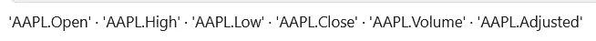

> 标准普尔 500 指数用符号 GSPC 表示，而苹果股票、谷歌股票和微软股票分别用 AAPL、谷歌和 MSFT 表示。

## 绘制苹果股票价格

利用 ***chart_Series*** 函数，生成苹果股票的时间序列图。

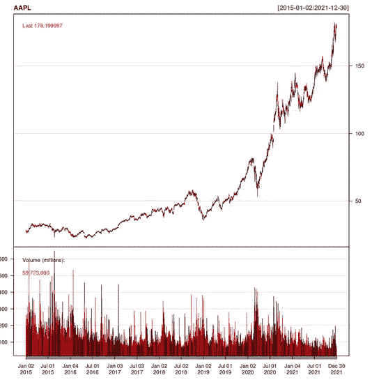

## 收盘价格的时间序列对象

为每个报价机的收盘价创建单独的时间序列对象。

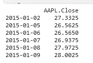

访问“AAPL”时间序列对象的数据。

## 结合收盘价格，并在同一图表上绘制它们

合并所有四只股票的时间序列，然后使用 ***plot.zoo*** 函数将它们绘制在同一个图表上。您可以使用 ***plot.zoo*** 函数中的附加参数来自定义图表的外观。

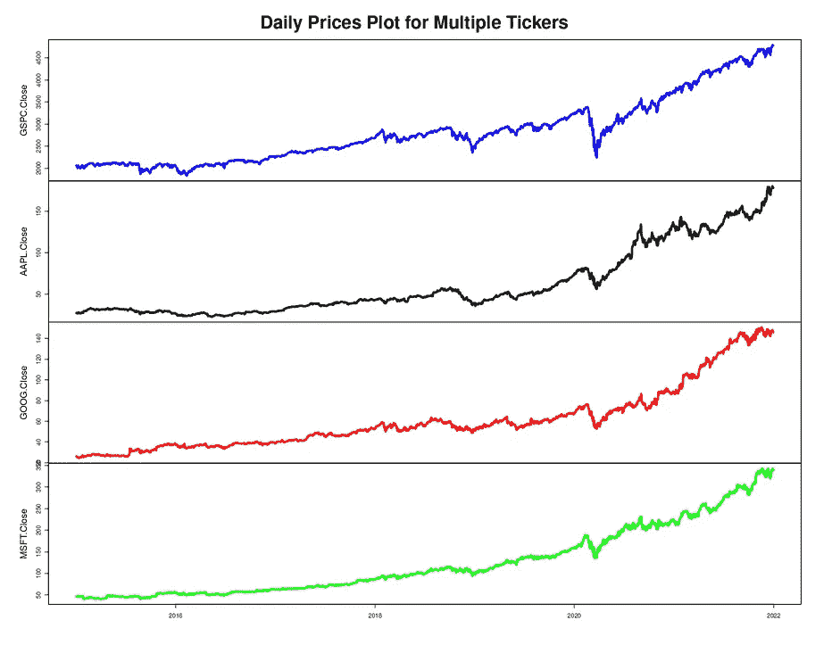

## 测井回报的计算和可视化

使用***performance analytics***包中的 ***Return.calculate*** 函数，我们可以计算 r 中一个时间序列的日志回报。该函数通过计算当前周期值与前一周期值之比的自然对数来计算时间序列中每个周期的日志回报。

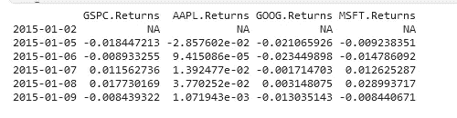

## 综合收益图

在同一个图表上绘制多个回报率，以比较不同资产在一段时间内的回报率，可能会很有用。

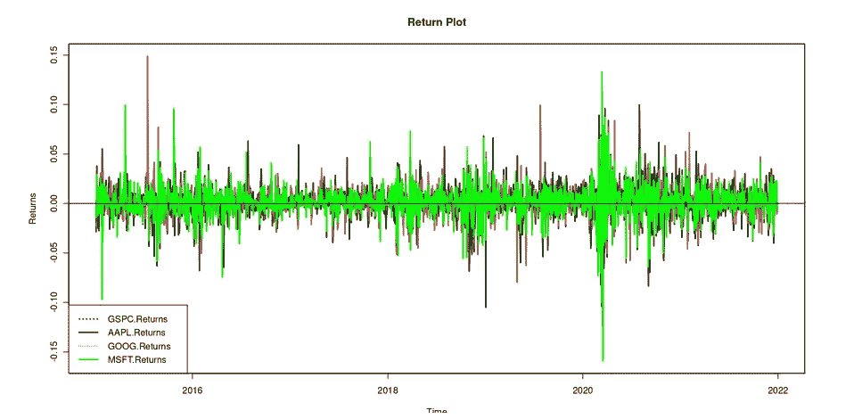

## 计算相关矩阵

关联矩阵是显示众多资产之间关联的表格。

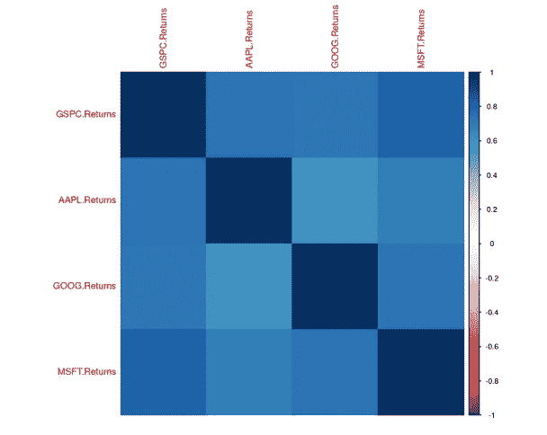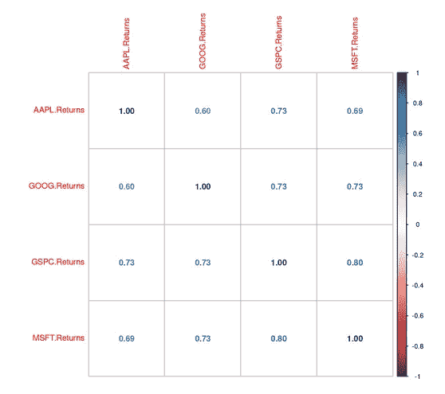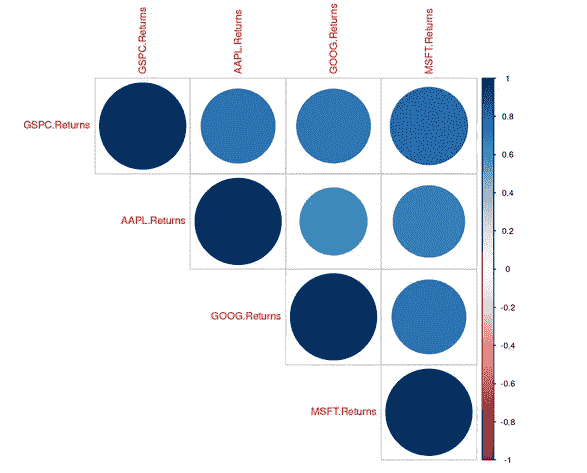

相关矩阵可以是一个有价值的工具，用于检查多个资产之间的关系，并发现可能的风险或多样化的可能性。

## 股权图

股票图，也称为累积回报图或业绩图，是一种说明股票价值随时间变化的图。
它被广泛用于说明股票或其他投资策略的表现，让你了解投资的价值是如何随着时间的推移而变化的。

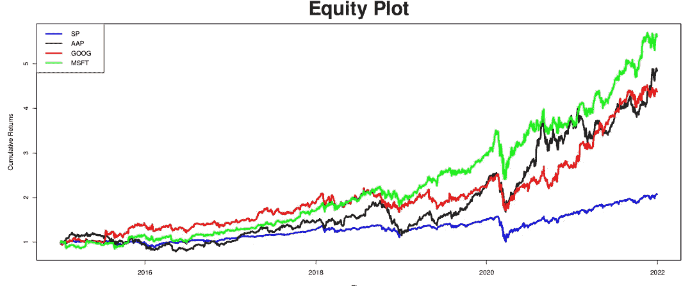

## 柱状图

直方图是可视化数据集形状和分布的便捷工具，有助于识别数据中的模式或趋势。

***hist*** 函数可用于构建 r 中各种股票的收益直方图。该函数通过将数据分成多个条块并以条形显示每个条块中的观察值数量来生成直方图。

下面是一个如何使用 R 编程语言生成股票回报直方图的示例:

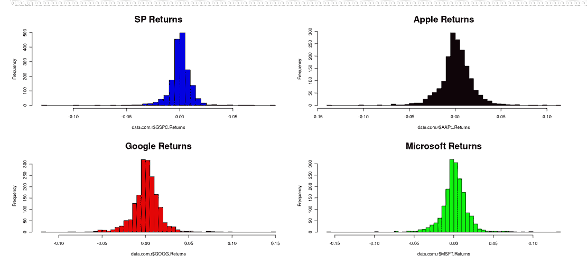

## 箱形图

箱线图也称为盒须图，是显示最小值、第一个四分位数、中值、第三个四分位数和最大值的数据的图形表示。这是一个很有价值的工具，可以显示数据集的分布和离散度，并发现任何潜在的异常值或极值。

***箱线图*** 函数可用于在 r 中生成箱线图。

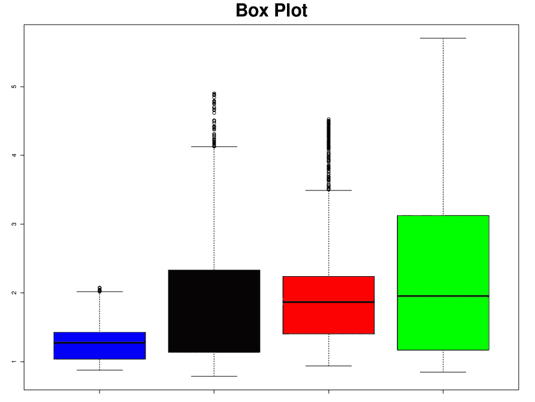

## 描述统计学

描述性统计是用于总结和描述数据集属性的方法和技术。它们被用来提供数据的摘要，并帮助理解数据的分布、集中趋势和分散性。

集中趋势的测量值(如平均值、中值和众数)、分散度的测量值(如范围、方差和标准差)和形状的测量值可用于使用描述性统计数据(如偏度和峰度)检查数据集。

以下是如何使用 R 为数据集生成描述性统计数据的示例:

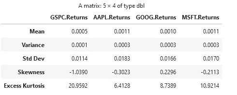

## 参考

布鲁克斯，克里斯。*金融计量经济学导论*。第四版。剑桥大学出版社。2019.

[Zivot](https://www.google.com/search?sxsrf=ALiCzsayTNs9JTN1lnhK-lYSImKGKmibRg:1665934602238&q=Eric+Zivot&stick=H4sIAAAAAAAAAOPgE-LVT9c3NEw2LMhNMrDMUIJw0wxyUwoqCgy0ZLKTrfST8vOz9cuLMktKUvPiy_OLsq0SS0sy8osWsXK5FmUmK0RlluWX7GBl3MXOxMEAAJsVnbFTAAAA&sa=X&ved=2ahUKEwi6wr2BiuX6AhWVM8AKHUF5AbsQmxMoAHoECFMQAg) ，E. 2023。*计算金融与金融计量经济学导论*。