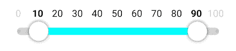
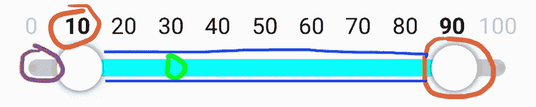
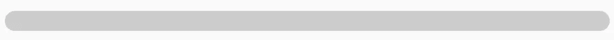
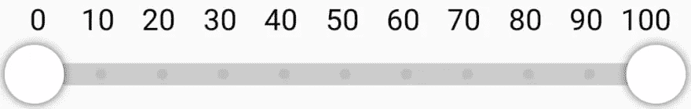
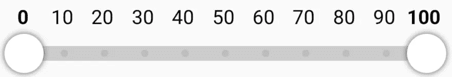
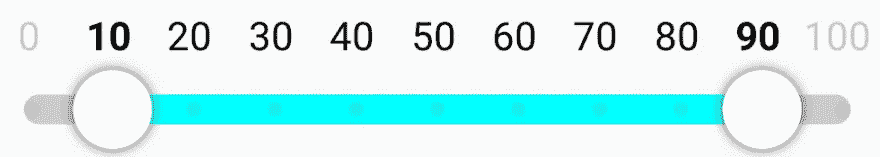

# 绘制带标签的范围滑块

> 原文：<https://blog.devgenius.io/draw-the-labeled-range-slider-3eb96e748e88?source=collection_archive---------7----------------------->


萨姆·哈达德在 [Unsplash](https://unsplash.com?utm_source=medium&utm_medium=referral) 上的照片

在本系列的第 4 部分中，让我们开始把我们到目前为止学到的所有东西和更多的东西放在一起，创建我们的标签范围滑块。



最终结果应该是什么样子

# 绘制用户界面

开始之前，我们首先需要分解我们的 Composable 中涉及的不同元素，以及如何绘制它们。

正如我们在下图中看到的，我们可以将带标签的范围滑块分解为 5 个元素。



单个元素的分解

我们有

*   滑动条上方的标签，指示可用和选定的值。颜色和字体风格应反映我们选择的范围(*红色*)
*   背景中的圆形条，引导我们的滑块(*紫色*)
*   步进标记，指示我们的条上所有可用的值(*绿色*)
*   在我们的条形图上显示我们选择的范围(*蓝色*)
*   最后是我们的滑块手柄，我们希望拖动它穿过滚动条来选择我们的范围(*橙色*)

# 圆形背景条(紫色)

开始和设置我们的可组合组件的最简单的元素是背景中引导我们的滑块的灰色条。在开始绘制条形图之前，我们首先需要做一些准备工作，比如计算宽度和高度。

对于宽度，我们希望我们的栏填充可用空间的整个宽度，并为滑块添加一些填充，但我们将在稍后讨论。
为了获得我们的可组合的大小，我们可以使用 **Modifier.onSizeChanged** 并将该值存储在一个状态中。根据该值，我们可以确定矩形的宽度。对于高度，我们保持简单，让调用者配置，但提供一个合理的默认值 12 Dp。
我们还为条形颜色和圆角大小添加了一个参数。

```
@Composable
fun LabeledRangeSlider(
    modifier: Modifier = Modifier,
    barHeight: Dp = 12.dp,
    barColor: Color = Color.LightGray,
    barCornerRadius: Dp = 6.dp
) { var composableSize by remember { mutableStateOf(IntSize(0, 0)) }
    val height = barHeight
    val barWidth = remember(key1 = composableSize) { composableSize.width.toFloat() }
    val barXStart = 0f
    val barYStart = 0f Canvas(
        modifier = modifier
            .height(height)
            .onSizeChanged {
                composableSize = it
            }
    ) {
        drawRoundRect(
            color = barColor,
            topLeft = Offset(barXStart, barYStart),
            size = Size(barWidth, barHeight.toPx()),
            cornerRadius = CornerRadius(barCornerRadius.toPx(), barCornerRadius.toPx())
        )
    }
}
```

我们已经准备了一些变量，如**高度**、**条宽**、**条宽**和**重心**。我们稍后将需要它们来计算更好的定位。我们将**高度**放入画布的**修饰符.高度**中，我们使用允许传递一个**修饰符**的最佳实践，因此宽度可以由调用者决定。

> *有趣的是:我们让* ***条宽*** *重算依赖于可组合的大小。既然只要可组合的大小不变我们就可以只记******bar width****。***

**到目前为止，结果如下所示**

****

**滑块的背景条**

**我们还可以从这个小片段中看到，我们已经需要一些配置，并且需要使用 **toPx** 将 Dp 转换为像素进行绘制。**

**我们可以做的是，像我们在[第 3 部分](https://dev.to/lex_fury/context-receivers-39p5)中看到的那样，引入一个配置数据类。**

```
**data class SliderConfig(
    val barHeight: Dp = 12.dp,
    val barColor: Color = Color.LightGray,
    val barCornerRadius: Dp = 6.dp
) {
    context(Density)
    val barHeightPx: Float
        get() = barHeight.toPx() context(Density)
    val barCornerRadiusPx
        get() = barCornerRadius.toPx()
}**
```

**我们将配置移到了 **SliderConfig** 中，这样我们就可以使用上下文接收器将像素转换直接封装到这个类中。这次我们使用**密度**作为**上下文**，因为它是由**绘图范围**实现的，但是可以更通用。为什么？我们一会儿就会看到:-)。**

# **滑块手柄(橙色)**

**接下来让我们添加滑块手柄。正如我们在上面的 GIF 中看到的，手柄周围有一个阴影，它也对触摸做出反应，增加阴影的大小。没有阴影，我们可以简单地调用 **drawCircle** 就完成了。不幸的是，我们无法用画布的常规 **drawCircle** 功能轻松应用阴影效果。但幸运的是，我们可以使用 **drawIntoCanvas** 及其 **drawCircle** 功能。它允许我们提供一个**绘制**参数，用它我们可以实现我们的阴影。**

```
**private fun DrawScope.drawCircleWithShadow(
    position: Offset,
    touched: Boolean,
    sliderConfig: SliderConfig
) {
    val touchAddition = if (touched) {
        sliderConfig.touchCircleShadowTouchedSizeAdditionPx
    } else {
        0f
    } drawIntoCanvas {
        val paint = androidx.compose.ui.graphics.Paint()
        val frameworkPaint = paint.asFrameworkPaint()
        frameworkPaint.color = sliderConfig.touchCircleColor.toArgb()
        frameworkPaint.setShadowLayer(
            sliderConfig.touchCircleShadowSizePx + touchAddition,
            0f,
            0f,
            Color.DarkGray.toArgb()
        )
        it.drawCircle(
            position,
            sliderConfig.touchCircleRadiusPx,
            paint
        )
    }
}**
```

**正如我们所见，我们创建了一个 **Paint** 对象，并将其转换为 **NativePaint** 。这给了我们访问 **setShadowLayer** 的权限。我们给阴影一个尺寸，根据这个尺寸，圆圈是否被触摸，然后用这个尺寸画出我们的圆圈。
我们还在我们的 **SliderConfig** 类中增加了一点配置。**

**准备好 circle 函数后，我们需要更新棒线的计算。当句柄被添加到栏的末端时，我们不希望它与我们的可组合对象重叠，或者更糟的是脱离屏幕。因此，我们需要添加一些填充到我们的酒吧。**

**为此，我们现在需要访问我们配置的像素值，正如我们在上面看到的，我们需要在**密度**对象的**范围**内。解决这个问题的一个方法是将计算移到我们画布的 **onDraw** lambda 中。这将意味着我们每次绘制时都要重新计算这些值，但是它们只需要在**密度**或我们的可组合大小发生变化时更新。
我们能做的是在尺寸和**密度**上创建一个小的扩展函数。**

```
**@Composable
private fun <T> Pair<IntSize, Density>.derive(additionalKey: Any? = null, block: Density.() -> T): T =
    remember(key1 = first, key2 = additionalKey) {
        second.block()
    }**
```

**有了它，我们可以这样写我们的尺寸计算:**

```
**val currentDensity = LocalDensity.current
val sizeAndDensity = composableSize to currentDensityval barYCenter = sizeAndDensity.derive { (height / 2).toPx() }
val barXStart = sizeAndDensity.derive { sliderConfig.touchCircleRadiusPx }
val barYStart = sizeAndDensity.derive { barYCenter - sliderConfig.barHeightPx / 2f }
val barWidth = sizeAndDensity.derive { composableSize.width - 2 * barXStart }**
```

**这里重要的一点是，我们总是可以在一个可组合的对象中用 **LocalDensity.current** 获得当前的**密度**。**

**现在让我们把手柄放在酒吧的起点和终点，然后画出来。**

```
**val leftCirclePosition = remember(key1 = composableSize) {
    Offset(barXStart, barYCenter)
}
val rightCirclePosition = remember(key1 = composableSize) {
    Offset(barXStart + barWidth, barYCenter)
}...
// in our Canvas
        drawCircleWithShadow(
            leftCirclePosition,
            false,
            sliderConfig
        ) drawCircleWithShadow(
            rightCirclePosition,
            false,
            sliderConfig
        )**
```

**到目前为止的结果如下:**

****

**背景条和触摸手柄**

# **标签和步骤标记(红色和绿色)**

**接下来，我们要在条形上方绘制标签以及步骤标记。将它们放在一起看是有意义的，因为标签及其步骤标记应该正确对齐。我们已经知道在 y 轴上定位我们的标签和步骤标记。标签应该在我们的可组合组件的顶部，步骤标记应该与我们的栏的中间对齐。我们仍然需要的是单步在 x 轴上的定位。为此，我们首先允许将步骤传递到我们的 Composable 中，并创建一个小函数来计算 x 坐标。**

```
**private fun calculateStepCoordinatesAndSpacing(
    numberOfSteps: Int,
    barXStart: Float,
    barWidth: Float,
    stepMarkerRadius: Float,
): Pair<FloatArray, Float> {
    val stepOffset = barXStart + stepMarkerRadius
    val stepSpacing = (barWidth - 2 * stepMarkerRadius) / (numberOfSteps - 1) val stepXCoordinates = generateSequence(stepOffset) { it + stepSpacing }
        .take(numberOfSteps)
        .toList() return stepXCoordinates.toFloatArray() to stepSpacing
}**
```

**我们计算开始与我们的酒吧的开始对齐，并且根据我们有多少步骤，我们计算他们之间的间距。**

**因为这个计算不仅依赖于可组合的大小和**密度**，而且依赖于步骤的数量，我们使用我们的**派生**函数来执行它。**

```
**val (stepXCoordinates, stepSpacing) = sizeAndDensity.derive(steps) {
        calculateStepCoordinatesAndSpacing(
            numberOfSteps = steps.size,
            barXStart = barXStart,
            barWidth = barWidth,
            stepMarkerRadius = sliderConfig.stepMarkerRadiusPx
        )
    }**
```

**此外，我们提供这些步骤作为**记住**功能的第二把钥匙。这样，我们可以确保如果步骤发生了变化，我们可以更新我们的 Composable。**

**计算完位置后，我们可以画出标签和步标。**

```
**private fun <T> DrawScope.drawStepMarkersAndLabels(
    steps: List<T>,
    stepXCoordinates: FloatArray,
    leftCirclePosition: Offset,
    rightCirclePosition: Offset,
    barYCenter: Float,
    sliderConfig: SliderConfig
) {
    assert(steps.size == stepXCoordinates.size) { "Step value size and step coordinate size do not match. Value size: ${steps.size}, Coordinate size: ${stepXCoordinates.size}" } steps.forEachIndexed { index, step ->
        val stepMarkerCenter = Offset(stepXCoordinates[index], barYCenter) val isCurrentlySelectedByLeftCircle =
            (leftCirclePosition.x > (stepMarkerCenter.x - sliderConfig.stepMarkerRadiusPx / 2)) &&
                    (leftCirclePosition.x < (stepMarkerCenter.x + sliderConfig.stepMarkerRadiusPx / 2))
        val isCurrentlySelectedByRightCircle =
            (rightCirclePosition.x > (stepMarkerCenter.x - sliderConfig.stepMarkerRadiusPx / 2)) &&
                    (rightCirclePosition.x < (stepMarkerCenter.x + sliderConfig.stepMarkerRadiusPx / 2)) val paint = when {
            isCurrentlySelectedByLeftCircle || isCurrentlySelectedByRightCircle                     -> sliderConfig.textSelectedPaint
            stepMarkerCenter.x < leftCirclePosition.x || stepMarkerCenter.x > rightCirclePosition.x -> sliderConfig.textOutOfRangePaint
            else                                                                                    -> sliderConfig.textInRangePaint
        } drawCircle(
            color = sliderConfig.stepMarkerColor,
            radius = sliderConfig.stepMarkerRadiusPx,
            alpha = .1f,
            center = stepMarkerCenter
        ) drawIntoCanvas {
            val stepText = step.toString().let { text ->
                if (text.length > 3) {
                    text.substring(0, 2)
                } else {
                    text
                }
            }
            it.nativeCanvas.drawText(
                stepText,
                stepMarkerCenter.x - (stepText.length * sliderConfig.textSizePx) / 3,
                sliderConfig.textSizePx,
                paint
            )
        }
    }
}**
```

**我们传入计算出的 x 轴位置和步骤来迭代它们，并相应地定位步骤标记和标签。正如你在 **drawIntoCanvas** 函数中看到的，我们正在访问本地画布来绘制我们的标签，因为正常的画布没有绘制文本的功能。
根据两个手柄的位置，我们选择不同的颜料，这样标签也能反映滑块中所选的范围。**

**我们在我们的 **SliderConfig** 中添加了更多的属性来控制颜色、文本大小、文本偏移量和步骤标记的颜色。有了这些额外的尺寸，我们就可以更新我们的组件的高度计算。**

```
**val height = remember(key1 = sliderConfig) { sliderConfig.touchCircleRadius * 2 + sliderConfig.textSize.value.dp + sliderConfig.textOffset }**
```

**以及我们定位变量的计算。**

```
**val barYCenter = sizeAndDensity.derive { composableSize.height - sliderConfig.touchCircleRadiusPx }
val barXStart = sizeAndDensity.derive { sliderConfig.touchCircleRadiusPx - sliderConfig.stepMarkerRadiusPx }
val barYStart = sizeAndDensity.derive { barYCenter - sliderConfig.barHeightPx / 2 }
val barWidth = sizeAndDensity.derive { composableSize.width - 2 * barXStart }
val barCornerRadius = sizeAndDensity.derive { CornerRadius(sliderConfig.barCornerRadiusPx, sliderConfig.barCornerRadiusPx) }**
```

**我们将**drawtepmarkersandlabels**放在画布中的 **drawRoundRect** 下方，但是在绘制标记的函数上方。结果看起来像这样:**

****

**添加了步骤标记和标签**

# **最终确定用户界面(蓝色)**

**正如我们所看到的，我们几乎完成了用户界面的绘制。仍然缺少的是在条上显示选定的范围，以及将我们的手柄正确地定位到当前选定的值。**

**首先我们定位把手。为此，我们希望我们的可组合组件能够从调用者那里接收这些值，因为我们不想管理这种状态。**

```
**@Composable
fun <T : Number> LabeledRangeSlider(
    selectedLowerBound: T,
    selectedUpperBound: T,
    steps: List<T>,
    modifier: Modifier = Modifier,
    sliderConfig: SliderConfig = SliderConfig()
) {
...
}**
```

**有了这两个值，我们可以更新句柄的位置**

```
**var leftCirclePosition by remember(key1 = composableSize) {
    val lowerBoundIdx = steps.indexOf(selectedLowerBound)
    mutableStateOf(Offset(stepXCoordinates[lowerBoundIdx], barYCenter))
}
var rightCirclePosition by remember(key1 = composableSize) {
    val upperBoundIdx = steps.indexOf(selectedUpperBound)
    mutableStateOf(Offset(stepXCoordinates[upperBoundIdx], barYCenter))
}**
```

****

**与步骤标记和标签对齐的触摸手柄**

**现在，所选步骤的标签以粗体字体正确绘制。**

**完成 UI 绘制的最后一步，就是在用 **drawRoundRect** 绘制条形背景的下方添加一个 **drawRect** 函数。**

```
**drawRect(
    color = sliderConfig.barColorInRange,
    topLeft = Offset(leftCirclePosition.x, barYStart),
    size = Size(rightCirclePosition.x - leftCirclePosition.x, sliderConfig.barHeightPx)
)**
```

**为了更好地查看结果，我们将 **selectedLowerBound** 和 **selectedUpperBound** 分别设置为 10 和 90。**

****

**添加了范围指示器的最终用户界面**

**看起来我们已经完成了标签范围滑块的绘制部分:-)。**

# **让它互动**

**我们正在绘制标签范围滑块所需的所有内容。现在我们需要让它互动。在写这篇文章的时候，我意识到它已经很长了，这就是为什么我决定把这部分分成另一篇文章。**

**[让我们直接进入](https://medium.com/@alex.frank84/make-the-labeled-range-slider-interactive-516bdf6e5c25)或者访问 [GitHub](https://github.com/a-frank/labeled-range-slider) 来探索完整的源代码。**