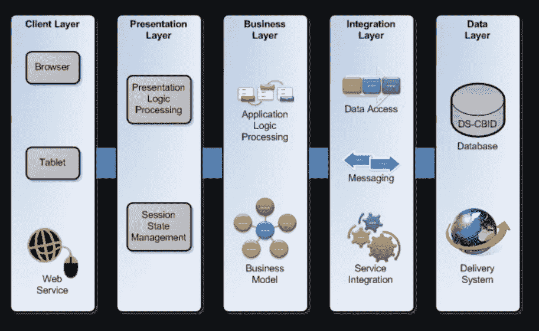

# N 层应用程序开发的缺点

> 原文：<https://blog.devgenius.io/drawbacks-of-n-tier-application-development-b98315725201?source=collection_archive---------0----------------------->

示例 n 层应用程序。来源:[https://www . ajboggs . com/WP-content/uploads/2018/03/sissa-sis 5 _ big . png](https://www.ajboggs.com/wp-content/uploads/2018/03/sissa-sis5_big.png)

我从事 n 层应用已经有一段时间了，如果你是一名软件工程师，有 2-3 年或更长的经验，并且从事过企业级应用开发，那么你也有可能从事过 n 层应用。你一定听说过这样一句话，“每个硬币都有两面”，意思是每件事都有好的和坏的方面。同样，你一定读过很多关于 n 层应用的好东西，这是毫无疑问的，但同时也有一些缺点，我将在这篇文章中讨论。

# 什么是 N 层应用？

n 层应用程序是具有多个层的软件应用程序。它的设计方式使得软件的处理、数据管理和显示功能在逻辑上和物理上是分离的。N-tier 也指多层或多层。根据应用程序的规模和业务需求，有 3-6 层应用程序(或多或少)。

## 三层应用程序:

1.  表示层
2.  应用层
3.  数据层

## 4 层应用程序:

1.  客户端层
2.  表示层
3.  业务领域层
4.  数据层

## 5 层应用程序:

1.  客户端层
2.  表示层
3.  业务领域层
4.  集成层(数据访问)
5.  数据层

层的名称和数量不是标准，它们会随着业务需求的变化而因项目而异。但它围绕着相似的概念。这是软件架构师必须设计和组织的事情。

# 有哪些弊端？

分层软件架构或 N 层架构的概念是为了便于开发和确保专业软件工程师在他们的专业层上工作而引入的。例如，移动应用程序开发人员将只在客户端层或表示层工作。一个有经验的数据库开发人员将在数据层工作。如果应用程序很小，那么单个开发人员将不得不设计数据库以及前端应用程序和两者之间的集成。

 [## 集成软件应用在现代社会中的作用

### 以前我写过为什么每个开发人员都应该知道和理解 API 在软件开发中的重要性…

medium.com](https://medium.com/dev-genius/role-of-integration-software-applications-in-the-modern-days-8319b637c8d5) 

但是随着项目的增长，它变得难以管理，并且当一个功能中出现问题时，有时很难识别问题是什么以及问题来自哪一层。这在 N 层应用程序中很常见，在这种应用程序中，中间有许多层，并且有多个开发人员在其上工作。分层软件体系结构是软件开发行业中一个经过验证的体系结构，前提是使用得当，每个团队成员都是同步的，并且每个人都知道谁在哪个层上工作。

 [## 什么是微服务及其设计模式。

### 微服务是软件行业中最热门的词汇之一，但是到底什么是微服务，什么是…

medium.com](https://medium.com/dev-genius/what-are-microservices-and-its-design-patterns-18771b031d86) 

微服务架构是分层架构的衍生物之一。随着微服务数量的增加，您将需要更多的开发人员来实现这些 API。因此，很难跟踪谁在做什么微服务，以及这些微服务项目的哪个 API。同样，项目经理需要跟踪开发微服务的不同 API 的开发人员。

 [## 为什么所有的开发人员都应该学习和理解 REST/SOAP 服务

### 在我之前的一份工作中，我的经理要求我寻找人才并面试他们的技能。我的…

medium.com](https://medium.com/dev-genius/why-all-the-developers-should-learn-and-understand-rest-soap-services-377c13388b5b) 

在 N 层软件开发中，尤其是在大型企业级项目中，最大的挑战是软件集成测试，也称为 SIT。当软件质量工程师对测试的功能提出一个问题时，如果在早期没有识别出来，就必须一直追踪到最底层来解决它。随着经验的积累和时间的推移，团队可以同步起来，他们可以立即确定问题和问题的原因，有助于缩短解决问题的时间。

实现 N 层架构的另一个原因是为了安全。所有的东西都不能作为一个大块的产品来实现，因为它也有安全问题。随着层的增加和安全性的实现，这意味着需要高性能网络来确保整体软件性能不受影响。

# 解决方案:

每个问题都有解决方法。为了实现 N 层应用程序并正常运行，我们需要确保整个团队是同步的，并且项目经理能够看到所有层的所有开发。最重要的是，对于端到端功能，所有层都必须启动并运行，连接所在的网络需要高速，以确保额外的跳数不会影响性能。

快乐学习！！！！！！