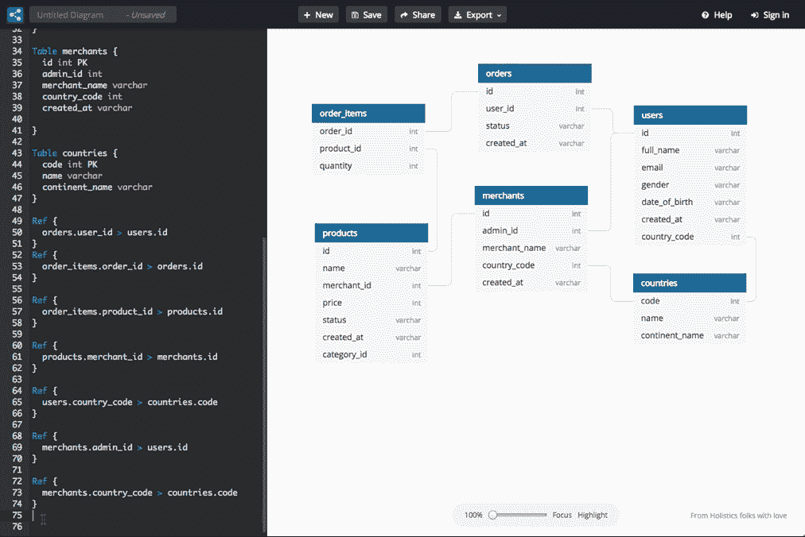

# 画 ER 图并不困难

> 原文：<https://blog.devgenius.io/drawing-er-diagrams-is-not-arduous-8a0f02dabe7c?source=collection_archive---------23----------------------->

一个简单的工具如何带给我新的视角

Sophie Vinetlouis 在 [Unsplash](https://unsplash.com/) 上拍摄的照片

当你把更多的时间放在修饰上而不是开发它的时候，你有没有努力去做实体关系(er)图？我们意见一致。后来有一天，我发现了一个改变游戏的工具。

# dbdiagram.io 简介

[dbdiagram.io](https://dbdiagram.io/home) 允许我们通过代码创建 ER 图。使用数据库标记语言(DBML)，我们作为开发人员可以毫不费力地定义我们的数据库，因为它就像家一样。由例子提供，我们可以很快跳进去，抓住概念。当我们声明一个表时，它会自动创建一个。当我们使用实体关系引用时，也会发生同样的事情。

dbdiagram.io 如何工作(来源: [dbdiagram.io](https://dbdiagram.io/home) )

这个工具有一个免费层。它已经提供了基本的元素，比如保存、共享、导出到 SQL 和导入。对于那些喜欢暗屏的人来说，还有“黑暗模式”。

# 演示时间

我的书租 ER 图

上面的模式是由以下代码创建的:

# 导出为 PostgreSQL

编写完代码后，在菜单栏上单击“导出”，然后单击“导出 PostgreSQL”。SQL 文件将如下所示:

# 还有改进的余地

尽管它很方便，但也不是没有缺点。当涉及到复杂的图表时，关系线有点笨拙，变得纠缠不清。我们必须把桌子移到正确的位置，因为“自动排列”功能目前还不能很好地工作。线交点上没有“桥”使得追踪有点棘手。不过，有一个解决方法，将鼠标悬停在一个表格上可以突出显示它的关系，或者启用“突出显示”按钮。但总的来说，我认为这是一个非常有用的工具，尤其是对于后端开发人员来说！

*原载于 2020 年 6 月 7 日*[*https://vyonizr . github . io*](https://vyonizr.github.io/blog/2020/06/07-drawing-er-diagrams-is-not-arduous/)*。*