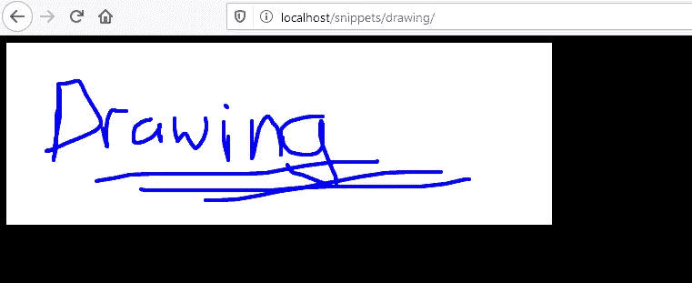

# 用 HTML 和 JavaScript 绘图:第 1 部分

> 原文：<https://blog.devgenius.io/drawing-with-html-and-javascript-part-1-d2ef829c084c?source=collection_archive---------40----------------------->

Artem Sapegin 在 [Unsplash](https://unsplash.com?utm_source=medium&utm_medium=referral) 上拍摄的照片

所以，你已经有了一个很棒的网站，但你不禁会想，还缺少一样东西可以让它变得更好？

画画！

使用 canvas 元素和一些 JavaScript 向网站添加绘图功能并不困难。我们将看看需要做些什么来开始，未来我们将对其进行扩展以使其变得更好。

显然，您需要一个 HTML 页面。用样板文件创建一个空的 HTML 页面，当然，也可以选择一个已经准备好的页面来添加。

添加一个带有类似“myDrawing”的 id 属性的 canvas 元素。

> <canvas id="”myDrawing”"></canvas>

完成了吗？非常好。现在开始 JavaScript。

创建一个名为 ***drawing.js*** 的新 JavaScript 文件

让我们从一些我们需要的变量开始。

> var drawCanvas = null
> var mouse pressed = false；
> var lastX，lastY
> var CTX；

这些将存储画布元素本身。告诉我们鼠标是否被按下的布尔值。最后绘制的位置(lastX，lastY)和画布上下文。

现在，添加一个新函数，我们将使用它来获取鼠标在绘图画布中的位置。

> 函数 get offset(){
> var rect = draw canvas . getboundingclientrect()；
> 
> var offset = {
> top:rect . top+window . scrolly，
> left:rect . left+window . scrollx，
> }；
> 
> 返回偏移量；
> }

该函数获取 canvas 元素的顶部和左侧点位置，然后考虑页面的滚动(如果相关的话),以给出 canvas 元素在页面中的正确左上位置(或偏移量)。我们需要这样做，因为我们必须告诉绘图代码从相对于画布左上角的正确位置开始绘制，而不是页面本身。

现在，让我们创建一个函数来实际绘制一些东西。

> 函数 Draw(x，y，is down){
> if(is down){
> CTX . begin path()；
> CTX . stroke style = ' blue '；
> CTX . line width = 2；
> CTX . line join = " round "；
> ctx.moveTo(lastX，lastY)；
> ctx.lineTo(x，y)；
> CTX . close path()；
> CTX . stroke()；
> }
> lastX = x；lastY = y；
> }

正如你所看到的，这是一个进行实际绘图的函数。首先确认鼠标按下。有几个值得注意的事情，你可以看到很容易改变定制选项。

> ctx.strokeStyle = ' blue

这将设置绘图的颜色。在这种情况下，蓝色，但任何有效的颜色都可以。在未来，我们将会考虑让用户能够设置它。

> CTX . line width = 2；

这设置了我们将用来在画布上绘制的画笔的大小(以像素为单位)。2 号相当好，而 20 号就太厚了。

然后我们告诉它在我们的最后一个点和当前点之间绘制，然后将当前点更新为最后一个点。基本上，当你按住按钮并拖动鼠标时，它会画出数百条细线，最终形成一幅流畅的图画。

这就是实际绘图的函数，但是我们还需要初始化它并设置一些事件处理程序，这样我们就可以使用这个函数在画布上绘图。

让我们创建一个初始化函数，我们可以调用它来激活这个绘图工具。

> 函数 InitDrawingMode(el，width，height) {
> 
> draw canvas = document . getelementbyid('+El)；
> CTX = draw canvas . get context(" 2d ")；
> 
> draw canvas . width = width；
> draw canvas . height = height；

如您所见，我们的函数期望被传递 canvas 元素 id 的名称。我们可以让它自动检测，但这是一个简单的方法，允许我们指定和控制多个每页，如果我们想要的。

我们通过获取元素本身和画布的上下文来填充我们已经声明的一些初始变量，画布可以用于绘图。你会注意到我们要求的上下文是“2d”。

然后，我们设置画布框的精确宽度和高度。这是使绘图功能适当缩放所必需的。我们在这里传递我们想要的高度和宽度来进行控制，但是我们也可以在将来动态地得到它。

> draw canvas . addevent listener(' mousedown '，function(e)
> {
> var offset = get offset()；
> mouse pressed = true；
> Draw(e.pageX — offset.left，e.pageY — offset.top，false)；
> 
> }，假)；

这是我们的第一个 eventListener，它将捕获 ***mousedown*** 事件。当按下鼠标按钮时会发生这种情况。如您所见，我们得到了画布元素的偏移量。然后我们将 ***mousePressed*** 布尔值设置为 true，因为鼠标被按下了。我们不想在初始压力下绘制，所以我们将 false 传递给 draw 函数。这意味着它将正确设置 ***lastX*** 和 ***lastY*** 而无需绘图。实际的绘图将来自我们的下一个事件处理程序。

> draw canvas . addevent listener(' mousemove '，function(e)
> {
> if(mouse pressed){
> var offset = get offset()；
> Draw(e.pageX — offset.left，e.pageY — offset.top，true)；
> }
> 
> }，假)；

除了我们正在捕捉 ***mousemove*** 事件，检查按钮是否被按下并实际进行绘制之外，情况几乎相同。

我们还需要处理按钮不再被按下时的 ***mouseup*** 事件。我们还想在鼠标离开画布区域时停止绘制。

> draw canvas . addevent listener(' mouseup '，function(e)
> {
> mouse pressed = false；
> }，假)；
> 
> draw canvas . addevent listener(' mouseleave '，函数(e)
> {
> mousePressed = false；
> }，假)；

关闭我们的初始化功能。

> }

为了更好地衡量，我将在这里添加一个 clear 函数，该函数将清空画布并将其设置回空白以重新开始。尽管在这个阶段，您也可以通过单击刷新按钮来完成此操作。

> 函数 clearDrawing() {
> //在清空画布的同时使用单位矩阵
> ctx.setTransform(1，0，0，1，0，0)；
> ctx.clearRect(0，0，ctx.canvas.width，CTX . canvas . height)；
> }

应该就是这样了。在你的页面上包含 JavaScript，然后调用我们创建的初始化函数来初始化和激活绘图。

> <脚本>
> InitDrawingMode(' my drawing '，1280，720)；
> </脚本>

如果一切顺利，现在您应该能够在页面上的画布内部进行绘制了。

给画布加个边框或者给页面背景换个颜色会有助于确保画布清晰可见。不过，现在我会把造型交给你。当我们做一些改进时，我们可能会在未来更多地关注造型。

接下来，我们将看看如何制作它，这样我们就可以很容易地改变画笔的颜色和大小，并添加能够将您漂亮的绘画保存到服务器的功能。

到时候见。

欢迎留下评论，看看我的其他教程。

我们创建的绘图工具的例子。