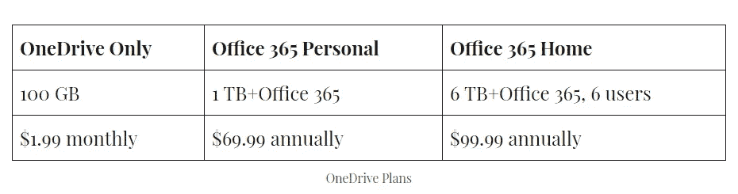

# Dropbox vs . Google Drive vs . one Drive

> 原文：<https://blog.devgenius.io/dropbox-vs-google-drive-vs-onedrive-b338cf9c192d?source=collection_archive---------4----------------------->

早在 2006 年我开始工作的时候，闪存驱动器/拇指驱动器就是便便。他们依然伟大；小巧且有大量储物空间，你可以选择非常酷的颜色和… [形状](https://www.logotech.com/all-custom-flash-drives.html)？赛车太棒了！

无论如何，每当我需要切换电脑时，我必须抓起一个闪存盘，把所有的东西都扔在上面，然后去另一台电脑，然后反向操作。不是不可能，但是太痛苦了。

2008 年左右，我开始为一家新公司工作，他们用的是 [Dropbox](http://www.dropbox.com) 。就是这个带文件夹的漂亮程序，我可以把我的东西放进去，然后在另一台电脑上检索！我很惊讶。我不是计算机盲，但我已经足够大了，可以记得以前的事情是怎样的，Dropbox 是普通大众云存储的开始。

很有可能，如果你正在读这篇文章，你正在使用某种云服务。现在，我有家人不知道 Dropbox 或 OneDrive 是什么，但他们有手机和笔记本电脑以及自动备份，所以云仍然发挥作用。

简而言之，云存储是存储数据的地方，使数据可以在您的设备上访问。它使用互联网，而不是你的个人硬盘和其他带有物理存储的产品，即闪存盘、相机、电脑、手机、外置硬盘。这是一个超级技术性的大东西，但没有必要担心它是如何工作的，除非你对那种东西感兴趣。我没有。

我用过 Dropbox、 [OneDrive](https://coranda-dms.com/2020/09/29/dropbox-vs-google-drive-vs-onedrive/#onedrive) 、 [Google Drive](https://coranda-dms.com/2020/09/29/dropbox-vs-google-drive-vs-onedrive/#googledrive) 和 iCloud。我是一个 iOS 爱好者，但讨厌 Mac，所以我将比较前三个。此外，如果没有 Mac，iCloud 的 5GB 免费存储空间甚至不值得一提。让我们开始吧！

# Dropbox

如上所述，我第一次涉足云管理系统是 Dropbox。自 2008 年以来，它做了它应该做的事情，并进行了许多改进，但这些改进是在谷歌进步的尾巴上，所以许多人在该公司有机会赶上时代之前放弃了 Dropbox。

# 优点:

*   使用方便
*   免费 3.5 GB
*   有用的工具，如纸张和 HelloSign
*   兼容 Windows、Mac、Android 和 iOS
*   创建新文件特征

## 使用方便

Dropbox 易于使用，包括一个交互式教程来帮助您入门。它的拖放功能可以让你轻松地添加文件，或者你可以通过网站将文件上传到你的账户。

## 免费 3.5 GB

对于免费版本，您可以获得 3.5 GB 的存储空间。如果你想存储照片和视频，这并不多，但对于文档和较小的文件来说足够了。

## 纸和 HelloSign

文档(doc)创建者的另一个名字不是 Microsoft Word，Paper 是一个不错的小文档编辑器，具有一些有用的功能。你可以很容易地包括。gif 文件和代码。它非常像谷歌文档，尽管我喜欢为添加媒体而提供的特色应用程序。它精简而不繁琐，Unsplash 是一个很受欢迎的网站，可以获得免费使用的图片。

HelloSign 是一个为文档请求签名的特性。在过去，你必须将所有文件打印出来，在每份文件上签上姓名首字母，并在底部签名，扫描文件，然后通过电子邮件或传真发送给相关方。HelloSign 使这一过程变得更加高效和环保。然而，我不知道使用它是否需要付费。

## 与 Mac 兼容

Dropbox 与 Mac 和 iOS 兼容，因此你可以在苹果产品上访问你的数据。

# 缺点:

*   3.5 GB 免费空间
*   昂贵的
*   不受欢迎的

## 3.5 GB 免费空间

免费存储有利有弊。它是有利的，因为他们不必提供它，但它是不利的，因为它只有 3.5 GB 免费。我有很多家人和宠物的照片，我把它们存储在外置硬盘和云中，因为如果失去它们，我会崩溃的。现在，我有大约 15 GB 的图片。Dropbox 的免费存储甚至无法备份我的照片。

## 昂贵的

Dropbox 从免费的 3.5 GB 跃升至每月 9.99 美元(按年计费)或 11.99 美元(按月计费)的 2TB。没有中间环节。它比其他云存储系统要贵得多。

## 不受欢迎的

一旦微软和谷歌加入云存储潮流，Dropbox 就失去了人气。它不是首选的云存储公司，为了共享和协作，拥有与您的家庭成员和公司相同的产品非常重要。

# Google Drive/Google One

我是一个谷歌女孩，所以[谷歌驱动](https://www.google.com/drive/)显然是我的最爱。谷歌除了 Google Drive 之外还增加了 Google One。Google One 是一个订阅计划，你可以添加家庭成员并保存工作文件和文档以外的内容。您可以保存照片、音乐、电子邮件等。

我是企业主，所以我用 Google Drive 文件流给 G 套件用户。它基本上是一个虚拟驱动器，这很好。他们还为非企业所有者提供谷歌备份和同步。

# 优点:

*   15 GB 免费
*   无限制存储高分辨率照片
*   兼容 Windows、Mac、Android 和 iOS
*   便宜的
*   使用方便
*   非常受欢迎

## 15 GB 免费空间

谷歌免费给你 15 GB，相当牛逼，打败了 iCloud 和 Dropbox。谷歌插手了很多事情，这可能会令人困惑，但他们会支持你。他们的存储包括 Google Drive、Google Photos、备份和同步、Drive 文件流。

Google One 是记录一切的最佳方式，包括 Gmail 邮件和备份手机(如果你是安卓用户的话)。然而，对于企业主或 G 套件订户来说，驱动文件流是一个不错的选择。

## 无限制存储高分辨率照片

令人惊讶的是，谷歌通过备份和同步以及谷歌照片为高分辨率照片提供了无限的存储空间！这意味着您的免费 15 GB 存储空间不会受到照片的影响。有了 Google 相册，你可以自动备份你用手机拍摄的任何照片，当你从手机中删除照片以释放空间时，它们会安全地保存在 Google 中。

## 便宜的

使用 Google One，你可以以每月 1.99 美元或每年 19.99 美元的价格升级到 100 GB 的存储空间。一个月 2.99 美元或一年 30 美元，就可以获得 200 GB。每月 9.99 美元，您可以获得 2 TB 的存储空间，10 TB 的存储空间每月 49.99 美元。您最多可以为该计划添加五名家庭成员，无需额外付费。

## 非常受欢迎

Google Drive 在商业行业非常受欢迎。我的客户使用谷歌文档和表格。使用 Google 文档、工作表和幻灯片(相当于微软的 Word、Excel 和 PowerPoint)，您可以与他人共享您的工作，并允许他们仅查看、仅评论或编辑。您可以通过电子邮件与他人共享，或者允许任何人查看、评论或编辑该链接。这是与团队成员和客户合作的好方法。

# 缺点:

*   太多不同的服务
*   iPhone 用户没有手机备份
*   Google One 没有无限的照片存储空间
*   驱动器文件流不能脱机工作

## 服务太多

如前所述，谷歌提供了如此多的东西，以至于它们无处不在。他们为 G Suite 用户提供驱动文件流，但为个人帐户提供备份和同步。他们有 Google 相册和 Google Drive 以及 Google One，这些都是独立的程序。我不知道他们对 Google One 有什么计划，但希望他们能为用户做一些整合。

## iPhone 用户没有手机备份

手机备份占了很大空间。谷歌提供了保存备份的功能，但只对安卓用户开放。考虑到 iCloud 可笑的免费存储空间，这对 iPhone 用户没有帮助。

## Google One 没有无限的照片存储空间

Google One 不提供无限制的照片存储空间。考虑到他们的存储有多便宜，这还不算太糟糕，但你可以在一个程序中保存你的照片，而不是在另一个程序中，这真的没有意义。照片、电子邮件和 Google Drive 会计入您的存储空间。

## 驱动器文件流不能脱机工作

如果您的互联网由于某种原因关闭，您将无法访问驱动器文件流，即使您使您的文档可以脱机使用。这太令人沮丧了。我不知道他们为什么这样做。如果您尝试在脱机状态下访问该驱动器，它会提示您该驱动器不可用。

# 微软 OneDrive

如果不是因为我是 Windows 用户而被迫使用 OneDrive，我可能会喜欢它。我试着卸载它，它*不*顺利。此外，我已经在我的 PC 和驱动器文件流上进行备份和同步，所以有 OneDrive 也是多余的，但微软就是这样的恶霸。

# 优点:

*   使用方便
*   易于转移计算机
*   与 Mac 兼容
*   微软 365 包含在两个计划中

## 使用方便

大多数云存储服务都是用户友好的。你可以做拖放的事情，或者浏览你的电脑或设备。OneDrive 也不例外，大部分选项都是自动化的。默认情况下，会选择备份您的图片、文档、桌面和音乐。这些是最受欢迎和最重要的，所以它是有意义的。

## 易于转移计算机

过去切换电脑是一件很痛苦的事。如果你的旧情人死了，你就不得不从头开始。这包括重新下载程序，将你保存在拇指驱动器上的文件放到新电脑上，获得你的设置和偏好，等等。作为一个自闭症患者，这让我很受伤！

使用 OneDrive，现在您只需使用您的 Microsoft 帐户登录，就像拥有您的旧计算机一样！Microsoft 包含了您的 Windows 首选项，如字体、字体大小、Windows 主题和颜色，以及上述文件夹中的重要文件。对于抗拒改变的人来说，这是光荣的。我有两台电脑和一台笔记本电脑，我可以从我离开的地方继续使用它们。同步是最好的！

## 微软 Office 365

微软现在将微软 Office 365 包含在其两个高级计划中，Office 365 个人版和 Office 365 家庭版。这是一件大事。花 400 美元就能买到微软 Office 365。是啊，很贵。或者，您可以升级您的存储，并获得 365，该存储最多可供六个用户使用！

我有在 [ThinkEDU](https://thinkedu.com) 花 40 美元买的单机版 365(你必须是经过认证的大学生才能享受折扣)，我喜欢知道如果我买不起云存储，我还会有它，但这只是我自己。

与 Google Docs 类似，您可以在浏览器中编辑文档，这些更改将与您的桌面和其他安装了 OneDrive 应用程序的设备同步。

# 缺点:

*   攻击性的
*   OneDrive Only 计划没有年度选项
*   不太受欢迎

## 攻击性的

就我个人而言，我不喜欢别人告诉我该用什么，而微软在这方面是出了名的。他们想让你独家使用他们的产品。OneDrive 被集成到 Windows 操作系统中，撤销它是一种痛苦，对你的计算机具有破坏性。我试着把一切都搞砸了。如果你是一个顽固的微软用户，这不是一个骗局。

## OneDrive Only 计划没有年度选项

OneDrive Only 计划每月 100 GB 收费 1.99 美元。此计划不能按年支付。同样，这不是一个大问题，但它可能会让一些用户感到厌烦。

## 不太受欢迎

就性能而言，我喜欢 OneDrive all right，它与谷歌非常相似，但我接触过的大多数公司和客户都使用谷歌驱动，它使我更容易使用与我合作的程序相同的程序。

# 结论

这三个云存储管理程序都有很好的功能，并且性能良好。这取决于你的偏好和你需要多少存储空间。我选择 Google Drive/Google One 是因为我是一个谷歌的大用户。我确实在这三个网站都有账户，但我最常使用谷歌，并为此付费。

如果你是 Windows 用户和微软粉丝，OneDrive 是个不错的选择。我很少用 Dropbox，经常会忘记。我偶尔会和使用 Dropbox 的人一起工作，我会在浏览器中打开它，然后在那里工作。

所以，对我来说，就是 Google Drive/One，OneDrive，和 Dropbox。您的方法和偏好可能会有所不同。然而，他们中的任何一个都不会错。

*原载于 2020 年 9 月 29 日*[*【http://coranda-dms.com】*](https://coranda-dms.com/2020/09/29/dropbox-vs-google-drive-vs-onedrive/)*。*