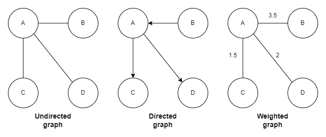
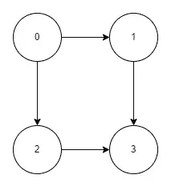

# DSA | Kahn 的拓扑排序算法

> 原文：<https://blog.devgenius.io/dsa-kahns-algorithm-for-topological-sorting-33c8587985a1?source=collection_archive---------5----------------------->

本文是数据结构与算法系列的一部分。在这个系列中，我将尝试详细解释重要而棘手的数据结构和算法主题。

在本文中，我将介绍 Kahn 的拓扑排序算法。

# 定义

首先让我们理解什么是拓扑排序。

`define: topological sorting`

> **有向图的拓扑排序**是其顶点的线性排序，使得对于从顶点 *u* 到顶点 *v* 的每个有向边 *uv* ，在排序中 *u* 在 *v* 之前

# 应用

我们可以使用拓扑排序来根据它们之间的依赖关系安排一系列的工作或任务。

作业由顶点表示，如果作业 *u* 必须在作业 *v* 开始之前完成，则存在从 *u* 到 *v* 的边(让我们以课程安排为例，其中每个顶点将表示一个课程，从 *u* 到 *v* 的边意味着课程 *u* 必须被视为有资格参加课程 *v*

# 图形数据结构基础

在进入卡恩算法之前。让我们复习一下算法中用到的图形数据结构的一些基础知识。



图形的类型

*   顶点:节点称为顶点(例如。a、B、C、D)
*   边:两个顶点之间的连接称为边(例如。AB、AC、AD)
*   路径:从一个顶点到另一个顶点的顶点序列(例如。BAC)
*   循环:起点和终点相同的路径
*   度:这只适用于未加权的图。这是连接到给定顶点的边的数量
*   入度:对于有向图，这是给定顶点的入边数
*   出度:类似于入度，这是给定顶点的出边数

# 卡恩算法

在这个算法中，我们选择顶点的顺序与最终的拓扑顺序相同。

1.  首先，我们选择入度为零的节点，并将其存储为一个队列。非空非循环图中必须至少存在一个这样的节点。
2.  然后我们遍历队列，直到至少有一个节点。
3.  在每次迭代中:首先我们将节点添加到结果列表(L)中。然后我们覆盖所有链接的节点并减少它们的入度。如果入度变为零，那么我们将其添加到队列中

我们来看一下伪代码。

```
L ← Resultant List [Initial state: {}]
S ← Queue of all the nodes with In-Degree zerowhile S is not empty do
    remove a node n from S
    add n to L
    for each node m with an edge e from n to m do
        decrease the In-Degree of m
        if In-Degree of m is 0 then
            insert m into Sif any node have In-Degree > 0 then
    return error   (graph has at least one cycle)
else 
    return L   (a topologically sorted order)
```

# 例子

让我们举一个例子，试着用卡恩的算法来解决这个问题。

## 问题陈述

总共有`numCourses`门课程需要你去修，分别标为从`0`到`numCourses - 1`。给你一个数组`prerequisites`，其中`prerequisites[i] = [ai, bi]`表示如果你想上`ai`课，你**必须先**上`bi`课。

*   例如，对子`[0, 1]`表示，要学习课程`0`，你必须先学习课程`1`。

返回*完成所有课程*所需的课程顺序。如果有许多有效答案，返回其中的任何一个。如果无法完成所有课程，返回**一个空数组**。

## 解决办法

让我们先了解一下这个图会是什么样子。

1.  每个课程都将是一个节点
2.  每个`prerequisites`元素将代表来自`bi -> ai`的一条边

对于输入:`numCourses = 4, prerequisites = [[1,0], [2,0], [3,1], [3, 2]]`。这是图表的样子。



图表

现在让我们在看代码之前，先试着理解一下算法的流程。

1.  如我们所见，只有节点 0 的入度为零，因此我们将把它添加到队列中。
2.  然后我们将循环遍历队列，直到它不为空。
3.  **在第一次迭代中**:我们将有节点 0。我们会把它添加到列表中。然后我们将通过节点 1 和节点 2。然后降低节点 1 和节点 2 的入度。在减少后，两者的入度都变为零，所以我们将两者都添加到队列中。
4.  因为节点 1 和 2 都在队列中，所以我们将进行另一次迭代。如果这样，我们可以得到节点 1 或节点 2(这将取决于哪个先被添加，两个答案都是正确的)。
5.  **在第二次迭代中**:假设我们有节点 1。然后我们会把它添加到列表中。然后减少节点 3 的入度。即使在减少之后，节点 3 的入度也不会为零。因此我们不会将其添加到队列中。
6.  在第三次迭代中:我们将有节点 2。然后我们会把它添加到列表中。然后减少节点 3 的入度。现在，节点 3 的入度为零，因此我们将把它添加到队列中。
7.  **在最后一次迭代中**:我们将有节点 3。然后我们会把它添加到列表中。由于它没有任何邻居，所以我们将停止。

因此我们的**最终列表**将是`[0, 1, 2, 3]`或`[0, 2, 1, 3]`。

现在让我们看看最终的实现。

```
public int[] findOrder(int numCourses, int[][] prerequisites) {
 int[] inDegree = new int[numCourses];
 List<Integer>[] am = new List[numCourses];

 for (int i = 0; i < numCourses; i++) {
  am[i] = new ArrayList<>();
 }

 // Populating adjacency matrix and inDegree
 for (int i = 0; i < prerequisites.length; i++) {
  inDegree[prerequisites[i][0]]++;
  am[prerequisites[i][1]].add(prerequisites[i][0]);
 }

 Queue<Integer> q = new LinkedList<>();

 // Checking which course have inDegree as 0 and 
 // adding it to the Queue
 for (int i = 0; i < numCourses; i++) {
  if (inDegree[i] == 0) {
   q.offer(i);
  }
 }

 // This will be the final order of courses
 List<Integer> courseOrder = new ArrayList<>();

 // Looping through the Queue until it is not empty
 while (!q.isEmpty()) {
  int size = q.size();
  for (int i = 0; i < size; i++) {
   // Adding current course to List
   int currentCourse = q.poll();
   courseOrder.add(currentCourse);
   // Looping throgh all the courses which you are eligible now 
   for (int course: am[currentCourse]) {
    // Decreasin the inDegree of course
    inDegree[course]--;
    // If inDegree become 0 then we will add it to the Queue
    if (inDegree[course] == 0) {
     q.offer(course);
    }
   }
  }
 }

 // If there is any node which still have inDegree greater then 0
 // Which means there exist a cycle and course scheduling is not possible
 for (int i = 0; i < numCourses; i++) {
  if (inDegree[i] != 0) {
   return new int[0];
  }
 }

 int[] res = new int[numCourses];

 for (int i = 0; i < courseOrder.size(); i++) {
  res[i] = courseOrder.get(i);
 }

 // Otherwise we will return the course order
 return res;
}
```