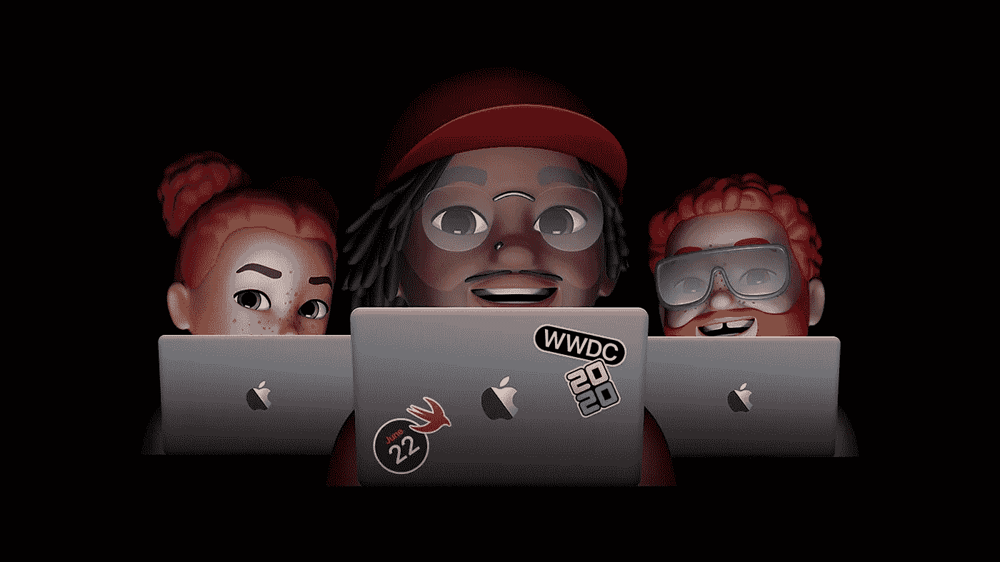
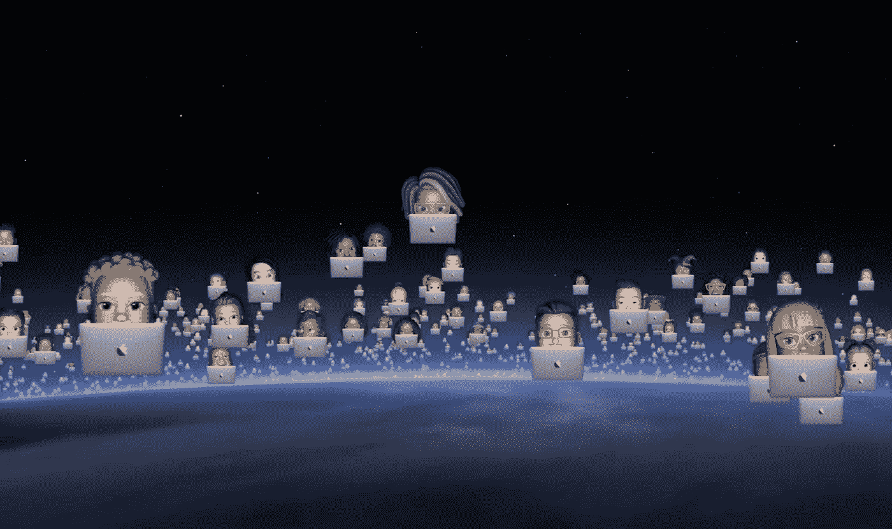
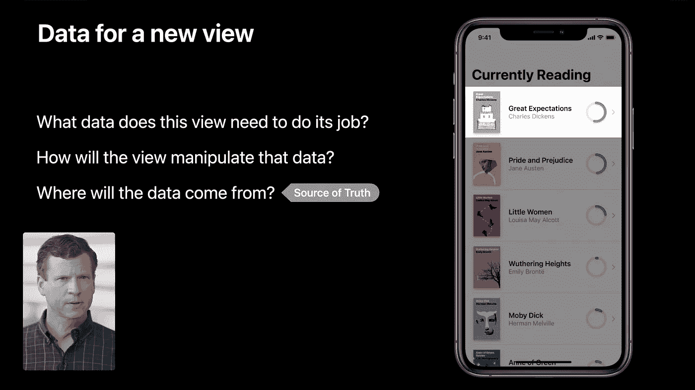
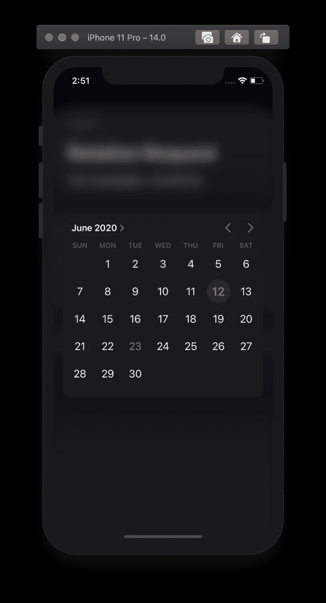
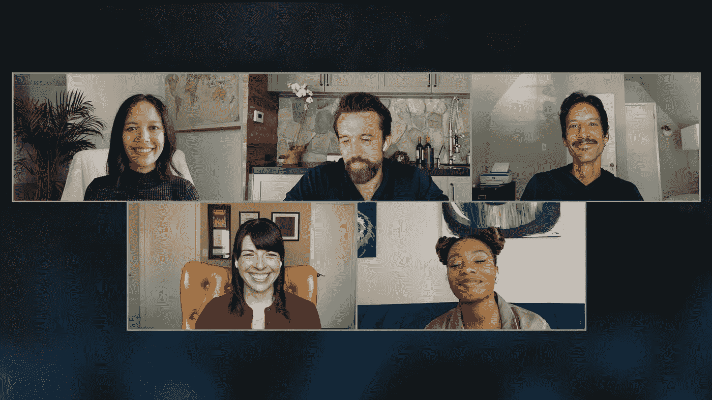

# GSoC 的配音周

> 原文：<https://blog.devgenius.io/dub-dub-week-in-gsoc-9415c67a684d?source=collection_archive---------24----------------------->

作为 Swift 学生挑战赛获胜者参加 WWDC20

图片:苹果

大家好，

这是我 GSoC'20 编码期第四周的博文。本周，我们的团队决定暂停开发导师 iOS 应用程序，以庆祝并全力参加 WWDC20。尽管我仍然完成了一些任务并实现了新的功能:p

在今天的帖子中，我将主要谈谈我参加 WWDC20 的经历，在实验室期间与苹果工程师交谈，并提前接触到最新技术和测试软件。

# 参加有史以来第一次配音

可以说，这是我的第一个 WWDC；我总是现场观看 Keynote，但这一周可以访问测试软件、实验室和会议，这是我第一次真正的配音体验，令人难以置信！

图片:苹果全球开发者大会主题演讲(在线)

我真的很喜欢苹果公司在上图中抓住了今年 WWDC 的精髓；全球数百万苹果开发者在线参加今年的 Dub Dub。

同样令人惊讶的是，人们曾经一度对全在线的 WWDC 持怀疑态度，也不知道苹果是否能够实现这一目标。现在，社区对它只有赞美，实际上称它在某些方面比标准的面对面会议更好🤯

我没有资格比较，但我真的很喜欢过去的这一周。然而，我总是投票支持体育赛事。网络、欢呼、活力和自然的联系方式将永远是我的首选。

## 关键学习

我主要关注 SwiftUI，这一周我最大的收获可以概括为这张幻灯片

图片:SwiftUI 中的数据要点，WWDC20

自去年推出 SwiftUI 以来，苹果一直强烈推荐在 swift ui 中构建小视图。

当我们将这两个建议结合起来:构建小视图并对这些视图的数据提出三个问题时，整个 SwiftUI 应用程序架构思想就变得鲜活起来。

> 在 SwiftUI 中构建小视图，并相应地为它们建模数据。

确切地说，我看过的所有会议视频和我的实验室都一致指向这一点:在 SwiftUI 中构建小视图，并相应地为它们建模数据。

# 在实验室与苹果工程师交谈

我真的很幸运，我申请的三个实验室都得到了预约。感觉这本身就是一项成就😄

> 这是一次难以置信的经历！

我在很多地方读到过苹果的工程师和 WWDC 的人们非常友好，这次我亲身体验到了这一点。你与苹果工程师交谈的整体感觉逐渐消失，然后就像你在与你的队友或朋友交谈一样，非常认真。

在我的三个实验室里，我和五名苹果工程师谈过，涉及的领域包括应用架构、性能、电池寿命和安全性；主要是配合 SwiftUI 和 Combine。

实验通过 Webex 进行，每次 25 分钟。在每个实验室中，我基本上都是分享我的屏幕来显示 Mentorship iOS 应用程序代码，然后一个接一个地提问！

> 对我来说，从三个实验室的苹果工程师口中听到这一点是非常令人惊讶的-
> “你走在正确的道路上。”

在某些情况下，我也能够收到一些非常有用的提示和对代码的改进，苹果工程师甚至没有问我就直接看到了，主要是为了提高性能和内存效率。

但总而言之，这三件事对每个实验室来说都是真实的-
-这很有趣，令人兴奋，苹果工程师非常友好
-我肯定学到了一些东西
-而且…25 分钟被证明是有限的(尤其是一旦你开始分享你的 Xcode 屏幕)

# 尽早获得最新的软件

Xcode 12，iOS 14，macOS Big Sur…

新的日期选择器(在 Xcode 12 上使用 SwiftUI 实现)

能够下载最新的 Xcode 和操作系统测试版比我想象的要强大和有意义得多。

安装新的测试版软件对我来说并不陌生。我已经通过公开测试版做了很长时间了。然而，早些时候，我的主要灵感并不是作为一名开发人员来测试新的 API，而是仅仅出于兴奋四处玩玩。此外，公开测试版会在发布几周后推出…

> 【https://developer.apple.com/wwdc20/10969 

我最喜欢的部分是夏洛特(波比)讲述她学习编码的经历，以及她支持墨尔本的时候。加上结尾，“快乐的嘟嘟嘟”😃

2.克雷格·费德里吉和格雷格·乔斯维克在访谈节目中的访谈

# Craig Federighi 和 Greg Joswiak 采访，远离 WWDC20

## 这是一个令人难以置信的采访，一个半小时长，你不会感到无聊。还有，♥苹果公园的背景图

我最喜欢的部分是 Craig Federighi 谈论隐私的地方，以及早期人们如何认为苹果公司由于其立场而错过了 ML，后来它被称为一种营销策略。

3.马克斯·布朗利采访克雷格·费德里吉

克雷格·费德里吉采访 MKBHD

克雷格·费德里吉在一次令人难以置信的采访中再次展示了苹果公园令人难以置信的景色。

## 这次采访涵盖了与脱口秀不同的主题，更侧重于 iOS 14 和 macOS Big Sur 中的实际设计和产品决策。

结论

这是不可思议的一周！对我来说几乎就像一个派对周:)我可以谈论 WWDC 和我对最新发布的想法几个小时，但让我们把这些留到我们真正见面的时候:D

与我的团队(安娜、金妮、瓦萨和阿康莎)一起庆祝 Dub Dub，放松了我们本周的时间表，这真是太棒了。

## 感谢您的阅读，希望您玩得开心:)

*请随时与我联系并联系，查看我们的项目，或者加入我们的开源社区:* [*LinkedIn*](https://www.linkedin.com/in/yugantar-jain-1a7820158/)*，*[*GitHub*](http://github.com/yugantarjain)*，* [*导师 iOS*](https://github.com/anitab-org/mentorship-ios) *，*[*AnitaB.org 社区*](https://anitab-org.zulipchat.com)

Again, an incredible view of the Apple Park during an incredible interview by Craig Federighi.

This interview covers different topics than The Talk Show and focuses more on the actual design and product decisions taken in iOS 14 and macOS Big Sur.

# Conclusion

This was an incredible week! Almost like a party week for me :) I can talk about WWDC and my thoughts on the latest releases for hours I guess, but let’s keep that for the time when we actually meet each other :D

It has been amazing to celebrate Dub Dub together with my team (Anna, Ginny, Vatsal, and Akanksha) by relaxing our timeline for this week.

## Thank you for reading, hope you had fun :)

*Please feel free to reach out to me and connect, check out our projects, or join our open source community:* [*LinkedIn*](https://www.linkedin.com/in/yugantar-jain-1a7820158/)*,* [*GitHub*](http://github.com/yugantarjain)*,* [*Mentorship iOS*](https://github.com/anitab-org/mentorship-ios)*,* [*AnitaB.org Community*](https://anitab-org.zulipchat.com)