# AWS 2020 假人指南—第 1 部分

> 原文：<https://blog.devgenius.io/dummies-guide-to-aws-2020-part-1-9410b59e1265?source=collection_archive---------13----------------------->

## AWS 初学者系列

# 什么是云计算？

云计算是按需交付计算服务，从应用程序到存储和处理能力，通常通过互联网并以按需付费的方式进行。

# 什么是 AWS？

亚马逊网络服务(AWS)是世界上最全面、最广泛采用的云平台，从全球数据中心提供超过 175 种全功能服务。数百万客户——包括发展最快的初创公司、最大的企业和领先的政府机构——正在使用 AWS 来降低成本、变得更加敏捷和更快地创新。

# AWS 提供哪些工具？

1.  计算
2.  储存；储备
3.  数据库ˌ资料库
4.  移民
5.  建立工作关系网
6.  开发工具
7.  管理工具
8.  分析学

还有更多…

# 我们开始吧！

## 创建您的帐户

前往 [AWS](https://aws.amazon.com/free/?trk=ps_a134p000003yHuFAAU&trkCampaign=acq_paid_search_brand&sc_channel=PS&sc_campaign=acquisition_PK&sc_publisher=Google&sc_category=Core&sc_country=PK&sc_geo=APAC&sc_outcome=acq&sc_detail=aws%20sign%20up&sc_content=Signup_e&sc_matchtype=e&sc_segment=444990381743&sc_medium=ACQ-P%7CPS-GO%7CBrand%7CDesktop%7CSU%7CAWS%7CCore%7CPK%7CEN%7CText&s_kwcid=AL!4422!3!444990381743!e!!g!!aws%20sign%20up&ef_id=CjwKCAjwrvv3BRAJEiwAhwOdM2SBvEPHJ_RbI7R8V5oSD5O5dMMDbOdv8tD2gG5dVtT_YZsenJBtphoCTYMQAvD_BwE:G:s&s_kwcid=AL!4422!3!444990381743!e!!g!!aws%20sign%20up&all-free-tier.sort-by=item.additionalFields.SortRank&all-free-tier.sort-order=asc) 并开始创建您的帐户。

跟随:

1.  点击创建免费账户。

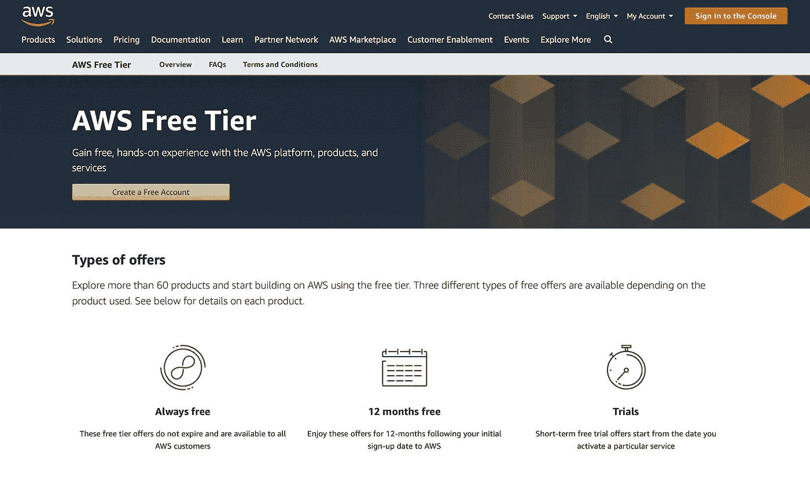

2.填写您的详细信息，然后单击继续。

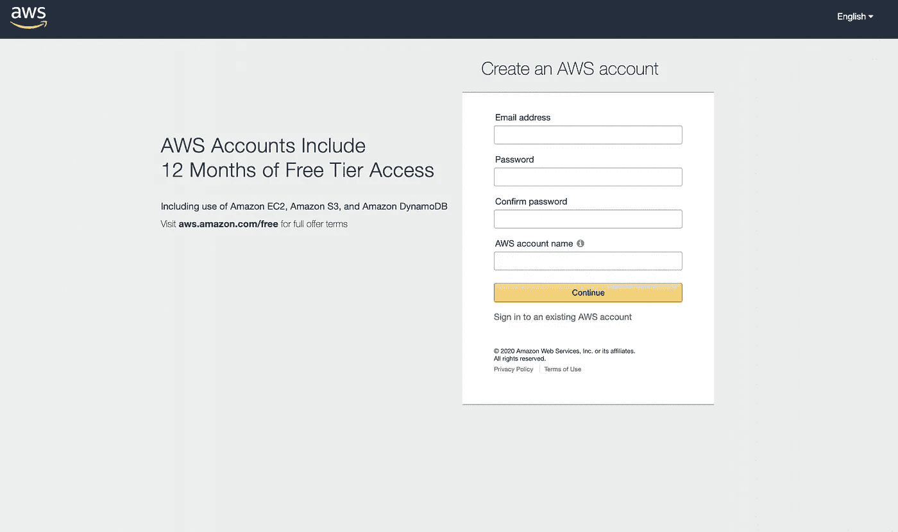

3.选择个人帐户并填写必填字段。

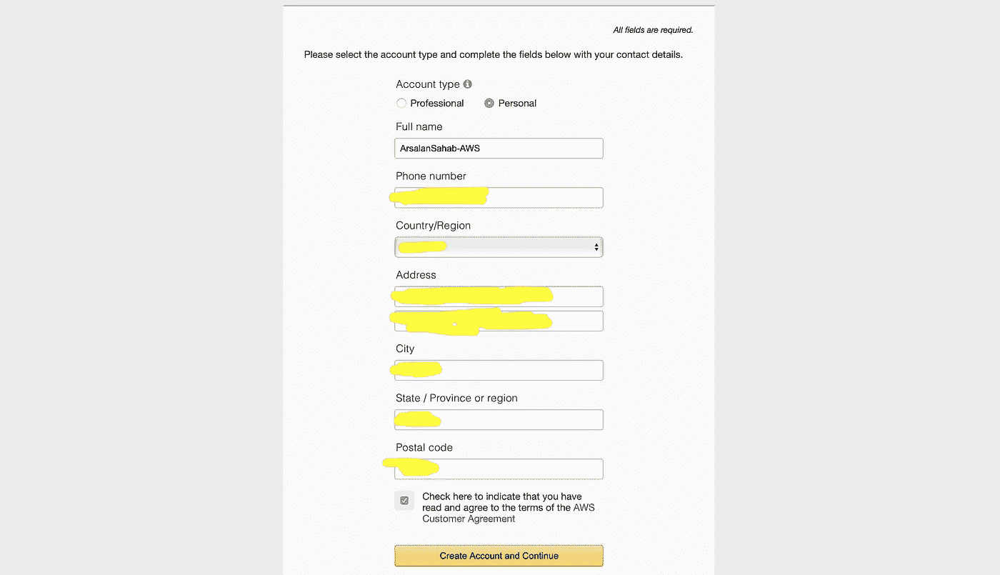

4.填写您的卡详细信息并继续。

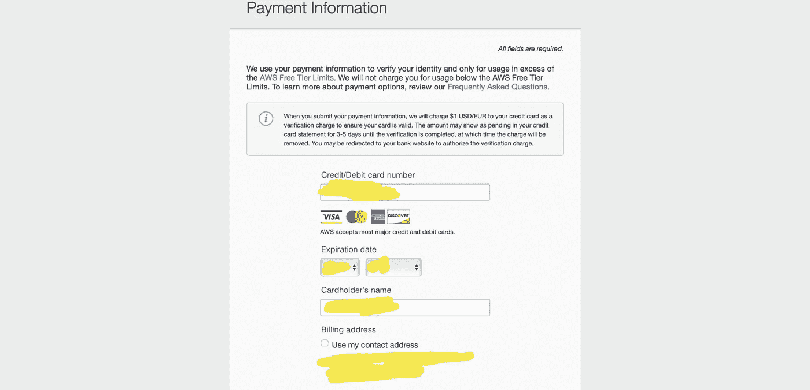

5.选择基本计划，并进一步验证所需的任何详细信息。

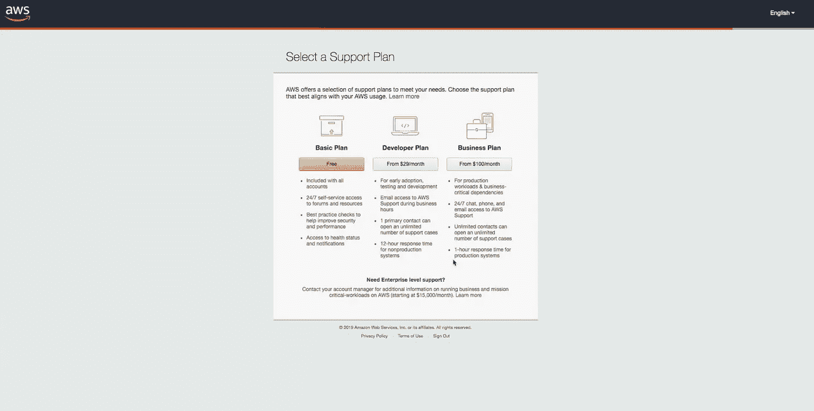

至此，您已经创建了您的帐户，现在再次前往 [AWS](https://aws.amazon.com/free/?trk=ps_a134p000003yHuFAAU&trkCampaign=acq_paid_search_brand&sc_channel=PS&sc_campaign=acquisition_PK&sc_publisher=Google&sc_category=Core&sc_country=PK&sc_geo=APAC&sc_outcome=acq&sc_detail=aws%20sign%20up&sc_content=Signup_e&sc_matchtype=e&sc_segment=444990381743&sc_medium=ACQ-P%7CPS-GO%7CBrand%7CDesktop%7CSU%7CAWS%7CCore%7CPK%7CEN%7CText&s_kwcid=AL!4422!3!444990381743!e!!g!!aws%20sign%20up&ef_id=CjwKCAjwrvv3BRAJEiwAhwOdM2SBvEPHJ_RbI7R8V5oSD5O5dMMDbOdv8tD2gG5dVtT_YZsenJBtphoCTYMQAvD_BwE:G:s&s_kwcid=AL!4422!3!444990381743!e!!g!!aws%20sign%20up&all-free-tier.sort-by=item.additionalFields.SortRank&all-free-tier.sort-order=asc) 并点击“登录控制台按钮”。

输入您的详细信息，选择 Root 用户并登录。

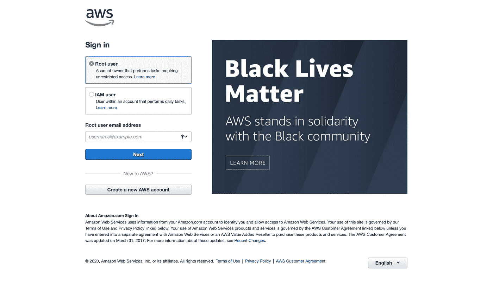

在我们开始使用服务之前，让我们设置预算和警报，以提醒我们自己，如果我们超出了我们的自由层。

# 设置预算和警报

哦，我差点忘了并非所有的 AWS 服务在所有地区都可用，所以请将您的 AWS 地区改为北弗吉尼亚。

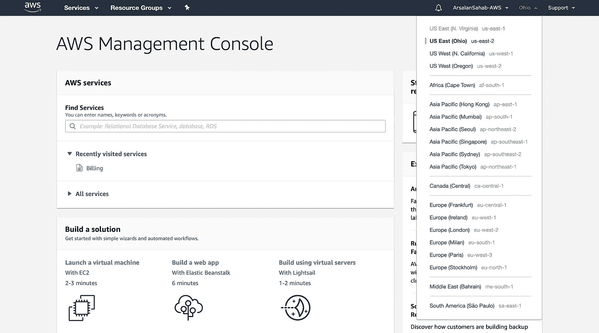

现在在“查找服务”栏搜索:“预算”并点击预算服务。

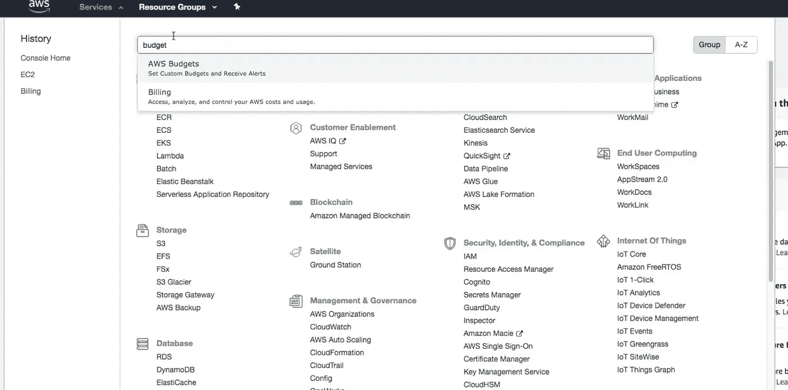

点击创建预算。

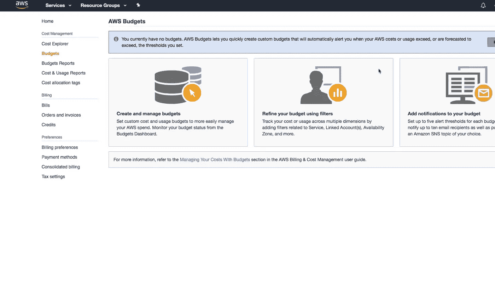

点击“成本预算”并继续。

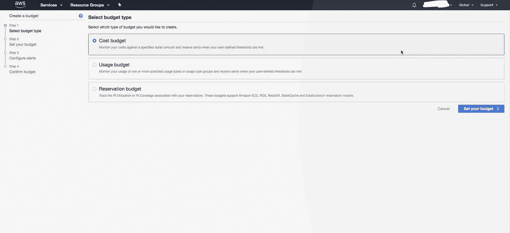

设置您的警报数量和警报周期，然后继续创建警报。

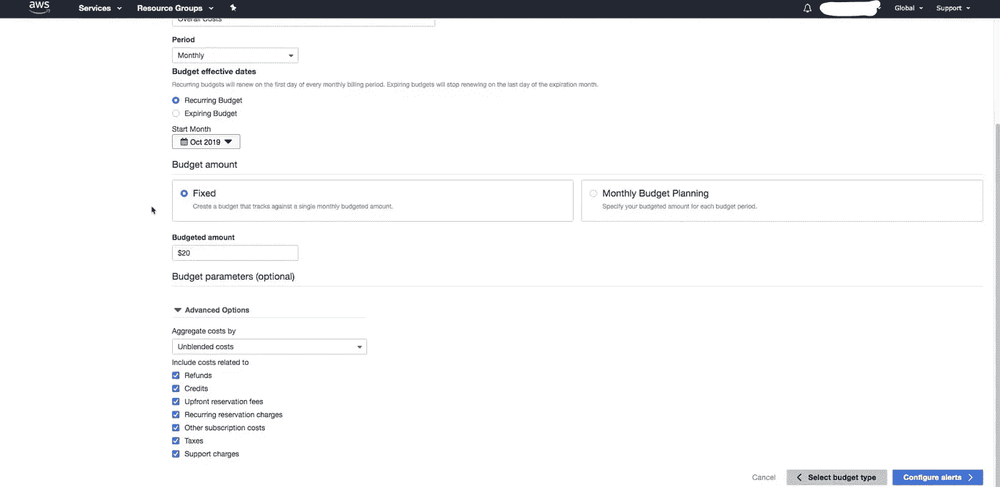

填写您的警报详细信息，然后单击创建预算。

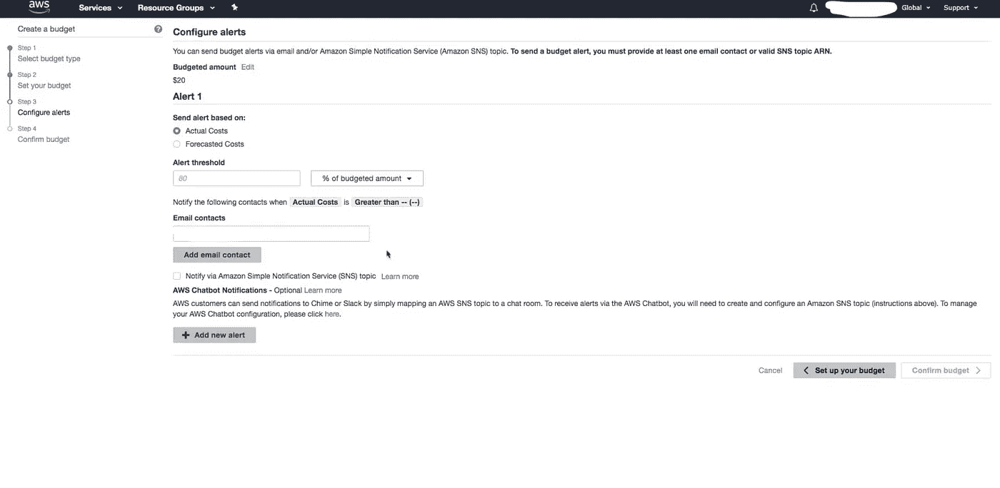

# 设置计费首选项

转到您的仪表板，点击“我的账单仪表板”。

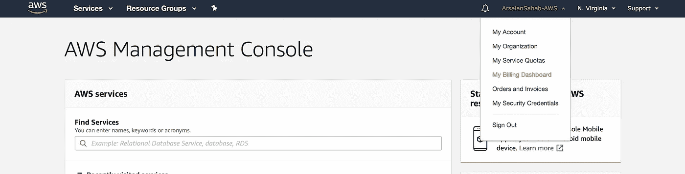

转到“账单优惠”，选择所有选项，然后保存优惠。

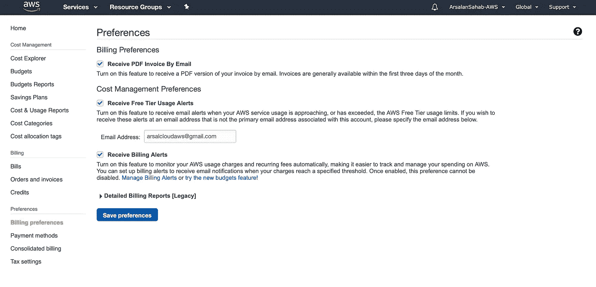

现在我们完成了帐户设置和所有无聊的事情。

# 让我们启动您的第一个云实例！

## 嘿，但是什么是云实例呢？

云环境是位于世界某个地方的计算机或服务器，但可以在世界任何地方访问。

简单地把它想象成一台在你朋友家里的计算机，但是你可以从你家远程访问它。

## 提升亚马逊的云计算平台:EC2。

弹性计算云(简称 EC2)在亚马逊网络服务(AWS)云中提供可扩展的计算能力。使用 Amazon EC2 消除了预先投资硬件的需要，因此您可以更快地开发和部署应用程序。您可以使用 Amazon EC2 启动任意多或任意少的虚拟服务器，配置安全性和网络，以及管理存储。

我们开始吧！

转到 AWS 控制台，在“查找服务”字段中搜索 EC2 并点击它。

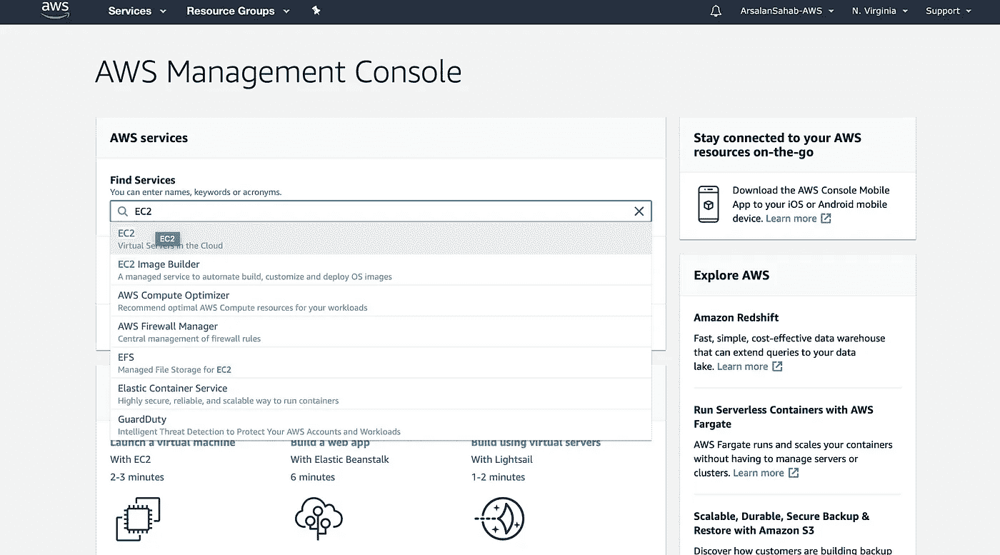

您将被定向到资源屏幕，单击启动实例。

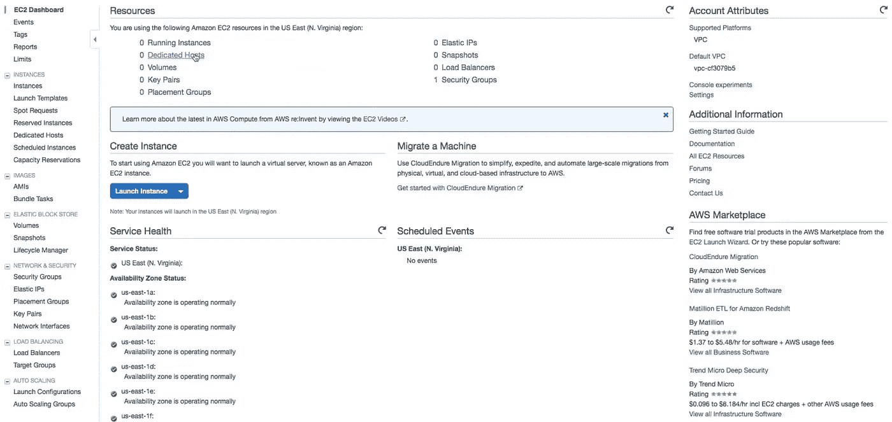

在本教程中，我们将选择 Amazon Linux 作为我们的映像或操作系统。

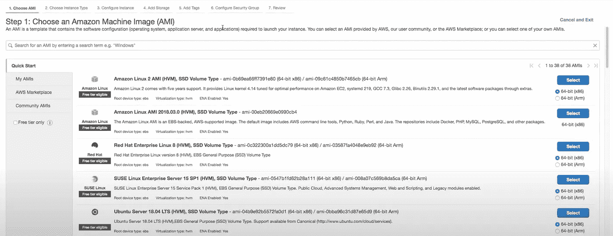

之后，您将被定向到“选择实例”屏幕，在那里选择“通用 t2.micro ”,因为它符合自由层的条件。

然后，您将被重定向到“configurations”屏幕，保持原样并继续执行步骤 4:添加存储。

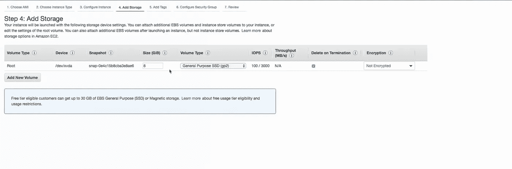

步骤 5 和 6 是可选的，让它们保持原样。

在第 7 步中，您将被要求提供一个密钥对，现在请选择“在没有密钥对的情况下继续”,因为我们将通过 SSH 访问我们的服务器并启动您的实例，如果您想创建一个密钥对，请在此处查看:[https://docs . AWS . Amazon . com/AWS C2/latest/user guide/launching-instance . html # Step-7-review-instance-launch](https://docs.aws.amazon.com/AWSEC2/latest/UserGuide/launching-instance.html#step-7-review-instance-launch)。

启动您的实例，等待几分钟，然后继续。

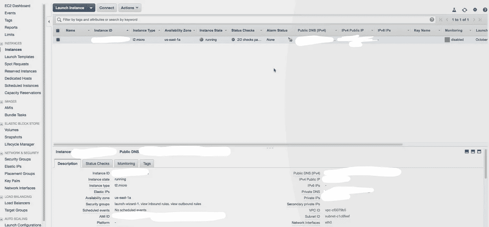

一旦你看到运行的绿色状态，然后你就可以进一步移动。

## 连接到您的实例

Amazon 推荐的连接实例的方法是使用会话管理器，但是现在我们将使用基于浏览器的 SSH。

右键单击您的实例 ID，然后选择 Connect 并选择 EC2 Instance Connect。

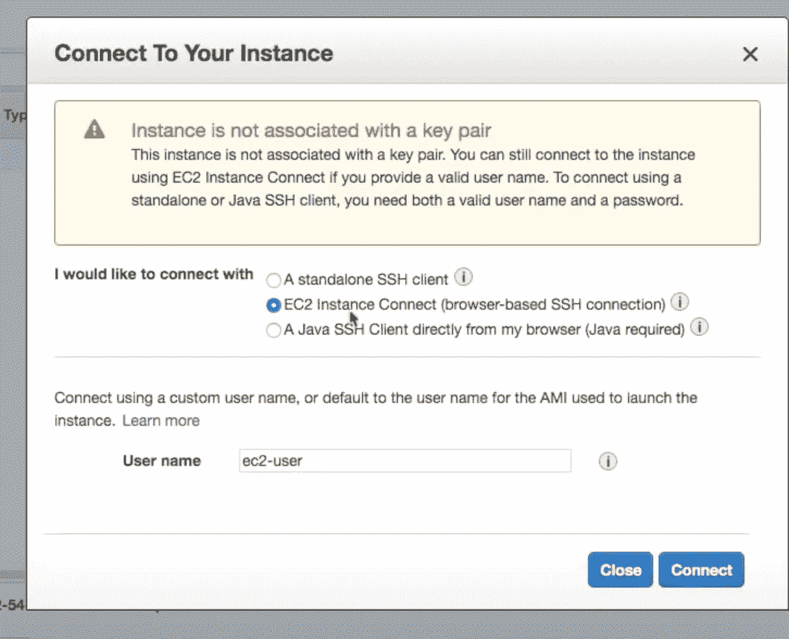

瞧啊。您现在已经连接到您的 EC2 云实例。

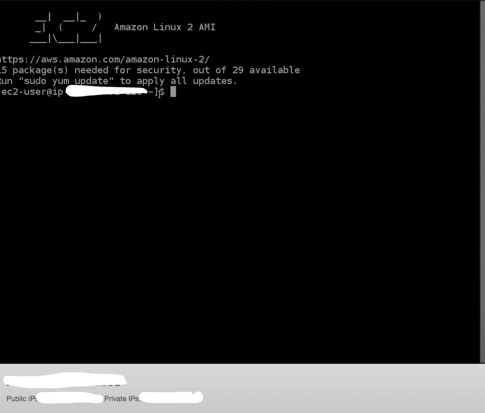

如对流程有任何疑问，请随时给我发电子邮件！

敬请关注进一步的云服务！