# 使用 tf.Keras 进行数据扩充的假人指南

> 原文：<https://blog.devgenius.io/dummies-guide-to-data-augmentation-using-tf-keras-84da6b808531?source=collection_archive---------13----------------------->

## 所有你需要知道的关于使用 keras 的数据扩充。

照片由 [Soragrit Wongsa](https://unsplash.com/@invictar1997?utm_source=medium&utm_medium=referral) 在 [Unsplash](https://unsplash.com?utm_source=medium&utm_medium=referral) 上拍摄

D 数据扩充是我们在修改现有数据的基础上创建新数据的过程，因此我们正在对训练集中的数据进行合理的修改。

# ☁️Reason's 为什么我们需要做数据增强。

## ➡️ 1.我们可能只是想向我们的训练集添加更多的数据

假设我们的训练集中的数据相对较少，并且很难获得更多的数据。因此，我们可以使用数据扩充从现有数据集创建更多数据，从而创建更多样本

## ➡️ 2.我们可能想用它来减少过度拟合。

如果我们有更少的训练数据，那么我们的模型更容易**过度拟合**，减少**过度拟合**的一种方法是向我们的训练集添加更多的数据或样本。因此，如果我们无法获得额外的样本，我们可以使用**数据扩充**向我们的训练集添加更多的数据。

# 使用 Keras 实现数据扩充。

## 📃导入所需的库。

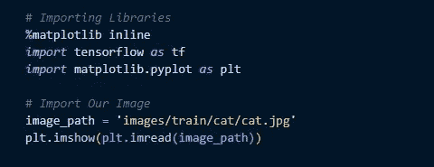

## 👉1.旋转图像😺

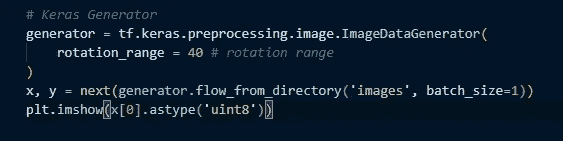

## 👉2.改变亮度。🌄

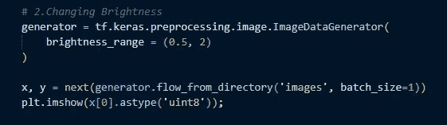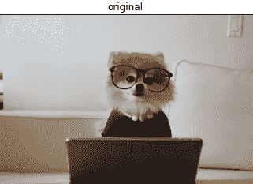

## 👉 **3。移动高度和宽度。🔳**

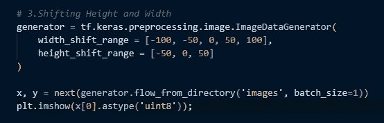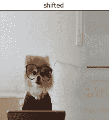

## 👉4.剪切图像。🔷

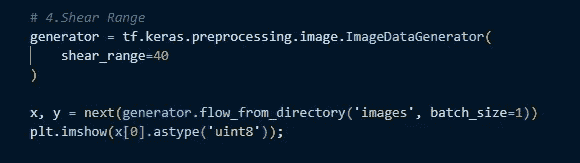

## 👉5.缩放图像。🔲

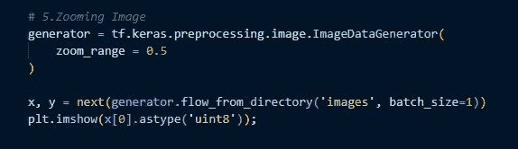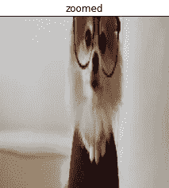

## 👉6.转换频道

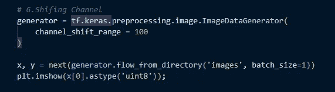

## 👉7.水平翻转图像⏫或者垂直▶️.

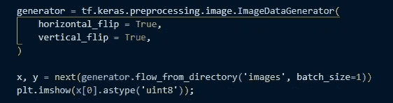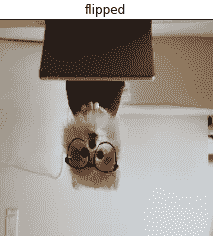

## 👉8.灰度和饱和度。🎴

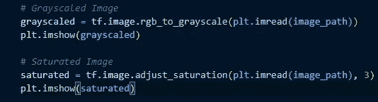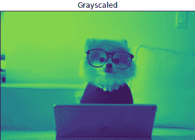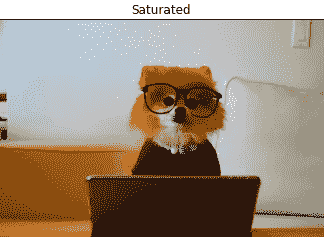

# 📑**更多用于数据扩充的 tf.image 函数:**

`**tf.image.stateless_random_brightness**`

`**tf.image.stateless_random_contrast**`

`**tf.image.stateless_random_crop**`

`**tf.image.stateless_random_flip_left_right**`

`**tf.image.stateless_random_flip_up_down**`

`**tf.image.stateless_random_hue**`

`**tf.image.stateless_random_jpeg_quality**`

`**tf.image.stateless_random_saturation**`

# 💭何时使用数据增强，何时不使用？

假设一个场景，您希望训练模型来预测图像是否是狗🐕或者不是狗❎🐕。

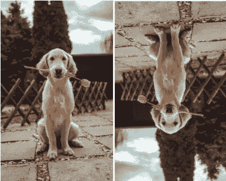

1.  你想要训练你的模型在**直立姿势** ( *左图*)的狗的图像上，因为模型更可能在大多数真实世界的图像中看到直立的狗，而不是狗的**垂直翻转图像** ( *右图*)。**这就是为什么我们不应该在这种情况下垂直翻转数据。**

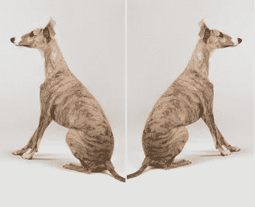

2.如果你只有向左的**狗的图像**🐕并且你在这些图像上训练该模型，很可能你的模型可以预测面向右边的狗的图像不是狗。

我们可以使用**数据增强**通过垂直翻转图像来生成图像。