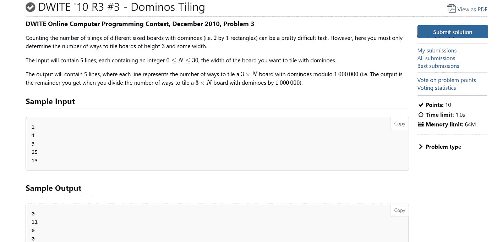
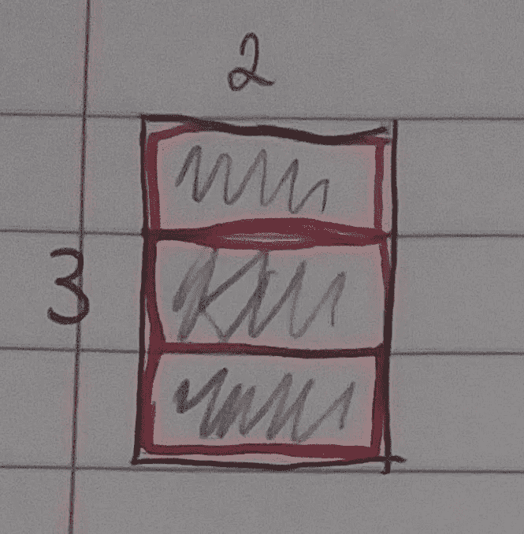
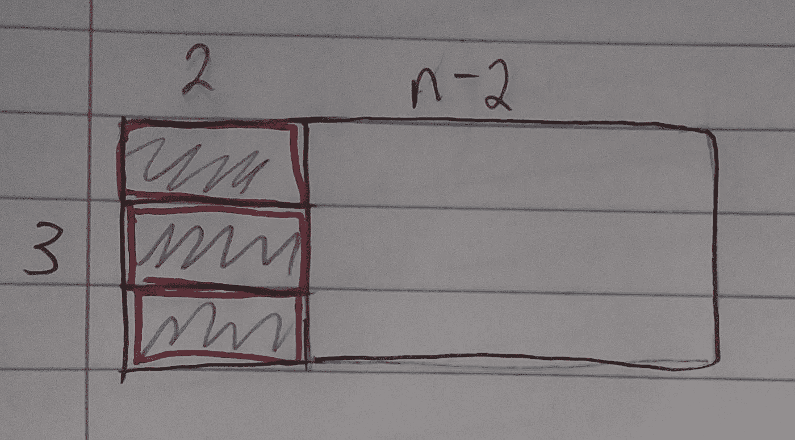
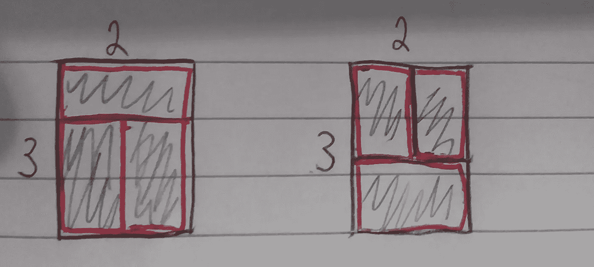
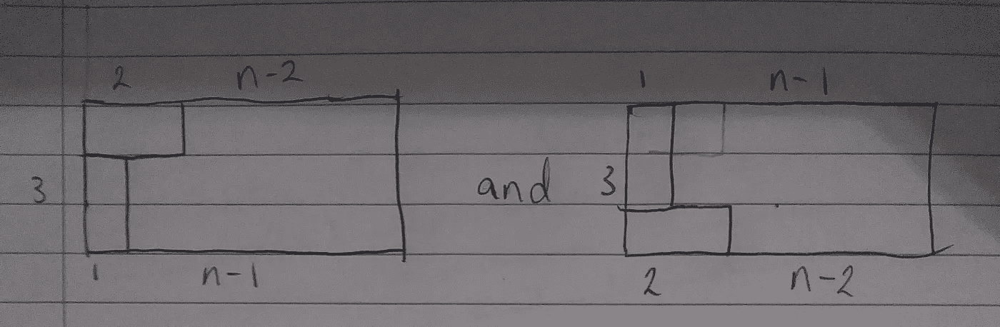
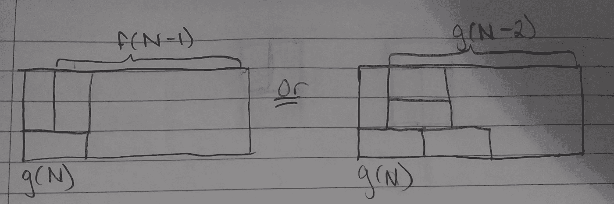

# DWITE '10 R3 #3 —多米诺骨牌平铺

> 原文：<https://blog.devgenius.io/dwite-10-r3-3-dominos-tiling-f750630a460e?source=collection_archive---------12----------------------->



让我们来看一下这个问题的解决方案。简而言之，这个问题是问我们有多少种方法可以用 1x2 平铺一个 3xN 的矩形。在跳到解决方案之前，尝试处理一些简单的案例。

在试图解决这个问题时，有一个问题需要考虑:有没有 N 个没有镶嵌的地方？

是的，任何奇数 n 都没有 tilings，这是为什么？

对于奇数 N 没有镶嵌，因为如果 N 是奇数，3xN 矩形的面积将是奇数，而 2x1 瓷砖的面积是偶数。因为没有办法用偶数矩形平铺奇数矩形，所以对于每个奇数 N，有 0 种方法用 2×1 平铺 3xN 矩形。

让我们创建一个函数- f(N)，其中 f(N)是用 1x2 矩形平铺一块 3xN 板的方法的数量。我们来看看 N =2 的时候。

这是 f(2)的一种可能性。



我们也可以用 f 来表示。这将是 f(N-2)，因为当 N ≥ 2 时，我们剩下 N-2 个矩形。这意味着 f(N) = f(N-2)。

看起来会像这样:



接下来，我们对 f(2)还有两种情况:



这意味着当 N = 2 时，有 3 种方法可以用 1x2 平铺块平铺 3x2 矩形。

然而，为了用 N 来表示，我们需要再一次改变它。我们不用 N=2 重新画一下，看看能得出什么。



让我们创建一个新函数，g(N)。g(N)会考虑这两种情况。有了 g(N)，我们要么回到 f(N)，要么继续 g(N)流。让我解释一下。如果你要把一个新的垂直瓷砖放在另一个垂直瓷砖旁边，你可以得到 f(N-1)。或者，您可以放置 3 个水平块，然后继续沿着 g(N)向下移动 g(N-2)。让我举例说明。



这意味着 g(N) = f(N-1) + g(N-2)。

这个想法可以用来求解 N=4，其中 f(4) = 11。我会把这个证明留给你作为练习。这些将是我们的基本案例。f(2) = 3，f(4) = 11。

然而，回到上面的案例:


有 2g(N-1)种方法可以实现这一点。这意味着我们的函数，f(N)现在是:f(N) = f(N-2) + 2g(N-1)。

这给了我们两个函数，让我们把它们标为 1 和 2，因为我们要做一些优化来获得更有效的函数。

1: f(N) = f(N-2) + 2g(N-1)

2: g(N) = f(N-1) + g(N-2)

现在，让我们用 N-1 来重写 g(N)。你很快就会明白为什么我们要这样做。

3: g(N-1) = f(N-2) + g(N-3)

现在，让我们把等式 1 和等式 3 加在一起。

3:f(N)+g(N-1)= f(N-2)+2g(N-1)+f(N-2)+g(N-3)

简化后，我们得到:

3: f(N) = 2f(N-2) + g(N-1) + g(N-3)

由于我们知道 g(N-1) = f(N-2) + g(N-3)，我们可以得到:

4:f(N)= 2f(N-2)+f(N-2)+g(N-3)+g(N-3)

4: f(N) = 3f(N-2) + 2g(N-3)

然后，我们可以重新排列等式 1，从 N 中减去 2，得到:

2g(N-3) = f(N-2)- f(N-4)

将此代入等式 4，我们得到:

f(N) = 3f(N-2) + f(N-2) — f(N-4)

简化后，我们得到:

f(N) = 4f(N-2) — f(N-4)

然后，我们可以使用这种递归来解决代码中的问题。这个问题告诉我们，每种情况下将有五行包含 N 的输入，因此我们可以用代码创建一个函数 f(N)。这是它在 c++中的样子。

```
#include <iostream>
#include <cmath>
#include <cstdio>
#include <algorithm>
#include <iostream>
using namespace std;
int f(int n) {
 if (n % 2 == 1) {
  return 0;
 }
 else if (n == 2) {
  return 3;
 }
 else if (n == 4) {
  return 11;
 }
 else {
  return 4 * f(n - 2) - f(n - 4);
 }
}
```

这就是算法本身。下面的代码获取输入并调用函数 f。

```
int main() {
 vector<int> results;
 for (int i = 0; i < 5; i++) {
  int N;
  cin >> N;
  results.push_back(g(N));
 }
 for (int i = 0; i < results.size(); i++) {
  cout << results[i] % 1000000 << endl;
 }

}
```

请注意，这些问题特别要求以 1000000 为模输出输出。

我希望这有助于你更好地理解平铺式问题，如果你在理解中有任何问题，请在下面留下评论，并随时留下赞。