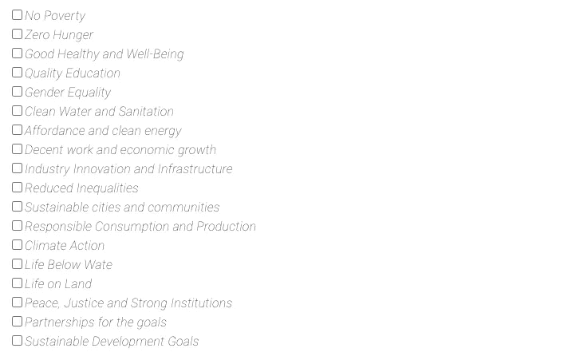

# 动态复选框列表(REACT JS)

> 原文：<https://blog.devgenius.io/dynamic-checkbox-list-react-js-d1e672a9a99e?source=collection_archive---------2----------------------->

大家好，希望你们都很好！！

在 React 应用程序中创建多个复选框值的步骤:

1.  创建 React 应用程序
2.  创建复选框组件
3.  将复选框组件添加到应用程序
4.  本地运行应用程序

# **创建 React 应用程序**

要创建 React 应用程序，请执行以下命令:

```
npx create-react-app <appName>
```

应用程序创建完成后，进入应用程序目录

```
cd <appName>
```

# **创建复选框组件**

接下来，我们将移动到 src 文件夹并创建组件 checkboxComponent.js 文件。然后用下面的代码更新文件。

```
import React from "react";const CheckboxComponent = ({ list }) => {return (<div>{list?.map((item, index) => (<div><inputstyle={{ fontStyle: "normal" }}type="checkbox"id={item.focus}value={item.focus}checked={item.isAdded}onChange={(e) => onAddingItem(e, item, index)}/><label className={classes.label1} htmlFor={item.focus}>{item.focus}</label></div>))}</div>);};export default CheckboxComponent;
```

# **给 App 添加复选框组件**

```
import React, { useState } from "react";const App = () => {const [focusArea, setFocusArea] = useState([{ focus: "No Poverty", isAdded: false },{ focus: "Zero Hunger", isAdded: false },{ focus: "Good Healthy and Well-Being", isAdded: false },{ focus: "Quality Education", isAdded: false },{ focus: "Gender Equality", isAdded: false },{ focus: "Clean Water and Sanitation", isAdded: false },{ focus: "Affordance and clean energy", isAdded: false },{ focus: "Decent work and economic growth", isAdded: false },{ focus: "Industry Innovation and Infrastructure", isAdded: false },{ focus: "Reduced Inequalities", isAdded: false },{ focus: "Sustainable cities and communities", isAdded: false },{ focus: "Responsible Consumption and Production", isAdded: false },{ focus: "Climate Action", isAdded: false },{ focus: "Life Below Wate", isAdded: false },{ focus: "Life on Land", isAdded: false },{ focus: "Peace, Justice and Strong Institutions", isAdded: false },{ focus: "Partnerships for the goals", isAdded: false },{ focus: "Sustainable Development Goals", isAdded: false },]);const handleOnChange = (event, option, index) => { const values = [...focusArea]; values[index].isAdded = event.target.checked; setFocusArea(values);};return (<div><CheckboxComponentlist={focusArea}onChange={(e) => handleOnChange(e, item, index)}/></div>);};export default App;
```

# **本地运行应用**

在您修改了上面的代码之后，在本地运行应用程序:

```
npm start 
or 
yarn start
```

这将有助于您的应用程序在 localhost:3000 中运行

您将看到以下输出:



输出

# **结论**

我们讨论了如何在 React 中创建动态复选框组件。我们用 *onChangehandler* 将列表传递给复选框组件，以获取复选框的状态并更新它。我们显示了该州列表中的所有复选框。

谢谢你！！

快乐编码…