# 使用 React 钩子的动态表单:高级老板的老板

> 原文：<https://blog.devgenius.io/dynamic-form-using-react-hooks-the-boss-of-the-senior-bosses-24cecc3da4a7?source=collection_archive---------12----------------------->


照片由 [Unsplash](https://unsplash.com?utm_source=medium&utm_medium=referral) 上的 [Afif Ramdhasuma](https://unsplash.com/@javaistan?utm_source=medium&utm_medium=referral) 拍摄

# 介绍

对数字意识的兴趣急剧增加，web 应用程序是构建和设计软件应用程序来解决人类挑战的最佳方式之一。收集用户数据是一个不容忽视的发展领域。

您是一名初级/高级软件工程师吗？您想使用表单字段收集大量数据，并使用 react hooks 关注个别变化吗？那么这篇文章就送给你了。

# 要学习的东西

在本文中，我将向您展示我是如何处理以下问题的:

*   呈现动态表单
*   处理各种形式的变化
*   使用按钮添加更多表单
*   使用按钮删除表单
*   使用样式组件
*   最佳代码实践

# 先决条件

*   了解 Javascript
*   了解反应
*   安装 Npm/节点

# 设置环境

创建一个新的 react 项目，使用下面的 [***链接***](https://create-react-app.dev/docs/getting-started/) ，并将其命名为 dynamic-forms。在您的终端中，导航到桌面文件夹并安装 styled-components，如下所示:

```
cd desktopcd dynamic-formsnpm i styled-components ––saveCode .
```

在上面的代码片段中，我导航到 desktop 文件夹，进入我创建的 dynamic-forms，react 项目，并安装了样式化组件，以便为应用程序提供灵活的样式。

# 文件夹结构

让我们转到终端，运行下面的代码片段:

```
cd srcmkdir Viewcd Viewmkdir Styles Utilcd Stylestouch ViewStyles.jscd ..cd Utiltouch handlers.jscd ..touch Main.jscd ..
```

我在 src 文件夹中导航，并创建了一个名为 View 的文件夹，在 View 文件夹中，我创建了两个名为 Styles、Util 的文件夹和一个名为 Main.js 的组件。

让我们进入 app.js 并删除返回的 jsx，只留下带有 app 类的 div 元素。

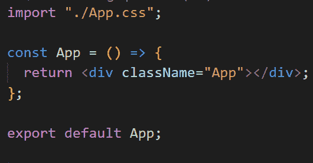

让我们进入 app.css，移除所有样式属性，并添加默认样式，如下所示:

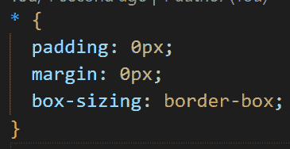

# 呈现动态表单

在上面创建的主组件中，我们添加以下代码片段:

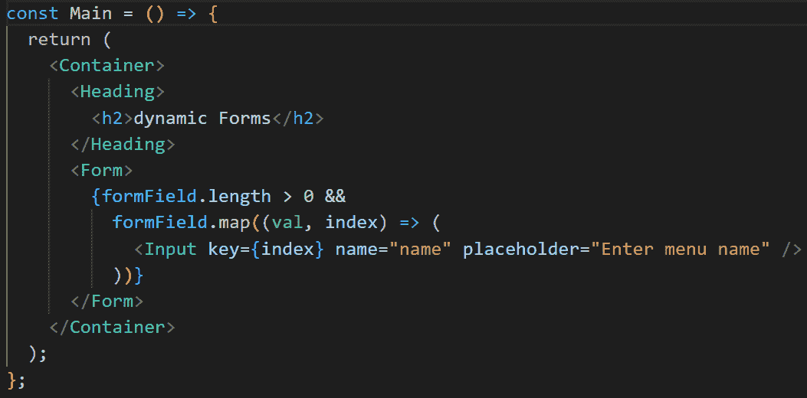

在上面的代码片段中，我呈现了一个标题和一个包含输入字段的表单。formField 是一个处理所有表单字段的状态，目前只呈现一个字段。

请注意，标记是使用样式化组件生成的，如下所示:

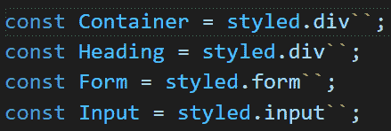

早些时候，我提到我将有一个按钮，用于添加/删除任何指定的表单。让我们添加按钮，如下所示:

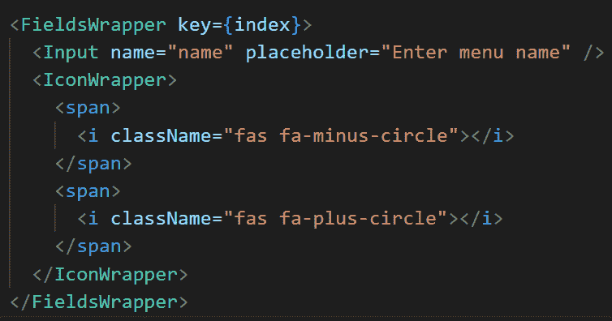

因为 React 返回时只接受一个子元素，所以我创建了一个包装器来包装字段和按钮。对于每个循环，它包装一个保存字段和按钮的元素。

# 集成字体图标

按钮图标是使用字体 awesome icon-v5.15.4 添加的，我使用了链接到 index.html 内部的 CDN，如下所示:

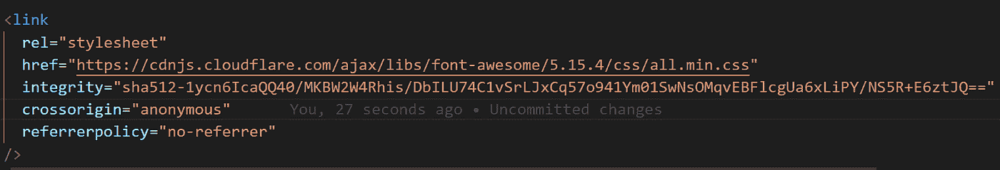

上面的代码片段允许我使用 className 属性添加图标，如前面的代码片段所示。

# 点击按钮时添加更多表单

让我们进入我在上面创建的 handlers.js 文件，并向其中添加以下代码片段:

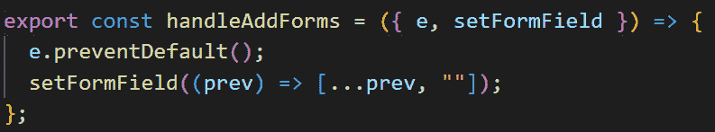

我声明/导出了 handleAddForms 函数，该函数包含两个参数，即事件和一个设置表单字段状态的方法。我使用事件的 preventDefault 方法来防止表单返回 void，并扩展 prev 状态，向该状态添加一个空字符串。

setFormField 在主组件中声明，如下所示:

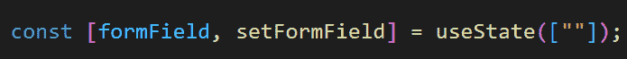

handleAddForms 被导入到主组件中，并在 span 元素的 onClick 方法中传递，然后设置参数，如下所示:

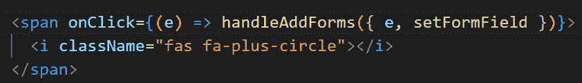

# 单击按钮时移除表单

让我们进入 handlers.js 文件，并向其中添加以下代码片段:

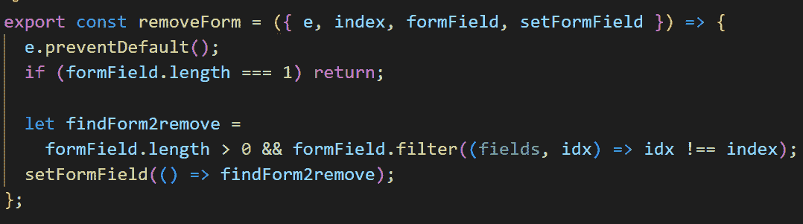

在上面的代码片段中，我声明/导出了 removeForm 处理程序，我向它传递了四(4)个参数，触发的事件，指定字段的索引，当前字段和设置状态的方法。

我阻止了表单返回 void，我设置了标准来监视字段何时只剩下一个字段，并在该条件之后停止执行剩余的代码。

我循环遍历 formField 以获取使用索引指定的字段，并返回指定字段之外的字段，最后将状态设置为当前可用的字段。

removeForm 方法也被导入到主组件中，并被传递给 remove 按钮 onClick，如下所示:

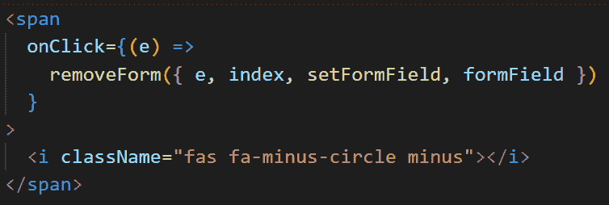

# 处理形式变化

让我们进入 handler.js 文件，并向其中添加以下代码片段:

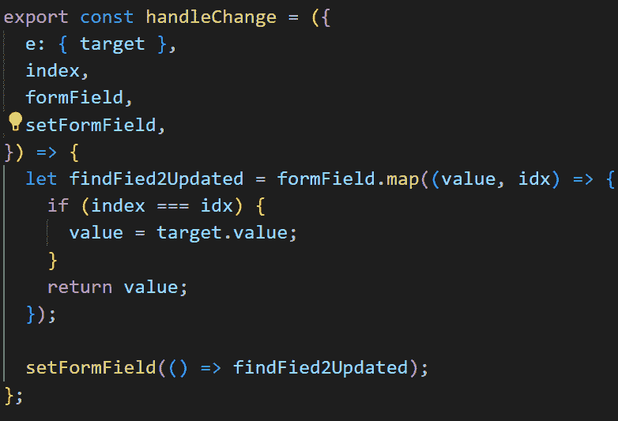

在上面的代码片段中，指定的索引用于获取要更新的确切字段，并最终将新的更新字段返回到状态。参数是在调用函数的主组件中设置的。

让我们进入主组件，在 onChange 方法中传递函数的字段，并将值设置为每个字段的值，如下所示:

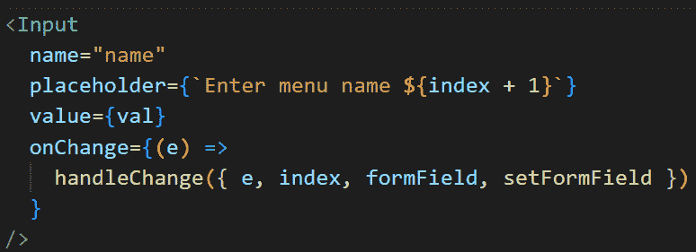

# 演示

现在我已经添加了以上所有内容，让我们使用下面的链接来访问[演示](https://res.cloudinary.com/hobbyluv07/video/upload/v1663142264/dynamic_forms_-_Google_Chrome_2022-09-14_08-50-50_pghjpd.mp4)

# 结论

到目前为止，我想您一定已经看过演示了，并且看到了与表单交互是多么的灵活和容易。我猜你的电子商务网站和其他需要动态表单的 UI 设计将不再是一个挑战。

如果这篇文章对你有帮助，请在 [Linkedin](https://www.linkedin.com/in/chime-princewill-3a2b1b192/) 和 [Medium](https://princewillchime43.medium.com/) 上赞、评论并关注我，以查看我的更多文章。点击下面的链接进入来源 [***代码***](https://github.com/chibuike07/dynamic-form-react) 。