# Go #6 中的动态编程:硬币兑换问题

> 原文：<https://blog.devgenius.io/dynamic-programming-in-go-6-coin-change-questions-36721113c44c?source=collection_archive---------9----------------------->

在“Go 中的动态编程”系列文章中，我们将讨论使用 DP 的各种解决方案，并在过程中遇到一些概念。

在文章#2 中，我们讨论了一个叫做“制表”的概念:[https://hitesh-pattanayak . medium . com/dynamic-programming-in-go-2-clipping-stairs-46597d 61157 c](https://hitesh-pattanayak.medium.com/dynamic-programming-in-go-2-climbing-stairs-46597d61157c)

在第一篇文章中，我们讨论了一个叫做“记忆化”的概念:[https://hitesh-pattanayak . medium . com/dynamic-programming-in-go-1-Fibonacci-68 D2 b 7 f1 b 616](https://hitesh-pattanayak.medium.com/dynamic-programming-in-go-1-fibonacci-68d2b7f1b616)

这是“Go 中的动态编程”系列文章的继续。

在这个故事中，我们将解决“硬币兑换”问题的两种变化。

> 问题 1

使用给定的硬币阵列，找出可能支付“x”金额的组合数。同样，每枚硬币的数量也是无限的。

## 例子

**硬币:**【2，3，5】

目标: 7

**预期答案:** 2(因为只有 2 种组合可能->【2，2，3】和【2，5】)

> 递归方法

**步骤**:

*   假设:给出的硬币是升序排列的。
*   对于每次迭代，我们要么选择当前的硬币，要么不选择。
*   如果当前硬币小于等于剩余的目标值，我们选择当前硬币(目标值将在每次回收呼叫中减少当前硬币值)
*   如果我们不选择当前的硬币，我们用下一个硬币循环。

> 递归方法:代码

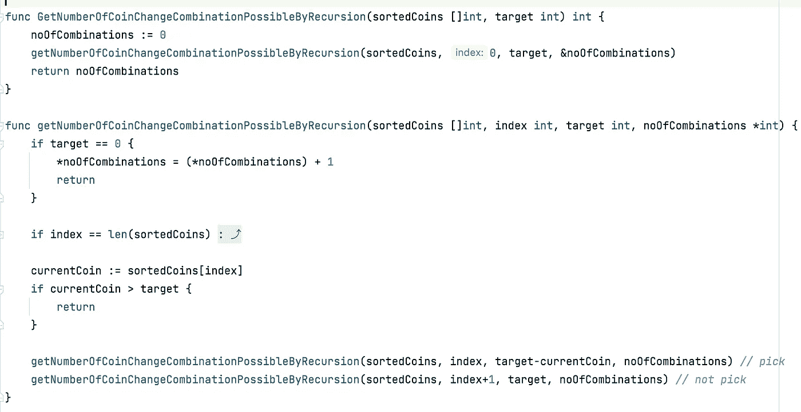

> 递归方法:测试

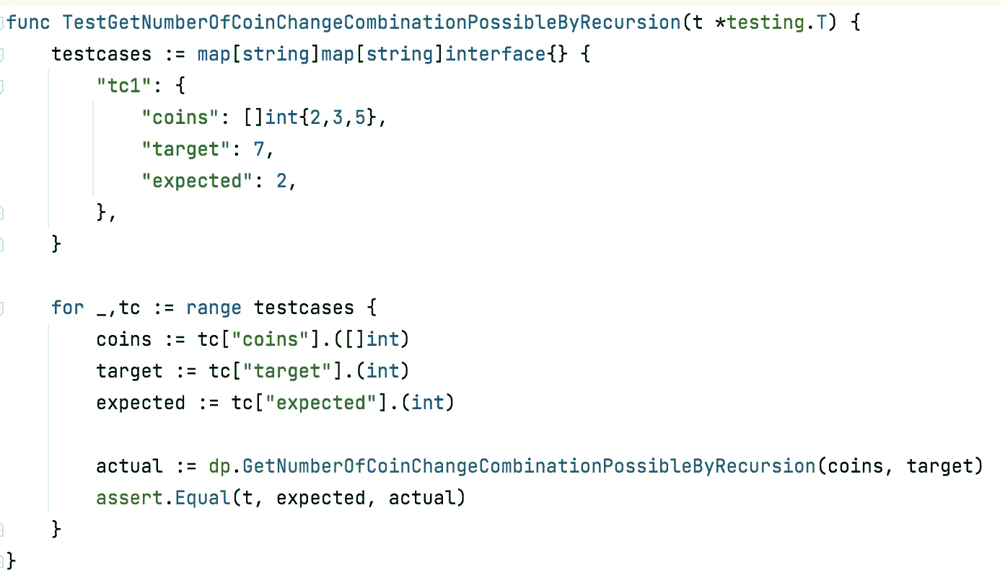

> 动态规划方法

**初始差压阵列**

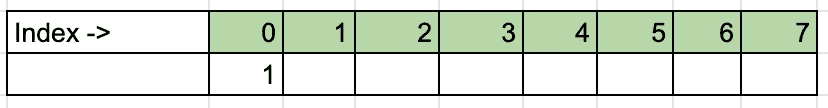

*   即使目标是“7”，数组的长度也是“8”，因为 _ _ _ _ _ _ _ _ _ _ _ _ _ _ _ _
*   数组的索引代表每一层的目标。
*   的每一个值都代表了有多少种方法可以通过使用给定的硬币来达到目标等级。
*   例如，如果索引“2”的值为“4”，这将意味着通过使用 4 种组合中的给定硬币可以达到“2”个目标硬币。比如可能是' 1，1，1，1 '，' 1，1，2 '，' 2，2 '，但不是' 2，1，1 '，因为它会变得和' 1，1，2 '一样。我们在寻找组合，而不是排列。
*   所以回到第一点，我们创建了一个“8”长度的数组，因为“0”目标也可以通过不支付任何硬币来实现。

**最终动力定位阵列**

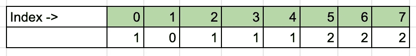

> DP 方法:代码

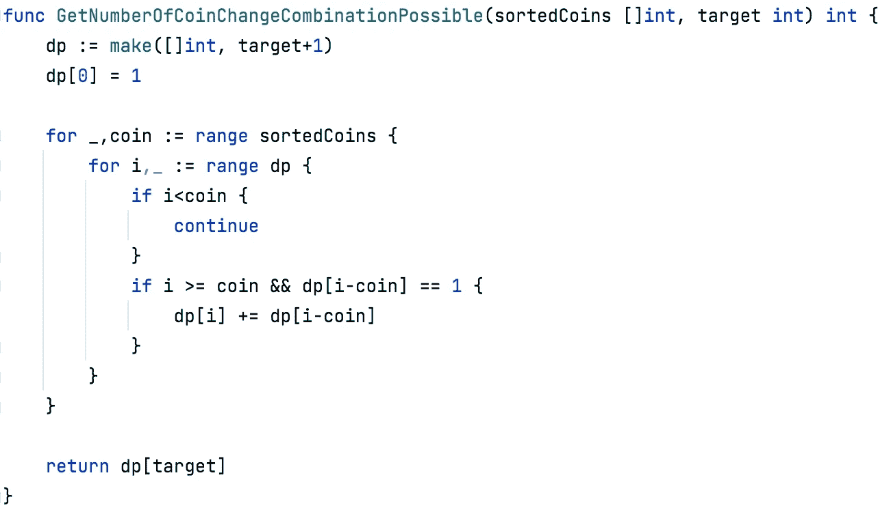

> DP 方法:测试

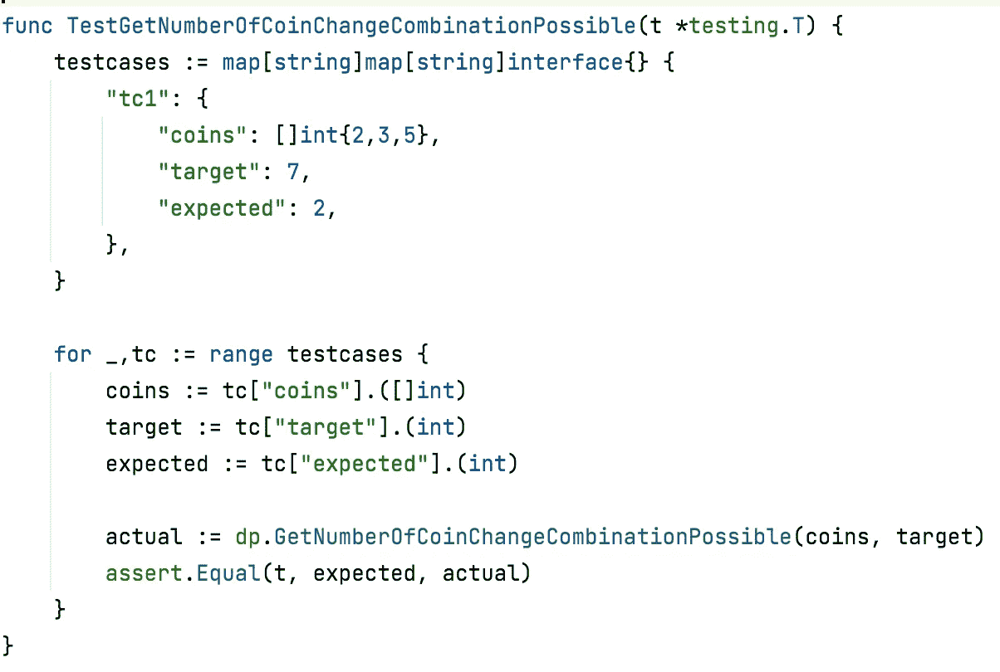

> 哪个更好？递归或者 DP！让我们测量一下…

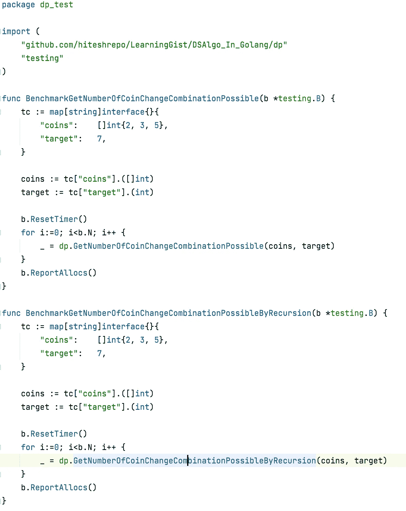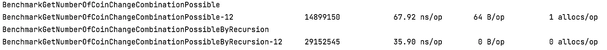

哇！！与我们的预期相反，递归解决方案似乎更快。

但事实是这样吗？

尝试对较长的输入运行基准测试。

比方说一个目标“100”和硬币“[2，3，5，10]”

请留下你的发现。

继续下一个问题…

> 问题 2

使用给定的硬币阵列，找出可能支付“x”金额的排列数。同样，每枚硬币的数量也是无限的。

看看问题 1 和问题 2 的区别是一个单词。

在问题 1 中，是组合，而在这里是排列。

那么它们之间有什么区别呢？

让我们考虑这个例子

**硬币:** [2，3，5]

**目标:** 7

给定一组数量无限的硬币(2，3，5)，我们需要找出数量为 7 的组合或排列的数量。

如果考虑组合，我们的答案仅限于:[2，2，3]和[2，5]

但是通过排列，我们的答案会变成:[2，2，3]，[2，3，2]，[3，2，2]，[2，5]，[5，2]。

在组合中，[2，3，2]和[3，2，2]无效，因为已经存在包含相同元素的[2，2，3]组合。同样[5，2]也太不存在了。

> 动态规划方法

直接跳到 DP 方法，因为我们已经在第一个问题中比较过了。这里我们正在解决类似的问题。

**初始动力定位阵列**

*   即使目标是“7”，数组的长度也是“8”，因为 _ _ _ _ _ _ _ _ _ _ _ _ _ _ _ _
*   数组的索引代表每一层的目标。
*   的每一个值都代表了有多少种方法可以通过使用给定的硬币来达到目标等级。
*   例如，如果索引“2”的值为“6”，这将意味着通过使用 6 种排列的给定硬币可以达到“2”个目标硬币。比如“1，1，1，1”，“1，1，2”，“2，1，1”，“1，2，1”，“2，2”。
*   所以回到第一点，我们创建了一个“8”长度的数组，因为“0”目标也可以通过不支付任何硬币来实现。

**最终动力定位阵列**

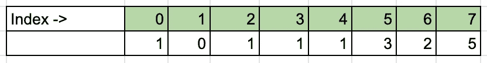

> DP 方法:代码

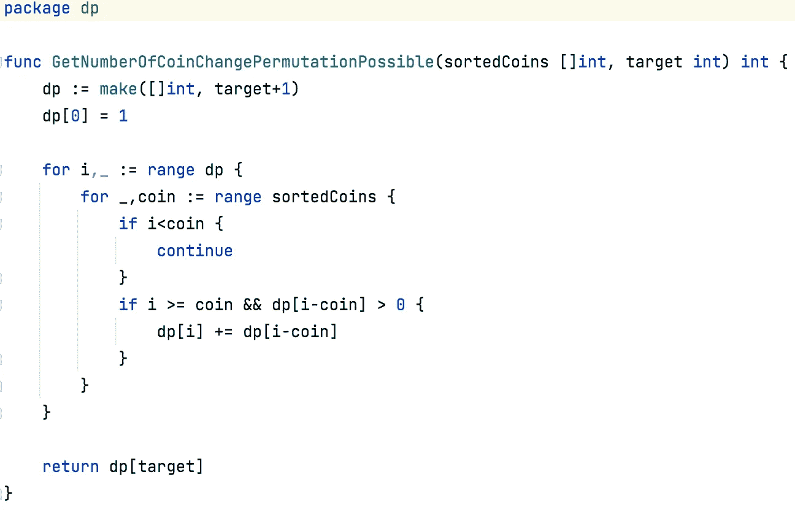

> DP 方法:测试

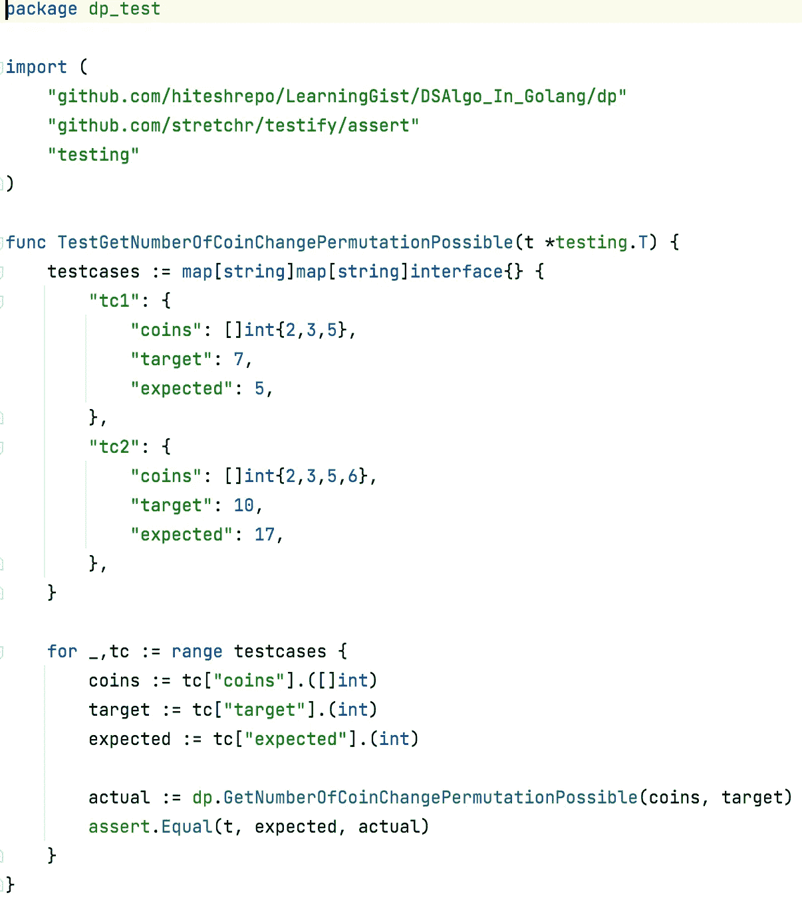

请尝试用递归方法解决问题 2，并与 DP 方法进行比较，并分享您的发现。