# Go #7 中的动态规划:背包问题

> 原文：<https://blog.devgenius.io/dynamic-programming-in-go-6-knapsack-questions-fd2e480ed6ca?source=collection_archive---------10----------------------->

在“Go 中的动态编程”系列文章中，我们将讨论使用 DP 的各种解决方案，并在过程中遇到一些概念。

在文章#2 中，我们讨论了一个叫做“制表”的概念:[https://hitesh-pattanayak . medium . com/dynamic-programming-in-go-2-clipping-stairs-46597d 61157 c](https://hitesh-pattanayak.medium.com/dynamic-programming-in-go-2-climbing-stairs-46597d61157c)

在第一篇文章中，我们讨论了一个叫做“记忆化”的概念:[https://hitesh-pattanayak . medium . com/dynamic-programming-in-go-1-Fibonacci-68 D2 b 7 f1 b 616](https://hitesh-pattanayak.medium.com/dynamic-programming-in-go-1-fibonacci-68d2b7f1b616)

这是“Go 中的动态编程”系列文章的继续。

在这个故事中，我们将解决背包问题的两种变化。

> 问题 1

问题是在不超出背包容量的情况下，找出背包可以容纳的最大物品数量。

**举例**

背包容量: 7

**权重:**【2，5，1，3，4】

**项目:**【15，14，10，45，30】

**预期:** 75

> 递归方法

**步骤**:

*   在每次递归中，我们要么选择权重和相应的项目数，要么不选择。
*   如果我们选择，那么我们减少容量，增加项目的计数，并移动到下一个权重/递归。
*   如果我们没有选择，我们只是移动到下一个递归/权重。
*   如果我们以 0 到达目标，我们将它添加到一个持久集合中，并从递归返回。
*   如果索引违反了权重数组，我们从递归返回。

> 递归方法:代码

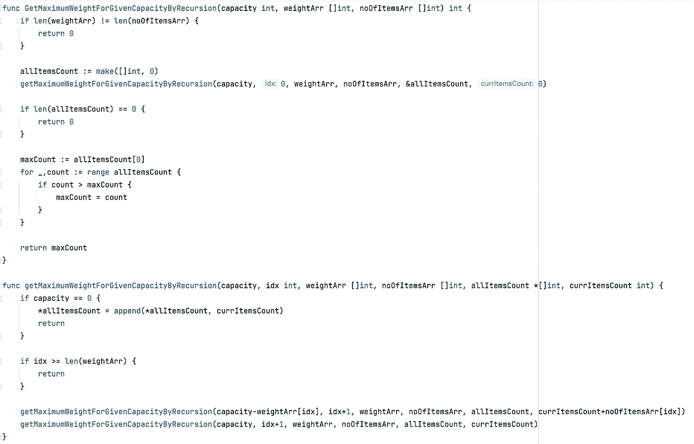

> 递归方法:测试

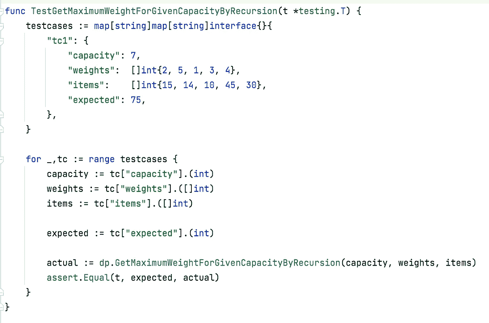

> 动态规划方法

## 初始 DP 矩阵

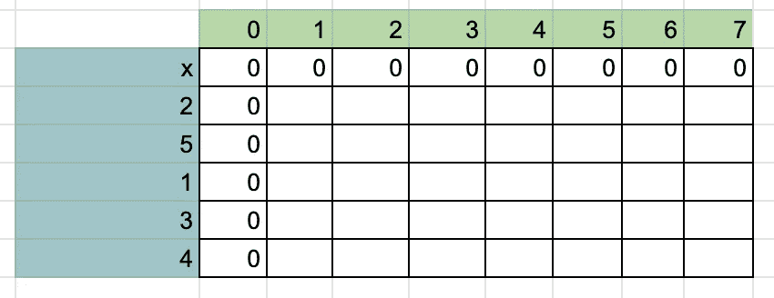

## 最终 DP 矩阵

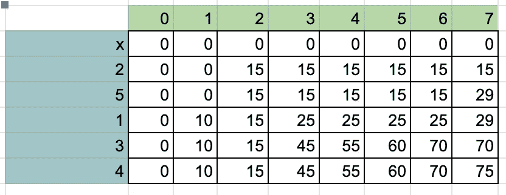

行表示权重，列表示像元的容量。

x 行代表空重，因此整行为“0 ”,因为空重永远不会超出任何容量，也不会影响物品数量。

> DP 方法:代码

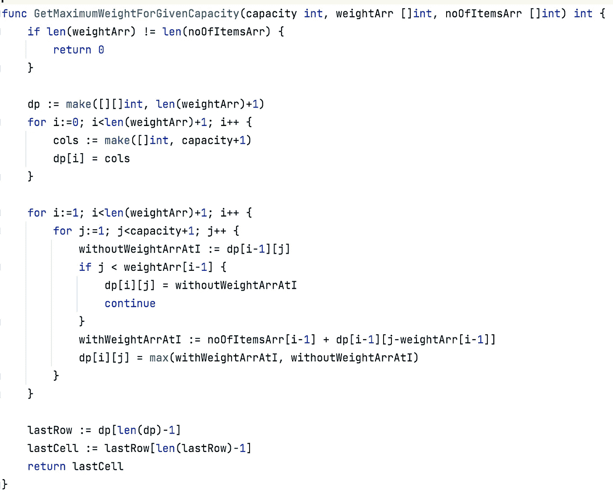

> DP 方法:测试

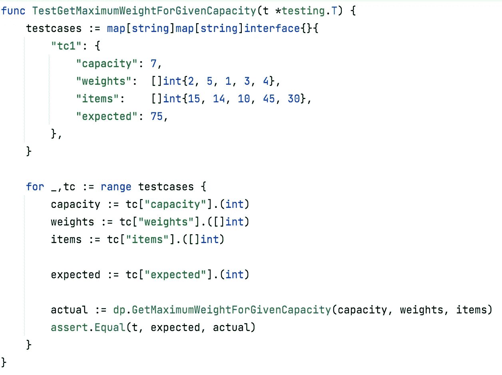

> 哪个更好？递归或者 DP！让我们测量一下…

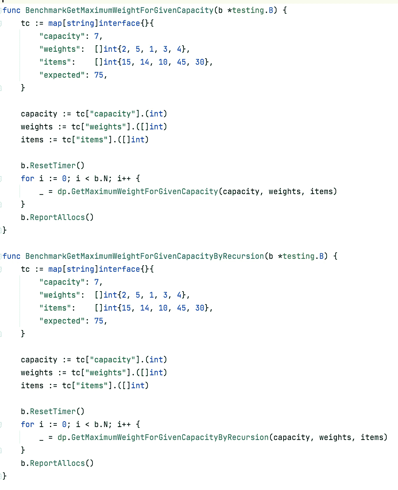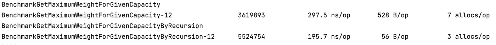

> 问题 2

背包:无界

在前面的问题中，我们要么选择一个重量，要么不选择。一个砝码只被选了一次。但是在这个变体中，单个可以被多次选取。允许重复权重。

**示例**

**背包容量:** 7

**权重:**【2，5，1，3，4】

**项目:**【15，14，10，45，30】

**预期:** 100

对于同一示例，预期值已从“75”更改为“100”。

**初始动力定位阵列**

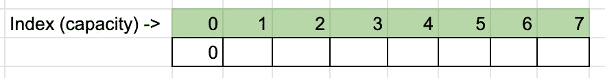

**最终动力定位阵列**

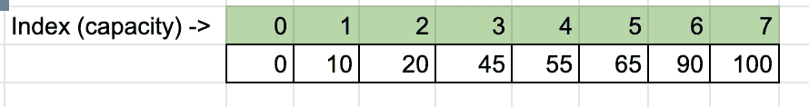

*   每个单元格存储在不超出其自身容量(列)的情况下可以存储的最大项目。
*   例如，在第 3 列，项目数= noOfItems[当前重量]+DP[剩余重量]

> 密码

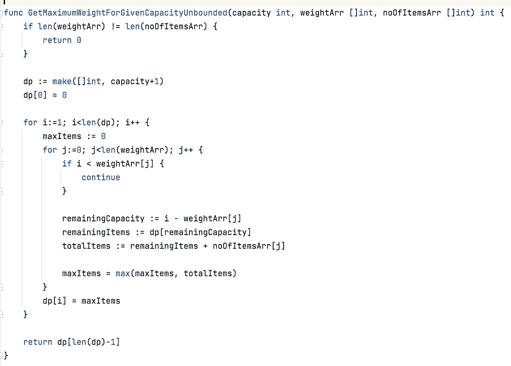

> 试验

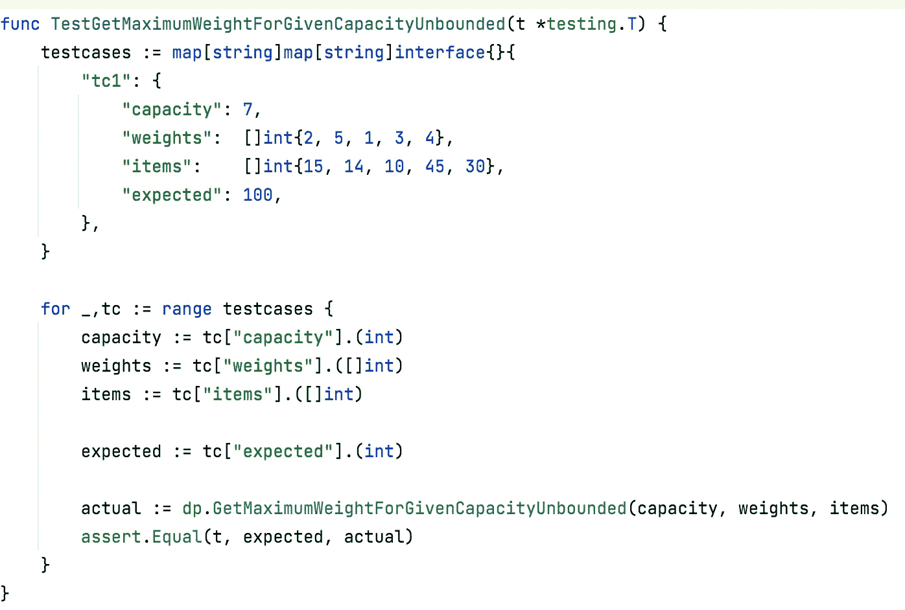

请尝试用递归方法解决问题 2，并与 DP 方法进行比较，并分享您的发现。

朋友们，如果你喜欢我的内容，你会考虑关注我的链接吗:[https://www.linkedin.com/in/hitesh-pattanayak-52290b160/](https://www.linkedin.com/in/hitesh-pattanayak-52290b160/)