# Go #8 中的动态编程:CountBinaryStrings count encodings 和 CountBuildings

> 原文：<https://blog.devgenius.io/dynamic-programming-in-go-8-countbinarystrings-countencodings-and-countbuildings-3eeb6b023e39?source=collection_archive---------5----------------------->

在这篇文章中，我们将解决 3 个问题。

这是我们“Go 中的动态编程”系列的继续。

> 问题 1:计算二进制字符串

有多少个字符串可以使用 1 和 0，这样两个连续的位置可以为零。

**例子**

长度:5

答案:21

预期的组合:["01010 "，" 01110 "，" 01111 "，" 10101"…。]

**解决方案**

初始差压

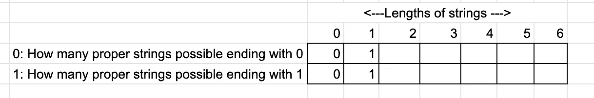

*   我们采用了一个 2D 数组，其中第一行是“以 0 结尾的字符串”，第二行是“以 1 结尾的字符串”。所有的字符串必须遵循不能有两个连续的 0 的规则。
*   此外，两个不同的阵列也可用于此目的。
*   例如,“0110”和“1110”是第一行和第四列唯一可能的组合，那么条目将是 2。
*   类似地，“0111”、“0101”是第二行和第四列唯一可能的组合，那么条目将是 2。

最终差压

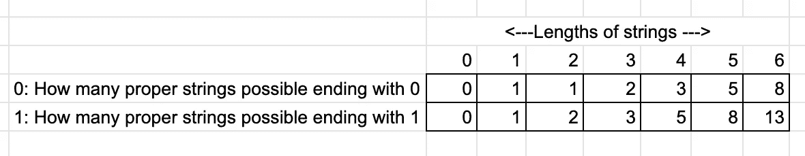

> 问题 1:代码和测试

而不是使用 2 个数组(一个数组代表 0，另一个代表 1)或使用 2D 数组。我们可以只用 4 个变量。2 个变量用于 0 和 1 的先前状态，另外 2 个变量用于 0 和 1 的当前状态。

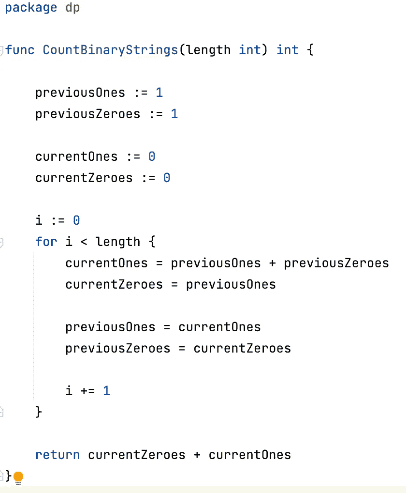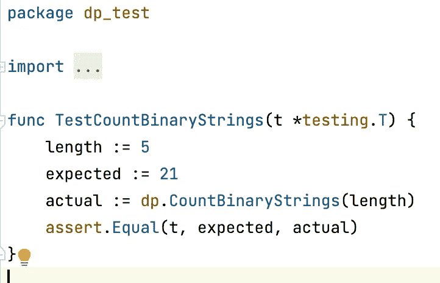

> 问题 2:排列建筑物

给定每边有给定数量街区的道路的数量，没有两个连续街区有建筑物的情况下，有多少个建筑物是可能的。

**举例**

道路:1

块数:5

可能的组合数量:441

“b”代表“建筑物”。

s 代表空格。

**解决方案**

这可以认为是问题 1 的延伸。我们可以把“建筑”表示为 0，把“空间”表示为 1。然后对道路的每一侧分别进行与问题 1 相似的解决方案。

> 问题 2:代码和测试

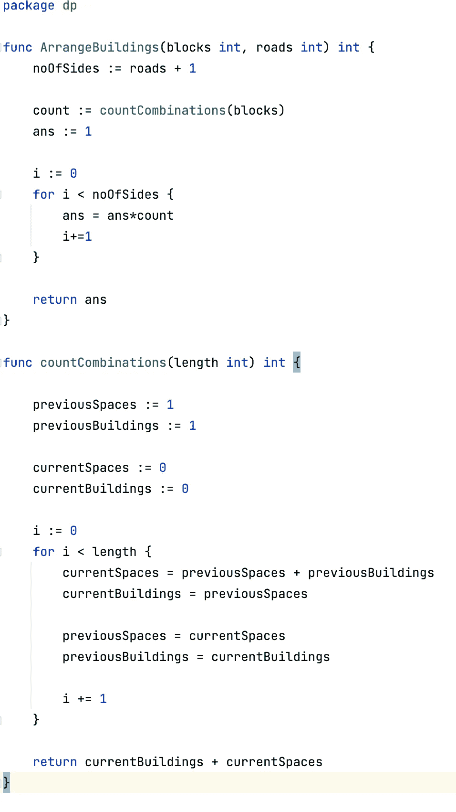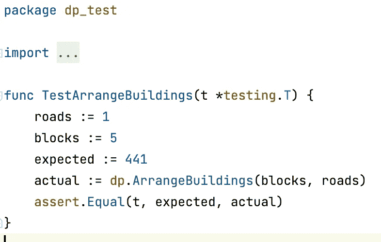

> 问题 3:计数编码

给定一个代码，找出所有可能的编码。

**例子**

**代码:** 231011

**编码计数:** 4

**编码地图:**

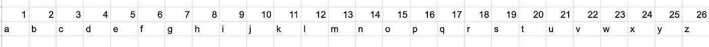

**解决方案**

初始差压

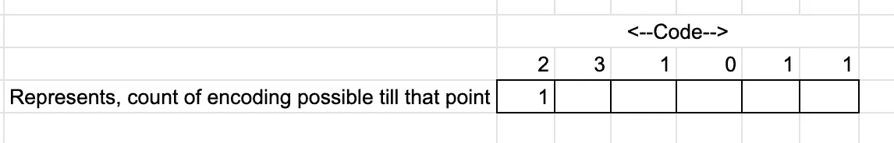

*   我们采用了一个数组，其中每个单元存储了到该点为止可能的编码计数。
*   例如，在“2”处，只有一种编码可能是“b”(对于 2)。
*   如果我们向前看，在“3”处，两种编码是可能的“bc”(对于 2 和 3)和“w”(对于 23)。

最终差压

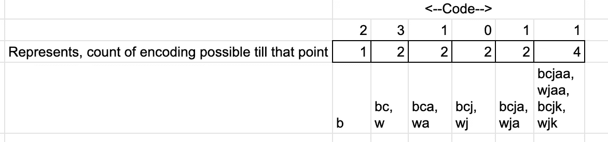

> 问题 3:代码和测试

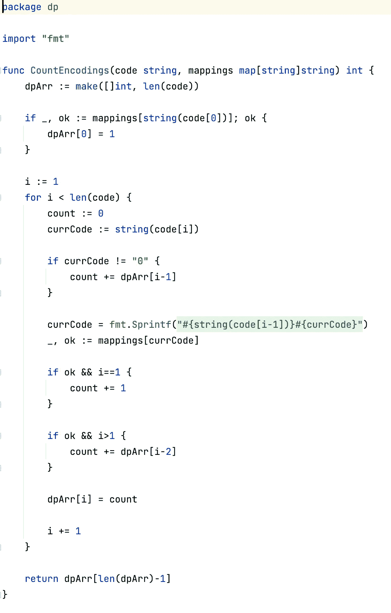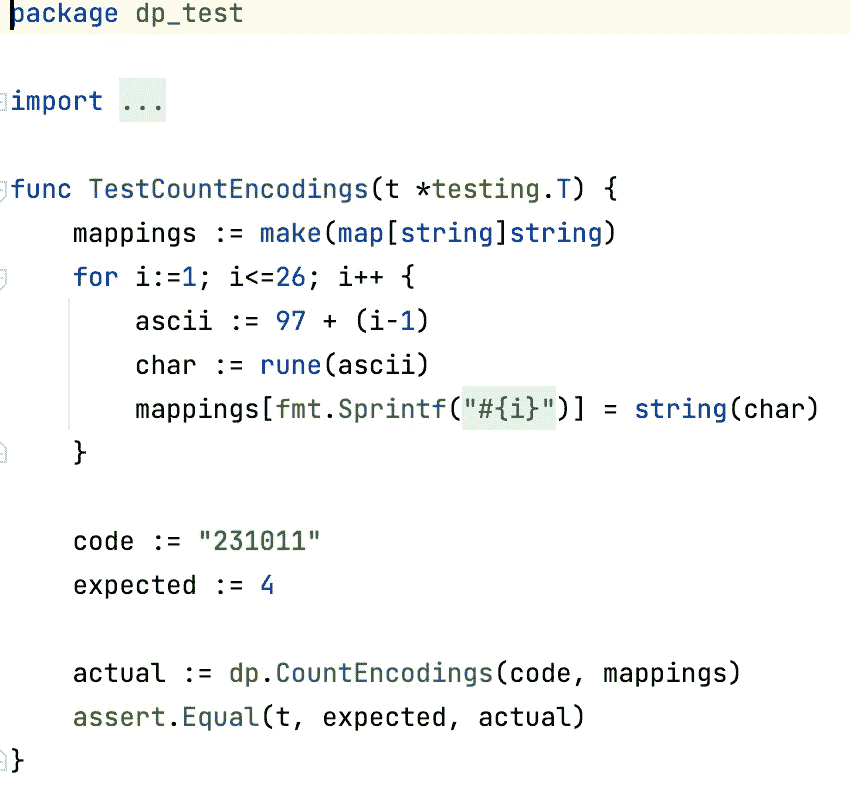

我想重申，为了解决动态编程中的问题，需要三个步骤:

1.  存储和含义:每个单元格的值代表什么。
2.  方向:你想从哪个方向解决。总是朝着“更容易”到“更难”的方向前进。较容易通常表示输入数量最少的像元。利用较简单的单元格来计算较难的单元格。
3.  遍历并求解。

朋友们，如果你喜欢我的内容，你会考虑关注我的链接吗:[https://www.linkedin.com/in/hitesh-pattanayak-52290b160/](https://www.linkedin.com/in/hitesh-pattanayak-52290b160/)