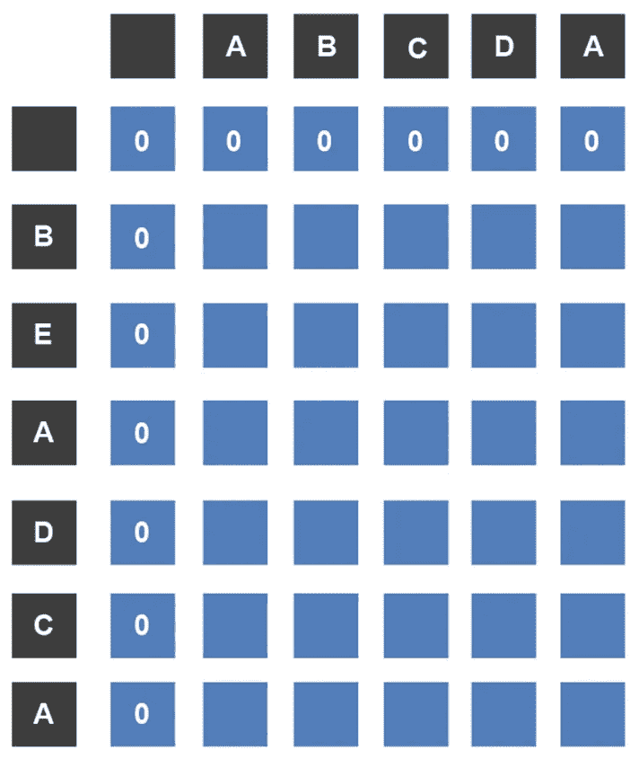
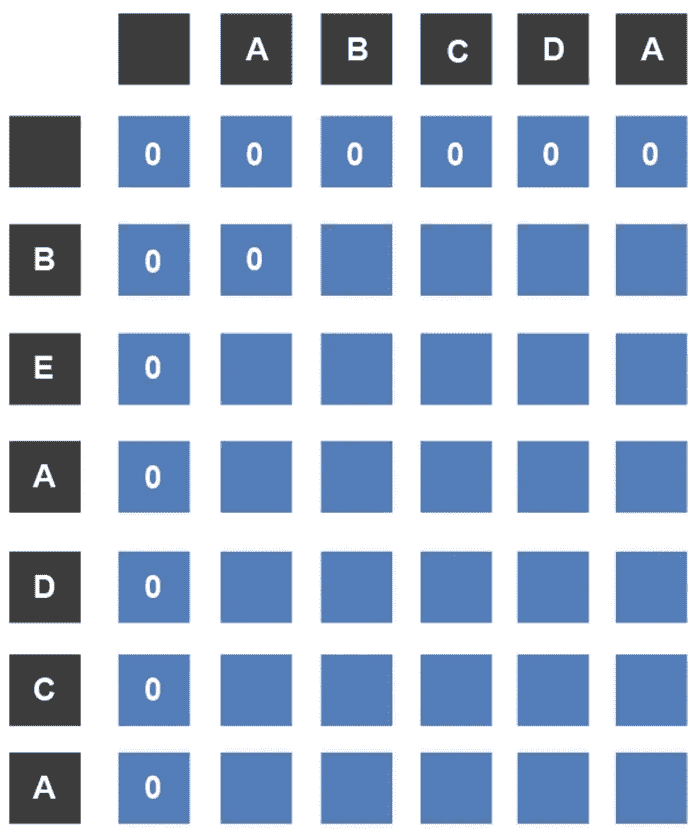
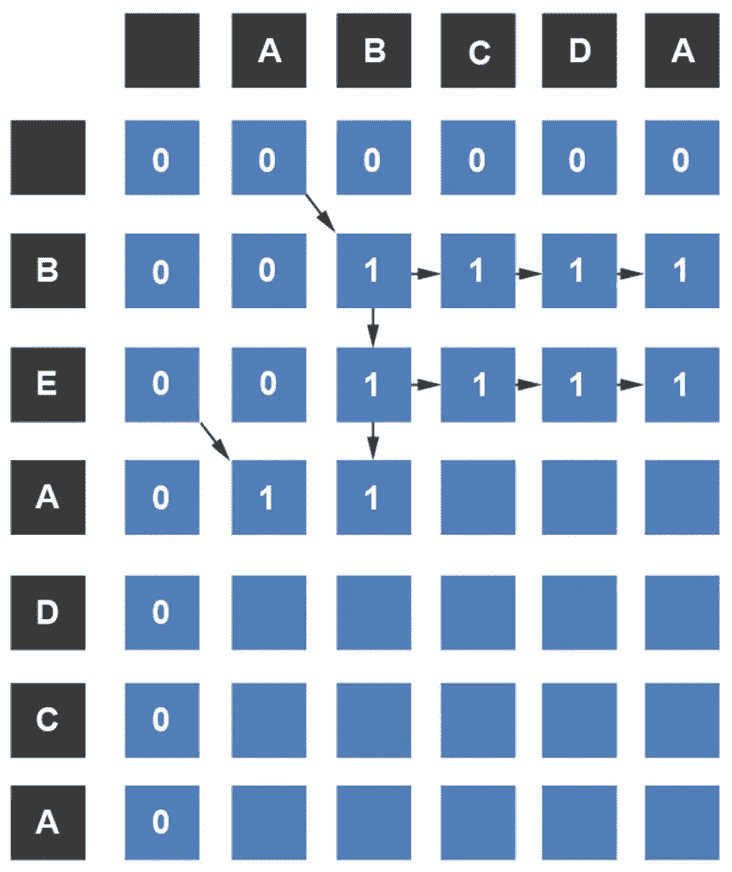
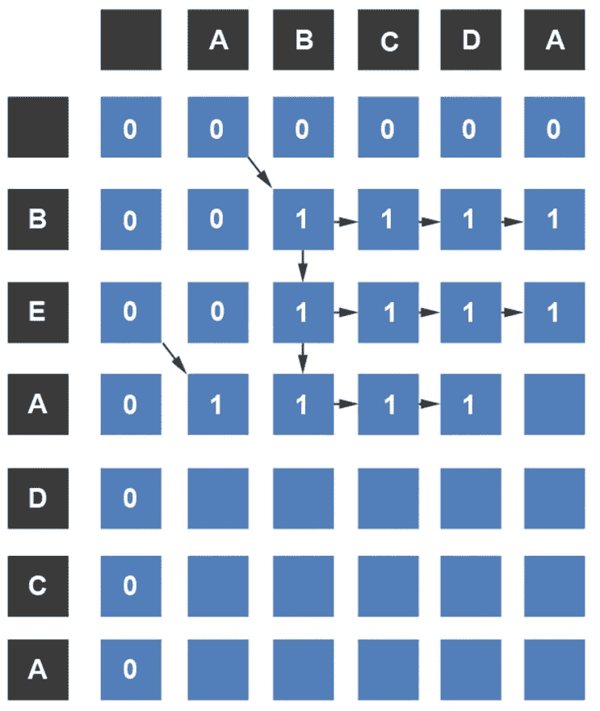
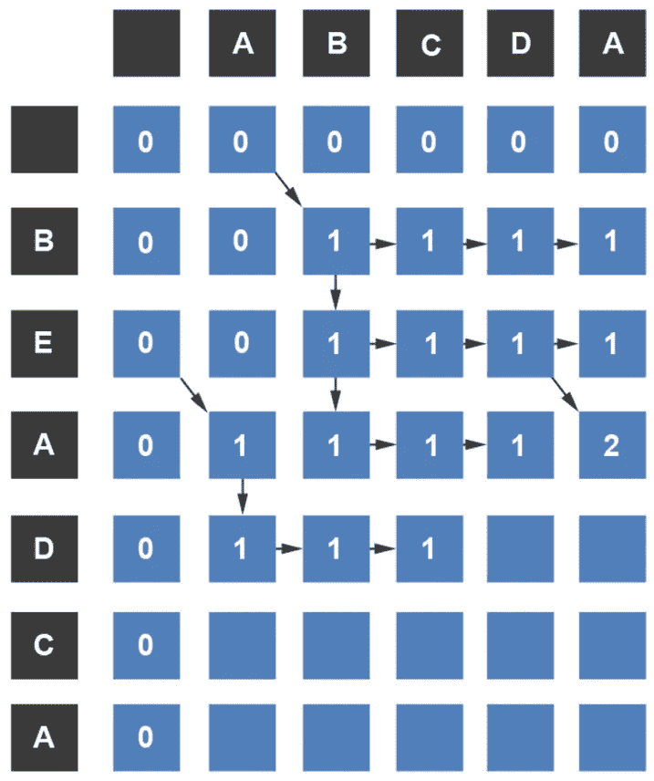
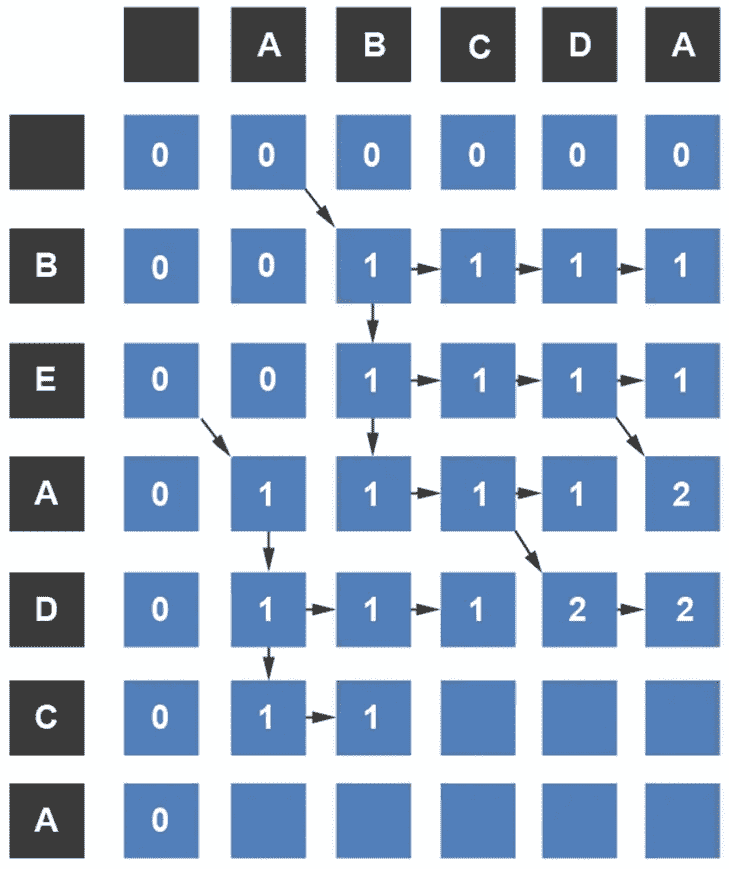
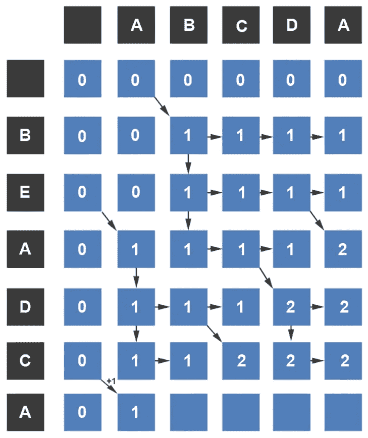
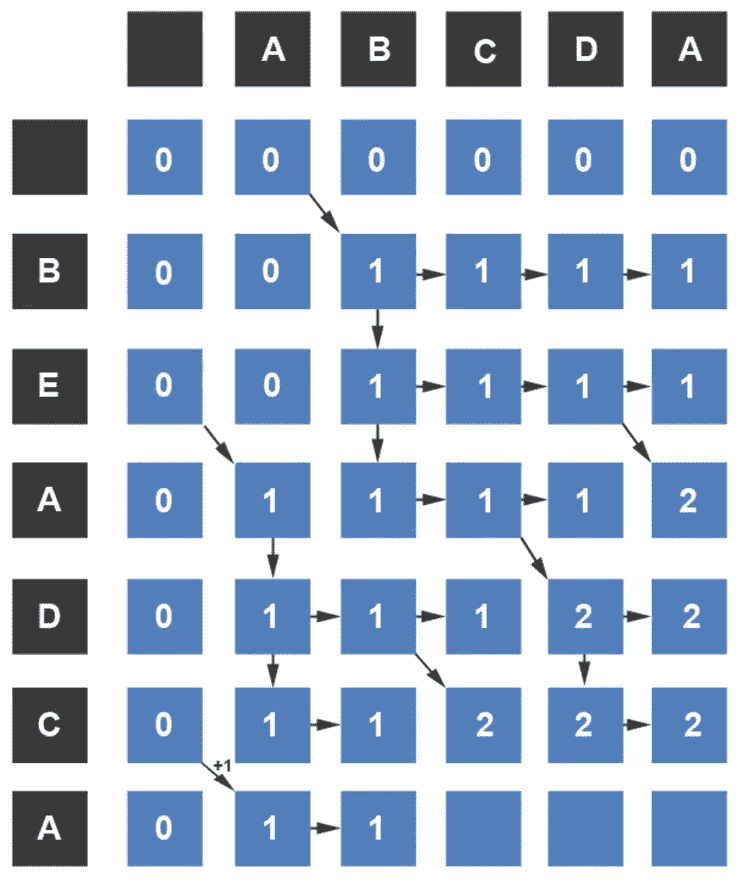
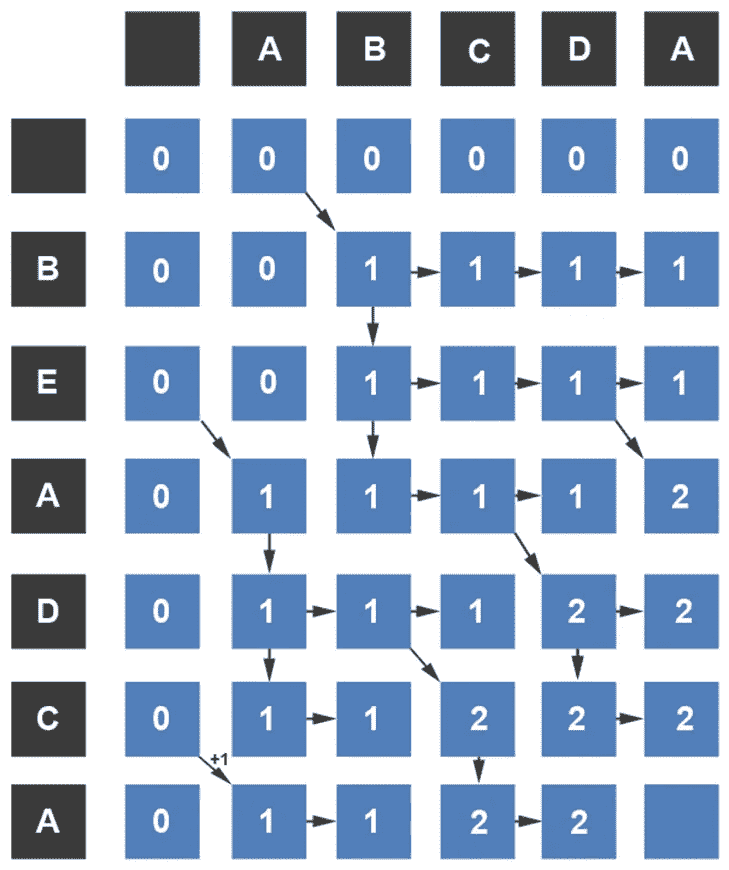
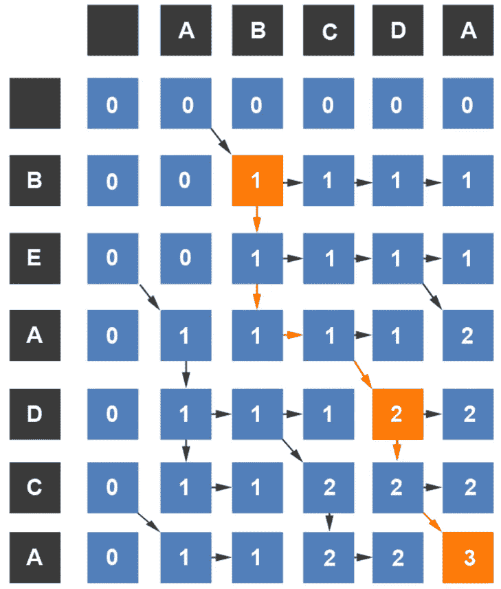

# 动态编程:最长公共子序列直观解释

> 原文：<https://blog.devgenius.io/dynamic-programming-longest-common-subsequence-visually-explained-95e70ef71046?source=collection_archive---------12----------------------->

计算机科学中出现的另一类问题是寻找最长的公共子序列。如果有以下字符串，BEADCA 和 ABCDA，最长的公共子序列是什么？你可能会很快发现这两个字符串的最长公共子序列是 BDA。可能有多个长度相等的子序列可以工作。让我们看看如何在这个问题中找到最长的公共子序列。

我们从构造一个矩阵开始。一个序列放在矩阵的顶部，另一个放在左侧。对于每个行/列匹配，我们将输入 1。如果没有匹配，我们将输入一个零，除非相邻的单元格已经大于零，在这种情况下，我们输入该值。对于相邻单元格已经大于 1 的所有其他匹配，新单元格将加 1。让我们看看实际情况是怎样的。

我们将从用零填充第一行和第一列开始。

然后，我们从第一行 B 开始。行 B 与列 a 进行比较。因为没有匹配，所以为该点输入零。

下一个比较是在行 B 和列 B 之间。由于它们匹配，我们将添加值 1，该值是从单元格(_，A)的添加的**。**

当比较 B 行和 c 列时，我们发现没有匹配。我们从单元格(B，B)中取出 1。

类似地，我们将 1 从单元格(B，C)携带到单元格(B，D)和单元格(B，A)。

我们移到第二排。对于 E 行，我们将其与第一列进行比较。因为它们不相同，所以我们为该单元格输入零。我们移动到 B 列。即使没有匹配，我们也可以从单元格(B，B)中取出 1。

因为没有其他列值与行 E 匹配，所以我们可以将 1 带入下一行。

我们向下移动到行 A。行 A 和列 A 是相同的，所以我们在单元格(A，A)中输入 1。

继续向前，下一个值不匹配:A 不匹配 b。但是，我们可以从上往下取 1。

行 A 与 C 或 D 都不匹配，所以我们将把 1 从单元格(A，B)移到这些单元格中。

最后一个单元格匹配。我们将在左上角的单元格(E，D)中添加 1，并在单元格(A，A)中输入新值 2。

我们移到下一排。D 行与第一列不匹配，所以我们只把 1 取下来。它与接下来的两列也没有匹配，所以我们将把 1 从单元格(D，A)移到单元格(D，B)和(D，C)。

D 行与 D 列匹配，所以我们将在左上角的单元格(A，C)中加 1。每当有一个匹配，你总是会增加 1 到左上角的单元格，并将其插入到新的单元格。这些转换将帮助您创建最长的公共子序列。

D 行与 A 列不匹配，所以我们将把最大值移到它的位置。

移至行 C，第一个单元格的值为 1，因为这是它们周围的最大值。A 列与 c 行不匹配。

下一个单元格匹配，所以我们将位于左上角单元格中的值加 1，并将其添加到新单元格中。

接下来的两个单元格不匹配，所以我们只将最大值移入这些单元格。当我们完成这个表时，我们将解释为什么我们从单元格(C，D)的上面移动，而从单元格(C，A)的左边移动。现在，只要知道我们正试图获得尽可能长的路径。

在最后一行，A 与列 A 匹配，所以我们将在左上角的单元格中加 1，并将该值插入新的单元格中。

对于单元格(A，B ),我们将把最大值移入其中。

单元格(A，C)的上方比其左侧包含一个更大的值，所以我们将把这个更大的值从上方移入其中。根据经验，如果左边的值与上面的值相同，则从上面移动该值。这并不意味着你不应该考虑来自左边的其他路径。可能是一个相等大小的子序列来自左边。

下一个单元格的行与列值不匹配，所以我们将把它周围的最大值移到新的单元格中。

最后，最后一个单元格的行和列值匹配，所以我们将在左上角的单元格中加 1，并在那里输入新值。

我们知道最大的公共子序列将包含 3 个字母，所以我们将尝试沿着路径向上，从最后一个过渡单元格(从左上角单元格添加了 1 的单元格)开始，并查看这些值将会是什么。

我们可以很快看到最长的公共子序列是 B，D，a。

*如果你喜欢你所读的，看看我的书，***算法说明性介绍。**

**

*迪诺·卡伊奇目前是 [LSBio(生命周期生物科学公司)](https://www.lsbio.com/)、[绝对抗体](https://absoluteantibody.com/)、 [Kerafast](https://www.kerafast.com/) 、[珠穆朗玛生物](https://everestbiotech.com/)、[北欧 MUbio](https://www.nordicmubio.com/) 和 [Exalpha](https://www.exalpha.com/) 的 IT 主管。他还担任我的自动系统的首席执行官。他有十多年的软件工程经验。他拥有计算机科学学士学位，辅修生物学。他的背景包括创建企业级电子商务应用程序、执行基于研究的软件开发，以及通过写作促进知识的传播。*

*你可以在 [LinkedIn](https://www.linkedin.com/in/dinocajic/) 上联系他，在 [Instagram](https://instagram.com/think.dino) 上关注他，或者[订阅他的媒体出版物](https://dinocajic.medium.com/subscribe)。*

*[*阅读迪诺·卡吉克(以及媒体上成千上万其他作家)的每一个故事。你的会员费直接支持迪诺·卡吉克和你阅读的其他作家。你也可以在媒体上看到所有的故事。*](https://dinocajic.medium.com/membership)*