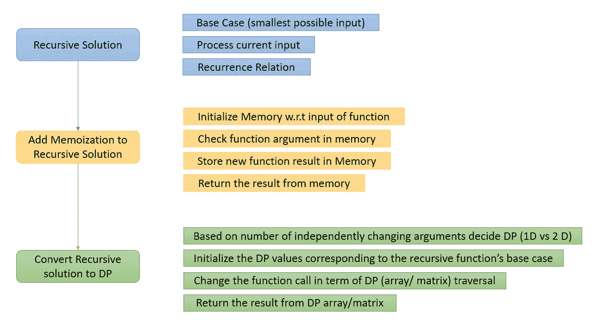

# 动态规划——解决动态规划问题的策略

> 原文：<https://blog.devgenius.io/dynamic-programming-strategy-to-approach-a-dp-question-f0f27f5e6b22?source=collection_archive---------7----------------------->


[哈迪贾·赛义迪](https://unsplash.com/@hadijasaidi?utm_source=unsplash&utm_medium=referral&utm_content=creditCopyText)在 [Unsplash](https://unsplash.com/s/photos/past?utm_source=unsplash&utm_medium=referral&utm_content=creditCopyText) 拍摄的照片

动态编程是对递归的增强！！！

> DP ==递归+记忆(自上而下)或列表(自下而上)

## 识别 DP

寻找像最大、最小、路数或最优这样的关键词。另一个暗示是，我们在每一步都有不同的选择。然后寻找这个问题的答案，给定的问题是优化问题吗？

**最优子结构—** 给定问题具有最优子结构性质，如果利用其子问题的最优解可以得到给定问题的最优解。假设我们要寻找从 ***源*** 到 ***目的*** 的最短路径。让**通过**成为*和 ***源*** 之间的中间点，用**单边**连接到**源**。但是我们有从**经过**到**目的地的多条路径。**在这种情况下`shortest(source, destination) = min(Source → Via + min(Via → Destination))`。*

***重叠子问题—** 动态规划将反复需要的子问题的解组合起来。DP 存储子问题的结果以避免重复计算。*

*一旦发现问题，请采取以下步骤:*

1.  *想象这个问题*
2.  *查找子问题(后缀、前缀、子串)*
3.  *找出子问题之间的关系*
4.  *概括关系*
5.  *实现子问题的顺序*

*一旦你收集了观察结果，使用下面的框架来解决问题。*

**

*解决动态规划问题的框架*

*让我们带着一个问题去理解上面讨论的整个过程。*

## *爬楼梯*

*你正在爬楼梯。需要 n 步才能到达顶端。每次你可以爬 1 或 2 级台阶。你有多少种不同的方式可以爬到顶端？*

## *解决动态规划问题的框架*

*1.定义目标函数*

*   *f(n)是到达第 n 级楼梯的不同方式的数量。*

*2.确定最小有效输入的基本情况*

```
*f(0) = 1
f(1) = 1
f(2) = 2 # f(2) can be caluculated from f(0) and f(1) as well. I have taken this just for more clarity.* 
```

*3.写下目标函数的递归关系。*

```
*f(n) = f(n-1) + f(n-2)*
```

**注意:在递归中，我们一般会在每次后续的函数调用中减少输入空间。这里我们减少 n，如果我们有一个数组，我们可以通过增加索引(从左到右)或减少索引(从右到左)来减少数组的大小。**

*4.执行的顺序是什么？*

```
*n → n-1 → n-2 … 1 → 0*
```

*5.去哪里寻找答案？*

```
*f(n)*
```

## *递归解*

```
*class Solution:
    def climbStairs(self, n):
        return self.cs_helper(n)

    def cs_helper(self, n): 
        if n == 0: 
           return 0
        if n == 1:
           return  1
        if n == 2:
           return 2

        return self.cs_helper(n - 1) + self.cs_helper(n - 2)*
```

## *递归+记忆*

> *那些记不起过去的人，注定会重复过去。*

*我们使用一个数组来存储计算参数的结果，而不是用同一个参数反复调用函数。*

```
*class Solution:
    def climbStairs(self, n):
        memo = [None for i in range(n + 1)]
        return self.cs_helper(n, memo)

    def cs_helper(self,n,memo):
        if memo[n] is not None:
            return memo[n] 
        if n == 0: 
           return 0
        if n == 1:
            result =  1
        if n == 2:
            result = 2
        else:
            result = self.cs_helper(n - 1, memo) + self.cs_helper(n - 2, memo)
            memo[n] = result
        return result*
```

**注意:你不需要实现递归函数，你可以简单地提出一个递归数学函数，找到它的状态，然后继续创建状态度量/数组。**

*一旦我们有了自上而下的解决方案，我们就可以把它转换成列表解决方案。*

## *自下而上/制表*

*现在我们按照这个框架，把递归解转换成线性解。由于基本情况我们使用 0，1 和 2 秒步骤，我们用值 0，1，2 初始化 dp[0]，dp[1]和 dp[2]。函数调用改为 dp[n]赋值，使用最后两个位置(dp[n-1] & dp[n-2])作为查找得到答案。*

```
*class Solution:
    def climbStairs(self, n):
        dp = [0] * (n+1)
        dp[0], dp[1], dp[2] = 0, 1, 2
        for i in range(3, n+1):
            dp[i] = dp[i-1] + dp[i-2]
        return dp[n]*
```

*在上面的解决方案中，我们使用的顺序是 0 → 1 →2 →3… →n-1 →n。*

## *动态规划中的空间优化*

*因为在每个索引中，我们只寻找最后两个值，所以我们可以删除 DP 数组，只使用两个变量来得到结果。*

```
*class Solution:
    def climbStairs(self, n):
        first = 1
        second = 1
        for i in range(2, n+1):
            res = first+second
            first, second = second, res
        return second*
```

***自顶向下&自底向上**方法的主要区别在于后一种方法计算所有的解，而前一种方法只计算那些需要的解。在自下而上的方法(制表)中，我们可以优化空间复杂度，这在递归解决方案中是不可能的。*

> ****时间复杂度= O(状态数∫计算一个状态所需时间)****

*   *自底向上通常更快，因为递归有相当大的计算成本。*
*   *在有许多从未计算过的表状态的情况下，自顶向下更快。*

*编码快乐！！！*