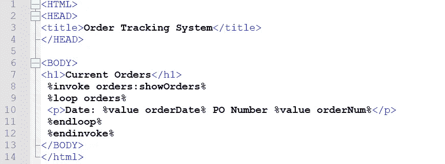
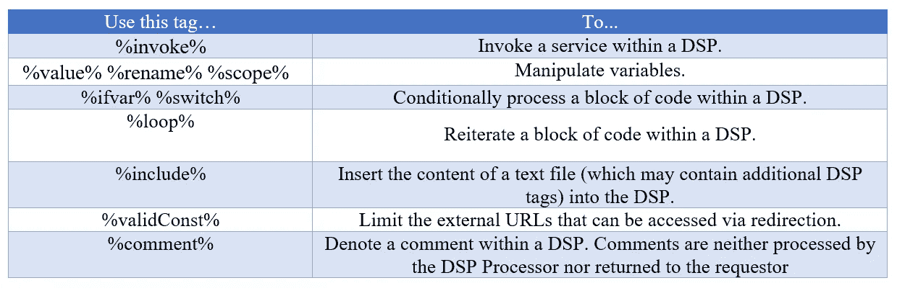

# webMethods 上的动态服务器页面(DSP)带有演示。

> 原文：<https://blog.devgenius.io/dynamic-server-pages-dsp-on-webmethods-is-with-demo-47636949e736?source=collection_archive---------5----------------------->

首先，我将详细解释一下:

*   什么动态服务器页面(DSP)。
*   DSP 长什么样？
*   你什么时候使用 DSP？
*   使用 DSP 有什么好处？
*   如何创建 DSP？
*   如何发布 DSP？
*   如何使用 DSP 标签？

# **什么动态服务器页面(DSP)。**

动态服务器页面 **(DSP)** 是一个嵌入了特殊代码(标签)的文档，这些代码指示 webMethods Integration Server 在 HTTP(或 HTTPS)客户端请求该文档时执行某些操作。DSP 用于构建基于浏览器的应用。因为它们是基于 HTML 的，所以可以用来构建复杂的用户界面，其中包括客户端浏览器可以识别的任何有效结构(例如，表单、级联样式表、JavaScript)。

# **DSP 长什么样？**

DSP 看起来就像一个普通的 HTML 文档，它包含附加的标签，这些标签包含在 ***%*** 符号中(例如， **%loop%** )。当客户端请求 DSP 时，集成服务器执行标签指定的操作，并在返回给客户端的文档中替换该操作的结果(基于标签的规则)。

> **注意:**
> DSP 标签从不发送给客户端；客户端只接收标签的结果。

下面是一个非常基础的 DSP 的例子(**标签**为粗体)。在这个例子中，DSP 通过 **%invoke%** 标签调用服务。 **%loop% … %endloop%** 块遍历服务返回的文档(称为订单)列表，并将结果插入到 HTML 文档中。

基本 DSP 示例

# 你什么时候使用 DSP？

DSP 用于构建基于浏览器的客户端(即使用 web 浏览器检索文档的客户端)。它们允许您构建一个比直接从浏览器调用服务更安全、更灵活的用户界面。
web methods Integration Server Administrator 是一个可以用 DSP 创建用户界面类型的好例子。该应用的接口完全由 DSP 组成。你可能想参考它的设计思想和如何使用特殊标签的例子。检查构成服务器用户界面的 DSP。

# 使用 DSP 有什么好处？

与使用 URL 直接调用服务相比，DSP 有几个优点:

1.  它们对用户隐藏了调用机制和服务名。
2.  它们为您提供了更改服务名称或用另一个服务替换一个服务的灵活性，而无需更改最终用户调用服务的方式。(用户总是调用同一个 DSP，您可以根据需要更改其内容。)
3.  它们很容易更新和扩展。
4.  它们允许您通过一个请求执行多个服务。

# 如何创建 DSP？

要创建 DSP，您必须使用文本编辑器对其进行编辑，然后将其保存在集成服务器上(*参见下面的*如何发布 DSP)。与输出模板不同，您不能使用服务开发来创建 DSP。

构建 DSP 时，请执行以下操作:

1.  键入您希望它出现在您希望集成服务器返回给客户机的文档中的文字文本。
2.  在您希望其结果出现的位置插入 DSP 标签。关于有效 DSP 标签以及如何使用它们的总结，(*参见下面的*使用 DSP 标签)。
3.  确保您的 HTML 文件包含正确的编码或您使用的编码的元标记，因为这可能会影响集成服务器之外的浏览器或解析器的性能。

> **重要提示:** 确保你创建的文档能够解析成有效的 HTML 文档。
> 
> **注意:**
> 在构建您的 DSP 时，请记住，在运行时，集成服务器将从上到下处理它一次。

# 如何发布 DSP？

要运行 DSP，必须将其发布到集成服务器上。为此，请采取以下常规步骤:

1.  将 DSP 文档保存在一个带有“ ***的文本文件中。dsp*** 扩展。例如**命令。dsp**
2.  将 DSP 文件放在您希望 ***dsp*** 驻留的包的 pub 目录中。例如:
    要在**walmartGetOrdersDetails**包中发布 DSP，您可以将其复制到:
    *Integration Server _ directory/packages/walmartGetOrdersDetails/pub*

# 如何使用 DSP 标签？

要开发一个 DSP，您需要在希望显示标签结果的地方嵌入 DSP 标签。下面是一些可用于构建 DSP 的标签的总结。有关每个标签的完整描述:

部分 DSP 标签概述

> **重要:** DSP 标签区分大小写。在您的 DSP 中，您必须完全按照如下所示键入它们(例如，键入 **%loop%** ，而不是 **%LOOP%** )。
> 
> **注:** 当客户端通过 HTTP 或 HTTPS 请求 DSP 时，集成服务器会自动解析标签。

# 动态服务器页面(DSP)演示。