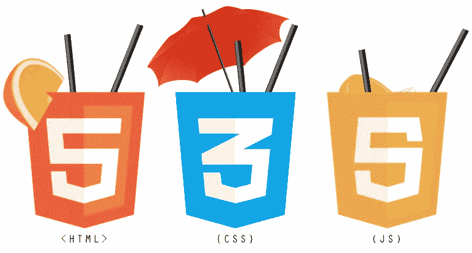

# 香草 JS 中的动态样式

> 原文：<https://blog.devgenius.io/dynamic-styling-in-vanilla-js-bcf68b55582a?source=collection_archive---------1----------------------->



香草 JS

样式在前端开发中是一个非常有用的概念，实现这一点的一种方法是给 HTML 标签分配类名和 id，并在外部样式表中给它们一些 CSS 属性。

在真实的 web 开发场景中，元素的属性可能需要动态地改变，一个很好的例子就是你在网页上看到的深色和浅色主题。

# 动态样式的工作原理

动态样式改变 DOM 元素的 CSS 属性，而无需手动操作。我们实现这一点的方法之一是使用 JavaScript。

使用 Javascript，我们可以动态地改变类名、id 和 DOM 元素的任何其他属性

*我们来编码吧！*

创建一个文件夹 *dynamicstyle* 并添加以下文件

a.index.html

b.index.css

c.索引. js

在 index.html 中，创建一个空的 div 元素和一个 button 元素

```
...
 <div></div>
<button>Change Color</button>
...
```

不要忘记链接你的 CSS 文件，使用:

```
<link href="index.css" rel="stylesheet" />
```

在 index.css 文件中创建带有已定义属性的类名，我们将动态地将这些属性添加到 dom 元素中(在本例中是 div 标记)。

```
div {
width: 4rem;
height: 4rem;
background: yellow;
}.*rose* {
background: red;
}.*dark* {
background: black;
}
```

我们给了 div 一些初始的 CSS 属性，背景颜色为黄色，宽度和高度均为 4rm。

# 使用 Javascript 的动态样式

此时，使用 HTML 文件底部的 script 标记将 index.js 文件链接到 HTML 文件，如下所示

```
...
<script src="index.js"></script>
</body>
</html>
```

现在，在 Javascript 文件中添加以下代码，以更改单击和双击按钮时的背景颜色

```
lethtmlDiv= *document.getElementsByTagName*('div')[0]lethtmlBtn= *document.getElementsByTagName*('button')[0]*htmlBtn.addEventListener*('click', function() {*htmlDiv.classList.add*('rose')})*htmlBtn.addEventListener*('dblclick', function() {*htmlDiv.classList.add*('dark')*console.log*('dbl')})
```

我们通过标记名获得了按钮和 div 元素，并将它们分配给变量 *htmlBtn* 和 *htmlDiv* ，然后添加了一个事件监听器，在按钮被单击一次和双击时监听。

同样使用 classList 特性，我们可以向 div 元素添加类，这样就可以动态地改变 CSS 属性。

*恭喜你！*

你现在可以用你所拥有的去做很多事情，我会鼓励你多读读，并且在 [Twitter](https://twitter.com/AI_Lift) 、 [Linkedin、](https://www.linkedin.com/in/ndukwearmstrong/)和 [Github](https://github.com/armstrong99) 上关注我

感谢阅读，祝你有美好的一天。