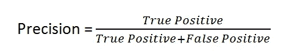
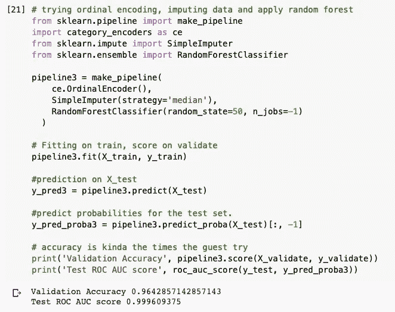
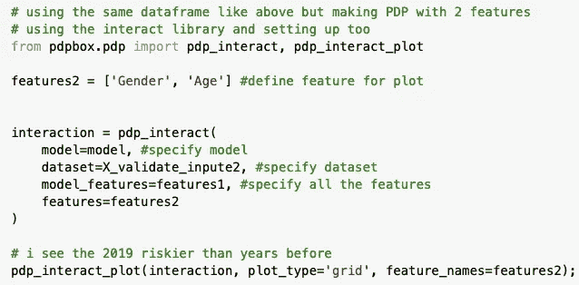

# 早期糖尿病风险预测

> 原文：<https://blog.devgenius.io/early-stage-diabetes-risk-prediction-bd42f113a20b?source=collection_archive---------1----------------------->

使用机器学习

在本帖中，我们将预测并执行早期糖尿病风险预测数据集的评估指标。数据集可以在 [UCI 机器学习库](https://archive.ics.uci.edu/ml/datasets/Early+stage+diabetes+risk+prediction+dataset.#)上找到。糖尿病是一种慢性代谢性疾病，其特征是血糖(或血糖)水平升高，随着时间的推移，会对心脏、血管、眼睛、肾脏和神经造成严重损害。

全世界约有 4.22 亿人患有糖尿病，其中大多数生活在中低收入国家，每年有 160 万人直接死于糖尿病。在过去的几十年里，糖尿病的病例数和患病率一直在稳步上升。

数据集有 17 列和 520 行，我们将使用以下分类模型及其指标得分:

*   逻辑回归
*   决策图表
*   随机森林分类器
*   XGBoost 分类器

我们开始吧！！！

# 处理数据

我需要将数据分割两次，这是训练/验证/测试随机分割的简单方法

# 从基线开始

“类”是我们要预测的特征，它有正负两个值。

这是基线准确性分数，让我们使用分类模型来提高分数。

# 逻辑回归模型

逻辑回归是最常见的分类算法之一。

让我们继续尝试用更多的模型来提高分数

验证准确度:0.91%

测试 ROC AUC : 0.98%

# 逻辑回归模型的混淆矩阵图

这就是混乱矩阵的样子

现在，让我们理解 TP、TN、FP、FN 在这个矩阵中表示什么:

*   **真阳性(TP):** 这些是我们预测是的病例(他们有疾病)，他们确实有疾病。
*   **真阴性(TN):** 我们预测没有，他们没有这种病。
*   假阳性(FP): 我们预测是的，但他们实际上并没有患病。(也称为“第一类错误”)
*   **假阴性(FN):** 我们预测没有，但他们确实有疾病。(也称为“第二类错误”)

# 使用逻辑回归模型的分类报告

让我们看看分类报告是如何工作的

**精度:**定义为真阳性数(TP)除以真阳性数加上假阳性数(FP)。

**召回:**定义为真阳性数(TP)除以真阳性数加上假阴性数(FN)。

**F1-score:** 是精度和召回率的调和平均值。

# 排列重要性

****排列** **特征** **重要性:**定义为单个特征值被随机打乱 1 时模型得分的减少。该过程打破了特征和目标之间的关系，因此模型分数的下降指示了模型对特征的依赖程度。**

# **决策树模型**

****

****分类** **准确率** **评分:**是我们的起点。它是做出正确预测的次数除以做出预测的总次数，再乘以 100 得到一个百分比。**

**在这个模型中，验证准确度分数增加了 0.06%**

**但是测试 ROC AUC 分数降低:0.012**

# **基于决策树模型的混淆矩阵图**

****

# **决策树模型分类报告**

****

# **可视化决策树模型**

********

# **用决策树模型可视化特征重要性**

********

# **随机森林模型**

****

****AUC** 为 **ROC 曲线**下的面积。这个**分数**给了我们一个模型表现如何的好主意。**

**AUC ROC 是任何分类模型性能的最重要的评价指标之一。**

**在这种情况下，准确率下降了 0.0087%**

**但 ROC AUC 得分更高:0.027%**

# **随机森林分类器的混淆矩阵图**

****

# **随机森林分类器分类报告**

****

# **部分相关图，1 使用随机森林分类器的特征隔离**

************

****部分依赖图:**(简称 **PDP** **图**)显示了一个或两个特征对机器学习模型的预测结果的边际效应。部分相关性图可以显示目标和特征之间的关系是线性的、单调的还是更复杂的。**

# **部分相关图，使用随机森林分类器的两个特征交互**

****

**看起来一种性别患糖尿病的几率比另一种高得多**

****

# **XGBoost 分类器模型**

# **Shapley 图解释使用其索引号或使用 XgBoost 的行号预测倍数**

************

**该图的记录是 103 名患者，看起来预测值为 0.43%，患糖尿病的概率为 0.57%。**

****

**还有更多的东西需要分析，但我会就此打住。这个帖子的代码可以在 [Github](https://github.com/YinmiAlas/early-stage-diabetes-prediction) 上找到。感谢您的阅读！**