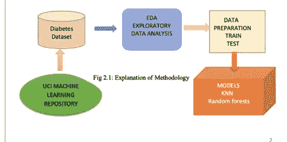
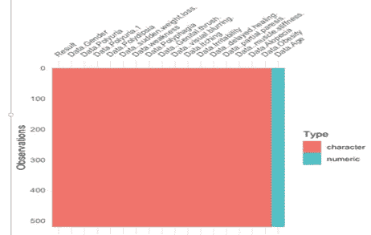
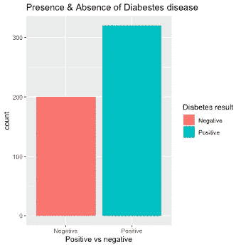
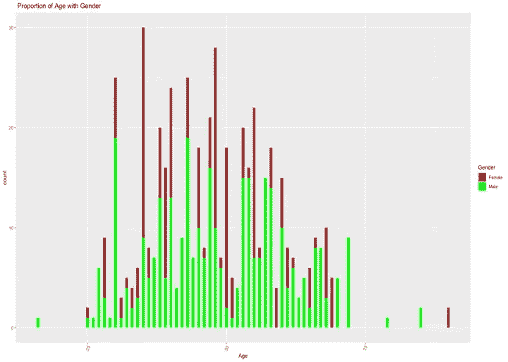
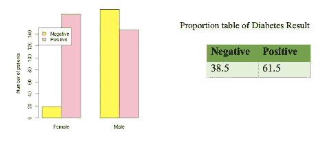
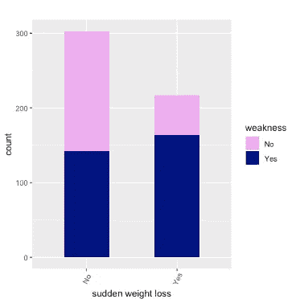
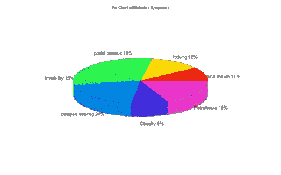

# 早期糖尿病风险预测

> 原文：<https://blog.devgenius.io/early-stage-diabetes-risk-prediction-dataset-69c0221efe5e?source=collection_archive---------6----------------------->

第一部分

# **摘要**

十年来，糖尿病患者急剧增加。糖尿病已经成为一种威胁生命的疾病，其增长背后有几个原因，如不良的生活方式、不活动、病毒感染、肥胖、家族史等。世界卫生组织(世卫组织)报告称，有 4.22 亿人患有糖尿病。因此，诊断糖尿病对于拯救人类生命至关重要。虽然全世界有许多治疗各种疾病的方法。机器学习是一种新的方法，可以帮助疾病预测和诊断。这项研究的目标一直集中在预测糖尿病早期症状的机器学习技术上。为了从这些方法中获得最好的可能结果或时间估计，已经执行了监督学习，例如 KNN 和随机森林。在实现两个模型的同时，还讨论了比较，在 96%的准确度下，随机森林被认为是预测的好模型。模型的准确性由给定数据集的性能来估计。

**1。** **简介:**

糖尿病是一种可导致人体血糖水平升高的代谢性疾病，并且是一种长期疾病。肥胖、不良饮食、高血压、刺激、瘙痒、视觉模糊、虚弱和缺乏锻炼等症状会在人体内引发糖尿病。它主要有两种类型，1 型糖尿病是当身体缺乏胰岛素时，人体需要每天使用胰岛素，也称为胰岛素依赖型，而 2 型糖尿病是当身体不能成功使用胰岛素时，称为非胰岛素依赖型。糖尿病患者也有可能患心脏病、肾病、中风、眼疾和神经损伤。他们中的许多人患有糖尿病，血糖水平高于正常范围，这有时被称为糖尿病前期。此外，随着时间的推移，糖尿病可以影响人体的任何部分，但是，糖尿病的早期检测可能是一个主要的益处，有必要了解如何处理糖尿病并阻止这种可能的并发症。

为了预测和分析数据中隐藏的信息和模式，数据科学在卫生部门发挥着重要作用。机器学习是人工智能和数据科学的一个领域，旨在操纵数据和算法。医疗保健数据集包含结构化和非结构化数据，以减少并发症和发展糖尿病的可能性；机器学习技术和数据挖掘可能是有益的。

然而，这项研究侧重于糖尿病数据集上的机器学习监督技术，以预测男性和女性糖尿病的早期阶段。监督技术，如 KNN(K-最近邻)和随机森林应用于检查和早期预测糖尿病。接下来，区分这两个模型，以便从糖尿病数据集中获得最佳结果。

**2。方法:**

糖尿病数据集选自 UCI 机器学习储存库网站。r 语言用于在数据集上执行一些步骤，例如数据探索(探索性数据分析)、数据准备和制作模型，如图 2.1 所示。执行 EDA 以呈现统计摘要和所选数据集的图形表示，确定缺失值是数据集包含的重要部分。在 EDA 步骤之后，需要在执行机器学习模型之前进行数据准备。因此，在数据准备过程中，将执行数据转换，通过使用因子公式将数据集中的字符变量转换为因子。之后，数据集被分为两类，即训练和测试，以检查模型的准确性。训练用于创建模型，测试检查模型的有效性。我选择了三种机器学习方法来应用于我的数据集。这些是 KNN 和兰登森林预测糖尿病早期症状的方法。这些模型不仅有助于我们深入了解糖尿病，而且有利于如何预防这种疾病。方法步骤如图 2.1 所示

**3。** **数据来源:**

该数据集包括新糖尿病或发展中糖尿病的证据和症状。数据源:

该数据集包括人体中新糖尿病或发展中糖尿病的证据和症状。数据文件已从 UCI 机器学习网站[收集 https://archive-beta . ics . UCI . edu/ml/datasets/early+stage+diabetes+risk+prediction+dataset](https://archive-beta.ics.uci.edu/ml/datasets/early+stage+diabetes+risk+prediction+dataset)。
该糖尿病数据集包含 520 条记录和 17 个属性。其中年龄变量是一个整数，其余的是字符类型。然而，结果变量被认为是显示糖尿病患者结果的因变量，其他变量如症状、年龄和性别是自变量。
作者:正文。数据文件是从 UCI 机器学习网站收集的: [UCI](https://archive.ics.uci.edu/ml/datasets/Early+stage+diabetes+risk+prediction+dataset.)

这个糖尿病数据集包含 520 条记录和 17 个属性。其中年龄变量是一个整数，其余的是字符类型。然而，结果变量被认为是显示糖尿病患者结果的因变量，其他变量如症状、年龄、性别是自变量。

作者:

米（meter 的缩写））m . fani qul Islam 电子邮件

拉哈塔拉·费尔杜西

萨迪库尔·拉赫曼

胡迈拉·亚斯明·布什拉

**4。数据探索(EDA):**

4.1 检查数据集中缺失的值

在缺失数据观察之前，将执行因变量和自变量的选择。结果变量是显示糖尿病患者报告的因变量，其他变量如性别和症状被认为是自变量。

解释

根据上面的观察，visdat 函数用于检查整个数据集是否包含任何缺失值。然而，在 R 脚本中有许多函数可以用来确定缺失值，但是这里使用了 visdat 包。从上面数据集的可视化图中，可以注意到糖尿病数据集不包含任何缺失值。

4.2 糖尿病结果柱状图

解释:

上面的柱状图代表了糖尿病患者的比例。可见，消极的人比积极的人少。300 多人的糖尿病检测结果呈阳性，而 200 人的检测结果呈阴性。

大量积极结果背后的原因可能是适应久坐的生活方式，如缺乏体育锻炼，不良饮食，高胆固醇摄入，食物和不动。其他可以在人体内发展成糖尿病的常见症状有年龄增长、患有多囊卵巢综合征、压力、虚弱、多尿、家族史等等。

4.3 性别因素与年龄和结果变量的分析

解释:

从上面的柱状图和直方图观察可以清楚地看到，男性阳性病例的比例低于女性。

男性患糖尿病的可能性更可能在 50 岁以后或 25 岁至 35 岁的中年时期出现，而女性的身体在 30 岁以后开始患糖尿病，在接近 32 岁时患病的可能性很高。

糖尿病结果表显示了许多阳性和阴性病例。那里大多数人患有糖尿病，女性患糖尿病的频率很高。另一方面，男性比例代表了最大的负面案例。因此，大多数女性对糖尿病的态度比男性积极。

**4.3 人突然体重减轻并伴有虚弱症状的柱状图**

解释:

为了检查糖尿病的早期迹象，选择了两种症状。上图说明了体重突然下降与虚弱症状之间的关系。人们更经常经历体重减轻和虚弱，而如果某人没有体重减轻的症状，那么他/她有虚弱的可能性较小。因此，可以说这两种症状通常被认为是糖尿病发展的早期迹象。

**4.5 糖尿病体征预测饼状图**

解释:

该饼图展示了患者中糖尿病症状的百分比。从上面的饼图可以看出，在糖患者中，延迟愈合、部分轻瘫、易怒和多食的发生率较高。然而，其他症状如肥胖、瘙痒和生殖器鹅口疮不到 15%。但是病人会经历大量的极度饥饿和体内血液循环不良。因此，多食和愈合延迟可能是患糖尿病的风险。

希望会有帮助；)

感谢你的时间；)

想听听你的想法。向我伸出手[这里](https://www.linkedin.com/in/anshita-mehra-b71596197)

如果你想看我的机器学习在这个数据集上的工作，那么请查看 [ML。](https://medium.com/@mehraanshita03/knn-and-random-forests-on-diabetes-data-447cacb727f2)