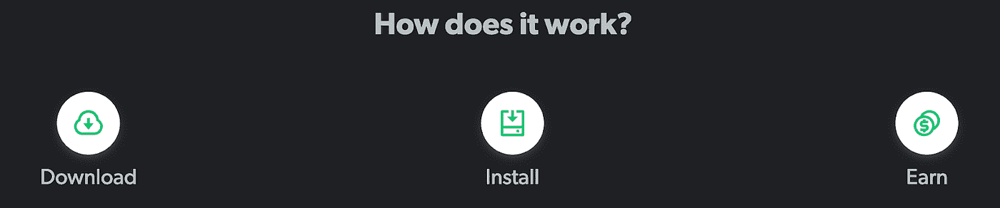
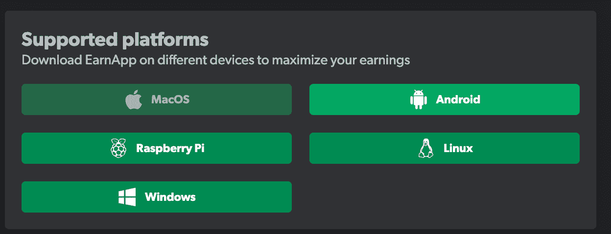
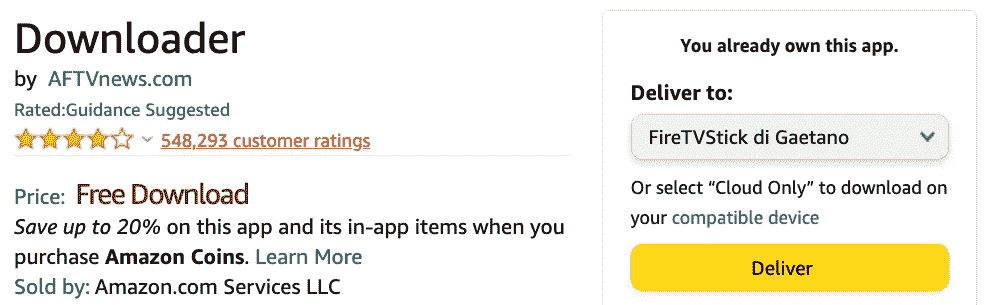
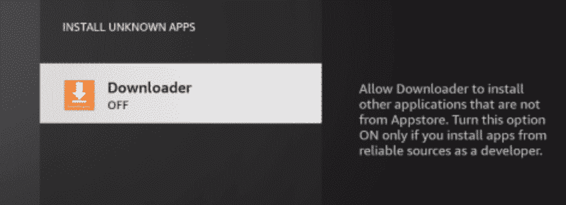
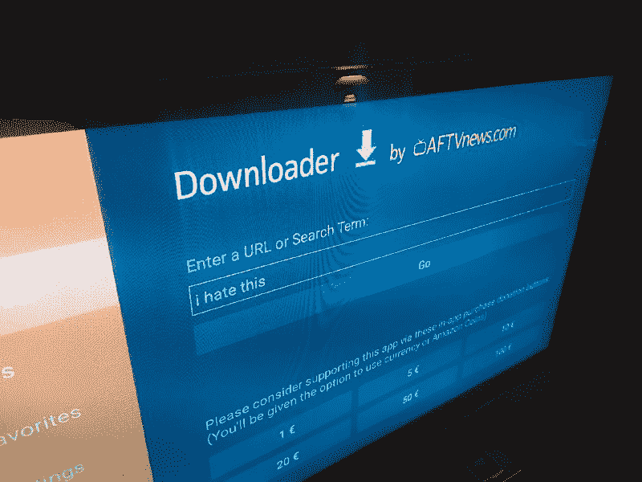
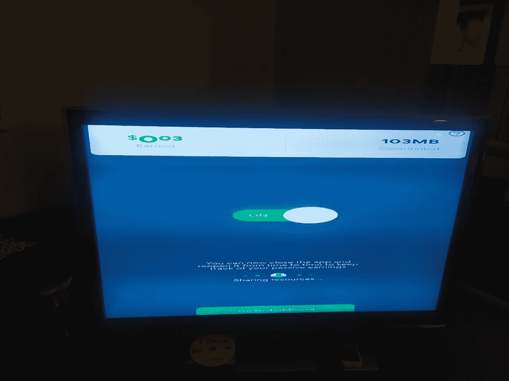
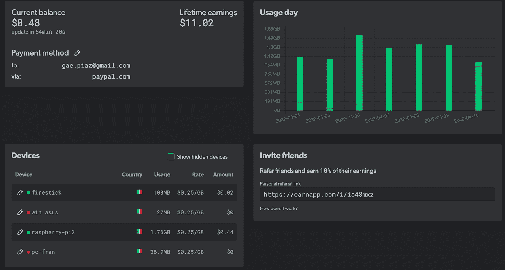
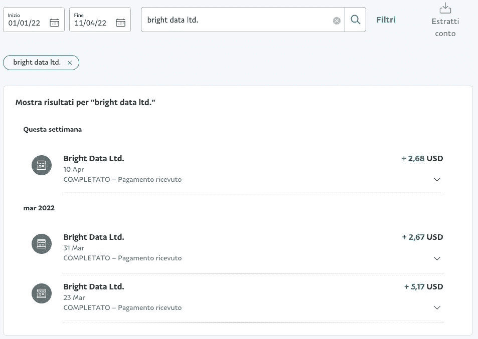
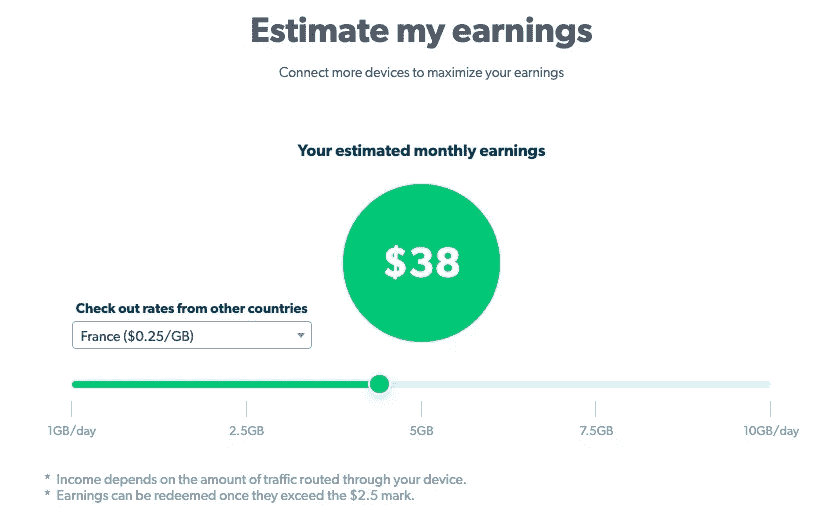

# 用你的火柴赚点啤酒钱

> 原文：<https://blog.devgenius.io/earn-some-beer-money-with-your-firestick-531285bd8fee?source=collection_archive---------14----------------------->

## 啤酒钱:非必要支付的额外费用，可用于购买奢侈品、爱好或一品脱你最喜欢的生啤酒。


利害攸关的等式其实很简单。

[Earnapp](https://earnapp.com/i/is48mxz) 是一个工具，通过从静止的设备上分享一点点你未使用的网络来赚取被动收入。亚马逊 Firestick 通常一直开着，并连接到互联网。Earnapp 为 Android 设备提供了一个 APK 安装程序。Fire OS 是 Android OS 的一个分支，可以在上面安装第三方 app。



通过分享一点你的人际网络来赚钱。别担心，很安全。

在这个简短的教程中，我们将了解如何在 Firestick 上安装和配置 Earnapp。

首先，我们必须使用谷歌账户在 Earnapp 上注册。如果你通过[这个链接](https://earnapp.com/i/is48mxz)注册，我将获得你总收入的 10%，而你不会有任何损失。如果你不想对我好，就去 earnapp.com 创建一个新账户。

一旦您获得了对仪表板的访问权限，您将看到一系列适用于各种操作系统的下载。你必须选择 Android 操作系统的下载链接。不要下载 APK，你只需要网址，在写作的时候是:

```
[https://cdn.discordapp.com/attachments/942079214671249498/942138180981903451/earnapp-1.272.390.apk](https://cdn.discordapp.com/attachments/942079214671249498/942138180981903451/earnapp-1.272.390.apk)
```

我们现在需要缩短这个环节。我用了 tinyurl.com，并把它翻译成这样:

```
[https://tinyurl.com/2p8ucfxe](https://tinyurl.com/2p8ucfxe)
```

这在接下来的步骤中会很有用。



你也应该考虑其他平台。

现在我们需要在 Firestick 上安装下载器应用程序。最简单的方法是使用以下链接提供的功能直接交付应用程序:

```
[https://www.amazon.com/AFTVnews-com-Downloader/dp/B01N0BP507](https://www.amazon.com/AFTVnews-com-Downloader/dp/B01N0BP507)
```



你需要点击“交付”

下一步:我们必须授予下载器应用程序安装第三方 APK 的许可。**在你的 Firestick 上，打开设置- >点击我的 Fire TV - >选择开发者选项- >点击安装未知应用- >找到下载器 app 并点击- >启用下载器 app 安装其他应用。**

[在这里](https://troypoint.com/downloader/#Screenshot_Guide)你可以找到一个关于下载器应用安装和配置的很好的截图指南。



授予下载器许可证！

现在打开下载器应用程序，在搜索框中插入 APK 的简短 URL。记得放***“https://***前缀。这将是迄今为止压力最大的一步。我讨厌屏幕键盘。顺便说一句，也有其他方法来安装 Earnapp APK 使用下载器，但我认为这是最好的一个。



屏幕键盘是对你耐心的良好训练。

现在，您只需打开 Earnapp 并登录您的帐户。一旦打开，应用程序将看起来有点模糊和变形，但你应该设法打开仪表板，首先使用导航控件，然后按下中央按钮。



这是一个令人敬畏的决议。在照片的右上方，你可以看到画中的一个家伙藏了起来。

你现在需要使用 [Amazon Silk](https://www.amazon.com/Amazon-com-Amazon-Silk-Web-Browser/dp/B01M35MQV4) (应该已经安装了)使用你的谷歌账户登录。*我希望你记得你的密码。我没有。不得不重新设置。该死的。*

登录成功后，您将能够在仪表板的设备列表中看到您新添加的 Android 设备列为“在线”。我的建议是重新命名我的设备，以便更好地跟踪一切。



赚大钱了。

然后你需要设置贝宝支付方式。您只需要链接您的帐户一次，Earnapp 将负责支付大约每 2.5 美元。这些是我的。



一些光明数据有限公司的付款。

旁注:考虑收入取决于连接设备的位置。



是的，您可以使用 VPN，但前提是 IP 地址是住宅。**注意，不建议使用 VPNs】。[链接](https://earnapp.com/faq/#can-i-use-a-vpn-to-change-my-location)。**

就是这样。感谢大家的阅读和分享！