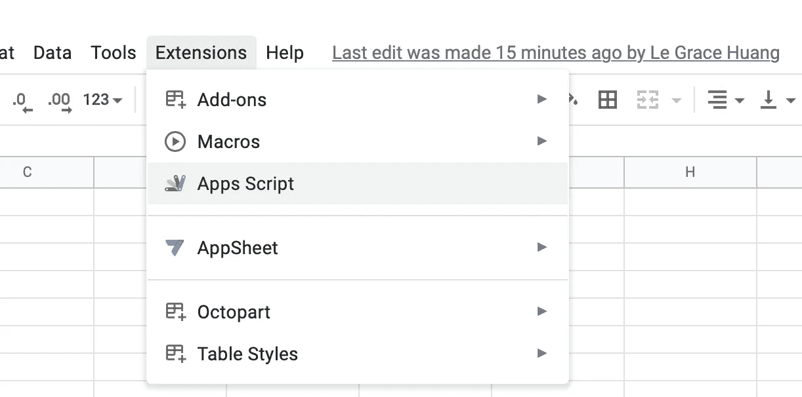
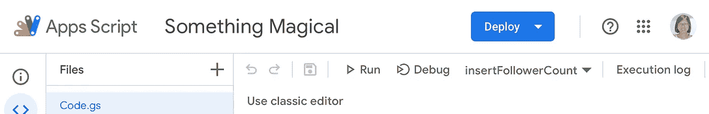
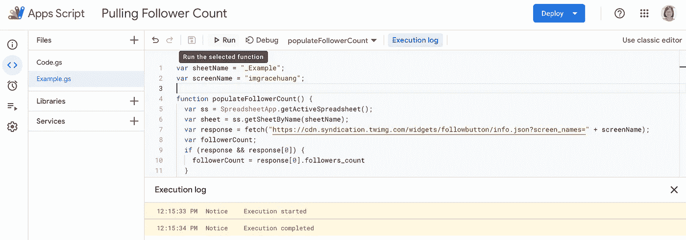
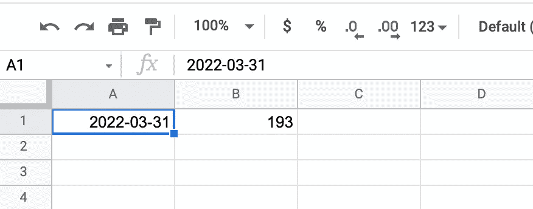
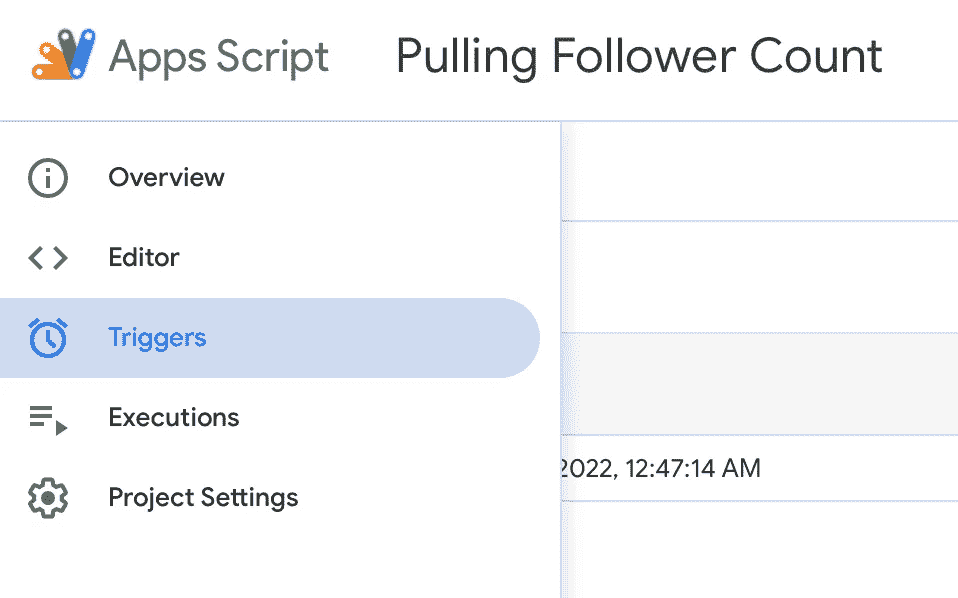
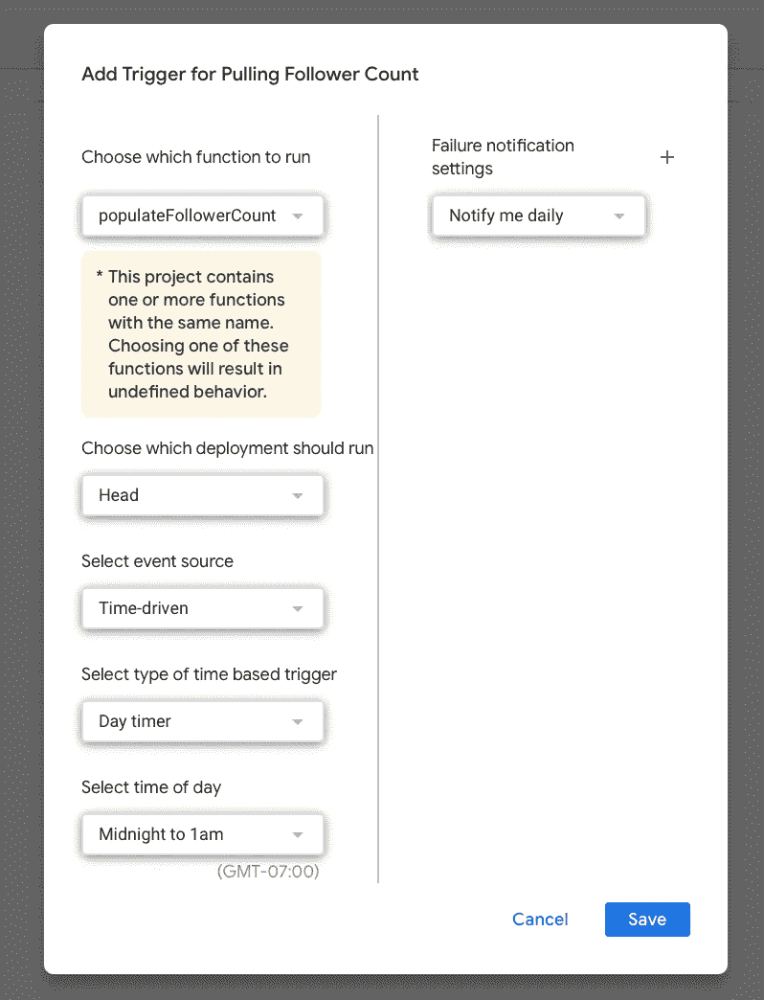

# 追踪任何用户的推特粉丝数的最简单方法

> 原文：<https://blog.devgenius.io/easiest-way-to-track-any-users-twitter-follower-count-b30661c0c16a?source=collection_archive---------4----------------------->

所以，你想记录你的 Twitter 追随者的增长，对吗？有许多方法可以做到:

1.  每天检查并记录
2.  使用第三方软件
3.  使用 Twitter 分析获得最近的每周关注者增长
4.  请求 Twitter API 访问，并设置一个 cron 作业每天调用它

我刚刚发现了另一种方法——自动、免费、不需要服务器，或者请求 Twitter API 访问。

我使用谷歌表单和应用程序脚本。

## 步骤 1:创建一个新的 Google Sheets 文档

这是最简单的方法中最简单的部分:进入你的 Google Drive，创建一个新的 Google Sheets 文档。

创建一个名为“_Example”的工作表，我们将在后面的代码中引用它。

## 步骤 2:转到应用程序脚本

从工作表文档，进入扩展->应用程序脚本。



然后它会引导到 Apps 脚本的 UI，您可以在那里编写代码。语言是 JavaScript。



## 步骤 3:编写脚本来获取关注者数量

这是使这种方法如此快速的另一个秘密武器——一种不使用官方 API 就能获得追随者数量的黑客手段，这要感谢 [Kaspars Dambis](https://kaspars.net/blog/twitter-follower-count-without-api) 。

```
https://cdn.syndication.twimg.com/widgets/followbutton/info.json?screen_names=**imgracehuang**
```

使用上面的 URL，您可以得到如下的 JSON 响应

```
[
  {
  "following":false,
  "id":"1466996870425632769",
  "screen_name":"imgracehuang",
  "name":"Grace Huang",
  "protected":false,
  "followers_count":190,
  "formatted_followers_count":"190 followers",
  "age_gated":false
  }
]
```

然后，您可以在 Apps 脚本中解析 JSON。

为了节省你的时间，下面是我的工作代码。你可以用任何你想追踪的 Twitter 账号替换昵称。

代码完成后，点击“运行”！



执行完成后，您将看到在名为“_Example”的表单中生成了追随者计数。



因此，作业已经成功运行了一次。让我们把它自动化。

## 步骤 4:将其设置为自动驾驶——重复作业

从侧边栏菜单转到触发器



然后点击底部的“添加触发器”按钮，并配置您希望如何运行这项工作。



瞧啊。这将每天填充表单中的关注者计数！

这是构建后端原型的一种非常简单的方式。我还将它用于我的各种项目原型。

希望这对您有所帮助。黑客快乐！

# 🚀格瑞丝在做什么？

每周，我都会发送一份时事通讯，介绍我在创业过程中探索随机性、尝试、错误和小成功时的发现和想法。[免费加入这里→](https://gracehuang.substack.com/)

如果你喜欢阅读这样的故事，并想支持我成为一名作家，可以考虑报名成为一名媒体成员。每月 5 美元，你就可以无限制地阅读媒体上的故事。如果你用我下面的链接注册，我会赚一点佣金。

[](https://imgracehuang.medium.com/membership) [## 通过我的推荐链接——黄芝琪加入 Medium

### 阅读黄芝琪的每一个故事(以及媒体上成千上万的其他作家)。您的会员费直接支持…

imgracehuang.medium.com](https://imgracehuang.medium.com/membership)