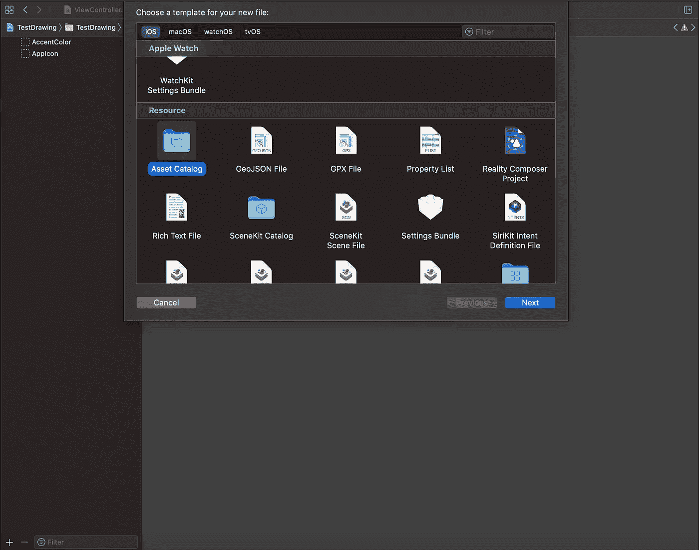
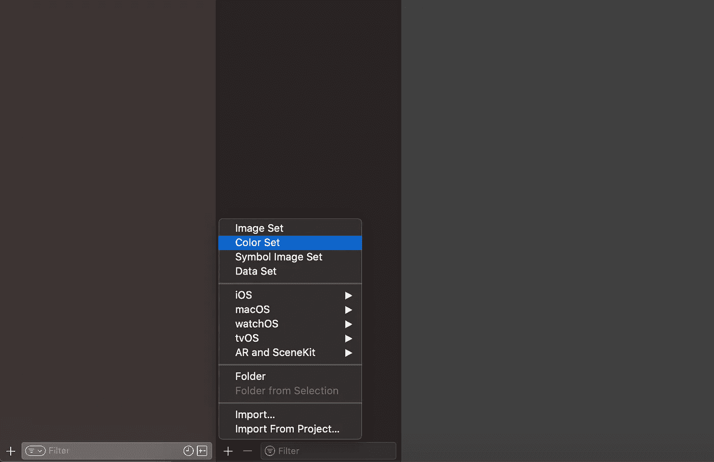
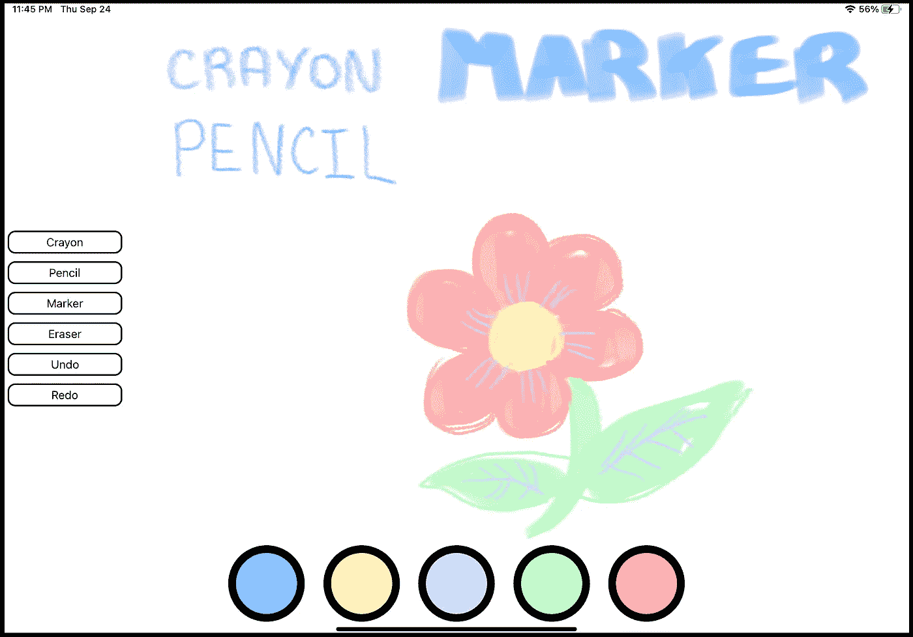

# 使用 PencilKit 轻松将绘图功能添加到您的 iOS 应用程序

> 原文：<https://blog.devgenius.io/easily-add-drawing-capabilities-to-your-ios-app-with-pencilkit-c0d07e976bd9?source=collection_archive---------0----------------------->

## 惊人的功能，最少的代码。

托尼·塞巴斯蒂安在 [Unsplash](https://unsplash.com?utm_source=medium&utm_medium=referral) 上拍摄的照片

PencilKit 框架是苹果在 iOS 13 中推出的。它让开发人员能够通过 Apple Pencil 或 touch 轻松地将书写和绘图功能添加到自己的应用程序中。这与苹果在他们的应用程序(如 Notes)中使用的低延迟框架相同。

> PencilKit 可以轻松地将手绘内容整合到您的 iPadOS 或 macOS 应用程序中。PencilKit 为您的 iOS 应用程序提供了一个绘图环境，该环境接收来自 Apple Pencil 或用户手指的输入，并将其转换为您在 iPadOS、iOS 或 macOS 中显示的图像。该环境附带了用于创建、擦除和选择线的工具。— [苹果开发者 pencil kit](https://developer.apple.com/documentation/pencilkit)

开始时你只需要三行代码

PKCanvasView 处理所有通过 Apple Pencil 添加到应用程序的信息，并通过指定的工具进行触摸。所有这些信息和数据都存储在一个 [PKDrawing](https://developer.apple.com/documentation/pencilkit/pkdrawing) 对象中，您可以在应用程序中保存和加载该对象，或者导出为图像。你既可以设置自己的工具，也可以使用苹果的原生 [PKToolPicker](https://developer.apple.com/documentation/pencilkit/pktoolpicker) 。

在画布上绘图是无缝的，是一种非常愉快的用户体验。

一个简单的例子:一个可爱的绘画应用程序，针对有创造力的孩子。

在 Xcode 12 中创建新项目，选择界面的 **App** 模板和**故事板**。在项目的目标常规选项卡中，将**设备方向**设置为**横向向左**。

我们将使用**资产目录**来管理颜色。向您的项目添加一个新文件，滚动到 Resources 部分并选择 Asset Catalog。命名为颜色。

选择资产目录

在颜色资产目录的底部，单击添加标志并选择**颜色集。**

将创建两个空颜色集。这些是为了管理你的应用程序中亮暗模式的颜色。然而，由于我们正在创建一个旨在绘图的应用程序，我们不需要以这种方式管理颜色(除非你想😊).

点击**属性的检查器**。命名你的新颜色，然后在**外观**部分选择**无。**在**颜色**部分，将输入法设置为 **8 位(0–255)**或 **8 位十六进制**(如果看不到颜色部分，点击颜色设置)。我想为应用程序的彩色调色板，并使用以下名称和十六进制值:

*   婴儿蓝( **6EB5FF**
*   毛茛( **FFF5BA** )
*   丁香( **DCD3FF** )
*   草甸( **BFFCC6** )
*   罗斯( **FFABAB**

在您的 ViewController 中导入 **PencilKit** 框架。创建颜色的可迭代枚举。

在 ViewController 中创建以下属性。

我们创建一个 **PKCanvasView** ，通过 **PKInkingTool** 创建三种钢笔类型，通过 **PKEraserTool** 创建一个橡皮擦。如你所见，我正在使用**。铅笔**类型适用于蜡笔和铅笔。没有**。蜡笔**型(虽然也有**)。笔**类型)所以我决定改变这两支笔的宽度，以产生蜡笔🖍和铅笔✏️的效果。

我们将以编程方式创建 UI。我将把它分解成三个步骤。第一步是将 PKCanvasView 添加到 ViewController 中。

画布将与我们的视图大小相同，我们将它的**绘制策略**设置为**。anyInput** 所以孩子们可以用苹果铅笔或手指画画。我们画布的默认工具是蜡笔。

第二步是创建调色板按钮。

我们遍历 Colors 枚举，为每种情况创建一个按钮，并将原始整数值指定为按钮的标记。按钮的标签将用于确定在 **updatePens** 函数中点击了哪种颜色。

然后，我们创建一个水平的 UIStackView，并将所有按钮作为子视图添加到其中。最后，我在 stackview 上指定约束，使它位于视图的底部。

我使用一个助手函数，通过扩展 UIButton 使我的按钮变圆。

最后一步是创建工具。

我们使用一个助手函数来创建名为 **createButton** 的工具按钮。

当点击工具按钮时，我们将适当的工具设置到画布上。我们将使用 [**撤销管理器**](https://developer.apple.com/documentation/foundation/undomanager) 来管理绘图操作。

然后，我们创建一个垂直的 stackview，向它添加工具按钮，并设置它在屏幕左侧的约束。

回到调色板按钮，我提到过当点击这些按钮时调用 **updatePens** 函数。

该函数获取被点击的按钮，并使用其标签来计算选择了哪种颜色。然后，它将画布使用的工具更新为新的颜色(如果可能的话)以及其他钢笔。

这是正在运行的应用程序。

用最少的代码实现强大的功能！😄