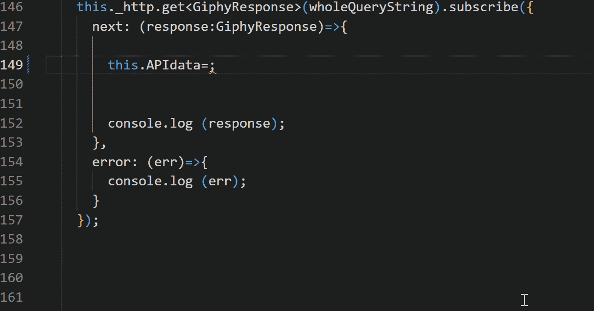

# 使用 quicktype.io 轻松创建自定义的类型脚本接口—弗兰·彼尔托

> 原文：<https://blog.devgenius.io/easily-create-custom-typescript-interfaces-with-quicktype-io-fran-prieto-397870770ef9?source=collection_archive---------10----------------------->


我敢肯定，作为一名 web 开发人员，您已经面临过很多次不得不在您的打字稿或角度项目中处理复杂对象的问题。一种方法是创建我们的自定义 Typescript 接口或类，但是当对象太复杂时，这可能会给我们带来很多工作。在本文中，我们将看到如何使用一个名为 [Quicktype.io](https://quicktype.io/) 的强大工具来创建我们的 Typescript 接口。这个工具可以通过网站访问，也可以作为 [Visual Studio 的扩展](https://marketplace.visualstudio.com/items?itemName=quicktype.quicktype)。

也许你们中的许多人都是经验丰富的开发人员，他们比我更了解 Typescript 接口和自定义类型的好处，但是**这里的重点是，在所有事情中，如何使用 quicktype.io 来处理大对象，并且在不到一分钟的时间内为这些大对象创建接口，即使它们有几十个属性。**

首先，我们将看到一段代码，它向我们展示了一个由来自 [Giphy API](https://developers.giphy.com/) 的 [HTTP 请求以 Angular](https://angular.io/guide/http) 返回的典型响应。我目前正在开发一个应用程序，它使用 Giphy API 来显示图像，以及其他功能，我将使用一些代码向您展示如何使用它以及创建自定义 Typescript 接口的巨大优势。

这一次，因为它是一个长代码，出于可读性的原因，将只链接它而不嵌入:

[https://gist . github . com/Fran web 79/58671911 ea 12 b 583 ADC 7712 efb 82d 369](https://gist.github.com/Franweb79/58671911ea12b583adc7712efb82d369)

如您所见，它是一个具有许多属性的对象，嵌套的属性…试图访问这些属性时很容易出错，并且很难跟踪到一个嵌套属性的路径，您可能会出现键入错误…

## 创建自定义 Typescript 接口的优点

使用 Typescript 接口，我们将能够更容易地避免上面提到的错误，利用 Typescript 可以给我们的帮助来访问对象及其属性。

不仅如此:如上所述，使用 Quicktype.io，我们将能够快速轻松地为如此复杂的对象创建我们的 Typescript 接口。

假设我们将通过 HTTP 请求向 Giphy 请求 10 件商品。项目的限制可以作为一个查询参数，正如我们将在后面看到的。请阅读 [Giphy 文档](https://developers.giphy.com/docs/api/endpoint#search)以了解更多信息。

结果将是一个有数千条线的非常大的物体。但是没关系。让我们看看代码。首先，我们将有意使用一个典型的不良实践来请求数据，使用*“any”*类型。

## 请求数据的错误方式:使用“any”类型

这将是我们的 HTTP 请求。ApiData 属性是我们存储要在模板中显示的数据的地方。

正如你所看到的，我们已经声明了一个名为 *wholeQueryString* 的变量，在这里我们可以设置我们想要请求的项目的限制。要查看关于其他参数的更多信息，我再次推荐您访问 [Giphy for Developers 文档](https://developers.giphy.com/docs/sdk)。

```
let wholeQueryString:string=`${URL}${Key}&limit=10 q=${searchQueryParameter}`;
```

我们还将 HTTP 请求的属性和参数设置为*“any”*。有时开发人员使用这种方法来避免 Typescript 抛出错误。例如，当我们这样做的时候

```
this.APIdata=response.data;
```

如果我们不将响应声明为*“any”*，Typescript 会说类似于*“是的，这是一个通用对象类型，我看不到里面的数据属性，因为它不是通用对象类型的一部分”*。


我们可以通过设置响应为*“any”*来解决，这就像告诉 Typescript: *“可以，我知道我在做什么，就让我做吧”*。那么它不会抱怨:


但是这样，我们必须知道我们的响应对象结构；我们必须检查属性，并知道我们的响应有一个数据属性。如果我们必须访问类似于

```
response.data[0].url
```

如上所述，试图遵循复杂的、嵌套的属性路径很容易出错。

这是一个解决方案，我们的软件会工作；但这不是最好的方法。

## 使用 quicktype.io 创建我们的 Typescript 接口

让我们创建自定义的 Typescript 接口，看看它如何帮助我们，以及如何用 [quicktype.io](https://quicktype.io/) 创建它

如果你对 Typescript 接口有所了解，你就能明白当我们得到这个 Giphy 响应时，为一个对象构建我们的接口有多难，不是吗？想象一下，你必须检查 20 多个属性，声明类型……嵌套对象也是如此。

幸运的是，我们现在将使用 quicktype.io 来完成这项工作。

首先，我们运行 HTTP 代码。

因为我们有一个

```
console.log (response);
```

它将向我们展示 Giphy 返回的完整对象。


我们只需复制整个对象，并将其粘贴到 quicktype.io 的[左侧面板中。它将把我们的 JSON 对象转换成任何语言的类型安全代码，包括 Typescript。](https://app.quicktype.io/)

记住要复制整个对象，只需右击它并选择“复制对象”，对 Firefox 和 Google Chrome 都一样。

您必须为您的 Typescript 接口写一个名称，在这种情况下，我们将使用 GiphyResponse。然后，在 options 按钮中，您可以选择希望 JSON 被解析的语言。在我们的情况下，它是打字稿。


就是这样！不到一分钟就有了我们长回应的完整界面！

## 为我们的项目使用 quicktype.io 生成的数据

既然我们已经有了代码，我们就可以复制并粘贴它，在我们的 Angular 项目中创建我们自己的 Typescript 接口。

首先，我们将创建一个名为

```
giphy-response-interfaces.ts
```

最好在*“interfaces”*文件夹中完成。只需复制 quicktype.io 生成的代码

现在，我们已经准备好在项目中任何需要的地方使用我们的自定义 Typescript 接口。现在，在 Typescript 的帮助下，我们将使用它轻松地处理对象。

我们将用新的自定义类型 GiphyResponse 或其派生类型来改变我们以前编写的*“任何”*类型。


我们需要的相关数据，顾名思义，会在*【数据】*属性里面。

请记住，我们将在一个属性内存储我们的数据。正如我们看到的，数据是一个数组的数据类型，所以我们改变:

```
public APIdata:any;
```

到

```
public APIdata:Datum[];
```

由于它是一个数组，我们可以在构造函数中简单地将其初始化为:

```
this.APIdata=[];
```

现在我们必须更改 HTTP 响应代码。所以你可以替换这个:

为此:

除了我们对属性所做的类型更改之外，我们可以看到我们在 HTTP 请求中更改了两件事:

*   我们使用了新的自定义类型和[类型脚本泛型](https://www.typescriptlang.org/docs/handbook/2/generics.html)(代码在< >中)。

```
this._http.get**<GiphyResponse>**
```

*   现在，响应参数也有了我们的自定义类型。请注意，它现在可以工作了，甚至只留下没有类型的响应:

```
next: (response)=>{

        this.APIdata=response.data;

        console.log (response);

      }
```

但是我谦卑地认为用我们的自定义类型来指定这个响应是一个更好的主意

```
next: (response:**GiphyResponse**)=>{

        this.APIdata=response.data;

        console.log (response);

      }
```

那么，这一切的优势在哪里呢？

看看现在发生了什么:


是啊！由于我们的自定义 Typescript 接口，现在 Typescript 知道了对象的结构和属性。我们告诉 Typescript 一些比模糊的*“any”*类型更具体、更好描述的东西，这样它可以帮助我们。

最好的好处是，如果我们现在必须访问对象内部的任何嵌套属性，我们可以更容易地做到这一点，Typescript 会安全地引导我们通过对象的结构。

看看这个。记住数据属性是一个数组，所以我们可以这样做，例如，对于数组的第一个元素:



您可以看到所有嵌套的属性、对象…这比探索浏览器控制台并自己跟踪路径要容易得多，对吗？

我希望这篇文章对你有用。

*封面图片由[詹姆斯·奥斯本](https://pixabay.com/es/users/jamesmarkosborne-1640589/?utm_source=link-attribution&utm_medium=referral&utm_campaign=image&utm_content=1076536)拍摄，见于 [Pixabay](https://pixabay.com/es/?utm_source=link-attribution&utm_medium=referral&utm_campaign=image&utm_content=1076536)

*原载于 2022 年 6 月 2 日*[*【https://portfolio.avanzartewebs.com】*](https://portfolio.avanzartewebs.com/javascript/typescript/2022/06/02/how-to-create-fast-and-easy-typescript-custom-interfaces-to-deal-with-complex-objects-using-quicktype-io/)*。*