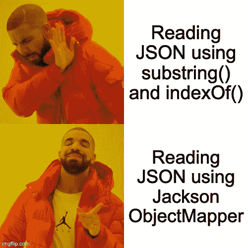

# 使用强大的 Jackson ObjectMapper 轻松解析 JSON

> 原文：<https://blog.devgenius.io/easily-parse-json-with-the-powerful-jackson-objectmapper-c1fb35cb4730?source=collection_archive---------5----------------------->

## 正确阅读餐馆(或任何)JSON 的指南


由 [LogicBig](https://www.logicbig.com/tutorials/misc/jackson/reader-for-updating.html)

# 对象映射程序背景

JSON 在许多应用程序中用于存储和发送数据，解析和读取这些数据的能力对于成为一名熟练的程序员非常重要。在我了解 ObjectMapper 之前，我会手动搜索 JSON 中的字段。

```
String myVal = json.substring(json.indexOf(field)+ 1, lengthOfVal)
```

这是一种从 JSON 中获取值的粗糙且容易出错的方法，当我团队中的一名高级开发人员看到我这样做时，他们给了我启发🌤️.(灯光是杰克逊对象映射器)



# Jackson 对象映射器的案例研究

想象一下，现在是周五晚上，你和你的另一半一起去吃晚饭🍽。不幸的是，你的伴侣非常挑剔，当他们决定去哪里吃饭时，就该是吃早餐的时候了😭。幸运的是，你居住的城市提供了镇上所有餐馆的 API😀。

```
{"restaurants":
    [
        {
          "id": "19ujjWJM219",
          "cuisine": "Italian",
          "name": "Pepe's",
          "date":"08/22/2020",
          "chefs": [
            "Luca",
            "Ferdinand",
            "Mario"
          ],
          "menu": {
            "menuitem": [
              {"name": "Pasta", "price": "10"},
              {"name": "Pizza", "price": "12"},
              {"name": "Chicken Parm", "price": "20"}
            ]
          }
        },
        {
          "id": "w8239dnJJS",
          "cuisine": "Seafood",
          "name": "The Catch",
          "chefs": [
                  "Kyle",
                  "Alex"
          ],
          "menu": {
            "date":"07/12/2020",
            "menuitem": [
              {"name": "Salmon", "price": "20"},
              {"name": "Lobster", "price": "30"},
              {"name": "Shrimp", "price": "18"}
            ]
          }
        }
    ]
}
```

唯一的问题是，这是一种丑陋的看待数据的方式🤢。因此，让我们通过解析 JSON，只获取餐馆和菜肴的名称，使阅读起来更容易🍔🥗🍝有空的😁。


由[凯瑟琳·希斯](https://unsplash.com/@catherineheath)在 [unsplash](https://unsplash.com/)

1.  首先，我们需要将 Jackson 库加载到我们的项目中

```
<dependency>
    <groupId>com.fasterxml.jackson.core</groupId>
    <artifactId>jackson-databind</artifactId>
    <version>2.9.8</version>
</dependency>
```

将它放在 maven 项目的 pom 文件中的*<dependencies></dependencies>*标签内。

2.**接下来，让我们在 java 程序中加入基本代码，从文件中读取 json。**

这是基本的文件读取代码，以获取字符串形式的文件内容。

**在 readFile()中:**我们使用一个缓冲的文件读取器在仍然有一行要读取的时候将行追加到一个字符串生成器中，然后返回结果字符串(文件的内容)。

**在 main():** 我们将使用上面的 json 路径创建一个文件对象。然后，我们可以调用新创建的 readFile()函数来获取字符串形式的 json 内容。

3.**最后，我们将添加代码来解析 JSON 并提取我们需要的数据🤓。**

在第 9 行，我们得到了我们城市的餐馆列表。在每家餐馆的第 10 行，我们向下钻取并得到菜单项目的列表。在第 11 行，我们打印出包含餐馆、菜名🍽和价格💰这个城市里的每一道菜🏙️.

这段代码的输出应该如下…

```
“Pepe’s”: “Pasta” “10”
“Pepe’s”: “Pizza” “12”
“Pepe’s”: “Chicken Parm” “20”
“The Catch”: “Salmon” “20”
“The Catch”: “Lobster” “30”
“The Catch”: “Shrimp” “18”
```

哒哒！您现在知道如何使用 Jackson 解析 JSON 了！🎉 🎊现在，您没有理由使用字符串操作来破解 JSON😂 👍。