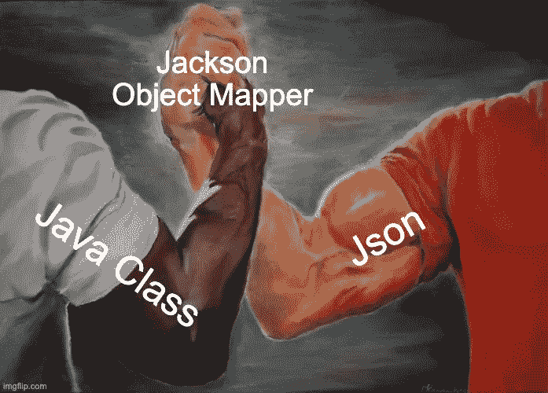

# 像专家一样轻松地将复杂的 Java 对象与 Json 相互转换

> 原文：<https://blog.devgenius.io/easily-translate-complex-java-objects-to-and-from-json-like-apro-7ba2df45a81e?source=collection_archive---------1----------------------->

## 使用 Jackson ObjectMapper 将对象存储和读取为 json 的正确方法



# 杰克逊对象映射器

介绍对象映射器的神奇之处。这个库是将 Json 翻译成 java 类以及将 Java 类翻译成 Json 的最佳选择。

如果你想深入了解 ObjectMapper 可以做的所有事情，这里是库的[链接。](https://fasterxml.github.io/jackson-databind/javadoc/2.7/com/fasterxml/jackson/databind/ObjectMapper.html)

在这个简短的教程中，我们将通过序列化一个教室 java 对象(它本身将包含一个 Person 对象列表)来展示 ObjectMapper 的强大功能，因为我们的教室是由 Person 组成的，所以会有一定程度的复杂性。

# 将对象存储为 Json

## Java 类:

假设我们有一个教室对象

在这个教室对象中📚👨🏻‍🏫📎，我们有一个表示类名的字符串和一个该类的成员列表。成员的对象类型是 Person🙋🏻‍♂️.

一个人有名字和年龄👦🏼。

现在想象我们有一间教室，如下图所示


照片由[伊万·阿列克西奇](https://unsplash.com/@ivalex)在 [unsplash](https://unsplash.com/) 上拍摄

我们也有一群属于这个教室的学生，我们想把这个教室和它所有的学生🧑🏽但是我们应该如何存储它们呢？当然是在 Json！🙌🏻

## 将我们的类写入 Json:

在这里，我们在第 4-6 行创建了几个教室对象，每个对象有三个成员。然后我们将类的数组写成 Json，并存储在一个字符串中

下面是我们应该得到的执行。😮⬇️

```
[
  {
    "className": "Math 101",
    "members": [
      {
        "name": "Bill",
        "age": 12
      },
      {
        "name": "John",
        "age": 15
      },
      {
        "name": "Matt",
        "age": 10
      }
    ]
  },
  {
    "className": "English 101",
    "members": [
      {
        "name": "Bob",
        "age": 13
      },
      {
        "name": "Alex",
        "age": 16
      },
      {
        "name": "Matt",
        "age": 10
      }
    ]
  },
  {
    "className": "French 101",
    "members": [
      {
        "name": "Jill",
        "age": 9
      },
      {
        "name": "John",
        "age": 15
      },
      {
        "name": "John",
        "age": 15
      }
    ]
  }
]
```

# 从 Json 读取对象

为此，🤓📚我们需要我们将从 Json 创建的每个对象都有一个无参数的构造函数以及所有字段的 getter 和 setter。

## 将我们的 Json 读回 Java 对象:

在这里，我们将读回我们刚刚创建的 Json，并将其存储到对象中。在第 14 行，我们读取了我们创建的教室列表的值📚✏️📏，我们需要通过传递第二个参数来指定我们对 Json 的期望

```
*new TypeReference<List<ClassRoom>>(){}*
```

在第 15、16 行，我们打印出每个教室的名字，然后在第 17、18 行，我们打印出每个教室成员的名字和年龄。

我们应该得到以下输出。🎉

```
Math 101
 Bill 12
 John 15
 Matt 10
English 101
 Bob 13
 Alex 16
 Matt 10
French 101
 Jill 9
 John 15
 John 15
```

搞定了。您刚刚将一个对象存储到 json 中，并像专家一样读回它😎。