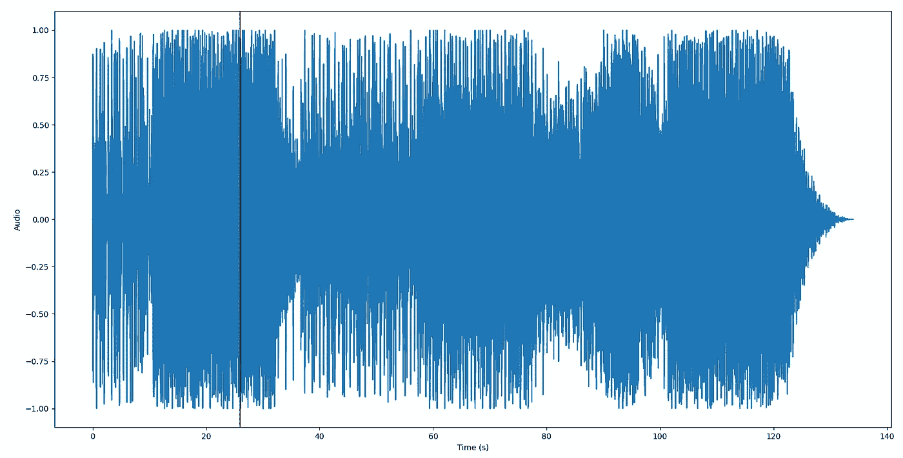

# 简易音频可视化(Python)

> 原文：<https://blog.devgenius.io/easy-audio-visualization-python-d3c6aa935212?source=collection_archive---------1----------------------->

读取音频数据、更新图表、使用多重处理:开始用 Python 进行音频可视化所需要知道的一切。

你肯定已经遇到过很多不同的软件，这些软件可以让你跟踪你正在听的音频的进程。**然而，你有没有想过这样的软件是如何工作的？**

今天是你的幸运日。我已经用 Python 做了一些音频处理，但是我从来没有可视化过我处理的音频文件，所以我决定尝试一下，用 Python 实现音频可视化。

在这里，我将与你分享我是如何用 Python 可视化音频数据的，并且实现非常简单。

## 目标

首先，我们来定义一个目标。这里的目标是**播放一个音频文件，同时可视化音频数据**，并在音频播放时让一条红线沿着图形移动。

预期产出

在开始写一些代码之前，我应该指出，代码应该写在 Python 文件中，而不是笔记本中，以确保一切正常，因为我们将以一种非常简单的方式使用多处理。

## 步骤 1:导入包

首先，您应该导入几个包，因为我们稍后会用到它们。

为了快速概述，我们使用:

*   **soundfile** 读取音频数据。
*   **numpy** 处理数组中包含的音频数据。
*   **matplotlib.pyplot** 显示音轨。
*   **pydub** 播放音频文件。
*   **time** 优化音轨的显示方式。
*   **多重处理**让两个进程同时运行。这里我们想在显示音轨的同时播放一个音频文件。

## 步骤 2:准备音频数据

让我们准备音频数据，我们将使用可视化的音频。数据存储在两个包含表示气压变化的浮子的数组中。

检索音频数据的采样率( **Fs** )也很重要，它对应于每秒的样本数。

## 步骤 3:播放音频文件

这一步可能是最有挑战性的(开个玩笑)。您只需要定义一个两行函数来播放音频。

为什么要为此定义一个函数呢？嗯，在使用多处理时，这是一种分离不同进程的便捷方式。当你看到第五步时，这一点可能会变得更清楚。

## 步骤 4:显示音轨

这一次，这一步是真正最具挑战性的。您想要显示音轨，并按照您听到的音频进行播放。

所以挑战是:

1.  持续更新绘图。
2.  适时更新剧情。

显示音轨的代码如下所示:

请注意，该图每 2 秒更新一次。事实上，由于采样数量很大，绘制音频数据需要时间，因此我建议您首先以大于或等于 2 秒的周期更新图形。否则，可能会有一些滞后。

## 第五步:多重处理(最后一步)

要在播放音频时可视化音频数据，需要让 Python 同时执行两项任务。因此我们将使用**多重处理**来同时运行两个进程。

下面是一个实现:

Python 脚本中需要“if __name__=="__main__ ":"行，以确保多处理正常工作，因此不应该省略它。

## 评论

请注意，这里提供的实现非常简单，而且肯定可以改进。尤其是:

*   你可以想象让音轨可视化更吸引人的方法。
*   该图仅每 2 秒更新一次，但您可能更喜欢定期更新。在这种情况下，您可以减少显示的音频数据中的样本数量，以便更快地显示图形。
*   在某些情况下，你仍然会面临滞后。(例如，如果情节全屏显示，那么你将有更多的机会面对滞后)
*   此处没有提供暂停音频的功能。

## 结论

我在这里用 Python 给出了一个简单的音频可视化实现。您可能已经注意到了，也可能没有注意到，这里的一些代码可能对其他项目非常有用。通常，**读取音频数据**，或者**更新图表**，或者**同时运行进程**，这些都是复杂的事情，几乎不费吹灰之力就能完成。

我希望这可能给你一些其他项目的想法！:)

您可以在下面找到对个人 [**GithHub** 资源库](https://github.com/jmpion/easy-audio-visualization)的访问，其中包含与本文相关的代码和音频文件:

 [## GitHub-jmp ion/简易音频可视化

### 此时您不能执行该操作。您已使用另一个标签页或窗口登录。您已在另一个选项卡中注销，或者…

github.com](https://github.com/jmpion/easy-audio-visualization)