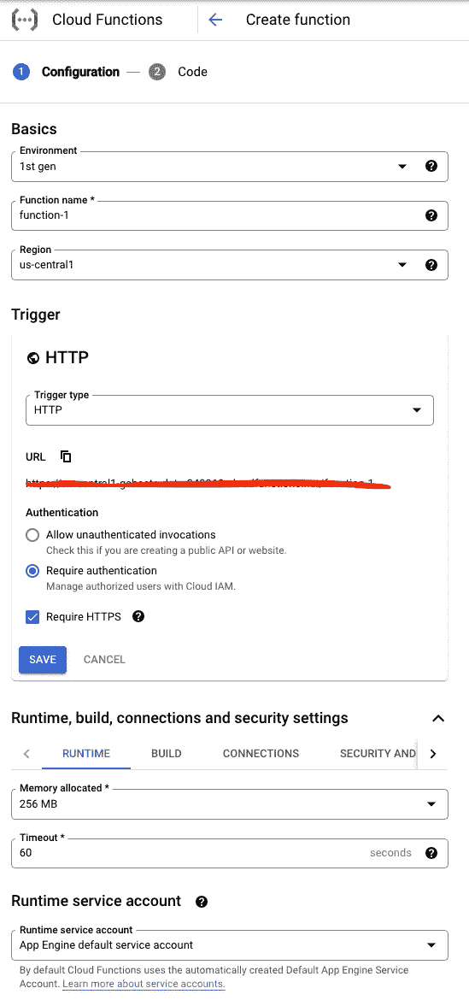
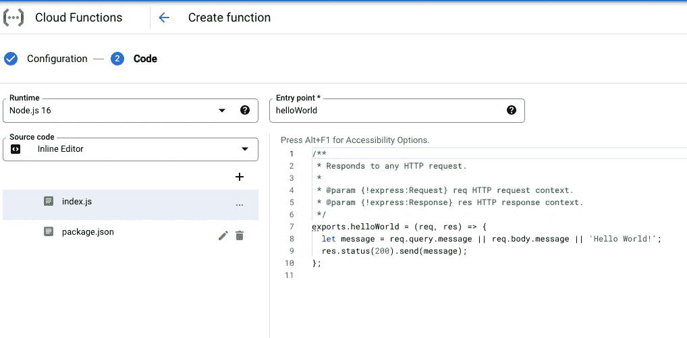
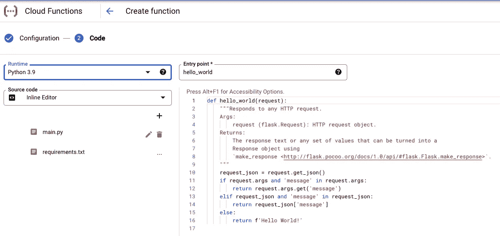
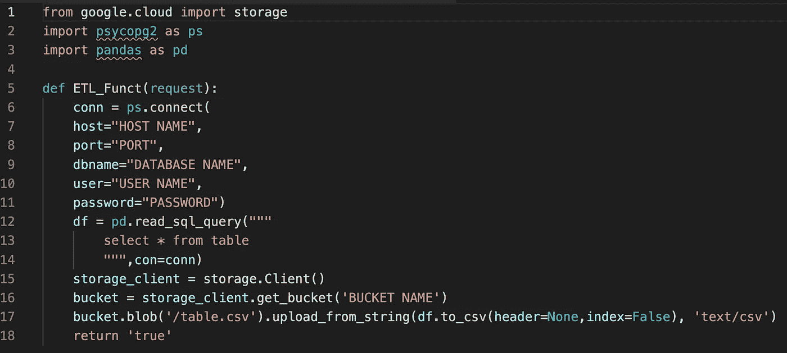
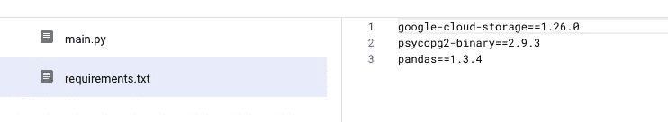
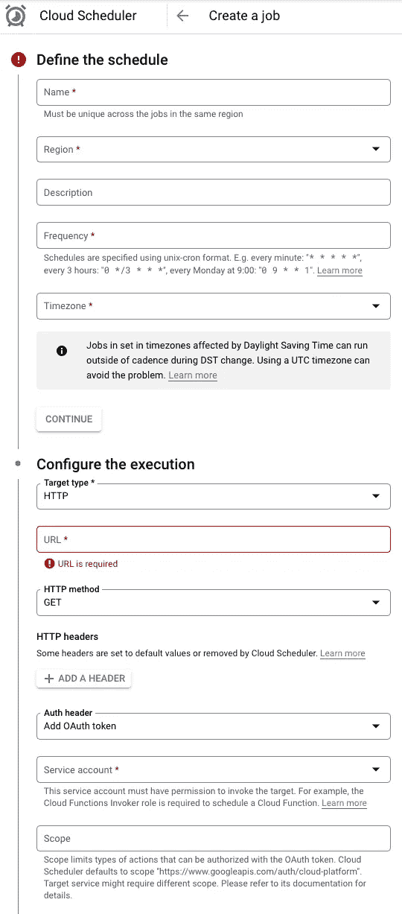

# 使用谷歌云功能轻松 ETL！

> 原文：<https://blog.devgenius.io/easy-etl-with-google-cloud-functions-c73ed983dee0?source=collection_archive---------6----------------------->

如果您仍然不是高级 ETL 脚本的专家，并且对 SQL 比较熟悉，那么这将是一个简单的方法，可以让您轻松地开始将数据放入大查询中！会使用一点 python，但主要是 SQL，只需使用**谷歌云平台**上的内置产品，你就可以在几分钟内将转换后的表放入数据仓库

如果你使用过**大查询**它有几个简单的方法来创建一个表一个来自**谷歌云存储**在那里你可以只上传一个 CSV(以正确的格式)并在你的数据集中创建一个**原生表**，这对于创建一个表的模式非常有帮助。接下来，您可以在大型查询控制台中使用**数据传输功能**,您也可以使用该功能**安排从 Google 云存储中传输数据**,您还可以选择**追加或镜像**您的目标表，甚至在数据传输完成后从存储中删除文件

我想我们找到了我们的共同点，那就是**云存储**，所以如果我们能以某种方式定期将文件存储到云存储中，我们只需点击几下鼠标就可以创建数据传输！现在，我们如何将这个 CSV 文件存储到云存储中，比如说每两个小时一次？嗯答案是**云函数！**您可以编写一个简短的 python 脚本，从您的源中提取数据，并将其作为 CSV 文件存储在 Google 云存储桶中，然后您就知道该过程了！

如上所述，我们的示例将显示如何从另一个 SQL 数据库中获取表，但它可以用于任何数据源。因此，我们首先启用云功能，然后创建一个功能

这是对我有效的默认配置，除了你看到运行时服务帐户的地方，我会选择一个我有最高访问权限的地方，以确保该功能工作正常，然后根据需要更改它。在很多情况下，你会遇到权限级别的问题，但为了简单起见，我会使用一个管理员帐户(至少有云功能 Admin)。Google cloud 上的权限级别是另一个单独的主题，但你需要知道这是一个非常常见的错误，但继续前进，一旦你在此页面上单击“下一步”,我们就会看到类似这样的代码页

所以默认是 Node js，但请将语言改为 **python** ，我们使用 3.9 版本，这是云函数的语法

这是 python 的语法，所以对于所有会使用 pyhton 和正在使用 jupyter 或其他东西的人，请用 return 结束你的函数，因为它将在你的控制台上工作，但不是在这里！因此，如果我们想要将一个名为 table 1 的表从一个数据库(在我们的例子中是它的 postgres)复制到 google 云存储中的一个**桶**中的 CSV 文件中，我们只需要 python 中的三个包第一个是 **google.cloud** ，我们只想要它的**存储**包，第二个是 **psycopg2** 以连接到我们的数据库，第三个是 **pandas** 以将表转换为 CSV。就是这样！这将是代码的语法—

就这样，用第 13 行(select * from table)替换您的查询，您就有了自己的代码。有可能 **psycopg2** 被弃用，在这种情况下使用 **sqlalchemy** (您可以找到一篇关于 medium 的文章；)或者在这里评论，我来回答)但是从今天起它开始工作了。最后一件事是 **requirements.txt** 文件，对于这个文件来说，它只是告诉你需要的包的版本，有很多方法可以得到它。只需将此代码作为文件复制到一个文件夹中，并在终端上运行 pipreqs /path/to/project(但首先使用 pip install pipreqs 安装它),或者如果您根本不了解 python，只需复制，如果有任何问题，请评论！

现在我们**部署函数**，这将需要一点时间，然后我们在 testing 选项卡中测试它，它将向您显示它是否工作，您将在您的目标存储桶中找到一个名为 table.csv 的文件。所以，如果你正确地完成了这些步骤，你就完成了你的第一个云函数！所以现在最后一件事是，这个函数不会自己运行，除非你手动触发它，因此我们使用**云调度器**！这是我向:D 承诺的最后一步

转到云调度程序，然后单击创建作业。填写必要的数据和频率，为了简单起见，我们将每 3 小时使用一次，即 0 */3 ***然后最后一个重要部分是配置执行，我们选择 **HTTP** ，在方法中我们选择 **GET** (默认情况下是它的 POST)，最重要的是选择 Auth 头作为“添加 OAuth 令牌”，再次选择具有最高访问权限的帐户进行测试(或使用具有云函数调用者权限级别的帐户)，然后按 create，我们就完成了！！！！！

现在您有了一个脚本，它将每三个小时更新一次您的 CSV 文件(您可以更改它，但是您需要为此学习 cron job，或者只是在线搜索一个转换器),您可以继续进行数据传输，并创建从您的目标存储桶到您的目标表的传输，如前所述，为了匹配模式，最好总是从同一个存储桶创建表！

这只是如何使用云函数的一个小例子，它们可以用在很多方面！如有任何问题或反馈，请评论:)

如果你喜欢我的文章，如果你能在我的[中型账户](https://medium.com/@suhasthakral)上给我一个关注，那就太好了